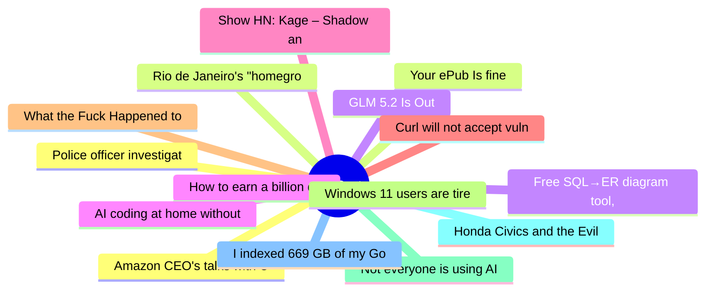

# HackerNews Best (高赞) Top 15 (2026-06-15)

## 思维导图

## 列表（15 条）

### 1. Amazon CEO's talks with U.S. officials triggered crackdown on Anthropic models
- **链接**: [https://www.wsj.com/tech/ai/amazon-ceos-talks-with-u-s-officials-triggered-crackdown-on-anthropic-models-dcc90578?st=Yct6gx&reflink=desktopwebshare_permalink](https://www.wsj.com/tech/ai/amazon-ceos-talks-with-u-s-officials-triggered-crackdown-on-anthropic-models-dcc90578?st=Yct6gx&reflink=desktopwebshare_permalink)
- **分数**: 788 | **评论**: 595 | **作者**: ls612
- **HN**: https://news.ycombinator.com/item?id=48519092

### 2. Your ePub Is fine
- **链接**: [https://andreklein.net/your-epub-is-fine-kobo-disagrees-blame-adobe/](https://andreklein.net/your-epub-is-fine-kobo-disagrees-blame-adobe/)
- **分数**: 775 | **评论**: 255 | **作者**: sohkamyung
- **HN**: https://news.ycombinator.com/item?id=48533848

### 3. GLM 5.2 Is Out
- **链接**: [https://twitter.com/jietang/status/2065784751345287314](https://twitter.com/jietang/status/2065784751345287314)
- **分数**: 755 | **评论**: 478 | **作者**: aloknnikhil
- **HN**: https://news.ycombinator.com/item?id=48518684

### 4. How to earn a billion dollars
- **链接**: [https://paulgraham.com/earn.html](https://paulgraham.com/earn.html)
- **分数**: 670 | **评论**: 1740 | **作者**: kingstoned
- **HN**: https://news.ycombinator.com/item?id=48526360

### 5. Show HN: Kage – Shadow any website to a single binary for offline viewing
- **链接**: [https://github.com/tamnd/kage](https://github.com/tamnd/kage)
- **分数**: 624 | **评论**: 121 | **作者**: tamnd
- **HN**: https://news.ycombinator.com/item?id=48529990

### 6. Curl will not accept vulnerability reports during July 2026
- **链接**: [https://daniel.haxx.se/blog/2026/06/15/curl-summer-of-bliss/](https://daniel.haxx.se/blog/2026/06/15/curl-summer-of-bliss/)
- **分数**: 610 | **评论**: 237 | **作者**: secret-noun
- **HN**: https://news.ycombinator.com/item?id=48537165

### 7. What the Fuck Happened to Nerds
- **链接**: [https://mrmarket.lol/what-the-fuck-happened-to-nerds/](https://mrmarket.lol/what-the-fuck-happened-to-nerds/)
- **分数**: 608 | **评论**: 373 | **作者**: vrnvu
- **HN**: https://news.ycombinator.com/item?id=48538229

### 8. Windows 11 users are tired of MS account requirements creeping into everything
- **链接**: [https://www.windowscentral.com/microsoft/windows-11/windows-11-users-are-tired-of-microsoft-account-requirements-and-workarounds](https://www.windowscentral.com/microsoft/windows-11/windows-11-users-are-tired-of-microsoft-account-requirements-and-workarounds)
- **分数**: 482 | **评论**: 334 | **作者**: josephcsible
- **HN**: https://news.ycombinator.com/item?id=48533101

### 9. Not everyone is using AI for everything
- **链接**: [https://gabrielweinberg.com/p/people-are-consuming-ai-like-they](https://gabrielweinberg.com/p/people-are-consuming-ai-like-they)
- **分数**: 481 | **评论**: 517 | **作者**: yegg
- **HN**: https://news.ycombinator.com/item?id=48527700

### 10. Honda Civics and the Evil Valet
- **链接**: [https://juniperspring.org/posts/honda-evil-valet/](https://juniperspring.org/posts/honda-evil-valet/)
- **分数**: 399 | **评论**: 95 | **作者**: librick
- **HN**: https://news.ycombinator.com/item?id=48523080

### 11. I indexed 669 GB of my GoPro videos using my M1 Max computer and local ML models
- **链接**: [https://news.ycombinator.com/item?id=48528029](https://news.ycombinator.com/item?id=48528029)
- **分数**: 389 | **评论**: 102 | **作者**: iliashad
- **HN**: https://news.ycombinator.com/item?id=48528029

### 12. Police officer investigated for using AI to 'create evidence' in multiple cases
- **链接**: [https://news.sky.com/story/derbyshire-police-officer-investigated-for-using-ai-to-create-evidence-in-multiple-cases-13553661](https://news.sky.com/story/derbyshire-police-officer-investigated-for-using-ai-to-create-evidence-in-multiple-cases-13553661)
- **分数**: 385 | **评论**: 190 | **作者**: austinallegro
- **HN**: https://news.ycombinator.com/item?id=48520807

### 13. Rio de Janeiro's "homegrown" LLM appears to be a merge of an existing model
- **链接**: [https://github.com/nex-agi/Nex-N2/issues/4](https://github.com/nex-agi/Nex-N2/issues/4)
- **分数**: 377 | **评论**: 199 | **作者**: unrvl22
- **HN**: https://news.ycombinator.com/item?id=48528371

### 14. Free SQL→ER diagram tool, runs in the browser, nothing uploaded
- **链接**: [https://sqltoerdiagram.com/](https://sqltoerdiagram.com/)
- **分数**: 353 | **评论**: 73 | **作者**: robhati
- **HN**: https://news.ycombinator.com/item?id=48523992

### 15. AI coding at home without going broke
- **链接**: [https://stephen.bochinski.dev/blog/2026/06/13/ai-coding-at-home-without-going-broke/](https://stephen.bochinski.dev/blog/2026/06/13/ai-coding-at-home-without-going-broke/)
- **分数**: 347 | **评论**: 282 | **作者**: sbochins
- **HN**: https://news.ycombinator.com/item?id=48518969
