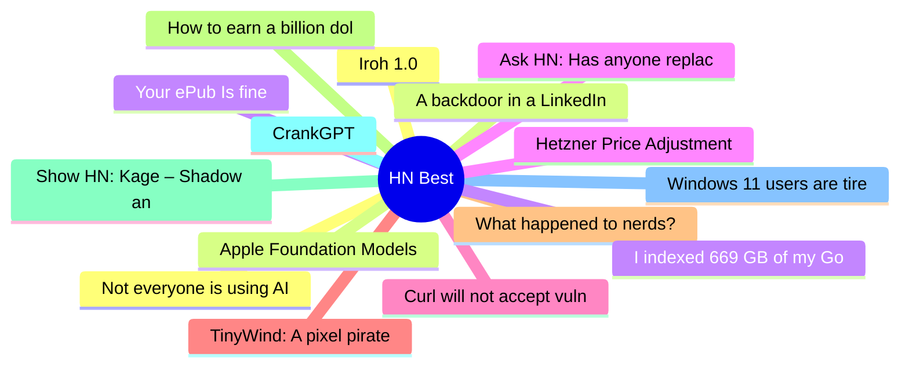

# HackerNews Best (高赞) Top 15 (2026-06-16)

## 思维导图

## 列表（15 条）

### 1. Iroh 1.0
- **链接**: [https://www.iroh.computer/blog/v1](https://www.iroh.computer/blog/v1)
- **分数**: 1091 | **评论**: 325 | **作者**: chadfowler
- **HN**: https://news.ycombinator.com/item?id=48542480

### 2. A backdoor in a LinkedIn job offer
- **链接**: [https://roman.pt/posts/linkedin-backdoor/](https://roman.pt/posts/linkedin-backdoor/)
- **分数**: 984 | **评论**: 190 | **作者**: lwhsiao
- **HN**: https://news.ycombinator.com/item?id=48546294

### 3. Your ePub Is fine
- **链接**: [https://andreklein.net/your-epub-is-fine-kobo-disagrees-blame-adobe/](https://andreklein.net/your-epub-is-fine-kobo-disagrees-blame-adobe/)
- **分数**: 881 | **评论**: 298 | **作者**: sohkamyung
- **HN**: https://news.ycombinator.com/item?id=48533848

### 4. Ask HN: Has anyone replaced Claude/GPT with a local model for daily coding?
- **链接**: [https://news.ycombinator.com/item?id=48542100](https://news.ycombinator.com/item?id=48542100)
- **分数**: 877 | **评论**: 402 | **作者**: cloudking
- **HN**: https://news.ycombinator.com/item?id=48542100

### 5. Curl will not accept vulnerability reports during July 2026
- **链接**: [https://daniel.haxx.se/blog/2026/06/15/curl-summer-of-bliss/](https://daniel.haxx.se/blog/2026/06/15/curl-summer-of-bliss/)
- **分数**: 758 | **评论**: 304 | **作者**: secret-noun
- **HN**: https://news.ycombinator.com/item?id=48537165

### 6. TinyWind: A pixel pirate sailing game with real wind physics (380k+ kms sailed)
- **链接**: [https://tinywind.io](https://tinywind.io)
- **分数**: 745 | **评论**: 147 | **作者**: tinywind
- **HN**: https://news.ycombinator.com/item?id=48543475

### 7. What happened to nerds?
- **链接**: [https://mrmarket.lol/what-the-fuck-happened-to-nerds/](https://mrmarket.lol/what-the-fuck-happened-to-nerds/)
- **分数**: 718 | **评论**: 483 | **作者**: vrnvu
- **HN**: https://news.ycombinator.com/item?id=48538229

### 8. How to earn a billion dollars
- **链接**: [https://paulgraham.com/earn.html](https://paulgraham.com/earn.html)
- **分数**: 711 | **评论**: 1861 | **作者**: kingstoned
- **HN**: https://news.ycombinator.com/item?id=48526360

### 9. Show HN: Kage – Shadow any website to a single binary for offline viewing
- **链接**: [https://github.com/tamnd/kage](https://github.com/tamnd/kage)
- **分数**: 685 | **评论**: 137 | **作者**: tamnd
- **HN**: https://news.ycombinator.com/item?id=48529990

### 10. CrankGPT
- **链接**: [https://crankgpt.com](https://crankgpt.com)
- **分数**: 571 | **评论**: 220 | **作者**: rishikeshs
- **HN**: https://news.ycombinator.com/item?id=48540854

### 11. Windows 11 users are tired of MS account requirements creeping into everything
- **链接**: [https://www.windowscentral.com/microsoft/windows-11/windows-11-users-are-tired-of-microsoft-account-requirements-and-workarounds](https://www.windowscentral.com/microsoft/windows-11/windows-11-users-are-tired-of-microsoft-account-requirements-and-workarounds)
- **分数**: 551 | **评论**: 414 | **作者**: josephcsible
- **HN**: https://news.ycombinator.com/item?id=48533101

### 12. Not everyone is using AI for everything
- **链接**: [https://gabrielweinberg.com/p/people-are-consuming-ai-like-they](https://gabrielweinberg.com/p/people-are-consuming-ai-like-they)
- **分数**: 501 | **评论**: 538 | **作者**: yegg
- **HN**: https://news.ycombinator.com/item?id=48527700

### 13. Apple Foundation Models
- **链接**: [https://platform.claude.com/docs/en/cli-sdks-libraries/libraries/apple-foundation-models](https://platform.claude.com/docs/en/cli-sdks-libraries/libraries/apple-foundation-models)
- **分数**: 470 | **评论**: 218 | **作者**: MehrdadKhnzd
- **HN**: https://news.ycombinator.com/item?id=48536776

### 14. I indexed 669 GB of my GoPro videos using my M1 Max computer and local ML models
- **链接**: [https://news.ycombinator.com/item?id=48528029](https://news.ycombinator.com/item?id=48528029)
- **分数**: 423 | **评论**: 111 | **作者**: iliashad
- **HN**: https://news.ycombinator.com/item?id=48528029

### 15. Hetzner Price Adjustment
- **链接**: [https://docs.hetzner.com/general/infrastructure-and-availability/price-adjustment/#cloud-servers](https://docs.hetzner.com/general/infrastructure-and-availability/price-adjustment/#cloud-servers)
- **分数**: 397 | **评论**: 552 | **作者**: tuhtah
- **HN**: https://news.ycombinator.com/item?id=48540844
