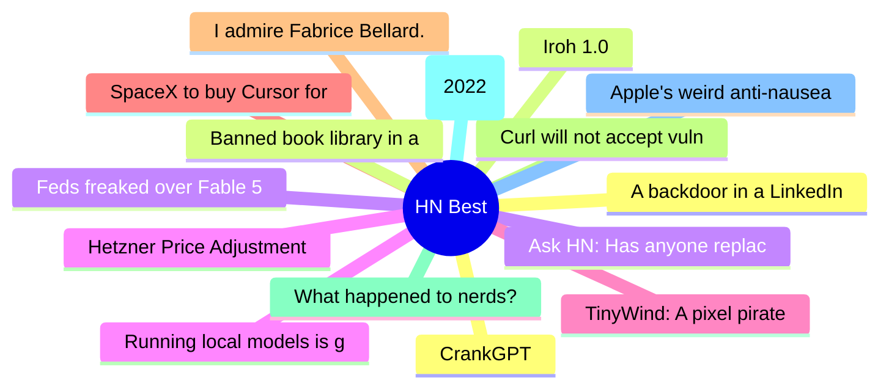

# HackerNews Best (高赞) Top 15 (2026-06-17)

## 思维导图

## 列表（15 条）

### 1. A backdoor in a LinkedIn job offer
- **链接**: [https://roman.pt/posts/linkedin-backdoor/](https://roman.pt/posts/linkedin-backdoor/)
- **分数**: 1545 | **评论**: 294 | **作者**: lwhsiao
- **HN**: https://news.ycombinator.com/item?id=48546294

### 2. Iroh 1.0
- **链接**: [https://www.iroh.computer/blog/v1](https://www.iroh.computer/blog/v1)
- **分数**: 1355 | **评论**: 425 | **作者**: chadfowler
- **HN**: https://news.ycombinator.com/item?id=48542480

### 3. Ask HN: Has anyone replaced Claude/GPT with a local model for daily coding?
- **链接**: [https://news.ycombinator.com/item?id=48542100](https://news.ycombinator.com/item?id=48542100)
- **分数**: 1244 | **评论**: 533 | **作者**: cloudking
- **HN**: https://news.ycombinator.com/item?id=48542100

### 4. Running local models is good now
- **链接**: [https://vickiboykis.com/2026/06/15/running-local-models-is-good-now/](https://vickiboykis.com/2026/06/15/running-local-models-is-good-now/)
- **分数**: 1111 | **评论**: 454 | **作者**: jfb
- **HN**: https://news.ycombinator.com/item?id=48555993

### 5. TinyWind: A pixel pirate sailing game with real wind physics (380k+ kms sailed)
- **链接**: [https://tinywind.io](https://tinywind.io)
- **分数**: 987 | **评论**: 183 | **作者**: tinywind
- **HN**: https://news.ycombinator.com/item?id=48543475

### 6. SpaceX to buy Cursor for $60B
- **链接**: [https://www.reuters.com/legal/transactional/spacex-buy-anysphere-60-billion-2026-06-16/](https://www.reuters.com/legal/transactional/spacex-buy-anysphere-60-billion-2026-06-16/)
- **分数**: 946 | **评论**: 1424 | **作者**: itsmarcelg
- **HN**: https://news.ycombinator.com/item?id=48553224

### 7. I admire Fabrice Bellard. He is almost certainly a better overall programmer
- **链接**: [https://twitter.com/ID_AA_Carmack/status/2064095424420487226](https://twitter.com/ID_AA_Carmack/status/2064095424420487226)
- **分数**: 871 | **评论**: 426 | **作者**: apitman
- **HN**: https://news.ycombinator.com/item?id=48550779

### 8. Curl will not accept vulnerability reports during July 2026
- **链接**: [https://daniel.haxx.se/blog/2026/06/15/curl-summer-of-bliss/](https://daniel.haxx.se/blog/2026/06/15/curl-summer-of-bliss/)
- **分数**: 779 | **评论**: 313 | **作者**: secret-noun
- **HN**: https://news.ycombinator.com/item?id=48537165

### 9. What happened to nerds?
- **链接**: [https://mrmarket.lol/what-the-fuck-happened-to-nerds/](https://mrmarket.lol/what-the-fuck-happened-to-nerds/)
- **分数**: 740 | **评论**: 502 | **作者**: vrnvu
- **HN**: https://news.ycombinator.com/item?id=48538229

### 10. Mechanical Watch (2022)
- **链接**: [https://ciechanow.ski/mechanical-watch/](https://ciechanow.ski/mechanical-watch/)
- **分数**: 649 | **评论**: 115 | **作者**: razin
- **HN**: https://news.ycombinator.com/item?id=48553550

### 11. Apple's weird anti-nausea dots cured my car sickness
- **链接**: [https://www.theverge.com/tech/942854/apple-vehicle-motion-cues-review-really-work](https://www.theverge.com/tech/942854/apple-vehicle-motion-cues-review-really-work)
- **分数**: 637 | **评论**: 201 | **作者**: neilfrndes
- **HN**: https://news.ycombinator.com/item?id=48557530

### 12. CrankGPT
- **链接**: [https://crankgpt.com](https://crankgpt.com)
- **分数**: 598 | **评论**: 233 | **作者**: rishikeshs
- **HN**: https://news.ycombinator.com/item?id=48540854

### 13. Banned book library in a wi-fi smart light bulb
- **链接**: [https://www.richardosgood.com/posts/banned-book-library/](https://www.richardosgood.com/posts/banned-book-library/)
- **分数**: 571 | **评论**: 347 | **作者**: sohkamyung
- **HN**: https://news.ycombinator.com/item?id=48547985

### 14. Feds freaked over Fable 5 after 'fix this code', not jailbreak, say researchers
- **链接**: [https://www.theregister.com/security/2026/06/15/feds-freaked-over-fable-5-after-simple-fix-this-code-prompt-not-jailbreak-says-researcher/5255827](https://www.theregister.com/security/2026/06/15/feds-freaked-over-fable-5-after-simple-fix-this-code-prompt-not-jailbreak-says-researcher/5255827)
- **分数**: 555 | **评论**: 330 | **作者**: _tk_
- **HN**: https://news.ycombinator.com/item?id=48552687

### 15. Hetzner Price Adjustment
- **链接**: [https://docs.hetzner.com/general/infrastructure-and-availability/price-adjustment/#cloud-servers](https://docs.hetzner.com/general/infrastructure-and-availability/price-adjustment/#cloud-servers)
- **分数**: 528 | **评论**: 734 | **作者**: tuhtah
- **HN**: https://news.ycombinator.com/item?id=48540844
