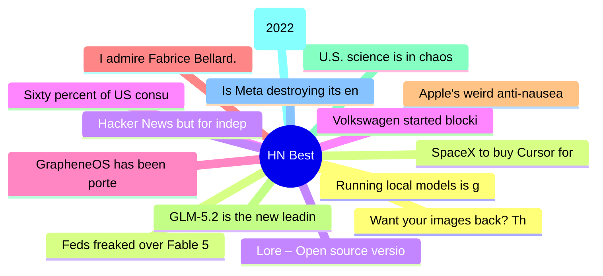

# HackerNews Best (高赞) Top 15 (2026-06-18)

## 思维导图

## 列表（15 条）

### 1. Running local models is good now
- **链接**: [https://vickiboykis.com/2026/06/15/running-local-models-is-good-now/](https://vickiboykis.com/2026/06/15/running-local-models-is-good-now/)
- **分数**: 1520 | **评论**: 584 | **作者**: jfb
- **HN**: https://news.ycombinator.com/item?id=48555993

### 2. SpaceX to buy Cursor for $60B
- **链接**: [https://www.reuters.com/legal/transactional/spacex-buy-anysphere-60-billion-2026-06-16/](https://www.reuters.com/legal/transactional/spacex-buy-anysphere-60-billion-2026-06-16/)
- **分数**: 1116 | **评论**: 1647 | **作者**: itsmarcelg
- **HN**: https://news.ycombinator.com/item?id=48553224

### 3. Lore – Open source version control system designed for scalability
- **链接**: [https://lore.org/](https://lore.org/)
- **分数**: 1045 | **评论**: 555 | **作者**: regnerba
- **HN**: https://news.ycombinator.com/item?id=48571081

### 4. Sixty percent of US consumers say 'AI' in brand messaging is a turnoff
- **链接**: [https://wpvip.com/future-of-the-web-2026/](https://wpvip.com/future-of-the-web-2026/)
- **分数**: 1020 | **评论**: 534 | **作者**: thm
- **HN**: https://news.ycombinator.com/item?id=48569278

### 5. GrapheneOS has been ported to Android 17
- **链接**: [https://discuss.grapheneos.org/d/36469-grapheneos-has-been-ported-to-android-17-and-official-releases-are-coming-soon](https://discuss.grapheneos.org/d/36469-grapheneos-has-been-ported-to-android-17-and-official-releases-are-coming-soon)
- **分数**: 979 | **评论**: 569 | **作者**: Cider9986
- **HN**: https://news.ycombinator.com/item?id=48561654

### 6. I admire Fabrice Bellard. He is almost certainly a better overall programmer
- **链接**: [https://twitter.com/ID_AA_Carmack/status/2064095424420487226](https://twitter.com/ID_AA_Carmack/status/2064095424420487226)
- **分数**: 921 | **评论**: 451 | **作者**: apitman
- **HN**: https://news.ycombinator.com/item?id=48550779

### 7. Apple's weird anti-nausea dots cured my car sickness
- **链接**: [https://www.theverge.com/tech/942854/apple-vehicle-motion-cues-review-really-work](https://www.theverge.com/tech/942854/apple-vehicle-motion-cues-review-really-work)
- **分数**: 868 | **评论**: 261 | **作者**: neilfrndes
- **HN**: https://news.ycombinator.com/item?id=48557530

### 8. GLM-5.2 is the new leading open weights model on Artificial Analysis
- **链接**: [https://artificialanalysis.ai/articles/glm-5-2-is-the-new-leading-open-weights-model-on-the-artificial-analysis-intelligence-index](https://artificialanalysis.ai/articles/glm-5-2-is-the-new-leading-open-weights-model-on-the-artificial-analysis-intelligence-index)
- **分数**: 820 | **评论**: 393 | **作者**: himata4113
- **HN**: https://news.ycombinator.com/item?id=48567759

### 9. U.S. science is in chaos
- **链接**: [https://www.scientificamerican.com/article/americas-compact-between-science-and-politics-is-broken/](https://www.scientificamerican.com/article/americas-compact-between-science-and-politics-is-broken/)
- **分数**: 745 | **评论**: 906 | **作者**: presspot
- **HN**: https://news.ycombinator.com/item?id=48568058

### 10. Mechanical Watch (2022)
- **链接**: [https://ciechanow.ski/mechanical-watch/](https://ciechanow.ski/mechanical-watch/)
- **分数**: 727 | **评论**: 124 | **作者**: razin
- **HN**: https://news.ycombinator.com/item?id=48553550

### 11. Is Meta destroying its engineering organization?
- **链接**: [https://newsletter.pragmaticengineer.com/p/why-is-meta-destroying-its-engineering](https://newsletter.pragmaticengineer.com/p/why-is-meta-destroying-its-engineering)
- **分数**: 639 | **评论**: 588 | **作者**: throwarayes
- **HN**: https://news.ycombinator.com/item?id=48558045

### 12. Want your images back? That'll be $5
- **链接**: [https://www.lutr.dev/want-your-images-back-sure-that-ll-be-5-dollars](https://www.lutr.dev/want-your-images-back-sure-that-ll-be-5-dollars)
- **分数**: 620 | **评论**: 256 | **作者**: lutr
- **HN**: https://news.ycombinator.com/item?id=48569954

### 13. Feds freaked over Fable 5 after 'fix this code', not jailbreak, say researchers
- **链接**: [https://www.theregister.com/security/2026/06/15/feds-freaked-over-fable-5-after-simple-fix-this-code-prompt-not-jailbreak-says-researcher/5255827](https://www.theregister.com/security/2026/06/15/feds-freaked-over-fable-5-after-simple-fix-this-code-prompt-not-jailbreak-says-researcher/5255827)
- **分数**: 595 | **评论**: 356 | **作者**: _tk_
- **HN**: https://news.ycombinator.com/item?id=48552687

### 14. Hacker News but for independent blogs
- **链接**: [https://bubbles.town/](https://bubbles.town/)
- **分数**: 557 | **评论**: 185 | **作者**: headalgorithm
- **HN**: https://news.ycombinator.com/item?id=48567155

### 15. Volkswagen started blocking GrapheneOS users
- **链接**: [https://discuss.grapheneos.org/d/35949-volkswagen-app?page=3](https://discuss.grapheneos.org/d/35949-volkswagen-app?page=3)
- **分数**: 539 | **评论**: 350 | **作者**: microtonal
- **HN**: https://news.ycombinator.com/item?id=48571526
