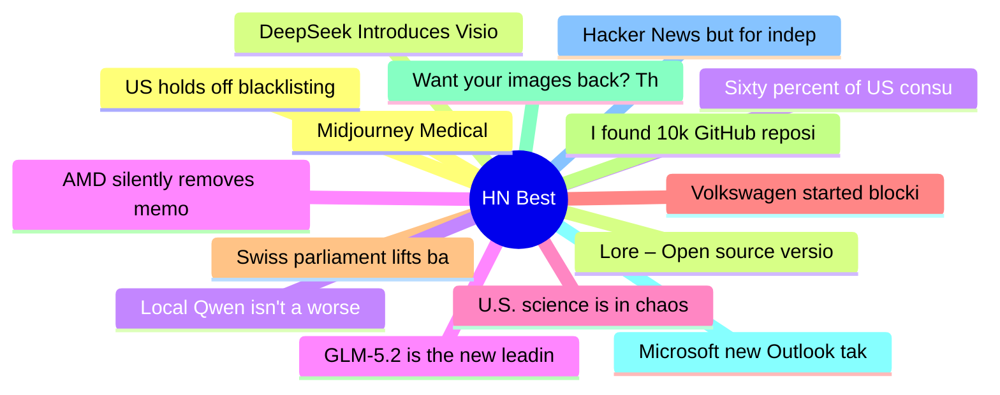

# HackerNews Best (高赞) Top 15 (2026-06-19)

## 思维导图

## 列表（15 条）

### 1. Midjourney Medical
- **链接**: [https://www.midjourney.com/medical/blogpost](https://www.midjourney.com/medical/blogpost)
- **分数**: 1282 | **评论**: 844 | **作者**: ricochet11
- **HN**: https://news.ycombinator.com/item?id=48579650

### 2. Lore – Open source version control system designed for scalability
- **链接**: [https://lore.org/](https://lore.org/)
- **分数**: 1223 | **评论**: 664 | **作者**: regnerba
- **HN**: https://news.ycombinator.com/item?id=48571081

### 3. Sixty percent of US consumers say 'AI' in brand messaging is a turnoff
- **链接**: [https://wpvip.com/future-of-the-web-2026/](https://wpvip.com/future-of-the-web-2026/)
- **分数**: 1066 | **评论**: 574 | **作者**: thm
- **HN**: https://news.ycombinator.com/item?id=48569278

### 4. GLM-5.2 is the new leading open weights model on Artificial Analysis
- **链接**: [https://artificialanalysis.ai/articles/glm-5-2-is-the-new-leading-open-weights-model-on-the-artificial-analysis-intelligence-index](https://artificialanalysis.ai/articles/glm-5-2-is-the-new-leading-open-weights-model-on-the-artificial-analysis-intelligence-index)
- **分数**: 877 | **评论**: 433 | **作者**: himata4113
- **HN**: https://news.ycombinator.com/item?id=48567759

### 5. U.S. science is in chaos
- **链接**: [https://www.scientificamerican.com/article/americas-compact-between-science-and-politics-is-broken/](https://www.scientificamerican.com/article/americas-compact-between-science-and-politics-is-broken/)
- **分数**: 862 | **评论**: 1090 | **作者**: presspot
- **HN**: https://news.ycombinator.com/item?id=48568058

### 6. Volkswagen started blocking GrapheneOS users
- **链接**: [https://discuss.grapheneos.org/d/35949-volkswagen-app?page=3](https://discuss.grapheneos.org/d/35949-volkswagen-app?page=3)
- **分数**: 763 | **评论**: 454 | **作者**: microtonal
- **HN**: https://news.ycombinator.com/item?id=48571526

### 7. Swiss parliament lifts ban on new nuclear power plants
- **链接**: [https://www.bluewin.ch/en/news/switzerland/parliament-lifts-ban-on-new-nuclear-power-plants-3257535.html](https://www.bluewin.ch/en/news/switzerland/parliament-lifts-ban-on-new-nuclear-power-plants-3257535.html)
- **分数**: 704 | **评论**: 586 | **作者**: leonidasrup
- **HN**: https://news.ycombinator.com/item?id=48585746

### 8. I found 10k GitHub repositories distributing Trojan malware
- **链接**: [https://orchidfiles.com/github-repositories-distributing-malware/](https://orchidfiles.com/github-repositories-distributing-malware/)
- **分数**: 676 | **评论**: 152 | **作者**: theorchid
- **HN**: https://news.ycombinator.com/item?id=48583928

### 9. Want your images back? That'll be $5
- **链接**: [https://www.lutr.dev/want-your-images-back-sure-that-ll-be-5-dollars](https://www.lutr.dev/want-your-images-back-sure-that-ll-be-5-dollars)
- **分数**: 649 | **评论**: 265 | **作者**: lutr
- **HN**: https://news.ycombinator.com/item?id=48569954

### 10. Microsoft new Outlook takes 10 seconds to do what Outlook Classic does instantly
- **链接**: [https://www.windowslatest.com/2026/06/15/microsofts-new-outlook-takes-10-seconds-to-do-what-outlook-classic-does-instantly-on-windows/](https://www.windowslatest.com/2026/06/15/microsofts-new-outlook-takes-10-seconds-to-do-what-outlook-classic-does-instantly-on-windows/)
- **分数**: 617 | **评论**: 407 | **作者**: Adam-Hincu
- **HN**: https://news.ycombinator.com/item?id=48584207

### 11. Hacker News but for independent blogs
- **链接**: [https://bubbles.town/](https://bubbles.town/)
- **分数**: 607 | **评论**: 209 | **作者**: headalgorithm
- **HN**: https://news.ycombinator.com/item?id=48567155

### 12. US holds off blacklisting DeepSeek, more than 100 firms deemed security risks
- **链接**: [https://www.reuters.com/world/china/us-holds-off-blacklisting-chinas-deepseek-more-than-100-firms-deemed-security-2026-06-17/](https://www.reuters.com/world/china/us-holds-off-blacklisting-chinas-deepseek-more-than-100-firms-deemed-security-2026-06-17/)
- **分数**: 524 | **评论**: 586 | **作者**: giuliomagnifico
- **HN**: https://news.ycombinator.com/item?id=48565498

### 13. DeepSeek Introduces Vision
- **链接**: [https://chat.deepseek.com/](https://chat.deepseek.com/)
- **分数**: 455 | **评论**: 182 | **作者**: RIshabh235
- **HN**: https://news.ycombinator.com/item?id=48581458

### 14. Local Qwen isn't a worse Opus, it's a different tool
- **链接**: [https://blog.alexellis.io/local-ai-is-not-opus/](https://blog.alexellis.io/local-ai-is-not-opus/)
- **分数**: 453 | **评论**: 244 | **作者**: alphabettsy
- **HN**: https://news.ycombinator.com/item?id=48580209

### 15. AMD silently removes memory encryption from consumer Ryzen CPUs
- **链接**: [https://www.tomshardware.com/pc-components/cpus/amd-silently-removes-memory-encryption-from-consumer-ryzen-cpus-leaving-users-unaware-that-they-may-be-vulnerable-security-feature-vanishes-after-newer-agesa-firmware-amd-engineers-go-radio-silent-when-pressed-about-the-change](https://www.tomshardware.com/pc-components/cpus/amd-silently-removes-memory-encryption-from-consumer-ryzen-cpus-leaving-users-unaware-that-they-may-be-vulnerable-security-feature-vanishes-after-newer-agesa-firmware-amd-engineers-go-radio-silent-when-pressed-about-the-change)
- **分数**: 417 | **评论**: 202 | **作者**: lompad
- **HN**: https://news.ycombinator.com/item?id=48582320
