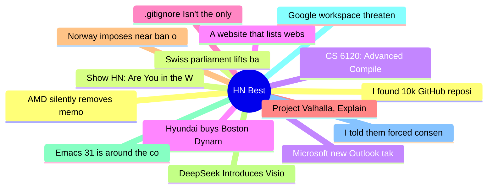

# HackerNews Best (高赞) Top 15 (2026-06-20)

## 思维导图

## 列表（15 条）

### 1. I found 10k GitHub repositories distributing Trojan malware
- **链接**: [https://orchidfiles.com/github-repositories-distributing-malware/](https://orchidfiles.com/github-repositories-distributing-malware/)
- **分数**: 940 | **评论**: 243 | **作者**: theorchid
- **HN**: https://news.ycombinator.com/item?id=48583928

### 2. Swiss parliament lifts ban on new nuclear power plants
- **链接**: [https://www.bluewin.ch/en/news/switzerland/parliament-lifts-ban-on-new-nuclear-power-plants-3257535.html](https://www.bluewin.ch/en/news/switzerland/parliament-lifts-ban-on-new-nuclear-power-plants-3257535.html)
- **分数**: 794 | **评论**: 827 | **作者**: leonidasrup
- **HN**: https://news.ycombinator.com/item?id=48585746

### 3. Microsoft new Outlook takes 10 seconds to do what Outlook Classic does instantly
- **链接**: [https://www.windowslatest.com/2026/06/15/microsofts-new-outlook-takes-10-seconds-to-do-what-outlook-classic-does-instantly-on-windows/](https://www.windowslatest.com/2026/06/15/microsofts-new-outlook-takes-10-seconds-to-do-what-outlook-classic-does-instantly-on-windows/)
- **分数**: 722 | **评论**: 507 | **作者**: Adam-Hincu
- **HN**: https://news.ycombinator.com/item?id=48584207

### 4. Hyundai buys Boston Dynamics
- **链接**: [https://startupfortune.com/hyundai-takes-full-control-of-boston-dynamics-as-softbank-exits-for-325-million/](https://startupfortune.com/hyundai-takes-full-control-of-boston-dynamics-as-softbank-exits-for-325-million/)
- **分数**: 717 | **评论**: 327 | **作者**: ck2
- **HN**: https://news.ycombinator.com/item?id=48600312

### 5. .gitignore Isn't the only way to ignore files in Git
- **链接**: [https://nelson.cloud/.gitignore-isnt-the-only-way-to-ignore-files-in-git/](https://nelson.cloud/.gitignore-isnt-the-only-way-to-ignore-files-in-git/)
- **分数**: 567 | **评论**: 169 | **作者**: FergusArgyll
- **HN**: https://news.ycombinator.com/item?id=48583356

### 6. Project Valhalla, Explained: How a Decade of Work Arrives in JDK 28
- **链接**: [https://www.jvm-weekly.com/p/project-valhalla-explained-how-a](https://www.jvm-weekly.com/p/project-valhalla-explained-how-a)
- **分数**: 553 | **评论**: 344 | **作者**: philonoist
- **HN**: https://news.ycombinator.com/item?id=48595511

### 7. Norway imposes near ban on AI in elementary school
- **链接**: [https://www.reuters.com/technology/norway-imposes-near-ban-ai-elementary-school-2026-06-19/](https://www.reuters.com/technology/norway-imposes-near-ban-ai-elementary-school-2026-06-19/)
- **分数**: 520 | **评论**: 353 | **作者**: ilreb
- **HN**: https://news.ycombinator.com/item?id=48600093

### 8. DeepSeek Introduces Vision
- **链接**: [https://chat.deepseek.com/](https://chat.deepseek.com/)
- **分数**: 489 | **评论**: 200 | **作者**: RIshabh235
- **HN**: https://news.ycombinator.com/item?id=48581458

### 9. Emacs 31 is around the corner: The changes I'm daily driving
- **链接**: [https://www.rahuljuliato.com/posts/emacs-31-around-the-corner](https://www.rahuljuliato.com/posts/emacs-31-around-the-corner)
- **分数**: 458 | **评论**: 274 | **作者**: frou_dh
- **HN**: https://news.ycombinator.com/item?id=48584135

### 10. Google workspace threatening to block Firefox access
- **链接**: [https://tales.fromprod.com/2026/169/google-workspace-threatening-to-block-firefox.html](https://tales.fromprod.com/2026/169/google-workspace-threatening-to-block-firefox.html)
- **分数**: 455 | **评论**: 147 | **作者**: birdculture
- **HN**: https://news.ycombinator.com/item?id=48600345

### 11. I told them forced consent was unlawful. 5 years later it cost Elkjop €1.8M
- **链接**: [https://www.thatprivacyguy.com/blog/elkjop-forced-consent-fine/](https://www.thatprivacyguy.com/blog/elkjop-forced-consent-fine/)
- **分数**: 455 | **评论**: 291 | **作者**: speckx
- **HN**: https://news.ycombinator.com/item?id=48589501

### 12. AMD silently removes memory encryption from consumer Ryzen CPUs
- **链接**: [https://www.tomshardware.com/pc-components/cpus/amd-silently-removes-memory-encryption-from-consumer-ryzen-cpus-leaving-users-unaware-that-they-may-be-vulnerable-security-feature-vanishes-after-newer-agesa-firmware-amd-engineers-go-radio-silent-when-pressed-about-the-change](https://www.tomshardware.com/pc-components/cpus/amd-silently-removes-memory-encryption-from-consumer-ryzen-cpus-leaving-users-unaware-that-they-may-be-vulnerable-security-feature-vanishes-after-newer-agesa-firmware-amd-engineers-go-radio-silent-when-pressed-about-the-change)
- **分数**: 446 | **评论**: 209 | **作者**: lompad
- **HN**: https://news.ycombinator.com/item?id=48582320

### 13. Show HN: Are You in the Weights?
- **链接**: [https://www.intheweights.com/](https://www.intheweights.com/)
- **分数**: 443 | **评论**: 240 | **作者**: turtlesoup
- **HN**: https://news.ycombinator.com/item?id=48591348

### 14. CS 6120: Advanced Compilers: The Self-Guided Online Course (2020)
- **链接**: [https://www.cs.cornell.edu/courses/cs6120/2025fa/self-guided/](https://www.cs.cornell.edu/courses/cs6120/2025fa/self-guided/)
- **分数**: 433 | **评论**: 59 | **作者**: ibobev
- **HN**: https://news.ycombinator.com/item?id=48583606

### 15. A website that lists websites to submit your website to
- **链接**: [https://www.submission.directory/](https://www.submission.directory/)
- **分数**: 428 | **评论**: 93 | **作者**: azeemkafridi
- **HN**: https://news.ycombinator.com/item?id=48586631
