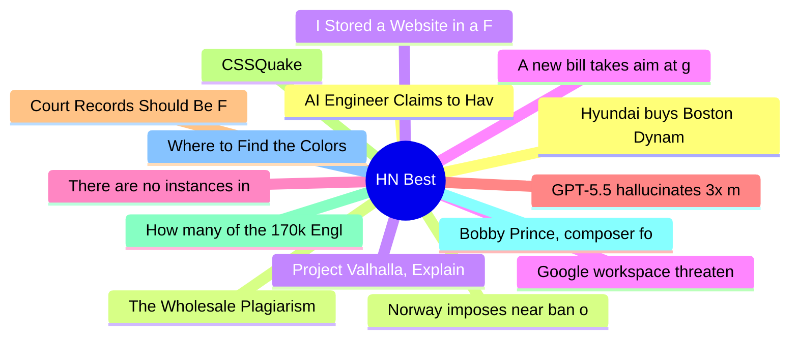

# HackerNews Best (高赞) Top 15 (2026-06-21)

## 思维导图

## 列表（15 条）

### 1. Hyundai buys Boston Dynamics
- **链接**: [https://startupfortune.com/hyundai-takes-full-control-of-boston-dynamics-as-softbank-exits-for-325-million/](https://startupfortune.com/hyundai-takes-full-control-of-boston-dynamics-as-softbank-exits-for-325-million/)
- **分数**: 939 | **评论**: 391 | **作者**: ck2
- **HN**: https://news.ycombinator.com/item?id=48600312

### 2. Norway imposes near ban on AI in elementary school
- **链接**: [https://www.reuters.com/technology/norway-imposes-near-ban-ai-elementary-school-2026-06-19/](https://www.reuters.com/technology/norway-imposes-near-ban-ai-elementary-school-2026-06-19/)
- **分数**: 788 | **评论**: 569 | **作者**: ilreb
- **HN**: https://news.ycombinator.com/item?id=48600093

### 3. Project Valhalla, Explained: How a Decade of Work Arrives in JDK 28
- **链接**: [https://www.jvm-weekly.com/p/project-valhalla-explained-how-a](https://www.jvm-weekly.com/p/project-valhalla-explained-how-a)
- **分数**: 646 | **评论**: 425 | **作者**: philonoist
- **HN**: https://news.ycombinator.com/item?id=48595511

### 4. Google workspace threatening to block Firefox access
- **链接**: [https://tales.fromprod.com/2026/169/google-workspace-threatening-to-block-firefox.html](https://tales.fromprod.com/2026/169/google-workspace-threatening-to-block-firefox.html)
- **分数**: 531 | **评论**: 176 | **作者**: birdculture
- **HN**: https://news.ycombinator.com/item?id=48600345

### 5. There are no instances in ATProto
- **链接**: [https://overreacted.io/there-are-no-instances-in-atproto/](https://overreacted.io/there-are-no-instances-in-atproto/)
- **分数**: 520 | **评论**: 298 | **作者**: danabramov
- **HN**: https://news.ycombinator.com/item?id=48599515

### 6. GPT-5.5 hallucinates 3x more than MIT-licensed GLM-5.2
- **链接**: [https://arrowtsx.dev/bigger-models/](https://arrowtsx.dev/bigger-models/)
- **分数**: 510 | **评论**: 249 | **作者**: oshrimpton
- **HN**: https://news.ycombinator.com/item?id=48600167

### 7. Court Records Should Be Free
- **链接**: [https://www.eff.org/deeplinks/2026/06/court-records-should-be-free](https://www.eff.org/deeplinks/2026/06/court-records-should-be-free)
- **分数**: 501 | **评论**: 133 | **作者**: hn_acker
- **HN**: https://news.ycombinator.com/item?id=48600946

### 8. CSSQuake
- **链接**: [https://cssquake.com/](https://cssquake.com/)
- **分数**: 482 | **评论**: 102 | **作者**: msalsas
- **HN**: https://news.ycombinator.com/item?id=48608223

### 9. How many of the 170k English words do you know?
- **链接**: [https://vocabowl-870366514258.us-west1.run.app/](https://vocabowl-870366514258.us-west1.run.app/)
- **分数**: 482 | **评论**: 544 | **作者**: abnry
- **HN**: https://news.ycombinator.com/item?id=48598586

### 10. Bobby Prince, composer for Doom, Wolfenstein 3D, and Duke Nukem 3D, has died
- **链接**: [https://www.legacy.com/legacy/robert-bobby-prince-lll](https://www.legacy.com/legacy/robert-bobby-prince-lll)
- **分数**: 452 | **评论**: 52 | **作者**: pgrote
- **HN**: https://news.ycombinator.com/item?id=48602352

### 11. Where to Find the Colors Your Screen Can't Show You
- **链接**: [https://moultano.wordpress.com/2026/06/19/where-to-find-the-colors-your-screen-cant-show-you/](https://moultano.wordpress.com/2026/06/19/where-to-find-the-colors-your-screen-cant-show-you/)
- **分数**: 444 | **评论**: 119 | **作者**: moultano
- **HN**: https://news.ycombinator.com/item?id=48606140

### 12. AI Engineer Claims to Have Cracked Linear A
- **链接**: [https://aiclambake.com/clamtakes/linear-a/](https://aiclambake.com/clamtakes/linear-a/)
- **分数**: 439 | **评论**: 173 | **作者**: Kosturdistan
- **HN**: https://news.ycombinator.com/item?id=48600107

### 13. The Wholesale Plagiarism of Obscure Sorrows
- **链接**: [https://waxy.org/2026/06/the-wholesale-plagiarism-of-obscure-sorrows/](https://waxy.org/2026/06/the-wholesale-plagiarism-of-obscure-sorrows/)
- **分数**: 342 | **评论**: 141 | **作者**: ridesisapis
- **HN**: https://news.ycombinator.com/item?id=48611411

### 14. I Stored a Website in a Favicon
- **链接**: [https://www.timwehrle.de/blog/i-stored-a-website-in-a-favicon/](https://www.timwehrle.de/blog/i-stored-a-website-in-a-favicon/)
- **分数**: 295 | **评论**: 100 | **作者**: theanonymousone
- **HN**: https://news.ycombinator.com/item?id=48606619

### 15. A new bill takes aim at government pressure to silence lawful online speech
- **链接**: [https://www.eff.org/deeplinks/2026/06/new-bill-takes-aim-government-pressure-silence-lawful-online-speech](https://www.eff.org/deeplinks/2026/06/new-bill-takes-aim-government-pressure-silence-lawful-online-speech)
- **分数**: 295 | **评论**: 138 | **作者**: hn_acker
- **HN**: https://news.ycombinator.com/item?id=48600950
