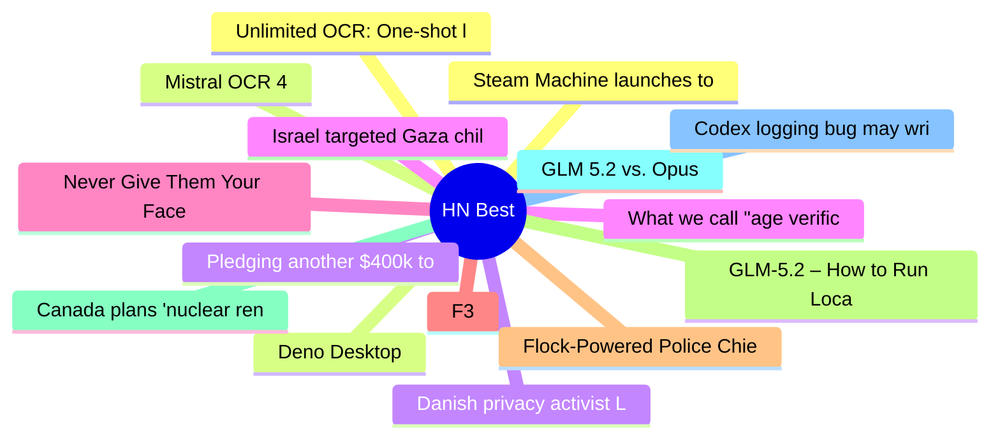

# HackerNews Best (高赞) Top 15 (2026-06-24)

## 思维导图

## 列表（15 条）

### 1. Steam Machine launches today
- **链接**: [https://store.steampowered.com/news/group/45479024/view/685257114654870245](https://store.steampowered.com/news/group/45479024/view/685257114654870245)
- **分数**: 1880 | **评论**: 1648 | **作者**: theschwa
- **HN**: https://news.ycombinator.com/item?id=48632884

### 2. Deno Desktop
- **链接**: [https://docs.deno.com/runtime/desktop/](https://docs.deno.com/runtime/desktop/)
- **分数**: 1101 | **评论**: 394 | **作者**: GeneralMaximus
- **HN**: https://news.ycombinator.com/item?id=48626137

### 3. Pledging another $400k to the Zig software foundation
- **链接**: [https://mitchellh.com/writing/zig-donation-2026](https://mitchellh.com/writing/zig-donation-2026)
- **分数**: 800 | **评论**: 288 | **作者**: tosh
- **HN**: https://news.ycombinator.com/item?id=48630020

### 4. What we call "age verification" is actually mass surveillance
- **链接**: [https://pluralistic.net/2026/06/23/destroy-the-village/](https://pluralistic.net/2026/06/23/destroy-the-village/)
- **分数**: 792 | **评论**: 419 | **作者**: hn_acker
- **HN**: https://news.ycombinator.com/item?id=48645173

### 5. Never Give Them Your Face
- **链接**: [https://nevergivethemyourface.com/](https://nevergivethemyourface.com/)
- **分数**: 735 | **评论**: 435 | **作者**: audiodude
- **HN**: https://news.ycombinator.com/item?id=48630066

### 6. F3
- **链接**: [https://github.com/future-file-format/f3](https://github.com/future-file-format/f3)
- **分数**: 619 | **评论**: 129 | **作者**: tosh
- **HN**: https://news.ycombinator.com/item?id=48647799

### 7. Flock-Powered Police Chiefs Stalking Women Shows Why Warrants Are Needed
- **链接**: [https://ipvm.com/reports/police-chiefs-track](https://ipvm.com/reports/police-chiefs-track)
- **分数**: 614 | **评论**: 337 | **作者**: jhonovich
- **HN**: https://news.ycombinator.com/item?id=48634694

### 8. GLM-5.2 – How to Run Locally
- **链接**: [https://unsloth.ai/docs/models/glm-5.2](https://unsloth.ai/docs/models/glm-5.2)
- **分数**: 586 | **评论**: 283 | **作者**: TechTechTech
- **HN**: https://news.ycombinator.com/item?id=48636377

### 9. Canada plans 'nuclear renaissance' with up to 10 reactors built by 2040
- **链接**: [https://www.cbc.ca/news/politics/federal-nuclear-strategy-9.7244509](https://www.cbc.ca/news/politics/federal-nuclear-strategy-9.7244509)
- **分数**: 582 | **评论**: 420 | **作者**: geox
- **HN**: https://news.ycombinator.com/item?id=48634585

### 10. GLM 5.2 vs. Opus
- **链接**: [https://techstackups.com/comparisons/glm-5.2-vs-opus/](https://techstackups.com/comparisons/glm-5.2-vs-opus/)
- **分数**: 513 | **评论**: 338 | **作者**: ritzaco
- **HN**: https://news.ycombinator.com/item?id=48626866

### 11. Codex logging bug may write TBs to local SSDs
- **链接**: [https://github.com/openai/codex/issues/28224](https://github.com/openai/codex/issues/28224)
- **分数**: 501 | **评论**: 269 | **作者**: vantareed
- **HN**: https://news.ycombinator.com/item?id=48626930

### 12. Unlimited OCR: One-shot long-horizon parsing
- **链接**: [https://github.com/baidu/Unlimited-OCR](https://github.com/baidu/Unlimited-OCR)
- **分数**: 456 | **评论**: 104 | **作者**: ingve
- **HN**: https://news.ycombinator.com/item?id=48643426

### 13. Mistral OCR 4
- **链接**: [https://mistral.ai/news/ocr-4/](https://mistral.ai/news/ocr-4/)
- **分数**: 443 | **评论**: 114 | **作者**: meetpateltech
- **HN**: https://news.ycombinator.com/item?id=48645152

### 14. Danish privacy activist Lars Andersen raided by police
- **链接**: [https://twitter.com/LarsAnders1620/status/2068208864747540516#m](https://twitter.com/LarsAnders1620/status/2068208864747540516#m)
- **分数**: 433 | **评论**: 404 | **作者**: I_am_tiberius
- **HN**: https://news.ycombinator.com/item?id=48625823

### 15. Israel targeted Gaza children resulting in genocide, UN inquiry says
- **链接**: [https://www.reuters.com/world/middle-east/israel-targeted-gaza-children-resulting-genocide-un-inquiry-says-2026-06-23/](https://www.reuters.com/world/middle-east/israel-targeted-gaza-children-resulting-genocide-un-inquiry-says-2026-06-23/)
- **分数**: 432 | **评论**: 188 | **作者**: supercopter
- **HN**: https://news.ycombinator.com/item?id=48642784
