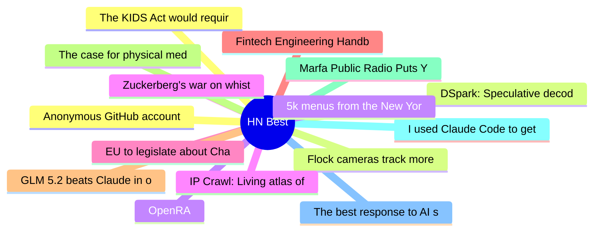

# HackerNews Best (高赞) Top 15 (2026-06-29)

## 思维导图

## 列表（15 条）

### 1. Anonymous GitHub account mass-dropping undisclosed 0-days
- **链接**: [https://github.com/bikini/exploitarium](https://github.com/bikini/exploitarium)
- **分数**: 928 | **评论**: 374 | **作者**: binyu
- **HN**: https://news.ycombinator.com/item?id=48698617

### 2. DSpark: Speculative decoding accelerates LLM inference [pdf]
- **链接**: [https://github.com/deepseek-ai/DeepSpec/blob/main/DSpark_paper.pdf](https://github.com/deepseek-ai/DeepSpec/blob/main/DSpark_paper.pdf)
- **分数**: 784 | **评论**: 352 | **作者**: aurenvale
- **HN**: https://news.ycombinator.com/item?id=48696585

### 3. OpenRA
- **链接**: [https://www.openra.net/](https://www.openra.net/)
- **分数**: 782 | **评论**: 153 | **作者**: tosh
- **HN**: https://news.ycombinator.com/item?id=48697560

### 4. Zuckerberg's war on whistleblowers
- **链接**: [https://pluralistic.net/2026/06/27/zuckerstreisand-2/](https://pluralistic.net/2026/06/27/zuckerstreisand-2/)
- **分数**: 756 | **评论**: 284 | **作者**: HotGarbage
- **HN**: https://news.ycombinator.com/item?id=48698684

### 5. EU to legislate about Chat Control behind closed doors
- **链接**: [https://www.patrick-breyer.de/en/double-threat-to-private-communications-undemocratic-chat-control-backroom-deals-and-imminent-concessions-spark-relaunch-of-fightchatcontrol-eu/](https://www.patrick-breyer.de/en/double-threat-to-private-communications-undemocratic-chat-control-backroom-deals-and-imminent-concessions-spark-relaunch-of-fightchatcontrol-eu/)
- **分数**: 619 | **评论**: 353 | **作者**: NeutralForest
- **HN**: https://news.ycombinator.com/item?id=48707719

### 6. Fintech Engineering Handbook
- **链接**: [https://w.pitula.me/fintech-engineering-handbook/](https://w.pitula.me/fintech-engineering-handbook/)
- **分数**: 619 | **评论**: 213 | **作者**: signa11
- **HN**: https://news.ycombinator.com/item?id=48696982

### 7. GLM 5.2 beats Claude in our benchmarks
- **链接**: [https://semgrep.dev/blog/2026/we-have-mythos-at-home-glm-52-beats-claude-in-our-cyber-benchmarks/](https://semgrep.dev/blog/2026/we-have-mythos-at-home-glm-52-beats-claude-in-our-cyber-benchmarks/)
- **分数**: 591 | **评论**: 284 | **作者**: jms703
- **HN**: https://news.ycombinator.com/item?id=48709670

### 8. The case for physical media ownership
- **链接**: [https://dervis.de/physical/](https://dervis.de/physical/)
- **分数**: 476 | **评论**: 351 | **作者**: cemdervis
- **HN**: https://news.ycombinator.com/item?id=48697335

### 9. Marfa Public Radio Puts You to Sleep
- **链接**: [https://www.marfapublicradio.org/podcast/marfa-public-radio-puts-you-to-sleep](https://www.marfapublicradio.org/podcast/marfa-public-radio-puts-you-to-sleep)
- **分数**: 393 | **评论**: 119 | **作者**: reaperducer
- **HN**: https://news.ycombinator.com/item?id=48703759

### 10. I used Claude Code to get a second opinion on my MRI
- **链接**: [https://antoine.fi/mri-analysis-using-claude-code-opus](https://antoine.fi/mri-analysis-using-claude-code-opus)
- **分数**: 379 | **评论**: 494 | **作者**: engmarketer
- **HN**: https://news.ycombinator.com/item?id=48708941

### 11. The best response to AI slop and online noise is from Robin Williams
- **链接**: [https://jayacunzo.com/blog/your-move-chief](https://jayacunzo.com/blog/your-move-chief)
- **分数**: 375 | **评论**: 207 | **作者**: herbertl
- **HN**: https://news.ycombinator.com/item?id=48703452

### 12. The KIDS Act would require age checks to get online
- **链接**: [https://www.eff.org/deeplinks/2026/06/kids-act-would-require-age-checks-get-online](https://www.eff.org/deeplinks/2026/06/kids-act-would-require-age-checks-get-online)
- **分数**: 371 | **评论**: 297 | **作者**: bilsbie
- **HN**: https://news.ycombinator.com/item?id=48706560

### 13. Flock cameras track more than your license plate, and they're spreading fast
- **链接**: [https://www.engadget.com/2203000/flock-cameras-recording-license-plate/](https://www.engadget.com/2203000/flock-cameras-recording-license-plate/)
- **分数**: 354 | **评论**: 264 | **作者**: SanjayMehta
- **HN**: https://news.ycombinator.com/item?id=48707673

### 14. 5k menus from the New York Public Library’s Buttolph Collection (1880-1920)
- **链接**: [https://pudding.cool/2026/06/menu-story/](https://pudding.cool/2026/06/menu-story/)
- **分数**: 342 | **评论**: 87 | **作者**: xbryanx
- **HN**: https://news.ycombinator.com/item?id=48707763

### 15. IP Crawl: Living atlas of open webcams discovered on the public internet
- **链接**: [https://ipcrawl.com/](https://ipcrawl.com/)
- **分数**: 328 | **评论**: 162 | **作者**: arm32
- **HN**: https://news.ycombinator.com/item?id=48700834
