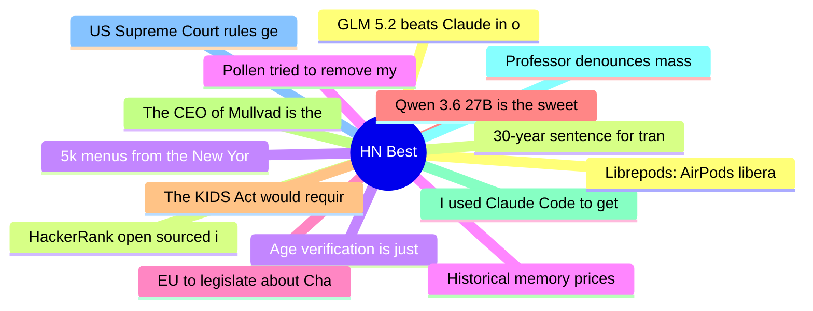

# HackerNews Best (高赞) Top 15 (2026-06-30)

## 思维导图

## 列表（15 条）

### 1. GLM 5.2 beats Claude in our benchmarks
- **链接**: [https://semgrep.dev/blog/2026/we-have-mythos-at-home-glm-52-beats-claude-in-our-cyber-benchmarks/](https://semgrep.dev/blog/2026/we-have-mythos-at-home-glm-52-beats-claude-in-our-cyber-benchmarks/)
- **分数**: 1070 | **评论**: 498 | **作者**: jms703
- **HN**: https://news.ycombinator.com/item?id=48709670

### 2. HackerRank open sourced its ATS. My resume scored 90/100. Oh wait 74. No – 88
- **链接**: [https://danunparsed.com/p/hackerrank-open-source-ats](https://danunparsed.com/p/hackerrank-open-source-ats)
- **分数**: 967 | **评论**: 406 | **作者**: sambellll
- **HN**: https://news.ycombinator.com/item?id=48713832

### 3. Age verification is just a precursor to automated attribution of speech
- **链接**: [https://nonogra.ph/age-verification-is-just-a-precursor-to-attribution-of-speech-06-29-2026](https://nonogra.ph/age-verification-is-just-a-precursor-to-attribution-of-speech-06-29-2026)
- **分数**: 962 | **评论**: 596 | **作者**: arkhiver
- **HN**: https://news.ycombinator.com/item?id=48714529

### 4. Pollen tried to remove my article and Google is assisting with it
- **链接**: [https://blog.pragmaticengineer.com/pollen-tried-to-remove-my-article-about-callum-negus-fancey-and-google-is-assisting-to-it/](https://blog.pragmaticengineer.com/pollen-tried-to-remove-my-article-about-callum-negus-fancey-and-google-is-assisting-to-it/)
- **分数**: 869 | **评论**: 125 | **作者**: taubek
- **HN**: https://news.ycombinator.com/item?id=48716902

### 5. EU to legislate about Chat Control behind closed doors
- **链接**: [https://www.patrick-breyer.de/en/double-threat-to-private-communications-undemocratic-chat-control-backroom-deals-and-imminent-concessions-spark-relaunch-of-fightchatcontrol-eu/](https://www.patrick-breyer.de/en/double-threat-to-private-communications-undemocratic-chat-control-backroom-deals-and-imminent-concessions-spark-relaunch-of-fightchatcontrol-eu/)
- **分数**: 718 | **评论**: 423 | **作者**: NeutralForest
- **HN**: https://news.ycombinator.com/item?id=48707719

### 6. Qwen 3.6 27B is the sweet spot for local development
- **链接**: [https://quesma.com/blog/qwen-36-is-awesome/](https://quesma.com/blog/qwen-36-is-awesome/)
- **分数**: 710 | **评论**: 547 | **作者**: stared
- **HN**: https://news.ycombinator.com/item?id=48721903

### 7. The KIDS Act would require age checks to get online
- **链接**: [https://www.eff.org/deeplinks/2026/06/kids-act-would-require-age-checks-get-online](https://www.eff.org/deeplinks/2026/06/kids-act-would-require-age-checks-get-online)
- **分数**: 625 | **评论**: 542 | **作者**: bilsbie
- **HN**: https://news.ycombinator.com/item?id=48706560

### 8. The CEO of Mullvad is the main financer of the Swedish Örebro party
- **链接**: [https://det.social/@lostgen/116820546568940358](https://det.social/@lostgen/116820546568940358)
- **分数**: 557 | **评论**: 1245 | **作者**: Risse
- **HN**: https://news.ycombinator.com/item?id=48717469

### 9. I used Claude Code to get a second opinion on my MRI
- **链接**: [https://antoine.fi/mri-analysis-using-claude-code-opus](https://antoine.fi/mri-analysis-using-claude-code-opus)
- **分数**: 549 | **评论**: 683 | **作者**: engmarketer
- **HN**: https://news.ycombinator.com/item?id=48708941

### 10. Professor denounces mass AI fraud on an exam at Brown
- **链接**: [https://english.elpais.com/education/2026-06-28/ai-fraud-at-brown-university-academic-integrity-is-at-risk.html](https://english.elpais.com/education/2026-06-28/ai-fraud-at-brown-university-academic-integrity-is-at-risk.html)
- **分数**: 530 | **评论**: 690 | **作者**: geox
- **HN**: https://news.ycombinator.com/item?id=48708991

### 11. US Supreme Court rules geofence warrants require constitutional protections
- **链接**: [https://www.theguardian.com/us-news/2026/jun/29/supreme-court-geofence-warrants-case-decision](https://www.theguardian.com/us-news/2026/jun/29/supreme-court-geofence-warrants-case-decision)
- **分数**: 492 | **评论**: 227 | **作者**: cdrnsf
- **HN**: https://news.ycombinator.com/item?id=48720924

### 12. Librepods: AirPods liberated
- **链接**: [https://github.com/librepods-org/librepods](https://github.com/librepods-org/librepods)
- **分数**: 481 | **评论**: 176 | **作者**: rbanffy
- **HN**: https://news.ycombinator.com/item?id=48710232

### 13. 30-year sentence for transporting zines is a five-alarm fire for free speech
- **链接**: [https://theintercept.com/2026/06/26/daniel-sanchez-estrada-zines-prairieland-free-speech/](https://theintercept.com/2026/06/26/daniel-sanchez-estrada-zines-prairieland-free-speech/)
- **分数**: 428 | **评论**: 254 | **作者**: xrd
- **HN**: https://news.ycombinator.com/item?id=48711981

### 14. 5k menus from the New York Public Library’s Buttolph Collection (1880-1920)
- **链接**: [https://pudding.cool/2026/06/menu-story/](https://pudding.cool/2026/06/menu-story/)
- **分数**: 408 | **评论**: 107 | **作者**: xbryanx
- **HN**: https://news.ycombinator.com/item?id=48707763

### 15. Historical memory prices 1960-2026
- **链接**: [https://dam.stanford.edu/memory-prices.html](https://dam.stanford.edu/memory-prices.html)
- **分数**: 398 | **评论**: 152 | **作者**: vga1
- **HN**: https://news.ycombinator.com/item?id=48710092
