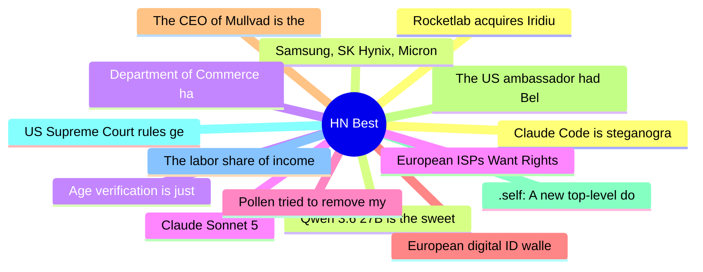

# HackerNews Best (高赞) Top 15 (2026-07-01)

## 思维导图

## 列表（15 条）

### 1. Claude Code is steganographically marking requests
- **链接**: [https://thereallo.dev/blog/claude-code-prompt-steganography](https://thereallo.dev/blog/claude-code-prompt-steganography)
- **分数**: 1560 | **评论**: 449 | **作者**: kirushik
- **HN**: https://news.ycombinator.com/item?id=48734373

### 2. Qwen 3.6 27B is the sweet spot for local development
- **链接**: [https://quesma.com/blog/qwen-36-is-awesome/](https://quesma.com/blog/qwen-36-is-awesome/)
- **分数**: 1149 | **评论**: 715 | **作者**: stared
- **HN**: https://news.ycombinator.com/item?id=48721903

### 3. Age verification is just a precursor to automated attribution of speech
- **链接**: [https://nonogra.ph/age-verification-is-just-a-precursor-to-attribution-of-speech-06-29-2026](https://nonogra.ph/age-verification-is-just-a-precursor-to-attribution-of-speech-06-29-2026)
- **分数**: 1006 | **评论**: 616 | **作者**: arkhiver
- **HN**: https://news.ycombinator.com/item?id=48714529

### 4. Claude Sonnet 5
- **链接**: [https://www.anthropic.com/news/claude-sonnet-5](https://www.anthropic.com/news/claude-sonnet-5)
- **分数**: 970 | **评论**: 548 | **作者**: marinesebastian
- **HN**: https://news.ycombinator.com/item?id=48736605

### 5. Pollen tried to remove my article and Google is assisting with it
- **链接**: [https://blog.pragmaticengineer.com/pollen-tried-to-remove-my-article-about-callum-negus-fancey-and-google-is-assisting-to-it/](https://blog.pragmaticengineer.com/pollen-tried-to-remove-my-article-about-callum-negus-fancey-and-google-is-assisting-to-it/)
- **分数**: 906 | **评论**: 126 | **作者**: taubek
- **HN**: https://news.ycombinator.com/item?id=48716902

### 6. European digital ID wallets rely on safety services of Google and Apple
- **链接**: [https://waag.org/en/article/european-digital-id-wallets-are-gift-google-and-apple/](https://waag.org/en/article/european-digital-id-wallets-are-gift-google-and-apple/)
- **分数**: 679 | **评论**: 289 | **作者**: donohoe
- **HN**: https://news.ycombinator.com/item?id=48730729

### 7. The CEO of Mullvad is the main financer of the Swedish Örebro party
- **链接**: [https://det.social/@lostgen/116820546568940358](https://det.social/@lostgen/116820546568940358)
- **分数**: 669 | **评论**: 1509 | **作者**: Risse
- **HN**: https://news.ycombinator.com/item?id=48717469

### 8. The US ambassador had Belgian police stop our reporting
- **链接**: [https://europeancorrespondent.com/en/r/the-us-ambassador-had-belgian-police-stop-our-reporting](https://europeancorrespondent.com/en/r/the-us-ambassador-had-belgian-police-stop-our-reporting)
- **分数**: 662 | **评论**: 299 | **作者**: robtherobber
- **HN**: https://news.ycombinator.com/item?id=48730608

### 9. .self: A new top-level domain designed to support self-hosting
- **链接**: [https://hccf.onmy.cloud/2026/06/21/reclaiming-our-digital-selves-hccfs-vision-for-a-human-centered-top-level-domain/](https://hccf.onmy.cloud/2026/06/21/reclaiming-our-digital-selves-hccfs-vision-for-a-human-centered-top-level-domain/)
- **分数**: 661 | **评论**: 372 | **作者**: HumanCCF
- **HN**: https://news.ycombinator.com/item?id=48724230

### 10. US Supreme Court rules geofence warrants require constitutional protections
- **链接**: [https://www.theguardian.com/us-news/2026/jun/29/supreme-court-geofence-warrants-case-decision](https://www.theguardian.com/us-news/2026/jun/29/supreme-court-geofence-warrants-case-decision)
- **分数**: 603 | **评论**: 291 | **作者**: cdrnsf
- **HN**: https://news.ycombinator.com/item?id=48720924

### 11. The labor share of income in the US is at its lowest post-war level
- **链接**: [https://libertystreeteconomics.newyorkfed.org/2026/06/the-post-covid-decline-in-the-labor-share/](https://libertystreeteconomics.newyorkfed.org/2026/06/the-post-covid-decline-in-the-labor-share/)
- **分数**: 464 | **评论**: 503 | **作者**: loughnane
- **HN**: https://news.ycombinator.com/item?id=48734234

### 12. Rocketlab acquires Iridium
- **链接**: [https://investors.rocketlabcorp.com/news-releases/news-release-details/rocket-lab-acquire-iridium-historic-deal-creating-fully](https://investors.rocketlabcorp.com/news-releases/news-release-details/rocket-lab-acquire-iridium-historic-deal-creating-fully)
- **分数**: 462 | **评论**: 302 | **作者**: everfrustrated
- **HN**: https://news.ycombinator.com/item?id=48719485

### 13. Samsung, SK Hynix, Micron Sued in US over Memory Price Fixing
- **链接**: [https://en.sedaily.com/international/2026/06/29/samsung-sk-hynix-micron-sued-in-us-over-memory-price-fixing](https://en.sedaily.com/international/2026/06/29/samsung-sk-hynix-micron-sued-in-us-over-memory-price-fixing)
- **分数**: 420 | **评论**: 193 | **作者**: donohoe
- **HN**: https://news.ycombinator.com/item?id=48718102

### 14. Department of Commerce has lifted export controls on Claude Fable 5 and Mythos 5
- **链接**: [https://twitter.com/AnthropicAI/status/2072106151890809341](https://twitter.com/AnthropicAI/status/2072106151890809341)
- **分数**: 415 | **评论**: 198 | **作者**: Pragmata
- **HN**: https://news.ycombinator.com/item?id=48740771

### 15. European ISPs Want Rightsholders Held Accountable for Overblocking Damage
- **链接**: [https://torrentfreak.com/european-isps-want-rightsholders-held-accountable-for-overblocking-damage/](https://torrentfreak.com/european-isps-want-rightsholders-held-accountable-for-overblocking-damage/)
- **分数**: 410 | **评论**: 124 | **作者**: Brajeshwar
- **HN**: https://news.ycombinator.com/item?id=48721072
