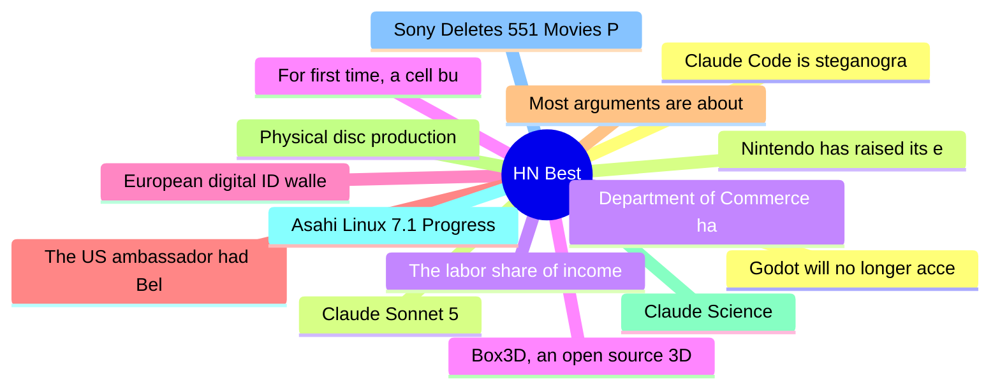

# HackerNews Best (高赞) Top 15 (2026-07-02)

## 思维导图

## 列表（15 条）

### 1. Claude Code is steganographically marking requests
- **链接**: [https://thereallo.dev/blog/claude-code-prompt-steganography](https://thereallo.dev/blog/claude-code-prompt-steganography)
- **分数**: 2371 | **评论**: 717 | **作者**: kirushik
- **HN**: https://news.ycombinator.com/item?id=48734373

### 2. Claude Sonnet 5
- **链接**: [https://www.anthropic.com/news/claude-sonnet-5](https://www.anthropic.com/news/claude-sonnet-5)
- **分数**: 1241 | **评论**: 769 | **作者**: marinesebastian
- **HN**: https://news.ycombinator.com/item?id=48736605

### 3. Department of Commerce has lifted export controls on Claude Fable 5 and Mythos 5
- **链接**: [https://twitter.com/AnthropicAI/status/2072106151890809341](https://twitter.com/AnthropicAI/status/2072106151890809341)
- **分数**: 925 | **评论**: 642 | **作者**: Pragmata
- **HN**: https://news.ycombinator.com/item?id=48740771

### 4. For first time, a cell built from scratch grows and divides
- **链接**: [https://www.quantamagazine.org/for-the-first-time-a-cell-built-from-scratch-grows-and-divides-20260701/](https://www.quantamagazine.org/for-the-first-time-a-cell-built-from-scratch-grows-and-divides-20260701/)
- **分数**: 778 | **评论**: 261 | **作者**: defrost
- **HN**: https://news.ycombinator.com/item?id=48747304

### 5. European digital ID wallets rely on safety services of Google and Apple
- **链接**: [https://waag.org/en/article/european-digital-id-wallets-are-gift-google-and-apple/](https://waag.org/en/article/european-digital-id-wallets-are-gift-google-and-apple/)
- **分数**: 705 | **评论**: 303 | **作者**: donohoe
- **HN**: https://news.ycombinator.com/item?id=48730729

### 6. The US ambassador had Belgian police stop our reporting
- **链接**: [https://europeancorrespondent.com/en/r/the-us-ambassador-had-belgian-police-stop-our-reporting](https://europeancorrespondent.com/en/r/the-us-ambassador-had-belgian-police-stop-our-reporting)
- **分数**: 687 | **评论**: 326 | **作者**: robtherobber
- **HN**: https://news.ycombinator.com/item?id=48730608

### 7. Most arguments are about ego, not ideas
- **链接**: [https://wangcong.org/2026-06-30-why-i-stopped-arguing-with-people.html](https://wangcong.org/2026-06-30-why-i-stopped-arguing-with-people.html)
- **分数**: 656 | **评论**: 521 | **作者**: backlit4034
- **HN**: https://news.ycombinator.com/item?id=48746445

### 8. Physical disc production ending in Jan 2028 for new games on PlayStation
- **链接**: [https://blog.playstation.com/2026/07/01/physical-disc-production-ending-in-january-2028-for-new-games-releasing-on-playstation-consoles/](https://blog.playstation.com/2026/07/01/physical-disc-production-ending-in-january-2028-for-new-games-releasing-on-playstation-consoles/)
- **分数**: 641 | **评论**: 665 | **作者**: Tiberium
- **HN**: https://news.ycombinator.com/item?id=48745456

### 9. Claude Science
- **链接**: [https://claude.com/product/claude-science](https://claude.com/product/claude-science)
- **分数**: 555 | **评论**: 171 | **作者**: lebovic
- **HN**: https://news.ycombinator.com/item?id=48735770

### 10. Asahi Linux 7.1 Progress Report
- **链接**: [https://asahilinux.org/2026/06/progress-report-7-1/](https://asahilinux.org/2026/06/progress-report-7-1/)
- **分数**: 536 | **评论**: 201 | **作者**: pantalaimon
- **HN**: https://news.ycombinator.com/item?id=48744518

### 11. Sony Deletes 551 Movies PlayStation Owners Paid For
- **链接**: [https://reclaimthenet.org/sony-deletes-551-studiocanal-movies-playstation-owners-paid-for](https://reclaimthenet.org/sony-deletes-551-studiocanal-movies-playstation-owners-paid-for)
- **分数**: 535 | **评论**: 245 | **作者**: bilsbie
- **HN**: https://news.ycombinator.com/item?id=48747389

### 12. Godot will no longer accept AI-authored code contributions
- **链接**: [https://www.pcgamer.com/gaming-industry/open-source-game-engine-godot-will-no-longer-accept-ai-authored-code-contributions-we-cant-trust-heavy-users-of-ai-to-understand-their-code-enough-to-fix-it/](https://www.pcgamer.com/gaming-industry/open-source-game-engine-godot-will-no-longer-accept-ai-authored-code-contributions-we-cant-trust-heavy-users-of-ai-to-understand-their-code-enough-to-fix-it/)
- **分数**: 533 | **评论**: 378 | **作者**: pjmlp
- **HN**: https://news.ycombinator.com/item?id=48743472

### 13. Nintendo has raised its employees base salary by 10%
- **链接**: [https://mynintendonews.com/2026/06/26/nintendo-has-raised-its-employees-base-salary-by-10/](https://mynintendonews.com/2026/06/26/nintendo-has-raised-its-employees-base-salary-by-10/)
- **分数**: 510 | **评论**: 312 | **作者**: _tk_
- **HN**: https://news.ycombinator.com/item?id=48745113

### 14. The labor share of income in the US is at its lowest post-war level
- **链接**: [https://libertystreeteconomics.newyorkfed.org/2026/06/the-post-covid-decline-in-the-labor-share/](https://libertystreeteconomics.newyorkfed.org/2026/06/the-post-covid-decline-in-the-labor-share/)
- **分数**: 495 | **评论**: 537 | **作者**: loughnane
- **HN**: https://news.ycombinator.com/item?id=48734234

### 15. Box3D, an open source 3D physics engine
- **链接**: [https://box2d.org/posts/2026/06/announcing-box3d/](https://box2d.org/posts/2026/06/announcing-box3d/)
- **分数**: 448 | **评论**: 101 | **作者**: makepanic
- **HN**: https://news.ycombinator.com/item?id=48745445
