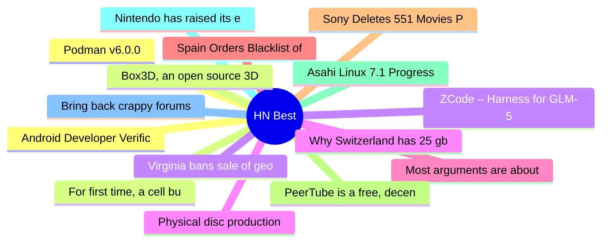

# HackerNews Best (高赞) Top 15 (2026-07-03)

## 思维导图

## 列表（15 条）

### 1. Android Developer Verification: Threat masquerading as protection
- **链接**: [https://f-droid.org/2026/07/01/adv-malware.html](https://f-droid.org/2026/07/01/adv-malware.html)
- **分数**: 1628 | **评论**: 698 | **作者**: drewfax
- **HN**: https://news.ycombinator.com/item?id=48755965

### 2. For first time, a cell built from scratch grows and divides
- **链接**: [https://www.quantamagazine.org/for-the-first-time-a-cell-built-from-scratch-grows-and-divides-20260701/](https://www.quantamagazine.org/for-the-first-time-a-cell-built-from-scratch-grows-and-divides-20260701/)
- **分数**: 934 | **评论**: 294 | **作者**: defrost
- **HN**: https://news.ycombinator.com/item?id=48747304

### 3. Virginia bans sale of geolocation data
- **链接**: [https://www.hunton.com/privacy-and-cybersecurity-law-blog/virginia-bans-sale-of-geolocation-data](https://www.hunton.com/privacy-and-cybersecurity-law-blog/virginia-bans-sale-of-geolocation-data)
- **分数**: 815 | **评论**: 127 | **作者**: toomuchtodo
- **HN**: https://news.ycombinator.com/item?id=48767347

### 4. Physical disc production ending in Jan 2028 for new games on PlayStation
- **链接**: [https://blog.playstation.com/2026/07/01/physical-disc-production-ending-in-january-2028-for-new-games-releasing-on-playstation-consoles/](https://blog.playstation.com/2026/07/01/physical-disc-production-ending-in-january-2028-for-new-games-releasing-on-playstation-consoles/)
- **分数**: 774 | **评论**: 781 | **作者**: Tiberium
- **HN**: https://news.ycombinator.com/item?id=48745456

### 5. Most arguments are about ego, not ideas
- **链接**: [https://wangcong.org/2026-06-30-why-i-stopped-arguing-with-people.html](https://wangcong.org/2026-06-30-why-i-stopped-arguing-with-people.html)
- **分数**: 711 | **评论**: 557 | **作者**: backlit4034
- **HN**: https://news.ycombinator.com/item?id=48746445

### 6. Spain Orders Blacklist of Palantir from Public and Private Companies
- **链接**: [https://clashreport.com/world/articles/spain-orders-blacklist-of-us-tech-giant-palantir-from-public-and-private-companies-fsnc2z17gjv](https://clashreport.com/world/articles/spain-orders-blacklist-of-us-tech-giant-palantir-from-public-and-private-companies-fsnc2z17gjv)
- **分数**: 669 | **评论**: 267 | **作者**: mgh2
- **HN**: https://news.ycombinator.com/item?id=48762725

### 7. Sony Deletes 551 Movies PlayStation Owners Paid For
- **链接**: [https://reclaimthenet.org/sony-deletes-551-studiocanal-movies-playstation-owners-paid-for](https://reclaimthenet.org/sony-deletes-551-studiocanal-movies-playstation-owners-paid-for)
- **分数**: 622 | **评论**: 286 | **作者**: bilsbie
- **HN**: https://news.ycombinator.com/item?id=48747389

### 8. PeerTube is a free, decentralized and federated video platform
- **链接**: [https://github.com/Chocobozzz/PeerTube](https://github.com/Chocobozzz/PeerTube)
- **分数**: 621 | **评论**: 296 | **作者**: doener
- **HN**: https://news.ycombinator.com/item?id=48759634

### 9. Asahi Linux 7.1 Progress Report
- **链接**: [https://asahilinux.org/2026/06/progress-report-7-1/](https://asahilinux.org/2026/06/progress-report-7-1/)
- **分数**: 568 | **评论**: 232 | **作者**: pantalaimon
- **HN**: https://news.ycombinator.com/item?id=48744518

### 10. Nintendo has raised its employees base salary by 10%
- **链接**: [https://mynintendonews.com/2026/06/26/nintendo-has-raised-its-employees-base-salary-by-10/](https://mynintendonews.com/2026/06/26/nintendo-has-raised-its-employees-base-salary-by-10/)
- **分数**: 557 | **评论**: 347 | **作者**: _tk_
- **HN**: https://news.ycombinator.com/item?id=48745113

### 11. Bring back crappy forums
- **链接**: [https://tedium.co/2026/07/01/online-web-forums-retrospective/](https://tedium.co/2026/07/01/online-web-forums-retrospective/)
- **分数**: 556 | **评论**: 341 | **作者**: pentagrama
- **HN**: https://news.ycombinator.com/item?id=48755731

### 12. Podman v6.0.0
- **链接**: [https://blog.podman.io/2026/07/introducing-podman-v6-0-0/](https://blog.podman.io/2026/07/introducing-podman-v6-0-0/)
- **分数**: 545 | **评论**: 211 | **作者**: soheilpro
- **HN**: https://news.ycombinator.com/item?id=48762098

### 13. Box3D, an open source 3D physics engine
- **链接**: [https://box2d.org/posts/2026/06/announcing-box3d/](https://box2d.org/posts/2026/06/announcing-box3d/)
- **分数**: 513 | **评论**: 121 | **作者**: makepanic
- **HN**: https://news.ycombinator.com/item?id=48745445

### 14. ZCode – Harness for GLM-5.2
- **链接**: [https://zcode.z.ai/en](https://zcode.z.ai/en)
- **分数**: 501 | **评论**: 349 | **作者**: chvid
- **HN**: https://news.ycombinator.com/item?id=48753715

### 15. Why Switzerland has 25 gbit internet and America doesn't
- **链接**: [https://stefan.schueller.net/posts/the-free-market-lie/](https://stefan.schueller.net/posts/the-free-market-lie/)
- **分数**: 490 | **评论**: 362 | **作者**: talonx
- **HN**: https://news.ycombinator.com/item?id=48770647
