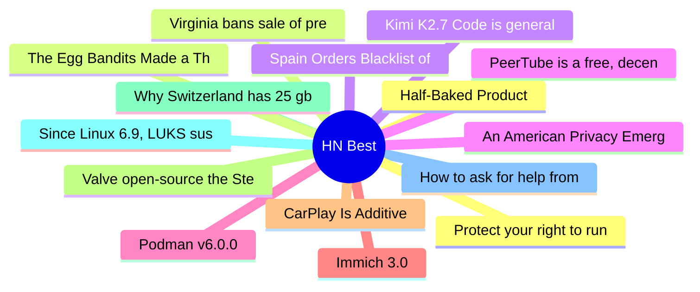

# HackerNews Best (高赞) Top 15 (2026-07-04)

## 思维导图

## 列表（15 条）

### 1. Half-Baked Product
- **链接**: [https://weli.dev/blog/half-baked-product/](https://weli.dev/blog/half-baked-product/)
- **分数**: 1218 | **评论**: 371 | **作者**: weli
- **HN**: https://news.ycombinator.com/item?id=48772388

### 2. Virginia bans sale of precise geolocation data
- **链接**: [https://www.hunton.com/privacy-and-cybersecurity-law-blog/virginia-bans-sale-of-geolocation-data](https://www.hunton.com/privacy-and-cybersecurity-law-blog/virginia-bans-sale-of-geolocation-data)
- **分数**: 937 | **评论**: 137 | **作者**: toomuchtodo
- **HN**: https://news.ycombinator.com/item?id=48767347

### 3. Spain Orders Blacklist of Palantir from Public and Private Companies
- **链接**: [https://clashreport.com/world/articles/spain-orders-blacklist-of-us-tech-giant-palantir-from-public-and-private-companies-fsnc2z17gjv](https://clashreport.com/world/articles/spain-orders-blacklist-of-us-tech-giant-palantir-from-public-and-private-companies-fsnc2z17gjv)
- **分数**: 718 | **评论**: 296 | **作者**: mgh2
- **HN**: https://news.ycombinator.com/item?id=48762725

### 4. PeerTube is a free, decentralized and federated video platform
- **链接**: [https://github.com/Chocobozzz/PeerTube](https://github.com/Chocobozzz/PeerTube)
- **分数**: 656 | **评论**: 342 | **作者**: doener
- **HN**: https://news.ycombinator.com/item?id=48759634

### 5. Podman v6.0.0
- **链接**: [https://blog.podman.io/2026/07/introducing-podman-v6-0-0/](https://blog.podman.io/2026/07/introducing-podman-v6-0-0/)
- **分数**: 624 | **评论**: 246 | **作者**: soheilpro
- **HN**: https://news.ycombinator.com/item?id=48762098

### 6. Immich 3.0
- **链接**: [https://github.com/immich-app/immich/discussions/29439](https://github.com/immich-app/immich/discussions/29439)
- **分数**: 597 | **评论**: 285 | **作者**: hashier
- **HN**: https://news.ycombinator.com/item?id=48761944

### 7. CarPlay Is Additive
- **链接**: [https://www.caseyliss.com/2026/7/2/carplay-is-additive-you-dolts](https://www.caseyliss.com/2026/7/2/carplay-is-additive-you-dolts)
- **分数**: 554 | **评论**: 690 | **作者**: sprawl_
- **HN**: https://news.ycombinator.com/item?id=48769397

### 8. Valve open-source the Steam Machine e-ink screen so you can make your own
- **链接**: [https://www.gamingonlinux.com/2026/07/valve-open-source-the-steam-machine-e-ink-screen-so-you-can-make-your-own/](https://www.gamingonlinux.com/2026/07/valve-open-source-the-steam-machine-e-ink-screen-so-you-can-make-your-own/)
- **分数**: 541 | **评论**: 100 | **作者**: ahlCVA
- **HN**: https://news.ycombinator.com/item?id=48774518

### 9. Why Switzerland has 25 gbit internet and America doesn't
- **链接**: [https://stefan.schueller.net/posts/the-free-market-lie/](https://stefan.schueller.net/posts/the-free-market-lie/)
- **分数**: 527 | **评论**: 419 | **作者**: talonx
- **HN**: https://news.ycombinator.com/item?id=48770647

### 10. Since Linux 6.9, LUKS suspend stopped wiping disk-encryption keys from memory
- **链接**: [https://mathstodon.xyz/@iblech/116769502749142438](https://mathstodon.xyz/@iblech/116769502749142438)
- **分数**: 524 | **评论**: 221 | **作者**: IngoBlechschmid
- **HN**: https://news.ycombinator.com/item?id=48763035

### 11. How to ask for help from people who don't know you
- **链接**: [https://pradyuprasad.com/writings/how-to-ask-for-help/](https://pradyuprasad.com/writings/how-to-ask-for-help/)
- **分数**: 511 | **评论**: 80 | **作者**: FigurativeVoid
- **HN**: https://news.ycombinator.com/item?id=48761118

### 12. Protect your right to run local AI
- **链接**: [https://righttointelligence.org/](https://righttointelligence.org/)
- **分数**: 501 | **评论**: 179 | **作者**: thoughtpeddler
- **HN**: https://news.ycombinator.com/item?id=48768951

### 13. The Egg Bandits Made a Thousand Times the Fine They Just Paid for Price Fixing
- **链接**: [https://www.thebignewsletter.com/p/crime-pays-the-egg-bandits-made-a](https://www.thebignewsletter.com/p/crime-pays-the-egg-bandits-made-a)
- **分数**: 490 | **评论**: 244 | **作者**: toomuchtodo
- **HN**: https://news.ycombinator.com/item?id=48761229

### 14. Kimi K2.7 Code is generally available in GitHub Copilot
- **链接**: [https://github.blog/changelog/2026-07-01-kimi-k2-7-is-now-available-in-github-copilot/](https://github.blog/changelog/2026-07-01-kimi-k2-7-is-now-available-in-github-copilot/)
- **分数**: 415 | **评论**: 176 | **作者**: unliftedq
- **HN**: https://news.ycombinator.com/item?id=48756602

### 15. An American Privacy Emergency
- **链接**: [https://scottaaronson.blog/?p=9902](https://scottaaronson.blog/?p=9902)
- **分数**: 394 | **评论**: 128 | **作者**: flowercalled
- **HN**: https://news.ycombinator.com/item?id=48768992
