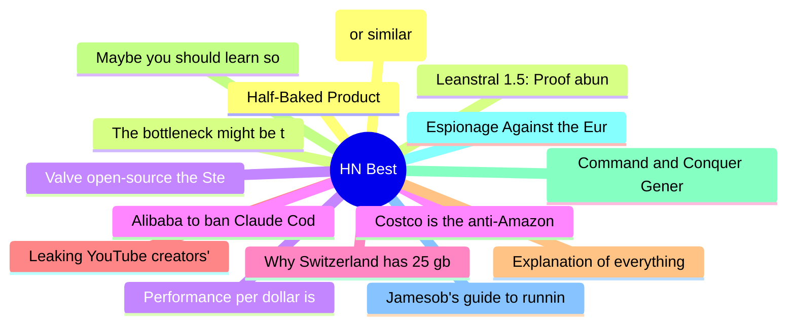

# HackerNews Best (高赞) Top 15 (2026-07-05)

## 思维导图

## 列表（15 条）

### 1. Half-Baked Product
- **链接**: [https://weli.dev/blog/half-baked-product/](https://weli.dev/blog/half-baked-product/)
- **分数**: 1341 | **评论**: 397 | **作者**: weli
- **HN**: https://news.ycombinator.com/item?id=48772388

### 2. The bottleneck might be the air in the room
- **链接**: [https://blog.mikebowler.ca/2026/07/03/co2-and-decision-making/](https://blog.mikebowler.ca/2026/07/03/co2-and-decision-making/)
- **分数**: 767 | **评论**: 442 | **作者**: gslin
- **HN**: https://news.ycombinator.com/item?id=48783117

### 3. Valve open-source the Steam Machine e-ink screen so you can make your own
- **链接**: [https://www.gamingonlinux.com/2026/07/valve-open-source-the-steam-machine-e-ink-screen-so-you-can-make-your-own/](https://www.gamingonlinux.com/2026/07/valve-open-source-the-steam-machine-e-ink-screen-so-you-can-make-your-own/)
- **分数**: 590 | **评论**: 111 | **作者**: ahlCVA
- **HN**: https://news.ycombinator.com/item?id=48774518

### 4. Costco is the anti-Amazon
- **链接**: [https://phenomenalworld.org/analysis/the-anti-amazon/](https://phenomenalworld.org/analysis/the-anti-amazon/)
- **分数**: 546 | **评论**: 547 | **作者**: bookofjoe
- **HN**: https://news.ycombinator.com/item?id=48776044

### 5. Why Switzerland has 25 gbit internet and America doesn't
- **链接**: [https://stefan.schueller.net/posts/the-free-market-lie/](https://stefan.schueller.net/posts/the-free-market-lie/)
- **分数**: 539 | **评论**: 430 | **作者**: talonx
- **HN**: https://news.ycombinator.com/item?id=48770647

### 6. Leaking YouTube creators' private videos
- **链接**: [https://javoriuski.com/post/youtube](https://javoriuski.com/post/youtube)
- **分数**: 531 | **评论**: 301 | **作者**: javxfps
- **HN**: https://news.ycombinator.com/item?id=48786781

### 7. Explanation of everything you can see in htop/top on Linux (2019)
- **链接**: [https://peteris.rocks/blog/htop/](https://peteris.rocks/blog/htop/)
- **分数**: 433 | **评论**: 55 | **作者**: theanonymousone
- **HN**: https://news.ycombinator.com/item?id=48784777

### 8. Maybe you should learn something
- **链接**: [https://www.marginalia.nu/log/a_135_learn/](https://www.marginalia.nu/log/a_135_learn/)
- **分数**: 430 | **评论**: 193 | **作者**: tylerdane
- **HN**: https://news.ycombinator.com/item?id=48782435

### 9. Command and Conquer Generals natively ported to macOS, iPhone, iPad using Fable
- **链接**: [https://github.com/ammaarreshi/Generals-Mac-iOS-iPad/tree/main](https://github.com/ammaarreshi/Generals-Mac-iOS-iPad/tree/main)
- **分数**: 418 | **评论**: 161 | **作者**: asronline
- **HN**: https://news.ycombinator.com/item?id=48788283

### 10. Espionage Against the European Parliament
- **链接**: [https://citizenlab.ca/research/member-of-committee-investigating-spyware-hacked-with-pegasus/](https://citizenlab.ca/research/member-of-committee-investigating-spyware-hacked-with-pegasus/)
- **分数**: 416 | **评论**: 124 | **作者**: ledoge
- **HN**: https://news.ycombinator.com/item?id=48779683

### 11. Jamesob's guide to running SOTA LLMs locally
- **链接**: [https://github.com/jamesob/local-llm](https://github.com/jamesob/local-llm)
- **分数**: 397 | **评论**: 180 | **作者**: livestyle
- **HN**: https://news.ycombinator.com/item?id=48775921

### 12. Google Books (or similar) all book scans – $200k bounty (2025)
- **链接**: [https://software.annas-archive.gl/AnnaArchivist/annas-archive/-/work_items/234](https://software.annas-archive.gl/AnnaArchivist/annas-archive/-/work_items/234)
- **分数**: 379 | **评论**: 203 | **作者**: Cider9986
- **HN**: https://news.ycombinator.com/item?id=48786838

### 13. Leanstral 1.5: Proof abundance for all
- **链接**: [https://mistral.ai/news/leanstral-1-5/](https://mistral.ai/news/leanstral-1-5/)
- **分数**: 358 | **评论**: 98 | **作者**: programLyrique
- **HN**: https://news.ycombinator.com/item?id=48780801

### 14. Performance per dollar is getting faster and cheaper
- **链接**: [https://www.wafer.ai/blog/glm52-amd](https://www.wafer.ai/blog/glm52-amd)
- **分数**: 350 | **评论**: 135 | **作者**: latchkey
- **HN**: https://news.ycombinator.com/item?id=48780417

### 15. Alibaba to ban Claude Code in workplace over alleged backdoor risks, source says
- **链接**: [https://www.reuters.com/world/china/alibaba-ban-claude-code-workplace-over-alleged-backdoor-risks-source-says-2026-07-03/](https://www.reuters.com/world/china/alibaba-ban-claude-code-workplace-over-alleged-backdoor-risks-source-says-2026-07-03/)
- **分数**: 331 | **评论**: 279 | **作者**: nsoonhui
- **HN**: https://news.ycombinator.com/item?id=48772443
