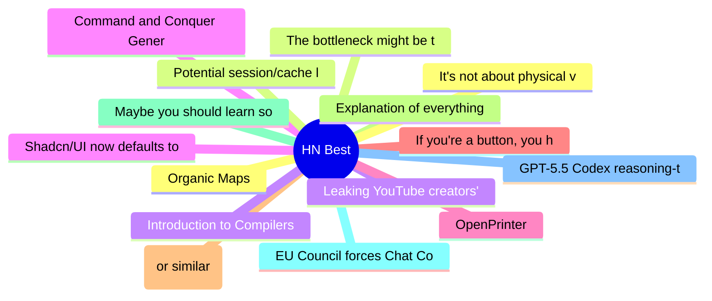

# HackerNews Best (高赞) Top 15 (2026-07-06)

## 思维导图

## 列表（15 条）

### 1. Organic Maps
- **链接**: [https://organicmaps.app/](https://organicmaps.app/)
- **分数**: 854 | **评论**: 248 | **作者**: tosh
- **HN**: https://news.ycombinator.com/item?id=48794446

### 2. The bottleneck might be the air in the room
- **链接**: [https://blog.mikebowler.ca/2026/07/03/co2-and-decision-making/](https://blog.mikebowler.ca/2026/07/03/co2-and-decision-making/)
- **分数**: 812 | **评论**: 456 | **作者**: gslin
- **HN**: https://news.ycombinator.com/item?id=48783117

### 3. Leaking YouTube creators' private videos
- **链接**: [https://javoriuski.com/post/youtube](https://javoriuski.com/post/youtube)
- **分数**: 666 | **评论**: 391 | **作者**: javxfps
- **HN**: https://news.ycombinator.com/item?id=48786781

### 4. Command and Conquer Generals natively ported to macOS, iPhone, iPad using Fable
- **链接**: [https://github.com/ammaarreshi/Generals-Mac-iOS-iPad/tree/main](https://github.com/ammaarreshi/Generals-Mac-iOS-iPad/tree/main)
- **分数**: 664 | **评论**: 272 | **作者**: asronline
- **HN**: https://news.ycombinator.com/item?id=48788283

### 5. OpenPrinter
- **链接**: [https://www.opentools.studio/](https://www.opentools.studio/)
- **分数**: 551 | **评论**: 128 | **作者**: bouh
- **HN**: https://news.ycombinator.com/item?id=48797916

### 6. If you're a button, you have one job
- **链接**: [https://unsung.aresluna.org/if-youre-a-button-you-have-one-job/](https://unsung.aresluna.org/if-youre-a-button-you-have-one-job/)
- **分数**: 542 | **评论**: 256 | **作者**: nozzlegear
- **HN**: https://news.ycombinator.com/item?id=48790689

### 7. Google Books (or similar) all book scans – $200k bounty (2025)
- **链接**: [https://software.annas-archive.gl/AnnaArchivist/annas-archive/-/work_items/234](https://software.annas-archive.gl/AnnaArchivist/annas-archive/-/work_items/234)
- **分数**: 513 | **评论**: 323 | **作者**: Cider9986
- **HN**: https://news.ycombinator.com/item?id=48786838

### 8. Explanation of everything you can see in htop/top on Linux (2019)
- **链接**: [https://peteris.rocks/blog/htop/](https://peteris.rocks/blog/htop/)
- **分数**: 499 | **评论**: 62 | **作者**: theanonymousone
- **HN**: https://news.ycombinator.com/item?id=48784777

### 9. Maybe you should learn something
- **链接**: [https://www.marginalia.nu/log/a_135_learn/](https://www.marginalia.nu/log/a_135_learn/)
- **分数**: 458 | **评论**: 201 | **作者**: tylerdane
- **HN**: https://news.ycombinator.com/item?id=48782435

### 10. EU Council forces Chat Control via fast-track
- **链接**: [https://www.heise.de/en/news/Chat-Control-1-0-EU-Council-forces-messenger-scans-via-fast-track-11353659.html](https://www.heise.de/en/news/Chat-Control-1-0-EU-Council-forces-messenger-scans-via-fast-track-11353659.html)
- **分数**: 398 | **评论**: 213 | **作者**: stavros
- **HN**: https://news.ycombinator.com/item?id=48793393

### 11. GPT-5.5 Codex reasoning-token clustering may be leading to degraded performance
- **链接**: [https://github.com/openai/codex/issues/30364](https://github.com/openai/codex/issues/30364)
- **分数**: 360 | **评论**: 148 | **作者**: maille
- **HN**: https://news.ycombinator.com/item?id=48789428

### 12. It's not about physical vs. digital games, it's about ownership
- **链接**: [https://popcar.bearblog.dev/its-about-ownership/](https://popcar.bearblog.dev/its-about-ownership/)
- **分数**: 355 | **评论**: 268 | **作者**: popcar2
- **HN**: https://news.ycombinator.com/item?id=48794750

### 13. Potential session/cache leakage between workspace instances or consumer accounts
- **链接**: [https://github.com/anthropics/claude-code/issues/74066](https://github.com/anthropics/claude-code/issues/74066)
- **分数**: 313 | **评论**: 132 | **作者**: chatmasta
- **HN**: https://news.ycombinator.com/item?id=48785485

### 14. Introduction to Compilers and Language Design (2021)
- **链接**: [https://dthain.github.io/books/compiler/](https://dthain.github.io/books/compiler/)
- **分数**: 287 | **评论**: 48 | **作者**: AlexeyBrin
- **HN**: https://news.ycombinator.com/item?id=48793454

### 15. Shadcn/UI now defaults to Base UI instead of Radix
- **链接**: [https://ui.shadcn.com/docs/changelog](https://ui.shadcn.com/docs/changelog)
- **分数**: 275 | **评论**: 154 | **作者**: dabinat
- **HN**: https://news.ycombinator.com/item?id=48791328
