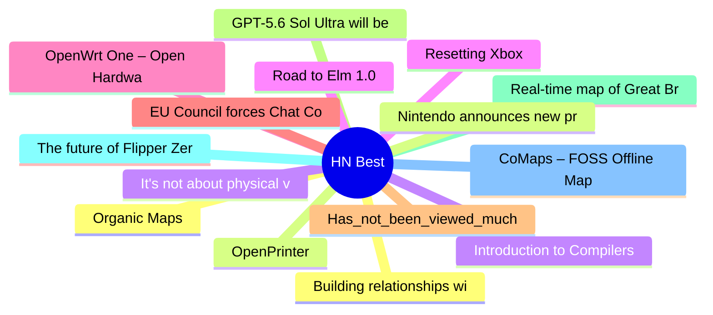

# HackerNews Best (高赞) Top 15 (2026-07-07)

## 思维导图

## 列表（15 条）

### 1. Organic Maps
- **链接**: [https://organicmaps.app/](https://organicmaps.app/)
- **分数**: 1136 | **评论**: 357 | **作者**: tosh
- **HN**: https://news.ycombinator.com/item?id=48794446

### 2. OpenPrinter
- **链接**: [https://www.opentools.studio/](https://www.opentools.studio/)
- **分数**: 1110 | **评论**: 279 | **作者**: bouh
- **HN**: https://news.ycombinator.com/item?id=48797916

### 3. It's not about physical vs. digital games, it's about ownership
- **链接**: [https://popcar.bearblog.dev/its-about-ownership/](https://popcar.bearblog.dev/its-about-ownership/)
- **分数**: 656 | **评论**: 505 | **作者**: popcar2
- **HN**: https://news.ycombinator.com/item?id=48794750

### 4. Resetting Xbox
- **链接**: [https://news.xbox.com/en-us/2026/07/06/resetting-xbox/](https://news.xbox.com/en-us/2026/07/06/resetting-xbox/)
- **分数**: 528 | **评论**: 524 | **作者**: dijksterhuis
- **HN**: https://news.ycombinator.com/item?id=48804993

### 5. OpenWrt One – Open Hardware Router
- **链接**: [https://openwrt.org/toh/openwrt/one](https://openwrt.org/toh/openwrt/one)
- **分数**: 487 | **评论**: 199 | **作者**: peter_d_sherman
- **HN**: https://news.ycombinator.com/item?id=48808482

### 6. EU Council forces Chat Control via fast-track
- **链接**: [https://www.heise.de/en/news/Chat-Control-1-0-EU-Council-forces-messenger-scans-via-fast-track-11353659.html](https://www.heise.de/en/news/Chat-Control-1-0-EU-Council-forces-messenger-scans-via-fast-track-11353659.html)
- **分数**: 464 | **评论**: 259 | **作者**: stavros
- **HN**: https://news.ycombinator.com/item?id=48793393

### 7. Has_not_been_viewed_much
- **链接**: [https://iamwillwang.com/notes/has-not-been-viewed-much/](https://iamwillwang.com/notes/has-not-been-viewed-much/)
- **分数**: 450 | **评论**: 120 | **作者**: wxw
- **HN**: https://news.ycombinator.com/item?id=48799155

### 8. GPT-5.6 Sol Ultra will be in Codex
- **链接**: [https://twitter.com/thsottiaux/status/2073933490513752151](https://twitter.com/thsottiaux/status/2073933490513752151)
- **分数**: 403 | **评论**: 384 | **作者**: mfiguiere
- **HN**: https://news.ycombinator.com/item?id=48799614

### 9. Real-time map of Great Britain's rail network
- **链接**: [https://www.map.signalbox.io](https://www.map.signalbox.io)
- **分数**: 387 | **评论**: 146 | **作者**: scrlk
- **HN**: https://news.ycombinator.com/item?id=48802535

### 10. The future of Flipper Zero development
- **链接**: [https://blog.flipper.net/future-of-flipper-zero-development/](https://blog.flipper.net/future-of-flipper-zero-development/)
- **分数**: 386 | **评论**: 171 | **作者**: croes
- **HN**: https://news.ycombinator.com/item?id=48796552

### 11. CoMaps – FOSS Offline Maps
- **链接**: [https://www.comaps.app/](https://www.comaps.app/)
- **分数**: 366 | **评论**: 74 | **作者**: basilikum
- **HN**: https://news.ycombinator.com/item?id=48808928

### 12. Building relationships with customers through support didn't turn out as hoped
- **链接**: [https://www.uncommonapps.nyc/p/castro-podcasts-things-i-got-wrong-support](https://www.uncommonapps.nyc/p/castro-podcasts-things-i-got-wrong-support)
- **分数**: 331 | **评论**: 186 | **作者**: dabluck
- **HN**: https://news.ycombinator.com/item?id=48799929

### 13. Nintendo announces new product revisions in Europe with replaceable batteries
- **链接**: [https://www.nintendo.com/en-gb/Support/Nintendo-Switch-2/Information-about-upcoming-battery-related-revisions-to-some-Nintendo-products-3132901.html](https://www.nintendo.com/en-gb/Support/Nintendo-Switch-2/Information-about-upcoming-battery-related-revisions-to-some-Nintendo-products-3132901.html)
- **分数**: 327 | **评论**: 194 | **作者**: akyuu
- **HN**: https://news.ycombinator.com/item?id=48804193

### 14. Introduction to Compilers and Language Design (2021)
- **链接**: [https://dthain.github.io/books/compiler/](https://dthain.github.io/books/compiler/)
- **分数**: 318 | **评论**: 51 | **作者**: AlexeyBrin
- **HN**: https://news.ycombinator.com/item?id=48793454

### 15. Road to Elm 1.0
- **链接**: [https://elm-lang.org/news/faster-builds](https://elm-lang.org/news/faster-builds)
- **分数**: 313 | **评论**: 153 | **作者**: wolfadex
- **HN**: https://news.ycombinator.com/item?id=48803364
