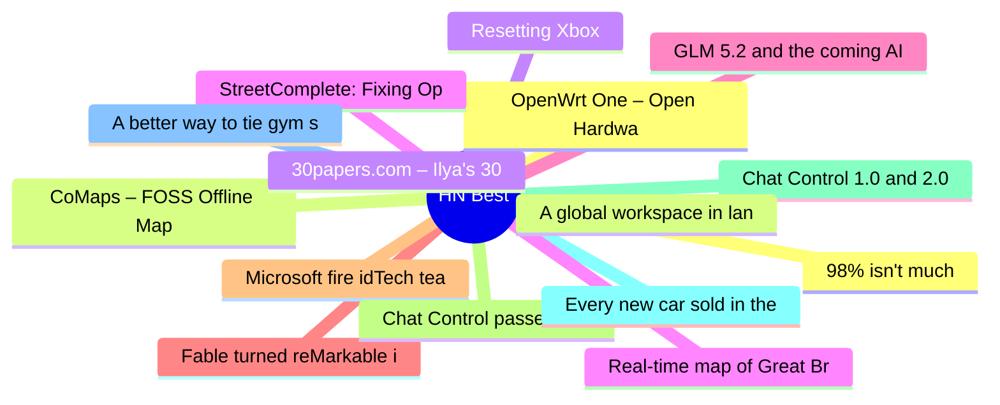

# HackerNews Best (高赞) Top 15 (2026-07-08)

## 思维导图

## 列表（15 条）

### 1. OpenWrt One – Open Hardware Router
- **链接**: [https://openwrt.org/toh/openwrt/one](https://openwrt.org/toh/openwrt/one)
- **分数**: 801 | **评论**: 305 | **作者**: peter_d_sherman
- **HN**: https://news.ycombinator.com/item?id=48808482

### 2. CoMaps – FOSS Offline Maps
- **链接**: [https://www.comaps.app/](https://www.comaps.app/)
- **分数**: 759 | **评论**: 199 | **作者**: basilikum
- **HN**: https://news.ycombinator.com/item?id=48808928

### 3. Resetting Xbox
- **链接**: [https://news.xbox.com/en-us/2026/07/06/resetting-xbox/](https://news.xbox.com/en-us/2026/07/06/resetting-xbox/)
- **分数**: 726 | **评论**: 904 | **作者**: dijksterhuis
- **HN**: https://news.ycombinator.com/item?id=48804993

### 4. StreetComplete: Fixing OpenStreetMap, one tiny quest at a time
- **链接**: [https://streetcomplete.app/](https://streetcomplete.app/)
- **分数**: 724 | **评论**: 173 | **作者**: kls0e
- **HN**: https://news.ycombinator.com/item?id=48816883

### 5. GLM 5.2 and the coming AI margin collapse
- **链接**: [https://martinalderson.com/posts/the-upcoming-ai-margin-collapse-part-1-glm-5-2/](https://martinalderson.com/posts/the-upcoming-ai-margin-collapse-part-1-glm-5-2/)
- **分数**: 668 | **评论**: 451 | **作者**: martinald
- **HN**: https://news.ycombinator.com/item?id=48809877

### 6. Fable turned reMarkable into Tom Riddle's diary from Harry Potter
- **链接**: [https://github.com/MaximeRivest/Riddle](https://github.com/MaximeRivest/Riddle)
- **分数**: 610 | **评论**: 407 | **作者**: modinfo
- **HN**: https://news.ycombinator.com/item?id=48811591

### 7. Microsoft fire idTech team at Id software
- **链接**: [https://gamefromscratch.com/microsoft-fire-idtech-team-at-id-software/](https://gamefromscratch.com/microsoft-fire-idtech-team-at-id-software/)
- **分数**: 566 | **评论**: 513 | **作者**: bauc
- **HN**: https://news.ycombinator.com/item?id=48819244

### 8. Chat Control passed first round in EU Parliament
- **链接**: [https://www.heise.de/en/news/Showdown-in-Strasbourg-The-unexpected-return-of-Chat-Control-1-0-11356680.html](https://www.heise.de/en/news/Showdown-in-Strasbourg-The-unexpected-return-of-Chat-Control-1-0-11356680.html)
- **分数**: 541 | **评论**: 238 | **作者**: miroljub
- **HN**: https://news.ycombinator.com/item?id=48819008

### 9. Chat Control 1.0 and 2.0 Explained
- **链接**: [https://fightchatcontrol.eu/chat-control-overview](https://fightchatcontrol.eu/chat-control-overview)
- **分数**: 496 | **评论**: 163 | **作者**: gasull
- **HN**: https://news.ycombinator.com/item?id=48818311

### 10. Every new car sold in the European Union must include a driver monitoring camera
- **链接**: [https://allaboutcookies.org/eu-mandatory-distracted-driver-system](https://allaboutcookies.org/eu-mandatory-distracted-driver-system)
- **分数**: 491 | **评论**: 635 | **作者**: nickslaughter02
- **HN**: https://news.ycombinator.com/item?id=48823557

### 11. A better way to tie gym shorts (or any drawstring) [video]
- **链接**: [https://www.youtube.com/watch?v=3R0Lp86GEBk](https://www.youtube.com/watch?v=3R0Lp86GEBk)
- **分数**: 485 | **评论**: 169 | **作者**: surprisetalk
- **HN**: https://news.ycombinator.com/item?id=48816956

### 12. 98% isn't much
- **链接**: [https://whynothugo.nl/journal/2026/07/03/98-isnt-very-much/](https://whynothugo.nl/journal/2026/07/03/98-isnt-very-much/)
- **分数**: 480 | **评论**: 314 | **作者**: speckx
- **HN**: https://news.ycombinator.com/item?id=48816959

### 13. A global workspace in language models
- **链接**: [https://www.anthropic.com/research/global-workspace](https://www.anthropic.com/research/global-workspace)
- **分数**: 448 | **评论**: 190 | **作者**: in-silico
- **HN**: https://news.ycombinator.com/item?id=48808002

### 14. 30papers.com – Ilya's 30 essential ML papers, in a beginner friendly format
- **链接**: [https://30papers.com/](https://30papers.com/)
- **分数**: 419 | **评论**: 68 | **作者**: notmcrowley
- **HN**: https://news.ycombinator.com/item?id=48819608

### 15. Real-time map of Great Britain's rail network
- **链接**: [https://www.map.signalbox.io](https://www.map.signalbox.io)
- **分数**: 409 | **评论**: 153 | **作者**: scrlk
- **HN**: https://news.ycombinator.com/item?id=48802535
