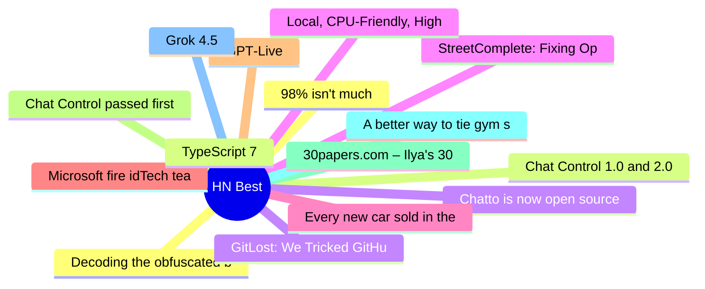

# HackerNews Best (高赞) Top 15 (2026-07-09)

## 思维导图

## 列表（15 条）

### 1. Decoding the obfuscated bash script on a Uniqlo t-shirt
- **链接**: [https://tris.sherliker.net/blog/obfuscated-self-evaluating-bash-script-by-cdn-akamai-being-supplied-to-consumers-via-retail-stores/](https://tris.sherliker.net/blog/obfuscated-self-evaluating-bash-script-by-cdn-akamai-being-supplied-to-consumers-via-retail-stores/)
- **分数**: 1330 | **评论**: 210 | **作者**: speerer
- **HN**: https://news.ycombinator.com/item?id=48829312

### 2. Chat Control 1.0 and 2.0 Explained
- **链接**: [https://fightchatcontrol.eu/chat-control-overview](https://fightchatcontrol.eu/chat-control-overview)
- **分数**: 882 | **评论**: 335 | **作者**: gasull
- **HN**: https://news.ycombinator.com/item?id=48818311

### 3. Chatto is now open source
- **链接**: [https://www.hmans.dev/blog/chatto-is-open-source](https://www.hmans.dev/blog/chatto-is-open-source)
- **分数**: 817 | **评论**: 217 | **作者**: speckx
- **HN**: https://news.ycombinator.com/item?id=48833116

### 4. StreetComplete: Fixing OpenStreetMap, one tiny quest at a time
- **链接**: [https://streetcomplete.app/](https://streetcomplete.app/)
- **分数**: 809 | **评论**: 206 | **作者**: kls0e
- **HN**: https://news.ycombinator.com/item?id=48816883

### 5. Every new car sold in the European Union must include a driver monitoring camera
- **链接**: [https://allaboutcookies.org/eu-mandatory-distracted-driver-system](https://allaboutcookies.org/eu-mandatory-distracted-driver-system)
- **分数**: 766 | **评论**: 1017 | **作者**: nickslaughter02
- **HN**: https://news.ycombinator.com/item?id=48823557

### 6. Microsoft fire idTech team at Id software
- **链接**: [https://gamefromscratch.com/microsoft-fire-idtech-team-at-id-software/](https://gamefromscratch.com/microsoft-fire-idtech-team-at-id-software/)
- **分数**: 656 | **评论**: 588 | **作者**: bauc
- **HN**: https://news.ycombinator.com/item?id=48819244

### 7. GPT‑Live
- **链接**: [https://openai.com/index/introducing-gpt-live/](https://openai.com/index/introducing-gpt-live/)
- **分数**: 641 | **评论**: 422 | **作者**: logickkk1
- **HN**: https://news.ycombinator.com/item?id=48834405

### 8. Chat Control passed first round in EU Parliament
- **链接**: [https://www.heise.de/en/news/Showdown-in-Strasbourg-The-unexpected-return-of-Chat-Control-1-0-11356680.html](https://www.heise.de/en/news/Showdown-in-Strasbourg-The-unexpected-return-of-Chat-Control-1-0-11356680.html)
- **分数**: 632 | **评论**: 260 | **作者**: miroljub
- **HN**: https://news.ycombinator.com/item?id=48819008

### 9. 30papers.com – Ilya's 30 essential ML papers, in a beginner friendly format
- **链接**: [https://30papers.com/](https://30papers.com/)
- **分数**: 621 | **评论**: 104 | **作者**: notmcrowley
- **HN**: https://news.ycombinator.com/item?id=48819608

### 10. A better way to tie gym shorts (or any drawstring) [video]
- **链接**: [https://www.youtube.com/watch?v=3R0Lp86GEBk](https://www.youtube.com/watch?v=3R0Lp86GEBk)
- **分数**: 529 | **评论**: 180 | **作者**: surprisetalk
- **HN**: https://news.ycombinator.com/item?id=48816956

### 11. Grok 4.5
- **链接**: [https://x.ai/news/grok-4-5](https://x.ai/news/grok-4-5)
- **分数**: 525 | **评论**: 693 | **作者**: BoumTAC
- **HN**: https://news.ycombinator.com/item?id=48835111

### 12. 98% isn't much
- **链接**: [https://whynothugo.nl/journal/2026/07/03/98-isnt-very-much/](https://whynothugo.nl/journal/2026/07/03/98-isnt-very-much/)
- **分数**: 519 | **评论**: 341 | **作者**: speckx
- **HN**: https://news.ycombinator.com/item?id=48816959

### 13. TypeScript 7
- **链接**: [https://devblogs.microsoft.com/typescript/announcing-typescript-7-0/](https://devblogs.microsoft.com/typescript/announcing-typescript-7-0/)
- **分数**: 510 | **评论**: 203 | **作者**: DanRosenwasser
- **HN**: https://news.ycombinator.com/item?id=48833715

### 14. GitLost: We Tricked GitHub's AI Agent into Leaking Private Repos
- **链接**: [https://noma.security/blog/gitlost-how-we-tricked-githubs-ai-agent-into-leaking-private-repos/](https://noma.security/blog/gitlost-how-we-tricked-githubs-ai-agent-into-leaking-private-repos/)
- **分数**: 510 | **评论**: 193 | **作者**: ColinEberhardt
- **HN**: https://news.ycombinator.com/item?id=48827858

### 15. Local, CPU-Friendly, High-Quality TTS (Text-to-Speech) with Kokoro
- **链接**: [https://ariya.io/2026/03/local-cpu-friendly-high-quality-tts-text-to-speech-with-kokoro/](https://ariya.io/2026/03/local-cpu-friendly-high-quality-tts-text-to-speech-with-kokoro/)
- **分数**: 508 | **评论**: 95 | **作者**: speckx
- **HN**: https://news.ycombinator.com/item?id=48821576
