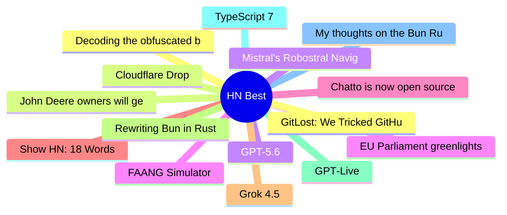

# HackerNews Best (高赞) Top 15 (2026-07-10)

## 思维导图

## 列表（15 条）

### 1. Decoding the obfuscated bash script on a Uniqlo t-shirt
- **链接**: [https://tris.sherliker.net/blog/obfuscated-self-evaluating-bash-script-by-cdn-akamai-being-supplied-to-consumers-via-retail-stores/](https://tris.sherliker.net/blog/obfuscated-self-evaluating-bash-script-by-cdn-akamai-being-supplied-to-consumers-via-retail-stores/)
- **分数**: 1457 | **评论**: 228 | **作者**: speerer
- **HN**: https://news.ycombinator.com/item?id=48829312

### 2. John Deere owners will get the right to repair equipment under FTC settlement
- **链接**: [https://apnews.com/article/john-deere-right-to-repair-agriculture-equipment-cb7514ffedb95c130a976af661f2bc02](https://apnews.com/article/john-deere-right-to-repair-agriculture-equipment-cb7514ffedb95c130a976af661f2bc02)
- **分数**: 1300 | **评论**: 274 | **作者**: djoldman
- **HN**: https://news.ycombinator.com/item?id=48838876

### 3. GPT-5.6
- **链接**: [https://openai.com/index/gpt-5-6/](https://openai.com/index/gpt-5-6/)
- **分数**: 1138 | **评论**: 816 | **作者**: logickkk1
- **HN**: https://news.ycombinator.com/item?id=48849066

### 4. EU Parliament greenlights Chat Control 1.0
- **链接**: [https://www.patrick-breyer.de/en/eu-parliament-greenlights-chat-control-1-0-breyer-our-children-lose-out/](https://www.patrick-breyer.de/en/eu-parliament-greenlights-chat-control-1-0-breyer-our-children-lose-out/)
- **分数**: 1074 | **评论**: 529 | **作者**: rapnie
- **HN**: https://news.ycombinator.com/item?id=48843923

### 5. Chatto is now open source
- **链接**: [https://www.hmans.dev/blog/chatto-is-open-source](https://www.hmans.dev/blog/chatto-is-open-source)
- **分数**: 1071 | **评论**: 292 | **作者**: speckx
- **HN**: https://news.ycombinator.com/item?id=48833116

### 6. Show HN: 18 Words
- **链接**: [https://18words.com/](https://18words.com/)
- **分数**: 881 | **评论**: 297 | **作者**: pompomsheep
- **HN**: https://news.ycombinator.com/item?id=48845049

### 7. Grok 4.5
- **链接**: [https://x.ai/news/grok-4-5](https://x.ai/news/grok-4-5)
- **分数**: 761 | **评论**: 1418 | **作者**: BoumTAC
- **HN**: https://news.ycombinator.com/item?id=48835111

### 8. Rewriting Bun in Rust
- **链接**: [https://bun.com/blog/bun-in-rust](https://bun.com/blog/bun-in-rust)
- **分数**: 752 | **评论**: 490 | **作者**: afturner
- **HN**: https://news.ycombinator.com/item?id=48837877

### 9. GPT‑Live
- **链接**: [https://openai.com/index/introducing-gpt-live/](https://openai.com/index/introducing-gpt-live/)
- **分数**: 742 | **评论**: 516 | **作者**: logickkk1
- **HN**: https://news.ycombinator.com/item?id=48834405

### 10. TypeScript 7
- **链接**: [https://devblogs.microsoft.com/typescript/announcing-typescript-7-0/](https://devblogs.microsoft.com/typescript/announcing-typescript-7-0/)
- **分数**: 703 | **评论**: 294 | **作者**: DanRosenwasser
- **HN**: https://news.ycombinator.com/item?id=48833715

### 11. My thoughts on the Bun Rust rewrite
- **链接**: [https://andrewkelley.me/post/my-thoughts-bun-rust-rewrite.html](https://andrewkelley.me/post/my-thoughts-bun-rust-rewrite.html)
- **分数**: 663 | **评论**: 584 | **作者**: kristoff_it
- **HN**: https://news.ycombinator.com/item?id=48843352

### 12. GitLost: We Tricked GitHub's AI Agent into Leaking Private Repos
- **链接**: [https://noma.security/blog/gitlost-how-we-tricked-githubs-ai-agent-into-leaking-private-repos/](https://noma.security/blog/gitlost-how-we-tricked-githubs-ai-agent-into-leaking-private-repos/)
- **分数**: 534 | **评论**: 203 | **作者**: ColinEberhardt
- **HN**: https://news.ycombinator.com/item?id=48827858

### 13. Cloudflare Drop
- **链接**: [https://www.cloudflare.com/drop/](https://www.cloudflare.com/drop/)
- **分数**: 520 | **评论**: 279 | **作者**: coloneltcb
- **HN**: https://news.ycombinator.com/item?id=48836233

### 14. Mistral's Robostral Navigate: a state of the art robotics navigation model
- **链接**: [https://mistral.ai/news/robostral-navigate/](https://mistral.ai/news/robostral-navigate/)
- **分数**: 482 | **评论**: 109 | **作者**: ottomengis
- **HN**: https://news.ycombinator.com/item?id=48832212

### 15. FAANG Simulator
- **链接**: [https://www.abeyk.com/escape-the-rat-race/](https://www.abeyk.com/escape-the-rat-race/)
- **分数**: 477 | **评论**: 189 | **作者**: nerdbiscuits
- **HN**: https://news.ycombinator.com/item?id=48836778
