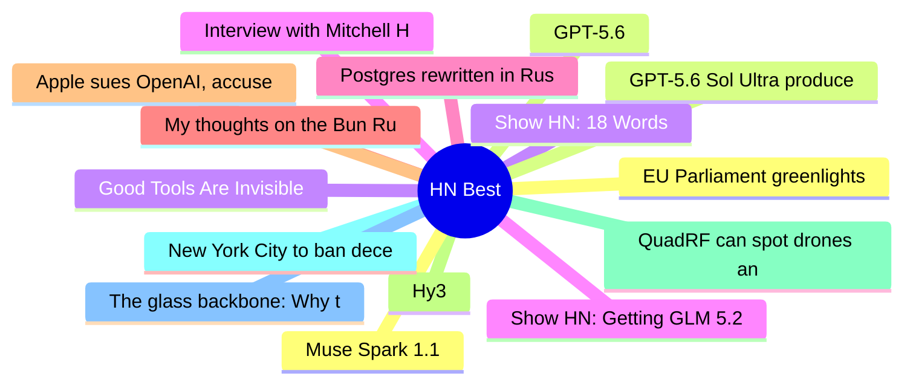

# HackerNews Best (高赞) Top 15 (2026-07-11)

## 思维导图

## 列表（15 条）

### 1. EU Parliament greenlights Chat Control 1.0
- **链接**: [https://www.patrick-breyer.de/en/eu-parliament-greenlights-chat-control-1-0-breyer-our-children-lose-out/](https://www.patrick-breyer.de/en/eu-parliament-greenlights-chat-control-1-0-breyer-our-children-lose-out/)
- **分数**: 1589 | **评论**: 814 | **作者**: rapnie
- **HN**: https://news.ycombinator.com/item?id=48843923

### 2. GPT-5.6
- **链接**: [https://openai.com/index/gpt-5-6/](https://openai.com/index/gpt-5-6/)
- **分数**: 1521 | **评论**: 1081 | **作者**: logickkk1
- **HN**: https://news.ycombinator.com/item?id=48849066

### 3. Show HN: 18 Words
- **链接**: [https://18words.com/](https://18words.com/)
- **分数**: 1090 | **评论**: 348 | **作者**: pompomsheep
- **HN**: https://news.ycombinator.com/item?id=48845049

### 4. Show HN: Getting GLM 5.2 running on my slow computer
- **链接**: [https://github.com/JustVugg/colibri](https://github.com/JustVugg/colibri)
- **分数**: 837 | **评论**: 206 | **作者**: vforno
- **HN**: https://news.ycombinator.com/item?id=48842459

### 5. Postgres rewritten in Rust, now passing 100% of the Postgres regression tests
- **链接**: [https://github.com/malisper/pgrust](https://github.com/malisper/pgrust)
- **分数**: 789 | **评论**: 706 | **作者**: SweetSoftPillow
- **HN**: https://news.ycombinator.com/item?id=48841676

### 6. My thoughts on the Bun Rust rewrite
- **链接**: [https://andrewkelley.me/post/my-thoughts-bun-rust-rewrite.html](https://andrewkelley.me/post/my-thoughts-bun-rust-rewrite.html)
- **分数**: 767 | **评论**: 676 | **作者**: kristoff_it
- **HN**: https://news.ycombinator.com/item?id=48843352

### 7. Apple sues OpenAI, accuses ex-employees of stealing trade secrets
- **链接**: [https://9to5mac.com/2026/07/10/apple-sues-openai-trade-secret-theft/](https://9to5mac.com/2026/07/10/apple-sues-openai-trade-secret-theft/)
- **分数**: 735 | **评论**: 368 | **作者**: stock_toaster
- **HN**: https://news.ycombinator.com/item?id=48865019

### 8. Hy3
- **链接**: [https://hy.tencent.com/research/hy3](https://hy.tencent.com/research/hy3)
- **分数**: 545 | **评论**: 114 | **作者**: andai
- **HN**: https://news.ycombinator.com/item?id=48847552

### 9. QuadRF can spot drones and see WiFi through my wall
- **链接**: [https://www.jeffgeerling.com/blog/2026/quadrf-can-spot-drones-and-see-wifi-through-my-wall/](https://www.jeffgeerling.com/blog/2026/quadrf-can-spot-drones-and-see-wifi-through-my-wall/)
- **分数**: 498 | **评论**: 182 | **作者**: speckx
- **HN**: https://news.ycombinator.com/item?id=48861717

### 10. New York City to ban deceptive subscription practices
- **链接**: [https://www.theguardian.com/us-news/2026/jul/10/new-york-city-deceptive-subscriptions-ban](https://www.theguardian.com/us-news/2026/jul/10/new-york-city-deceptive-subscriptions-ban)
- **分数**: 464 | **评论**: 231 | **作者**: randycupertino
- **HN**: https://news.ycombinator.com/item?id=48863464

### 11. The glass backbone: Why the Army's logistics will break in the next war
- **链接**: [https://mwi.westpoint.edu/the-glass-backbone-why-the-armys-logistics-will-break-in-the-next-war/](https://mwi.westpoint.edu/the-glass-backbone-why-the-armys-logistics-will-break-in-the-next-war/)
- **分数**: 453 | **评论**: 644 | **作者**: baud147258
- **HN**: https://news.ycombinator.com/item?id=48845442

### 12. Muse Spark 1.1
- **链接**: [https://ai.meta.com/blog/introducing-muse-spark-meta-model-api/](https://ai.meta.com/blog/introducing-muse-spark-meta-model-api/)
- **分数**: 400 | **评论**: 209 | **作者**: ot
- **HN**: https://news.ycombinator.com/item?id=48846184

### 13. GPT-5.6 Sol Ultra produces proof of the Cycle Double Cover Conjecture [pdf]
- **链接**: [https://cdn.openai.com/pdf/04d1d1e4-bc75-476a-97cf-49055cd98d31/cdc_proof.pdf](https://cdn.openai.com/pdf/04d1d1e4-bc75-476a-97cf-49055cd98d31/cdc_proof.pdf)
- **分数**: 391 | **评论**: 305 | **作者**: scrlk
- **HN**: https://news.ycombinator.com/item?id=48863490

### 14. Good Tools Are Invisible
- **链接**: [https://www.gingerbill.org/article/2026/07/10/good-tools-are-invisible/](https://www.gingerbill.org/article/2026/07/10/good-tools-are-invisible/)
- **分数**: 384 | **评论**: 180 | **作者**: theanonymousone
- **HN**: https://news.ycombinator.com/item?id=48858121

### 15. Interview with Mitchell Hashimoto about Ghostty and Zig
- **链接**: [https://alexalejandre.com/programming/interview-with-mitchell-hashimoto/](https://alexalejandre.com/programming/interview-with-mitchell-hashimoto/)
- **分数**: 377 | **评论**: 226 | **作者**: veqq
- **HN**: https://news.ycombinator.com/item?id=48849292
