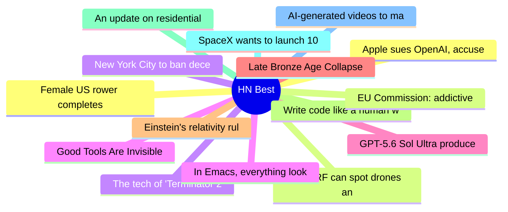

# HackerNews Best (高赞) Top 15 (2026-07-12)

## 思维导图

## 列表（15 条）

### 1. Apple sues OpenAI, accuses ex-employees of stealing trade secrets
- **链接**: [https://9to5mac.com/2026/07/10/apple-sues-openai-trade-secret-theft/](https://9to5mac.com/2026/07/10/apple-sues-openai-trade-secret-theft/)
- **分数**: 1591 | **评论**: 895 | **作者**: stock_toaster
- **HN**: https://news.ycombinator.com/item?id=48865019

### 2. QuadRF can spot drones and see WiFi through my wall
- **链接**: [https://www.jeffgeerling.com/blog/2026/quadrf-can-spot-drones-and-see-wifi-through-my-wall/](https://www.jeffgeerling.com/blog/2026/quadrf-can-spot-drones-and-see-wifi-through-my-wall/)
- **分数**: 729 | **评论**: 231 | **作者**: speckx
- **HN**: https://news.ycombinator.com/item?id=48861717

### 3. New York City to ban deceptive subscription practices
- **链接**: [https://www.theguardian.com/us-news/2026/jul/10/new-york-city-deceptive-subscriptions-ban](https://www.theguardian.com/us-news/2026/jul/10/new-york-city-deceptive-subscriptions-ban)
- **分数**: 625 | **评论**: 328 | **作者**: randycupertino
- **HN**: https://news.ycombinator.com/item?id=48863464

### 4. Good Tools Are Invisible
- **链接**: [https://www.gingerbill.org/article/2026/07/10/good-tools-are-invisible/](https://www.gingerbill.org/article/2026/07/10/good-tools-are-invisible/)
- **分数**: 538 | **评论**: 255 | **作者**: theanonymousone
- **HN**: https://news.ycombinator.com/item?id=48858121

### 5. GPT-5.6 Sol Ultra produces proof of the Cycle Double Cover Conjecture [pdf]
- **链接**: [https://cdn.openai.com/pdf/04d1d1e4-bc75-476a-97cf-49055cd98d31/cdc_proof.pdf](https://cdn.openai.com/pdf/04d1d1e4-bc75-476a-97cf-49055cd98d31/cdc_proof.pdf)
- **分数**: 513 | **评论**: 424 | **作者**: scrlk
- **HN**: https://news.ycombinator.com/item?id=48863490

### 6. Late Bronze Age Collapse
- **链接**: [https://acoup.blog/2026/01/30/collections-the-late-bronze-age-collapse-a-very-brief-introduction/](https://acoup.blog/2026/01/30/collections-the-late-bronze-age-collapse-a-very-brief-introduction/)
- **分数**: 415 | **评论**: 299 | **作者**: dmonay
- **HN**: https://news.ycombinator.com/item?id=48858737

### 7. Einstein's relativity rules chemical bonds in heavy elements, new research shows
- **链接**: [https://www.brown.edu/news/2026-07-09/chemical-bonds-relativity](https://www.brown.edu/news/2026-07-09/chemical-bonds-relativity)
- **分数**: 385 | **评论**: 172 | **作者**: hhs
- **HN**: https://news.ycombinator.com/item?id=48866134

### 8. Write code like a human will maintain it
- **链接**: [https://unstack.io/write-code-like-a-human-will-maintain-it](https://unstack.io/write-code-like-a-human-will-maintain-it)
- **分数**: 346 | **评论**: 299 | **作者**: ScottWRobinson
- **HN**: https://news.ycombinator.com/item?id=48859701

### 9. An update on residential proxies and the scraper situation
- **链接**: [https://lwn.net/SubscriberLink/1080822/990a8a5e2d379085/](https://lwn.net/SubscriberLink/1080822/990a8a5e2d379085/)
- **分数**: 339 | **评论**: 357 | **作者**: chmaynard
- **HN**: https://news.ycombinator.com/item?id=48864252

### 10. SpaceX wants to launch 100k more Starlink satellites for 100x the bandwidth
- **链接**: [https://www.zdnet.com/home-and-office/networking/spacex-wants-to-launch-100000-more-starlink-satellites/](https://www.zdnet.com/home-and-office/networking/spacex-wants-to-launch-100000-more-starlink-satellites/)
- **分数**: 297 | **评论**: 1128 | **作者**: CrankyBear
- **HN**: https://news.ycombinator.com/item?id=48863064

### 11. AI-generated videos to maximally drive a target brain region
- **链接**: [https://nevo-project.epfl.ch/](https://nevo-project.epfl.ch/)
- **分数**: 289 | **评论**: 236 | **作者**: smusamashah
- **HN**: https://news.ycombinator.com/item?id=48856904

### 12. Female US rower completes historic solo journey from California to Hawaii
- **链接**: [https://www.theguardian.com/us-news/2026/jul/04/california-hawaii-rowing-solo-journey](https://www.theguardian.com/us-news/2026/jul/04/california-hawaii-rowing-solo-journey)
- **分数**: 281 | **评论**: 93 | **作者**: speckx
- **HN**: https://news.ycombinator.com/item?id=48873692

### 13. EU Commission: addictive design Instagram and Facebook in breach of the DSA
- **链接**: [https://ec.europa.eu/commission/presscorner/home/en](https://ec.europa.eu/commission/presscorner/home/en)
- **分数**: 272 | **评论**: 192 | **作者**: jeroenhd
- **HN**: https://news.ycombinator.com/item?id=48858292

### 14. The tech of 'Terminator 2' – an oral history (2017)
- **链接**: [https://vfxblog.com/2017/08/23/the-tech-of-terminator-2-an-oral-history/](https://vfxblog.com/2017/08/23/the-tech-of-terminator-2-an-oral-history/)
- **分数**: 254 | **评论**: 90 | **作者**: markus_zhang
- **HN**: https://news.ycombinator.com/item?id=48862365

### 15. In Emacs, everything looks like a service
- **链接**: [http://yummymelon.com/devnull/in-emacs-everything-looks-like-a-service.html](http://yummymelon.com/devnull/in-emacs-everything-looks-like-a-service.html)
- **分数**: 249 | **评论**: 106 | **作者**: kickingvegas
- **HN**: https://news.ycombinator.com/item?id=48857230
