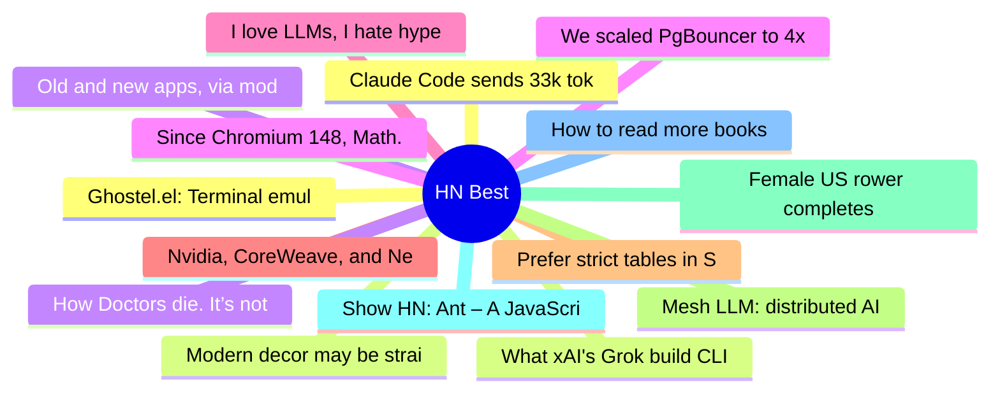

# HackerNews Best (高赞) Top 15 (2026-07-13)

## 思维导图

## 列表（15 条）

### 1. Claude Code sends 33k tokens before reading the prompt; OpenCode sends 7k
- **链接**: [https://systima.ai/blog/claude-code-vs-opencode-token-overhead](https://systima.ai/blog/claude-code-vs-opencode-token-overhead)
- **分数**: 503 | **评论**: 281 | **作者**: systima
- **HN**: https://news.ycombinator.com/item?id=48883275

### 2. What xAI's Grok build CLI sends to xAI: A wire-level analysis
- **链接**: [https://gist.github.com/cereblab/dc9a40bc26120f4540e4e09b75ffb547](https://gist.github.com/cereblab/dc9a40bc26120f4540e4e09b75ffb547)
- **分数**: 423 | **评论**: 163 | **作者**: jhoho
- **HN**: https://news.ycombinator.com/item?id=48877371

### 3. Old and new apps, via modern coding agents
- **链接**: [https://terrytao.wordpress.com/2026/07/11/old-and-new-apps-via-modern-coding-agents/](https://terrytao.wordpress.com/2026/07/11/old-and-new-apps-via-modern-coding-agents/)
- **分数**: 422 | **评论**: 126 | **作者**: subset
- **HN**: https://news.ycombinator.com/item?id=48880170

### 4. Since Chromium 148, Math.tanh is now fingerprintable to link underlying OS
- **链接**: [https://scrapfly.dev/posts/browser-math-os-fingerprint/](https://scrapfly.dev/posts/browser-math-os-fingerprint/)
- **分数**: 381 | **评论**: 177 | **作者**: joahnn_s
- **HN**: https://news.ycombinator.com/item?id=48884853

### 5. I love LLMs, I hate hype
- **链接**: [https://geohot.github.io//blog/jekyll/update/2026/07/12/i-love-llms.html](https://geohot.github.io//blog/jekyll/update/2026/07/12/i-love-llms.html)
- **分数**: 366 | **评论**: 228 | **作者**: therepanic
- **HN**: https://news.ycombinator.com/item?id=48883343

### 6. Nvidia, CoreWeave, and Nebius: Inside the Circular Financing of the GPU Boom
- **链接**: [https://io-fund.com/ai-stocks/nvidia-coreweave-nebius-circular-financing-gpu-boom](https://io-fund.com/ai-stocks/nvidia-coreweave-nebius-circular-financing-gpu-boom)
- **分数**: 361 | **评论**: 167 | **作者**: adletbalzhanov
- **HN**: https://news.ycombinator.com/item?id=48873836

### 7. Prefer strict tables in SQLite
- **链接**: [https://evanhahn.com/prefer-strict-tables-in-sqlite/](https://evanhahn.com/prefer-strict-tables-in-sqlite/)
- **分数**: 340 | **评论**: 171 | **作者**: ingve
- **HN**: https://news.ycombinator.com/item?id=48873940

### 8. Mesh LLM: distributed AI computing on iroh
- **链接**: [https://www.iroh.computer/blog/mesh-llm](https://www.iroh.computer/blog/mesh-llm)
- **分数**: 337 | **评论**: 79 | **作者**: tionis
- **HN**: https://news.ycombinator.com/item?id=48876505

### 9. Female US rower completes historic solo journey from California to Hawaii
- **链接**: [https://www.theguardian.com/us-news/2026/jul/04/california-hawaii-rowing-solo-journey](https://www.theguardian.com/us-news/2026/jul/04/california-hawaii-rowing-solo-journey)
- **分数**: 316 | **评论**: 106 | **作者**: speckx
- **HN**: https://news.ycombinator.com/item?id=48873692

### 10. Show HN: Ant – A JavaScript runtime and ecosystem
- **链接**: [https://antjs.org](https://antjs.org)
- **分数**: 315 | **评论**: 144 | **作者**: theMackabu
- **HN**: https://news.ycombinator.com/item?id=48875377

### 11. How to read more books
- **链接**: [https://scotto.me/blog/2026-07-12-how-to-read-more-books/](https://scotto.me/blog/2026-07-12-how-to-read-more-books/)
- **分数**: 280 | **评论**: 159 | **作者**: silcoon
- **HN**: https://news.ycombinator.com/item?id=48882056

### 12. Ghostel.el: Terminal emulator powered by libghostty
- **链接**: [https://dakra.github.io/ghostel/](https://dakra.github.io/ghostel/)
- **分数**: 267 | **评论**: 52 | **作者**: signa11
- **HN**: https://news.ycombinator.com/item?id=48879504

### 13. Modern decor may be straining people's brains
- **链接**: [https://studyfinds.com/modern-decor-may-be-straining-peoples-brains/](https://studyfinds.com/modern-decor-may-be-straining-peoples-brains/)
- **分数**: 267 | **评论**: 261 | **作者**: downwithdisease
- **HN**: https://news.ycombinator.com/item?id=48873424

### 14. How Doctors die. It’s not like the rest of us (2016)
- **链接**: [https://archive.cancerworld.net/featured/how-doctors-die/](https://archive.cancerworld.net/featured/how-doctors-die/)
- **分数**: 239 | **评论**: 146 | **作者**: downbad_
- **HN**: https://news.ycombinator.com/item?id=48876741

### 15. We scaled PgBouncer to 4x throughput
- **链接**: [https://clickhouse.com/blog/pgbouncer-clickhouse-managed-postgres](https://clickhouse.com/blog/pgbouncer-clickhouse-managed-postgres)
- **分数**: 235 | **评论**: 55 | **作者**: saisrirampur
- **HN**: https://news.ycombinator.com/item?id=48872874
