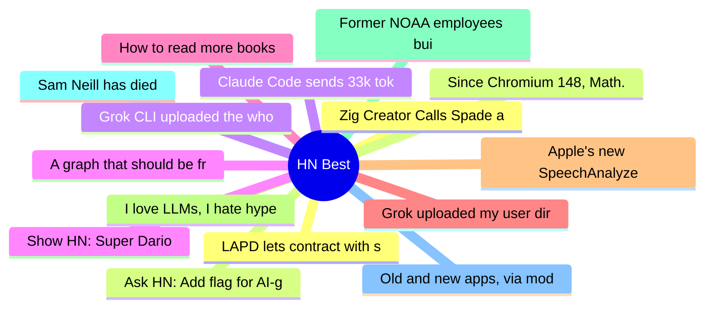

# HackerNews Best (高赞) Top 15 (2026-07-14)

## 思维导图

## 列表（15 条）

### 1. Zig Creator Calls Spade a Spade, Anthropic Blows Smoke
- **链接**: [https://raymyers.org/post/zed-creator-calls-spade-a-spade/](https://raymyers.org/post/zed-creator-calls-spade-a-spade/)
- **分数**: 1431 | **评论**: 719 | **作者**: crowdhailer
- **HN**: https://news.ycombinator.com/item?id=48889637

### 2. Ask HN: Add flag for AI-generated articles
- **链接**: [https://news.ycombinator.com/item?id=48886741](https://news.ycombinator.com/item?id=48886741)
- **分数**: 1017 | **评论**: 441 | **作者**: levkk
- **HN**: https://news.ycombinator.com/item?id=48886741

### 3. Claude Code sends 33k tokens before reading the prompt; OpenCode sends 7k
- **链接**: [https://systima.ai/blog/claude-code-vs-opencode-token-overhead](https://systima.ai/blog/claude-code-vs-opencode-token-overhead)
- **分数**: 686 | **评论**: 378 | **作者**: systima
- **HN**: https://news.ycombinator.com/item?id=48883275

### 4. A graph that should be front-page news
- **链接**: [https://www.lyrebirddreaming.com/post/the-graph-that-should-be-front-page-news](https://www.lyrebirddreaming.com/post/the-graph-that-should-be-front-page-news)
- **分数**: 633 | **评论**: 402 | **作者**: rakel_rakel
- **HN**: https://news.ycombinator.com/item?id=48888331

### 5. How to read more books
- **链接**: [https://scotto.me/blog/2026-07-12-how-to-read-more-books/](https://scotto.me/blog/2026-07-12-how-to-read-more-books/)
- **分数**: 535 | **评论**: 286 | **作者**: silcoon
- **HN**: https://news.ycombinator.com/item?id=48882056

### 6. Grok uploaded my user directory to xAI's servers
- **链接**: [https://twitter.com/a_green_being/status/2076598897779020159](https://twitter.com/a_green_being/status/2076598897779020159)
- **分数**: 493 | **评论**: 17 | **作者**: tnolet
- **HN**: https://news.ycombinator.com/item?id=48892512

### 7. Apple's new SpeechAnalyzer API, benchmarked against Whisper and its predecessor
- **链接**: [https://get-inscribe.com/blog/apple-speech-api-benchmark.html](https://get-inscribe.com/blog/apple-speech-api-benchmark.html)
- **分数**: 492 | **评论**: 195 | **作者**: get-inscribe
- **HN**: https://news.ycombinator.com/item?id=48894752

### 8. I love LLMs, I hate hype
- **链接**: [https://geohot.github.io//blog/jekyll/update/2026/07/12/i-love-llms.html](https://geohot.github.io//blog/jekyll/update/2026/07/12/i-love-llms.html)
- **分数**: 474 | **评论**: 310 | **作者**: therepanic
- **HN**: https://news.ycombinator.com/item?id=48883343

### 9. Former NOAA employees built Climate.us to preserve climate data and resources
- **链接**: [https://19thnews.org/2026/07/noaa-climate-data-website/](https://19thnews.org/2026/07/noaa-climate-data-website/)
- **分数**: 469 | **评论**: 181 | **作者**: benwerd
- **HN**: https://news.ycombinator.com/item?id=48897945

### 10. Sam Neill has died
- **链接**: [https://www.theguardian.com/film/2026/jul/13/sam-neill-death-actor-dies-aged-78](https://www.theguardian.com/film/2026/jul/13/sam-neill-death-actor-dies-aged-78)
- **分数**: 451 | **评论**: 106 | **作者**: j4mie
- **HN**: https://news.ycombinator.com/item?id=48888468

### 11. Old and new apps, via modern coding agents
- **链接**: [https://terrytao.wordpress.com/2026/07/11/old-and-new-apps-via-modern-coding-agents/](https://terrytao.wordpress.com/2026/07/11/old-and-new-apps-via-modern-coding-agents/)
- **分数**: 447 | **评论**: 132 | **作者**: subset
- **HN**: https://news.ycombinator.com/item?id=48880170

### 12. LAPD lets contract with surveillance giant Flock expire
- **链接**: [https://techcrunch.com/2026/07/13/lapd-lets-contract-with-surveillance-giant-flock-expire-citing-serious-concerns-over-civil-liberties-and-privacy/](https://techcrunch.com/2026/07/13/lapd-lets-contract-with-surveillance-giant-flock-expire-citing-serious-concerns-over-civil-liberties-and-privacy/)
- **分数**: 439 | **评论**: 389 | **作者**: forks
- **HN**: https://news.ycombinator.com/item?id=48893947

### 13. Since Chromium 148, Math.tanh is now fingerprintable to link underlying OS
- **链接**: [https://scrapfly.dev/posts/browser-math-os-fingerprint/](https://scrapfly.dev/posts/browser-math-os-fingerprint/)
- **分数**: 424 | **评论**: 215 | **作者**: joahnn_s
- **HN**: https://news.ycombinator.com/item?id=48884853

### 14. Grok CLI uploaded the whole home directory to GCS
- **链接**: [https://twitter.com/a_green_being/status/2076598897779020159](https://twitter.com/a_green_being/status/2076598897779020159)
- **分数**: 383 | **评论**: 394 | **作者**: denysvitali
- **HN**: https://news.ycombinator.com/item?id=48892468

### 15. Show HN: Super Dario
- **链接**: [https://superdario.pawb.de](https://superdario.pawb.de)
- **分数**: 373 | **评论**: 96 | **作者**: thepasch
- **HN**: https://news.ycombinator.com/item?id=48896286
