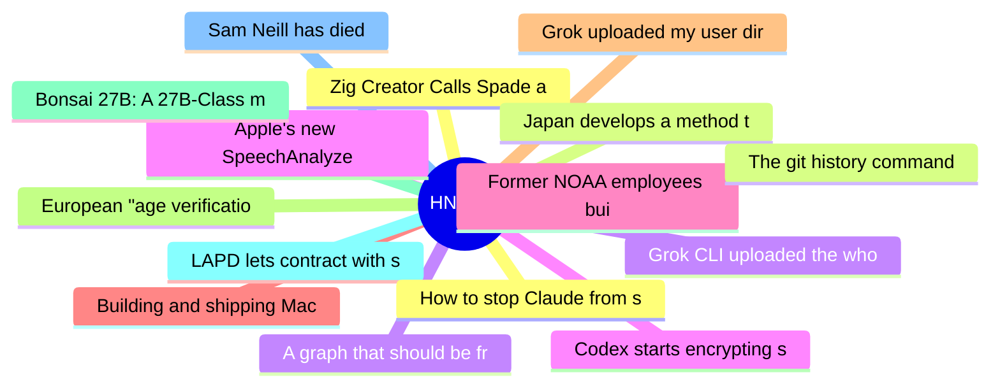

# HackerNews Best (高赞) Top 15 (2026-07-15)

## 思维导图

## 列表（15 条）

### 1. Zig Creator Calls Spade a Spade, Anthropic Blows Smoke
- **链接**: [https://raymyers.org/post/zed-creator-calls-spade-a-spade/](https://raymyers.org/post/zed-creator-calls-spade-a-spade/)
- **分数**: 1516 | **评论**: 771 | **作者**: crowdhailer
- **HN**: https://news.ycombinator.com/item?id=48889637

### 2. Japan develops a method to recover up to 90% of lithium from used EV batteries
- **链接**: [https://tech.supercarblondie.com/japan-recovers-up-to-90-of-lithium-from-used-ev-batteries/](https://tech.supercarblondie.com/japan-recovers-up-to-90-of-lithium-from-used-ev-batteries/)
- **分数**: 722 | **评论**: 188 | **作者**: donohoe
- **HN**: https://news.ycombinator.com/item?id=48901569

### 3. A graph that should be front-page news
- **链接**: [https://www.lyrebirddreaming.com/post/the-graph-that-should-be-front-page-news](https://www.lyrebirddreaming.com/post/the-graph-that-should-be-front-page-news)
- **分数**: 682 | **评论**: 435 | **作者**: rakel_rakel
- **HN**: https://news.ycombinator.com/item?id=48888331

### 4. Apple's new SpeechAnalyzer API, benchmarked against Whisper and its predecessor
- **链接**: [https://get-inscribe.com/blog/apple-speech-api-benchmark.html](https://get-inscribe.com/blog/apple-speech-api-benchmark.html)
- **分数**: 556 | **评论**: 233 | **作者**: get-inscribe
- **HN**: https://news.ycombinator.com/item?id=48894752

### 5. Former NOAA employees built Climate.us to preserve climate data and resources
- **链接**: [https://19thnews.org/2026/07/noaa-climate-data-website/](https://19thnews.org/2026/07/noaa-climate-data-website/)
- **分数**: 540 | **评论**: 210 | **作者**: benwerd
- **HN**: https://news.ycombinator.com/item?id=48897945

### 6. Building and shipping Mac and iOS apps without opening Xcode
- **链接**: [https://scottwillsey.com/building-and-shipping-mac-and-ios-apps-without-ever-opening-xcode/](https://scottwillsey.com/building-and-shipping-mac-and-ios-apps-without-ever-opening-xcode/)
- **分数**: 536 | **评论**: 229 | **作者**: speckx
- **HN**: https://news.ycombinator.com/item?id=48896665

### 7. Grok uploaded my user directory to xAI's servers
- **链接**: [https://twitter.com/a_green_being/status/2076598897779020159](https://twitter.com/a_green_being/status/2076598897779020159)
- **分数**: 509 | **评论**: 19 | **作者**: tnolet
- **HN**: https://news.ycombinator.com/item?id=48892512

### 8. European "age verification" "app" forcing everyone to use Android or iOS
- **链接**: [https://github.com/eu-digital-identity-wallet/av-doc-technical-specification/discussions/19](https://github.com/eu-digital-identity-wallet/av-doc-technical-specification/discussions/19)
- **分数**: 493 | **评论**: 338 | **作者**: roundabout-host
- **HN**: https://news.ycombinator.com/item?id=48903777

### 9. Bonsai 27B: A 27B-Class model that runs on a phone
- **链接**: [https://prismml.com/news/bonsai-27b](https://prismml.com/news/bonsai-27b)
- **分数**: 491 | **评论**: 182 | **作者**: xenova
- **HN**: https://news.ycombinator.com/item?id=48910545

### 10. LAPD lets contract with surveillance giant Flock expire
- **链接**: [https://techcrunch.com/2026/07/13/lapd-lets-contract-with-surveillance-giant-flock-expire-citing-serious-concerns-over-civil-liberties-and-privacy/](https://techcrunch.com/2026/07/13/lapd-lets-contract-with-surveillance-giant-flock-expire-citing-serious-concerns-over-civil-liberties-and-privacy/)
- **分数**: 468 | **评论**: 409 | **作者**: forks
- **HN**: https://news.ycombinator.com/item?id=48893947

### 11. Sam Neill has died
- **链接**: [https://www.theguardian.com/film/2026/jul/13/sam-neill-death-actor-dies-aged-78](https://www.theguardian.com/film/2026/jul/13/sam-neill-death-actor-dies-aged-78)
- **分数**: 467 | **评论**: 114 | **作者**: j4mie
- **HN**: https://news.ycombinator.com/item?id=48888468

### 12. How to stop Claude from saying load-bearing
- **链接**: [https://jola.dev/posts/how-to-stop-claude-from-saying-load-bearing](https://jola.dev/posts/how-to-stop-claude-from-saying-load-bearing)
- **分数**: 463 | **评论**: 519 | **作者**: shintoist
- **HN**: https://news.ycombinator.com/item?id=48905248

### 13. The git history command
- **链接**: [https://lalitm.com/post/git-history/](https://lalitm.com/post/git-history/)
- **分数**: 429 | **评论**: 305 | **作者**: turbocon
- **HN**: https://news.ycombinator.com/item?id=48901010

### 14. Grok CLI uploaded the whole home directory to GCS
- **链接**: [https://twitter.com/a_green_being/status/2076598897779020159](https://twitter.com/a_green_being/status/2076598897779020159)
- **分数**: 429 | **评论**: 402 | **作者**: denysvitali
- **HN**: https://news.ycombinator.com/item?id=48892468

### 15. Codex starts encrypting sub-agent prompts
- **链接**: [https://github.com/openai/codex/issues/28058](https://github.com/openai/codex/issues/28058)
- **分数**: 412 | **评论**: 242 | **作者**: embedding-shape
- **HN**: https://news.ycombinator.com/item?id=48905028
