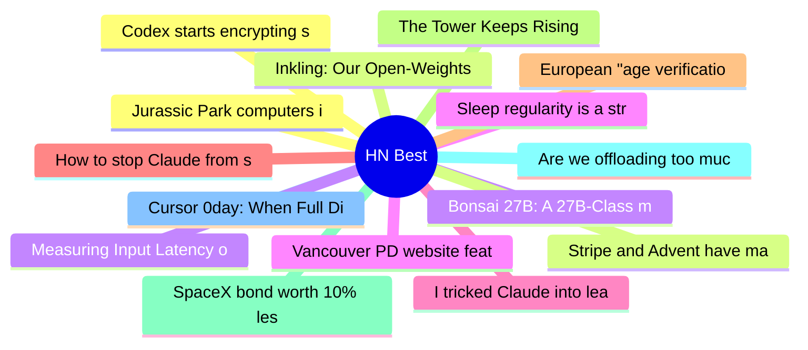

# HackerNews Best (高赞) Top 15 (2026-07-16)

## 思维导图

## 列表（15 条）

### 1. Jurassic Park computers in excruciating detail
- **链接**: [https://fabiensanglard.net/jurrasic_park_computers/index.html](https://fabiensanglard.net/jurrasic_park_computers/index.html)
- **分数**: 877 | **评论**: 231 | **作者**: vinhnx
- **HN**: https://news.ycombinator.com/item?id=48915709

### 2. Inkling: Our Open-Weights Model
- **链接**: [https://thinkingmachines.ai/news/introducing-inkling/](https://thinkingmachines.ai/news/introducing-inkling/)
- **分数**: 801 | **评论**: 205 | **作者**: vimarsh6739
- **HN**: https://news.ycombinator.com/item?id=48924912

### 3. Bonsai 27B: A 27B-Class model that runs on a phone
- **链接**: [https://prismml.com/news/bonsai-27b](https://prismml.com/news/bonsai-27b)
- **分数**: 680 | **评论**: 242 | **作者**: xenova
- **HN**: https://news.ycombinator.com/item?id=48910545

### 4. Sleep regularity is a stronger predictor of mortality risk than sleep duration (2023)
- **链接**: [https://academic.oup.com/sleep/article/47/1/zsad253/7280269](https://academic.oup.com/sleep/article/47/1/zsad253/7280269)
- **分数**: 673 | **评论**: 350 | **作者**: bilsbie
- **HN**: https://news.ycombinator.com/item?id=48919363

### 5. I tricked Claude into leaking your deepest, darkest secrets
- **链接**: [https://www.ayush.digital/blog/the-memory-heist](https://www.ayush.digital/blog/the-memory-heist)
- **分数**: 613 | **评论**: 283 | **作者**: macleginn
- **HN**: https://news.ycombinator.com/item?id=48916975

### 6. How to stop Claude from saying load-bearing
- **链接**: [https://jola.dev/posts/how-to-stop-claude-from-saying-load-bearing](https://jola.dev/posts/how-to-stop-claude-from-saying-load-bearing)
- **分数**: 592 | **评论**: 601 | **作者**: shintoist
- **HN**: https://news.ycombinator.com/item?id=48905248

### 7. European "age verification" "app" forcing everyone to use Android or iOS
- **链接**: [https://github.com/eu-digital-identity-wallet/av-doc-technical-specification/discussions/19](https://github.com/eu-digital-identity-wallet/av-doc-technical-specification/discussions/19)
- **分数**: 562 | **评论**: 420 | **作者**: roundabout-host
- **HN**: https://news.ycombinator.com/item?id=48903777

### 8. The Tower Keeps Rising
- **链接**: [https://lucumr.pocoo.org/2026/7/13/the-tower-keeps-rising/](https://lucumr.pocoo.org/2026/7/13/the-tower-keeps-rising/)
- **分数**: 533 | **评论**: 256 | **作者**: cdrnsf
- **HN**: https://news.ycombinator.com/item?id=48909785

### 9. SpaceX bond worth 10% less than issue price – heading for junk bond status
- **链接**: [https://www.ft.com/content/3a023b95-66c3-41e1-b0ce-df752a499541](https://www.ft.com/content/3a023b95-66c3-41e1-b0ce-df752a499541)
- **分数**: 525 | **评论**: 546 | **作者**: youngtaff
- **HN**: https://news.ycombinator.com/item?id=48920181

### 10. Are we offloading too much of our thinking to AI?
- **链接**: [https://www.artfish.ai/p/offloading-thinking-to-ai](https://www.artfish.ai/p/offloading-thinking-to-ai)
- **分数**: 512 | **评论**: 473 | **作者**: yenniejun111
- **HN**: https://news.ycombinator.com/item?id=48908178

### 11. Cursor 0day: When Full Disclosure Becomes the Only Protection Left
- **链接**: [https://mindgard.ai/blog/cursor-0day-when-full-disclosure-becomes-the-only-protection-left](https://mindgard.ai/blog/cursor-0day-when-full-disclosure-becomes-the-only-protection-left)
- **分数**: 441 | **评论**: 200 | **作者**: Synthetic7346
- **HN**: https://news.ycombinator.com/item?id=48910676

### 12. Codex starts encrypting sub-agent prompts
- **链接**: [https://github.com/openai/codex/issues/28058](https://github.com/openai/codex/issues/28058)
- **分数**: 422 | **评论**: 249 | **作者**: embedding-shape
- **HN**: https://news.ycombinator.com/item?id=48905028

### 13. Stripe and Advent have made a joint offer to acquire PayPal – sources
- **链接**: [https://www.reuters.com/business/finance/stripe-advent-offer-buy-paypal-more-than-53-billion-sources-say-2026-07-15/](https://www.reuters.com/business/finance/stripe-advent-offer-buy-paypal-more-than-53-billion-sources-say-2026-07-15/)
- **分数**: 398 | **评论**: 220 | **作者**: rvz
- **HN**: https://news.ycombinator.com/item?id=48915953

### 14. Measuring Input Latency on Linux: X11 vs. Wayland, VRR, and DXVK
- **链接**: [https://marco-nett.de/blog/measuring-input-latency-on-linux-x11-vs-wayland-vrr-dxvk/](https://marco-nett.de/blog/measuring-input-latency-on-linux-x11-vs-wayland-vrr-dxvk/)
- **分数**: 393 | **评论**: 283 | **作者**: hoechst
- **HN**: https://news.ycombinator.com/item?id=48909424

### 15. Vancouver PD website features Quick Escape button that wipes itself from history
- **链接**: [https://vpd.ca/](https://vpd.ca/)
- **分数**: 357 | **评论**: 136 | **作者**: LookAtThatBacon
- **HN**: https://news.ycombinator.com/item?id=48914644
