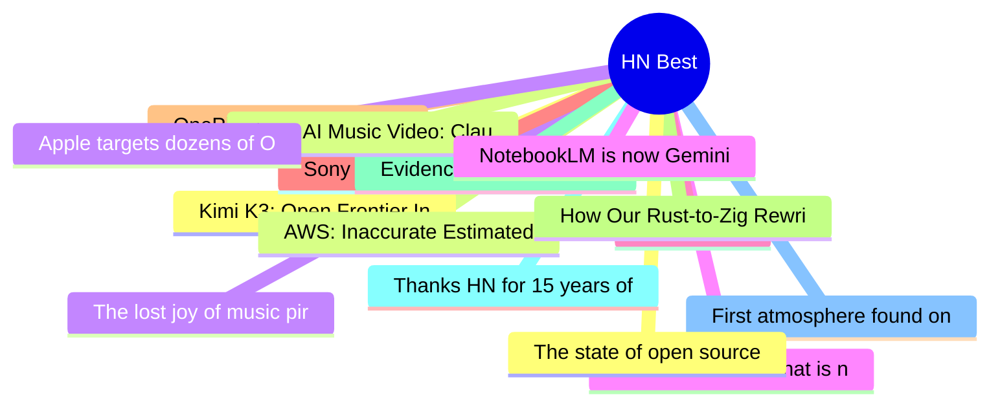

# HackerNews Best (高赞) Top 15 (2026-07-18)

## 思维导图

## 列表（15 条）

### 1. Kimi K3: Open Frontier Intelligence
- **链接**: [https://www.kimi.com/blog/kimi-k3](https://www.kimi.com/blog/kimi-k3)
- **分数**: 2002 | **评论**: 1165 | **作者**: vincent_s
- **HN**: https://news.ycombinator.com/item?id=48935342

### 2. AWS: Inaccurate Estimated Billing Data – $1.7 billion
- **链接**: [https://news.ycombinator.com/item?id=48945241](https://news.ycombinator.com/item?id=48945241)
- **分数**: 1070 | **评论**: 649 | **作者**: nprateem
- **HN**: https://news.ycombinator.com/item?id=48945241

### 3. The lost joy of music piracy
- **链接**: [https://www.pigeonsandplanes.com/read/music-piracy-what-cd-oink-nine-inch-nails-streaming](https://www.pigeonsandplanes.com/read/music-piracy-what-cd-oink-nine-inch-nails-streaming)
- **分数**: 818 | **评论**: 581 | **作者**: mcgin
- **HN**: https://news.ycombinator.com/item?id=48930454

### 4. Microsoft Comic Chat is now open source
- **链接**: [https://opensource.microsoft.com/blog/2026/07/16/microsoft-comic-chat-is-now-open-source/](https://opensource.microsoft.com/blog/2026/07/16/microsoft-comic-chat-is-now-open-source/)
- **分数**: 788 | **评论**: 172 | **作者**: jervant
- **HN**: https://news.ycombinator.com/item?id=48936426

### 5. Decoy Font
- **链接**: [https://www.mixfont.com/experiments/decoy-font](https://www.mixfont.com/experiments/decoy-font)
- **分数**: 695 | **评论**: 155 | **作者**: ray__
- **HN**: https://news.ycombinator.com/item?id=48936584

### 6. Sony deletes more movies from the accounts of people who ‘bought’ them
- **链接**: [https://www.techdirt.com/2026/07/15/sony-deletes-a-bunch-more-movies-from-the-accounts-of-people-who-bought-them/](https://www.techdirt.com/2026/07/15/sony-deletes-a-bunch-more-movies-from-the-accounts-of-people-who-bought-them/)
- **分数**: 685 | **评论**: 435 | **作者**: nekusar
- **HN**: https://news.ycombinator.com/item?id=48933419

### 7. OnePlus halts operations in USA and Europe
- **链接**: [https://community.oneplus.com/thread/2170715118587871237](https://community.oneplus.com/thread/2170715118587871237)
- **分数**: 583 | **评论**: 361 | **作者**: pilililo2
- **HN**: https://news.ycombinator.com/item?id=48932539

### 8. How Our Rust-to-Zig Rewrite Is Going
- **链接**: [https://rtfeldman.com/rust-to-zig](https://rtfeldman.com/rust-to-zig)
- **分数**: 516 | **评论**: 295 | **作者**: jorangreef
- **HN**: https://news.ycombinator.com/item?id=48933149

### 9. Evidence of inconsistencies in evaluation process and selection of winners
- **链接**: [https://www.kaggle.com/competitions/kaggle-measuring-agi/discussion/724918#3498423](https://www.kaggle.com/competitions/kaggle-measuring-agi/discussion/724918#3498423)
- **分数**: 450 | **评论**: 278 | **作者**: twerkmeister
- **HN**: https://news.ycombinator.com/item?id=48946010

### 10. Thanks HN for 15 years of support and helping me find my life's work
- **链接**: [https://news.ycombinator.com/item?id=48949551](https://news.ycombinator.com/item?id=48949551)
- **分数**: 390 | **评论**: 36 | **作者**: nicholasjbs
- **HN**: https://news.ycombinator.com/item?id=48949551

### 11. First atmosphere found on Earth-like planet in habitable zone of distant star
- **链接**: [https://www.bbc.com/news/articles/cy4kdd1e0ejo](https://www.bbc.com/news/articles/cy4kdd1e0ejo)
- **分数**: 384 | **评论**: 237 | **作者**: neversaydie
- **HN**: https://news.ycombinator.com/item?id=48947560

### 12. The state of open source AI
- **链接**: [https://stateofopensource.ai/](https://stateofopensource.ai/)
- **分数**: 384 | **评论**: 283 | **作者**: rellem
- **HN**: https://news.ycombinator.com/item?id=48947825

### 13. $100 AI Music Video: Claude Fable 5 vs. GPT-5.6 Sol
- **链接**: [https://www.tryai.dev/blog/ai-music-video-arena-claude-vs-gpt-5.6](https://www.tryai.dev/blog/ai-music-video-arena-claude-vs-gpt-5.6)
- **分数**: 383 | **评论**: 518 | **作者**: hershyb_
- **HN**: https://news.ycombinator.com/item?id=48939524

### 14. Apple targets dozens of OpenAI employees with legal letters
- **链接**: [https://www.ft.com/content/1b8c9d52-88a9-426b-ba47-f1811f859166](https://www.ft.com/content/1b8c9d52-88a9-426b-ba47-f1811f859166)
- **分数**: 378 | **评论**: 324 | **作者**: merksittich
- **HN**: https://news.ycombinator.com/item?id=48946303

### 15. NotebookLM is now Gemini Notebook
- **链接**: [https://blog.google/innovation-and-ai/products/gemini-notebook/notebooklm-gemini-notebook/](https://blog.google/innovation-and-ai/products/gemini-notebook/notebooklm-gemini-notebook/)
- **分数**: 364 | **评论**: 178 | **作者**: xnx
- **HN**: https://news.ycombinator.com/item?id=48936451
