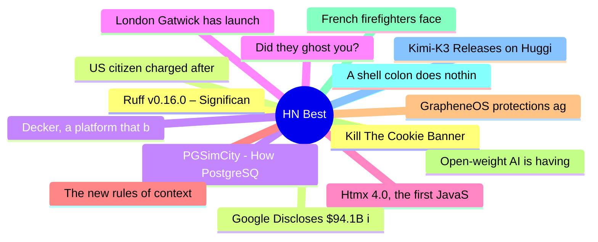

# HackerNews Best (高赞) Top 15 (2026-07-27)

## 思维导图

## 列表（15 条）

### 1. Kill The Cookie Banner
- **链接**: [https://killthecookiebanner.eu/](https://killthecookiebanner.eu/)
- **分数**: 1049 | **评论**: 495 | **作者**: rapnie
- **HN**: https://news.ycombinator.com/item?id=49057175

### 2. US citizen charged after GrapheneOS phone wipes during airport search
- **链接**: [https://www.techspot.com/news/113236-us-prosecutors-charge-atlanta-man-after-grapheneos-phone.html](https://www.techspot.com/news/113236-us-prosecutors-charge-atlanta-man-after-grapheneos-phone.html)
- **分数**: 814 | **评论**: 611 | **作者**: eecc
- **HN**: https://news.ycombinator.com/item?id=49063022

### 3. PGSimCity - How PostgreSQL Works
- **链接**: [https://nikolays.github.io/PGSimCity/](https://nikolays.github.io/PGSimCity/)
- **分数**: 639 | **评论**: 62 | **作者**: jonbaer
- **HN**: https://news.ycombinator.com/item?id=49063754

### 4. Did they ghost you?
- **链接**: [https://didtheyghostyou.com/](https://didtheyghostyou.com/)
- **分数**: 473 | **评论**: 213 | **作者**: mooreds
- **HN**: https://news.ycombinator.com/item?id=49051120

### 5. Htmx 4.0, the first JavaScript library to release exclusively on the Game Boy
- **链接**: [https://swag.htmx.org/en-cad/products/htmx-4-the-game](https://swag.htmx.org/en-cad/products/htmx-4-the-game)
- **分数**: 462 | **评论**: 154 | **作者**: rcy
- **HN**: https://news.ycombinator.com/item?id=49057241

### 6. The new rules of context engineering for Claude 5 generation models
- **链接**: [https://claude.com/blog/the-new-rules-of-context-engineering-for-claude-5-generation-models](https://claude.com/blog/the-new-rules-of-context-engineering-for-claude-5-generation-models)
- **分数**: 448 | **评论**: 375 | **作者**: mellosouls
- **HN**: https://news.ycombinator.com/item?id=49051361

### 7. GrapheneOS protections against data extraction from locked devices
- **链接**: [https://discuss.grapheneos.org/d/40700-grapheneos-protections-against-data-extraction-from-locked-devices](https://discuss.grapheneos.org/d/40700-grapheneos-protections-against-data-extraction-from-locked-devices)
- **分数**: 415 | **评论**: 231 | **作者**: Cider9986
- **HN**: https://news.ycombinator.com/item?id=49055169

### 8. Open-weight AI is having its Kubernetes moment
- **链接**: [https://tobi.knaup.me/2026-07-25-open-weight-ai-is-having-its-kubernetes-moment/](https://tobi.knaup.me/2026-07-25-open-weight-ai-is-having-its-kubernetes-moment/)
- **分数**: 402 | **评论**: 317 | **作者**: tknaup
- **HN**: https://news.ycombinator.com/item?id=49048034

### 9. French firefighters face 'pyrocumulonimbus' for first time
- **链接**: [https://www.france24.com/en/live-news/20260726-french-firefighters-face-pyrocumulonimbus-for-first-time](https://www.france24.com/en/live-news/20260726-french-firefighters-face-pyrocumulonimbus-for-first-time)
- **分数**: 393 | **评论**: 270 | **作者**: saaaaaam
- **HN**: https://news.ycombinator.com/item?id=49060495

### 10. A shell colon does nothing. Use it anyway
- **链接**: [https://refp.se/articles/your-shell-and-the-magic-colon](https://refp.se/articles/your-shell-and-the-magic-colon)
- **分数**: 389 | **评论**: 171 | **作者**: olexsmir
- **HN**: https://news.ycombinator.com/item?id=49047453

### 11. Kimi-K3 Releases on HuggingFace 7/27
- **链接**: [https://huggingface.co/moonshotai/Kimi-K3](https://huggingface.co/moonshotai/Kimi-K3)
- **分数**: 365 | **评论**: 156 | **作者**: nateb2022
- **HN**: https://news.ycombinator.com/item?id=49065752

### 12. Ruff v0.16.0 – Significant new updates – 413 default rules up from 59
- **链接**: [https://astral.sh/blog/ruff-v0.16.0](https://astral.sh/blog/ruff-v0.16.0)
- **分数**: 341 | **评论**: 227 | **作者**: vismit2000
- **HN**: https://news.ycombinator.com/item?id=49056112

### 13. Google Discloses $94.1B in SpaceX Stock, Marking 6% Stake
- **链接**: [https://www.wsj.com/tech/google-discloses-94-1-billion-in-spacex-stock-marking-6-stake-91655d7c](https://www.wsj.com/tech/google-discloses-94-1-billion-in-spacex-stock-marking-6-stake-91655d7c)
- **分数**: 328 | **评论**: 307 | **作者**: 1vuio0pswjnm7
- **HN**: https://news.ycombinator.com/item?id=49057574

### 14. Decker, a platform that builds on the legacy of Hypercard and classic macOS
- **链接**: [https://beyondloom.com/decker/](https://beyondloom.com/decker/)
- **分数**: 318 | **评论**: 74 | **作者**: tosh
- **HN**: https://news.ycombinator.com/item?id=49060856

### 15. London Gatwick has launched a robotic airport parking service
- **链接**: [https://aerospaceglobalnews.com/news/gatwick-airport-robotic-parking-stanley-robotics/](https://aerospaceglobalnews.com/news/gatwick-airport-robotic-parking-stanley-robotics/)
- **分数**: 278 | **评论**: 242 | **作者**: agotterer
- **HN**: https://news.ycombinator.com/item?id=49058669
