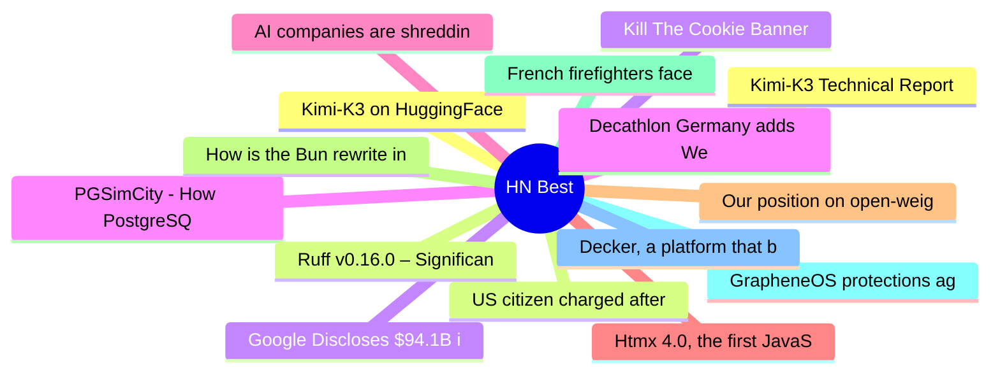

# HackerNews Best (高赞) Top 15 (2026-07-28)

## 思维导图

## 列表（15 条）

### 1. Kimi-K3 on HuggingFace
- **链接**: [https://huggingface.co/moonshotai/Kimi-K3](https://huggingface.co/moonshotai/Kimi-K3)
- **分数**: 1313 | **评论**: 515 | **作者**: nateb2022
- **HN**: https://news.ycombinator.com/item?id=49065752

### 2. US citizen charged after GrapheneOS phone wipes during airport search
- **链接**: [https://www.techspot.com/news/113236-us-prosecutors-charge-atlanta-man-after-grapheneos-phone.html](https://www.techspot.com/news/113236-us-prosecutors-charge-atlanta-man-after-grapheneos-phone.html)
- **分数**: 1262 | **评论**: 1013 | **作者**: eecc
- **HN**: https://news.ycombinator.com/item?id=49063022

### 3. Kill The Cookie Banner
- **链接**: [https://killthecookiebanner.eu/](https://killthecookiebanner.eu/)
- **分数**: 1121 | **评论**: 574 | **作者**: rapnie
- **HN**: https://news.ycombinator.com/item?id=49057175

### 4. PGSimCity - How PostgreSQL Works
- **链接**: [https://nikolays.github.io/PGSimCity/](https://nikolays.github.io/PGSimCity/)
- **分数**: 889 | **评论**: 87 | **作者**: jonbaer
- **HN**: https://news.ycombinator.com/item?id=49063754

### 5. AI companies are shredding rare books
- **链接**: [https://twitter.com/HedgieMarkets/status/2081534588485296565](https://twitter.com/HedgieMarkets/status/2081534588485296565)
- **分数**: 739 | **评论**: 468 | **作者**: anon373839
- **HN**: https://news.ycombinator.com/item?id=49068738

### 6. Htmx 4.0, the first JavaScript library to release exclusively on the Game Boy
- **链接**: [https://swag.htmx.org/en-cad/products/htmx-4-the-game](https://swag.htmx.org/en-cad/products/htmx-4-the-game)
- **分数**: 498 | **评论**: 193 | **作者**: rcy
- **HN**: https://news.ycombinator.com/item?id=49057241

### 7. Our position on open-weights models
- **链接**: [https://www.anthropic.com/news/position-open-weights-models](https://www.anthropic.com/news/position-open-weights-models)
- **分数**: 465 | **评论**: 639 | **作者**: surprisetalk
- **HN**: https://news.ycombinator.com/item?id=49076057

### 8. How is the Bun rewrite in Rust going?
- **链接**: [https://lockwood.dev/ai/2026/07/27/how-is-the-bun-rewrite-in-rust-going.html](https://lockwood.dev/ai/2026/07/27/how-is-the-bun-rewrite-in-rust-going.html)
- **分数**: 454 | **评论**: 349 | **作者**: tomlockwood
- **HN**: https://news.ycombinator.com/item?id=49067854

### 9. French firefighters face 'pyrocumulonimbus' for first time
- **链接**: [https://www.france24.com/en/live-news/20260726-french-firefighters-face-pyrocumulonimbus-for-first-time](https://www.france24.com/en/live-news/20260726-french-firefighters-face-pyrocumulonimbus-for-first-time)
- **分数**: 446 | **评论**: 355 | **作者**: saaaaaam
- **HN**: https://news.ycombinator.com/item?id=49060495

### 10. GrapheneOS protections against data extraction from locked devices
- **链接**: [https://discuss.grapheneos.org/d/40700-grapheneos-protections-against-data-extraction-from-locked-devices](https://discuss.grapheneos.org/d/40700-grapheneos-protections-against-data-extraction-from-locked-devices)
- **分数**: 436 | **评论**: 251 | **作者**: Cider9986
- **HN**: https://news.ycombinator.com/item?id=49055169

### 11. Decker, a platform that builds on the legacy of Hypercard and classic macOS
- **链接**: [https://beyondloom.com/decker/](https://beyondloom.com/decker/)
- **分数**: 374 | **评论**: 99 | **作者**: tosh
- **HN**: https://news.ycombinator.com/item?id=49060856

### 12. Kimi-K3 Technical Report [pdf]
- **链接**: [https://github.com/MoonshotAI/Kimi-K3/blob/main/k3_tech_report.pdf](https://github.com/MoonshotAI/Kimi-K3/blob/main/k3_tech_report.pdf)
- **分数**: 367 | **评论**: 164 | **作者**: vinhnx
- **HN**: https://news.ycombinator.com/item?id=49070985

### 13. Ruff v0.16.0 – Significant new updates – 413 default rules up from 59
- **链接**: [https://astral.sh/blog/ruff-v0.16.0](https://astral.sh/blog/ruff-v0.16.0)
- **分数**: 348 | **评论**: 231 | **作者**: vismit2000
- **HN**: https://news.ycombinator.com/item?id=49056112

### 14. Google Discloses $94.1B in SpaceX Stock, Marking 6% Stake
- **链接**: [https://www.wsj.com/tech/google-discloses-94-1-billion-in-spacex-stock-marking-6-stake-91655d7c](https://www.wsj.com/tech/google-discloses-94-1-billion-in-spacex-stock-marking-6-stake-91655d7c)
- **分数**: 337 | **评论**: 320 | **作者**: 1vuio0pswjnm7
- **HN**: https://news.ycombinator.com/item?id=49057574

### 15. Decathlon Germany adds Wero payment option to decathlon.de website
- **链接**: [https://www.sgieurope.com/e-commerce/decathlon-germany-launches-wero-payment-on-its-website/122397.article](https://www.sgieurope.com/e-commerce/decathlon-germany-launches-wero-payment-on-its-website/122397.article)
- **分数**: 302 | **评论**: 207 | **作者**: doener
- **HN**: https://news.ycombinator.com/item?id=49072310
