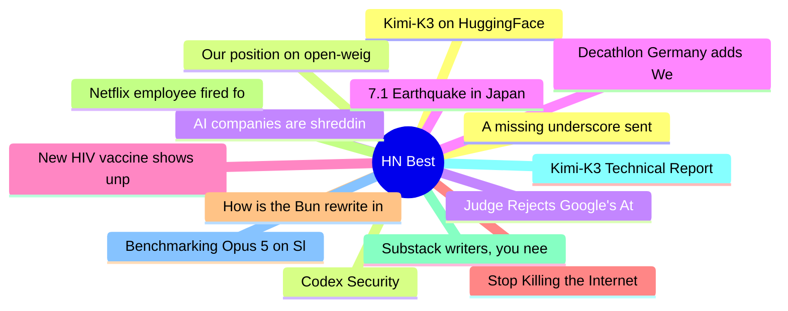

# HackerNews Best (高赞) Top 15 (2026-07-29)

## 思维导图

## 列表（15 条）

### 1. Kimi-K3 on HuggingFace
- **链接**: [https://huggingface.co/moonshotai/Kimi-K3](https://huggingface.co/moonshotai/Kimi-K3)
- **分数**: 1366 | **评论**: 538 | **作者**: nateb2022
- **HN**: https://news.ycombinator.com/item?id=49065752

### 2. Our position on open-weights models
- **链接**: [https://www.anthropic.com/news/position-open-weights-models](https://www.anthropic.com/news/position-open-weights-models)
- **分数**: 1149 | **评论**: 1687 | **作者**: surprisetalk
- **HN**: https://news.ycombinator.com/item?id=49076057

### 3. AI companies are shredding rare books
- **链接**: [https://twitter.com/HedgieMarkets/status/2081534588485296565](https://twitter.com/HedgieMarkets/status/2081534588485296565)
- **分数**: 782 | **评论**: 508 | **作者**: anon373839
- **HN**: https://news.ycombinator.com/item?id=49068738

### 4. 7.1 Earthquake in Japan
- **链接**: [https://www.data.jma.go.jp/multi/quake/quake_detail.html?eventID=20260728163528&lang=en](https://www.data.jma.go.jp/multi/quake/quake_detail.html?eventID=20260728163528&lang=en)
- **分数**: 775 | **评论**: 207 | **作者**: krembo
- **HN**: https://news.ycombinator.com/item?id=49080664

### 5. New HIV vaccine shows unprecedented success in preclinical study
- **链接**: [https://www.lji.org/news-events/news/post/new-hiv-vaccine-shows-unprecedented-success-in-preclinical-study/](https://www.lji.org/news-events/news/post/new-hiv-vaccine-shows-unprecedented-success-in-preclinical-study/)
- **分数**: 567 | **评论**: 240 | **作者**: codebyaditya
- **HN**: https://news.ycombinator.com/item?id=49083314

### 6. Stop Killing the Internet: No Digital ID and No Age Verification
- **链接**: [https://citizens-initiative.europa.eu/initiatives/details/2026/000011_en](https://citizens-initiative.europa.eu/initiatives/details/2026/000011_en)
- **分数**: 521 | **评论**: 187 | **作者**: doener
- **HN**: https://news.ycombinator.com/item?id=49084938

### 7. How is the Bun rewrite in Rust going?
- **链接**: [https://lockwood.dev/ai/2026/07/27/how-is-the-bun-rewrite-in-rust-going.html](https://lockwood.dev/ai/2026/07/27/how-is-the-bun-rewrite-in-rust-going.html)
- **分数**: 488 | **评论**: 383 | **作者**: tomlockwood
- **HN**: https://news.ycombinator.com/item?id=49067854

### 8. Netflix employee fired for sharing personal details in retreat trust exercise
- **链接**: [https://nypost.com/2026/07/26/us-news/netflix-exec-goes-ballistic-after-being-fired-for-stunning-trust-exercise-confession-at-retreat-suit/](https://nypost.com/2026/07/26/us-news/netflix-exec-goes-ballistic-after-being-fired-for-stunning-trust-exercise-confession-at-retreat-suit/)
- **分数**: 424 | **评论**: 474 | **作者**: softwaredoug
- **HN**: https://news.ycombinator.com/item?id=49076923

### 9. Substack writers, you need a website
- **链接**: [https://elizabethtai.com/2026/06/10/substack-writers-you-need-a-website/](https://elizabethtai.com/2026/06/10/substack-writers-you-need-a-website/)
- **分数**: 416 | **评论**: 214 | **作者**: speckx
- **HN**: https://news.ycombinator.com/item?id=49086788

### 10. Kimi-K3 Technical Report [pdf]
- **链接**: [https://github.com/MoonshotAI/Kimi-K3/blob/main/k3_tech_report.pdf](https://github.com/MoonshotAI/Kimi-K3/blob/main/k3_tech_report.pdf)
- **分数**: 388 | **评论**: 180 | **作者**: vinhnx
- **HN**: https://news.ycombinator.com/item?id=49070985

### 11. Benchmarking Opus 5 on SlopCodeBench
- **链接**: [https://github.com/humanlayer/advanced-context-engineering-for-coding-agents/blob/main/benchmarking-opus-5-on-slop-code-bench.md](https://github.com/humanlayer/advanced-context-engineering-for-coding-agents/blob/main/benchmarking-opus-5-on-slop-code-bench.md)
- **分数**: 387 | **评论**: 115 | **作者**: dhorthy
- **HN**: https://news.ycombinator.com/item?id=49076391

### 12. A missing underscore sent innocent man to prison for 18 months
- **链接**: [https://arstechnica.com/tech-policy/2026/07/police-missed-one-underscore-and-sent-the-wrong-man-to-prison/](https://arstechnica.com/tech-policy/2026/07/police-missed-one-underscore-and-sent-the-wrong-man-to-prison/)
- **分数**: 384 | **评论**: 248 | **作者**: quantified
- **HN**: https://news.ycombinator.com/item?id=49076116

### 13. Codex Security
- **链接**: [https://github.com/openai/codex-security](https://github.com/openai/codex-security)
- **分数**: 347 | **评论**: 105 | **作者**: bakigul
- **HN**: https://news.ycombinator.com/item?id=49089755

### 14. Judge Rejects Google's Attempt to DMCA Its Way Out of Being Scraped
- **链接**: [https://www.techdirt.com/2026/07/27/judge-rejects-googles-attempt-to-dmca-its-way-out-of-being-scraped/](https://www.techdirt.com/2026/07/27/judge-rejects-googles-attempt-to-dmca-its-way-out-of-being-scraped/)
- **分数**: 334 | **评论**: 147 | **作者**: cdrnsf
- **HN**: https://news.ycombinator.com/item?id=49073513

### 15. Decathlon Germany adds Wero payment option to decathlon.de website
- **链接**: [https://www.sgieurope.com/e-commerce/decathlon-germany-launches-wero-payment-on-its-website/122397.article](https://www.sgieurope.com/e-commerce/decathlon-germany-launches-wero-payment-on-its-website/122397.article)
- **分数**: 333 | **评论**: 227 | **作者**: doener
- **HN**: https://news.ycombinator.com/item?id=49072310
