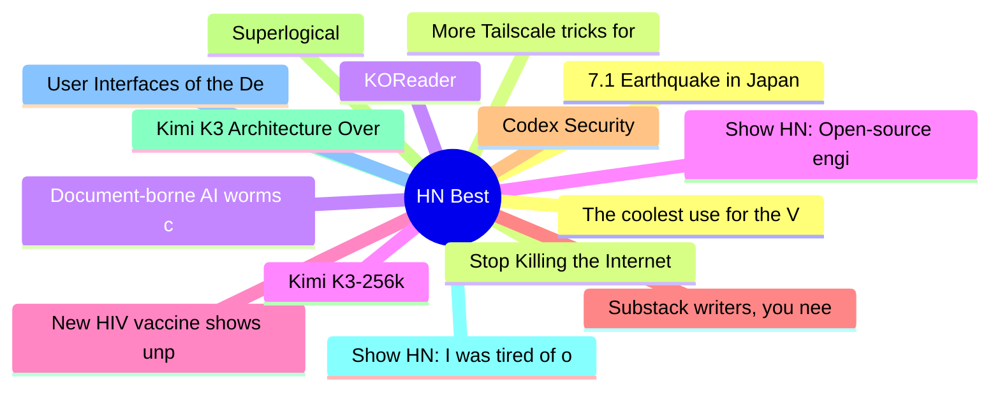

# HackerNews Best (高赞) Top 15 (2026-07-30)

## 思维导图

## 列表（15 条）

### 1. 7.1 Earthquake in Japan
- **链接**: [https://www.data.jma.go.jp/multi/quake/quake_detail.html?eventID=20260728163528&lang=en](https://www.data.jma.go.jp/multi/quake/quake_detail.html?eventID=20260728163528&lang=en)
- **分数**: 812 | **评论**: 226 | **作者**: krembo
- **HN**: https://news.ycombinator.com/item?id=49080664

### 2. Stop Killing the Internet: No Digital ID and No Age Verification
- **链接**: [https://citizens-initiative.europa.eu/initiatives/details/2026/000011_en](https://citizens-initiative.europa.eu/initiatives/details/2026/000011_en)
- **分数**: 686 | **评论**: 279 | **作者**: doener
- **HN**: https://news.ycombinator.com/item?id=49084938

### 3. KOReader
- **链接**: [https://koreader.rocks/](https://koreader.rocks/)
- **分数**: 670 | **评论**: 211 | **作者**: Cider9986
- **HN**: https://news.ycombinator.com/item?id=49095865

### 4. Show HN: Open-source engine running Gemma 4 26B in 2 GB RAM on any M-series Mac
- **链接**: [https://github.com/drumih/turbo-fieldfare](https://github.com/drumih/turbo-fieldfare)
- **分数**: 657 | **评论**: 227 | **作者**: gitpusher42
- **HN**: https://news.ycombinator.com/item?id=49098510

### 5. New HIV vaccine shows unprecedented success in preclinical study
- **链接**: [https://www.lji.org/news-events/news/post/new-hiv-vaccine-shows-unprecedented-success-in-preclinical-study/](https://www.lji.org/news-events/news/post/new-hiv-vaccine-shows-unprecedented-success-in-preclinical-study/)
- **分数**: 649 | **评论**: 292 | **作者**: codebyaditya
- **HN**: https://news.ycombinator.com/item?id=49083314

### 6. Substack writers, you need a website
- **链接**: [https://elizabethtai.com/2026/06/10/substack-writers-you-need-a-website/](https://elizabethtai.com/2026/06/10/substack-writers-you-need-a-website/)
- **分数**: 632 | **评论**: 339 | **作者**: speckx
- **HN**: https://news.ycombinator.com/item?id=49086788

### 7. Codex Security
- **链接**: [https://github.com/openai/codex-security](https://github.com/openai/codex-security)
- **分数**: 587 | **评论**: 223 | **作者**: bakigul
- **HN**: https://news.ycombinator.com/item?id=49089755

### 8. Superlogical
- **链接**: [https://www.superlogical.com/](https://www.superlogical.com/)
- **分数**: 533 | **评论**: 328 | **作者**: yan
- **HN**: https://news.ycombinator.com/item?id=49098965

### 9. Kimi K3 Architecture Overview and Notes
- **链接**: [https://sebastianraschka.com/blog/2026/kimi-k3-architecture-notes.html](https://sebastianraschka.com/blog/2026/kimi-k3-architecture-notes.html)
- **分数**: 494 | **评论**: 109 | **作者**: ModelForge
- **HN**: https://news.ycombinator.com/item?id=49085698

### 10. Show HN: I was tired of opening 2 tabs for every HN link, so I made a userscript
- **链接**: [https://github.com/twalichiewicz/HNewhere](https://github.com/twalichiewicz/HNewhere)
- **分数**: 408 | **评论**: 114 | **作者**: twalichiewicz
- **HN**: https://news.ycombinator.com/item?id=49090607

### 11. User Interfaces of the Demo Scene
- **链接**: [https://www.datagubbe.se/scenegui/](https://www.datagubbe.se/scenegui/)
- **分数**: 400 | **评论**: 68 | **作者**: zdw
- **HN**: https://news.ycombinator.com/item?id=49093434

### 12. The coolest use for the Vision Pro
- **链接**: [https://christianselig.com/2026/07/vision-pro-house/](https://christianselig.com/2026/07/vision-pro-house/)
- **分数**: 396 | **评论**: 190 | **作者**: robbiet480
- **HN**: https://news.ycombinator.com/item?id=49102774

### 13. More Tailscale tricks for your jailbroken Kindle
- **链接**: [https://tailscale.com/blog/jailbroken-kindle-proxy-tun-modes](https://tailscale.com/blog/jailbroken-kindle-proxy-tun-modes)
- **分数**: 389 | **评论**: 106 | **作者**: Error6571
- **HN**: https://news.ycombinator.com/item?id=49093569

### 14. Document-borne AI worms can self-propagate through Copilot for Word
- **链接**: [https://enklypesalt.com/posts/context-collapse-part3-ai-worming-through-word/](https://enklypesalt.com/posts/context-collapse-part3-ai-worming-through-word/)
- **分数**: 348 | **评论**: 267 | **作者**: Canopy9560
- **HN**: https://news.ycombinator.com/item?id=49096188

### 15. Kimi K3-256k
- **链接**: [https://www.kimi.com/code/docs/en/kimi-code/models](https://www.kimi.com/code/docs/en/kimi-code/models)
- **分数**: 342 | **评论**: 99 | **作者**: monneyboi
- **HN**: https://news.ycombinator.com/item?id=49101852
