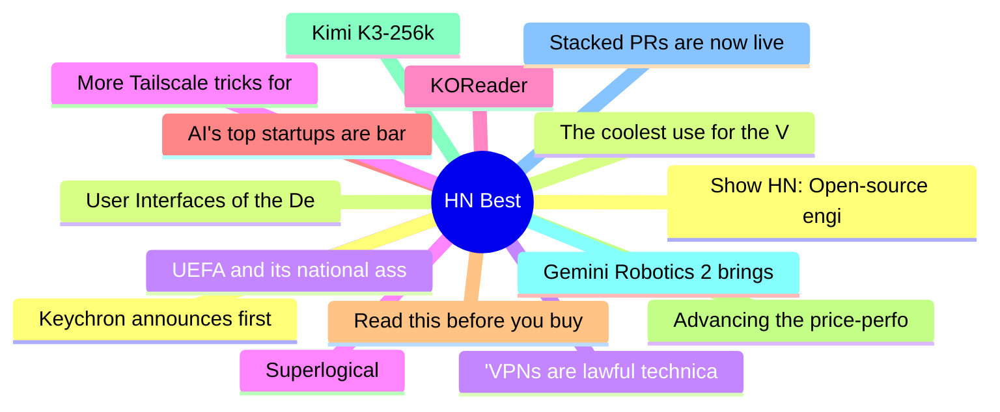

# HackerNews Best (高赞) Top 15 (2026-07-31)

## 思维导图

## 列表（15 条）

### 1. Show HN: Open-source engine running Gemma 4 26B in 2 GB RAM on any M-series Mac
- **链接**: [https://github.com/drumih/turbo-fieldfare](https://github.com/drumih/turbo-fieldfare)
- **分数**: 883 | **评论**: 320 | **作者**: gitpusher42
- **HN**: https://news.ycombinator.com/item?id=49098510

### 2. The coolest use for the Vision Pro
- **链接**: [https://christianselig.com/2026/07/vision-pro-house/](https://christianselig.com/2026/07/vision-pro-house/)
- **分数**: 809 | **评论**: 305 | **作者**: robbiet480
- **HN**: https://news.ycombinator.com/item?id=49102774

### 3. UEFA and its national associations will not participate in FIFA competitions
- **链接**: [https://www.uefa.com/news-media/news/02a7-213a92896eb0-54dfbf454e3b-1000--statement-on-behalf-of-uefa-and-its-55-national-associations/](https://www.uefa.com/news-media/news/02a7-213a92896eb0-54dfbf454e3b-1000--statement-on-behalf-of-uefa-and-its-55-national-associations/)
- **分数**: 792 | **评论**: 436 | **作者**: dickfickling
- **HN**: https://news.ycombinator.com/item?id=49113929

### 4. Superlogical
- **链接**: [https://www.superlogical.com/](https://www.superlogical.com/)
- **分数**: 759 | **评论**: 450 | **作者**: yan
- **HN**: https://news.ycombinator.com/item?id=49098965

### 5. KOReader
- **链接**: [https://koreader.rocks/](https://koreader.rocks/)
- **分数**: 736 | **评论**: 240 | **作者**: Cider9986
- **HN**: https://news.ycombinator.com/item?id=49095865

### 6. AI's top startups are barely publishing their research
- **链接**: [https://www.science.org/content/article/ai-s-top-startups-are-barely-publishing-their-research](https://www.science.org/content/article/ai-s-top-startups-are-barely-publishing-their-research)
- **分数**: 593 | **评论**: 313 | **作者**: YeGoblynQueenne
- **HN**: https://news.ycombinator.com/item?id=49103285

### 7. Read this before you buy that TV streaming stick
- **链接**: [https://krebsonsecurity.com/2026/07/read-this-before-you-buy-that-tv-streaming-stick/](https://krebsonsecurity.com/2026/07/read-this-before-you-buy-that-tv-streaming-stick/)
- **分数**: 572 | **评论**: 338 | **作者**: speckx
- **HN**: https://news.ycombinator.com/item?id=49112744

### 8. Advancing the price-performance frontier with GPT‑5.6
- **链接**: [https://openai.com/index/advancing-the-price-performance-frontier-with-gpt-5-6/](https://openai.com/index/advancing-the-price-performance-frontier-with-gpt-5-6/)
- **分数**: 497 | **评论**: 326 | **作者**: tedsanders
- **HN**: https://news.ycombinator.com/item?id=49112867

### 9. Kimi K3-256k
- **链接**: [https://www.kimi.com/code/docs/en/kimi-code/models](https://www.kimi.com/code/docs/en/kimi-code/models)
- **分数**: 483 | **评论**: 151 | **作者**: monneyboi
- **HN**: https://news.ycombinator.com/item?id=49101852

### 10. Gemini Robotics 2 brings whole body intelligence to robots
- **链接**: [https://deepmind.google/blog/gemini-robotics-2-brings-whole-body-intelligence-to-robots/](https://deepmind.google/blog/gemini-robotics-2-brings-whole-body-intelligence-to-robots/)
- **分数**: 478 | **评论**: 394 | **作者**: ai2027
- **HN**: https://news.ycombinator.com/item?id=49111237

### 11. Stacked PRs are now live on GitHub
- **链接**: [https://github.blog/changelog/2026-07-30-stacked-pull-requests-are-now-in-public-preview/](https://github.blog/changelog/2026-07-30-stacked-pull-requests-are-now-in-public-preview/)
- **分数**: 469 | **评论**: 164 | **作者**: tomzorz
- **HN**: https://news.ycombinator.com/item?id=49112232

### 12. Keychron announces first open-source firmware for gaming mice
- **链接**: [https://www.digitalfoundry.net/news/2026/07/keychron-announces-first-open-source-firmware-for-gaming-mice](https://www.digitalfoundry.net/news/2026/07/keychron-announces-first-open-source-firmware-for-gaming-mice)
- **分数**: 433 | **评论**: 176 | **作者**: JLO64
- **HN**: https://news.ycombinator.com/item?id=49099715

### 13. User Interfaces of the Demo Scene
- **链接**: [https://www.datagubbe.se/scenegui/](https://www.datagubbe.se/scenegui/)
- **分数**: 429 | **评论**: 74 | **作者**: zdw
- **HN**: https://news.ycombinator.com/item?id=49093434

### 14. 'VPNs are lawful technical tools,' says EU Court in landmark copyright ruling
- **链接**: [https://remysharp.com/links/2026-07-23-35890312](https://remysharp.com/links/2026-07-23-35890312)
- **分数**: 426 | **评论**: 164 | **作者**: speckx
- **HN**: https://news.ycombinator.com/item?id=49109440

### 15. More Tailscale tricks for your jailbroken Kindle
- **链接**: [https://tailscale.com/blog/jailbroken-kindle-proxy-tun-modes](https://tailscale.com/blog/jailbroken-kindle-proxy-tun-modes)
- **分数**: 404 | **评论**: 110 | **作者**: Error6571
- **HN**: https://news.ycombinator.com/item?id=49093569
