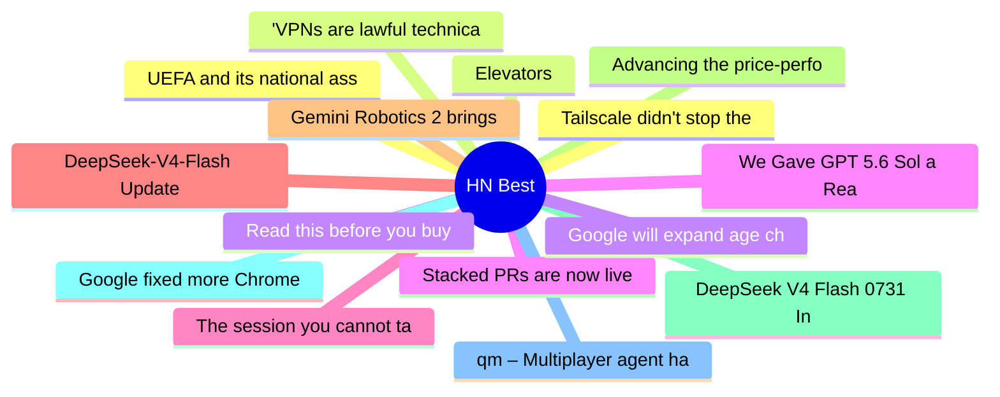

# HackerNews Best (高赞) Top 15 (2026-08-01)

## 思维导图

## 列表（15 条）

### 1. UEFA and its national associations will not participate in FIFA competitions
- **链接**: [https://www.uefa.com/news-media/news/02a7-213a92896eb0-54dfbf454e3b-1000--statement-on-behalf-of-uefa-and-its-55-national-associations/](https://www.uefa.com/news-media/news/02a7-213a92896eb0-54dfbf454e3b-1000--statement-on-behalf-of-uefa-and-its-55-national-associations/)
- **分数**: 1196 | **评论**: 657 | **作者**: dickfickling
- **HN**: https://news.ycombinator.com/item?id=49113929

### 2. Elevators
- **链接**: [https://john.fun/elevators](https://john.fun/elevators)
- **分数**: 884 | **评论**: 221 | **作者**: Jrh0203
- **HN**: https://news.ycombinator.com/item?id=49124218

### 3. Read this before you buy that TV streaming stick
- **链接**: [https://krebsonsecurity.com/2026/07/read-this-before-you-buy-that-tv-streaming-stick/](https://krebsonsecurity.com/2026/07/read-this-before-you-buy-that-tv-streaming-stick/)
- **分数**: 792 | **评论**: 526 | **作者**: speckx
- **HN**: https://news.ycombinator.com/item?id=49112744

### 4. Stacked PRs are now live on GitHub
- **链接**: [https://github.blog/changelog/2026-07-30-stacked-pull-requests-are-now-in-public-preview/](https://github.blog/changelog/2026-07-30-stacked-pull-requests-are-now-in-public-preview/)
- **分数**: 760 | **评论**: 284 | **作者**: tomzorz
- **HN**: https://news.ycombinator.com/item?id=49112232

### 5. The session you cannot take with you
- **链接**: [https://earendil.com/posts/session-portability/](https://earendil.com/posts/session-portability/)
- **分数**: 733 | **评论**: 212 | **作者**: apitman
- **HN**: https://news.ycombinator.com/item?id=49118781

### 6. DeepSeek-V4-Flash Update
- **链接**: [https://api-docs.deepseek.com/updates/](https://api-docs.deepseek.com/updates/)
- **分数**: 675 | **评论**: 324 | **作者**: dnhkng
- **HN**: https://news.ycombinator.com/item?id=49119559

### 7. Gemini Robotics 2 brings whole body intelligence to robots
- **链接**: [https://deepmind.google/blog/gemini-robotics-2-brings-whole-body-intelligence-to-robots/](https://deepmind.google/blog/gemini-robotics-2-brings-whole-body-intelligence-to-robots/)
- **分数**: 609 | **评论**: 513 | **作者**: ai2027
- **HN**: https://news.ycombinator.com/item?id=49111237

### 8. Advancing the price-performance frontier with GPT‑5.6
- **链接**: [https://openai.com/index/advancing-the-price-performance-frontier-with-gpt-5-6/](https://openai.com/index/advancing-the-price-performance-frontier-with-gpt-5-6/)
- **分数**: 599 | **评论**: 392 | **作者**: tedsanders
- **HN**: https://news.ycombinator.com/item?id=49112867

### 9. DeepSeek V4 Flash 0731 Intelligence, Performance and Price Analysis
- **链接**: [https://artificialanalysis.ai/models/deepseek-v4-flash](https://artificialanalysis.ai/models/deepseek-v4-flash)
- **分数**: 535 | **评论**: 291 | **作者**: theanonymousone
- **HN**: https://news.ycombinator.com/item?id=49120299

### 10. Google fixed more Chrome bugs in June than over the past two years, thanks to AI
- **链接**: [https://blog.google/security/chrome-stronger-with-every-update/](https://blog.google/security/chrome-stronger-with-every-update/)
- **分数**: 483 | **评论**: 490 | **作者**: Garbage
- **HN**: https://news.ycombinator.com/item?id=49120097

### 11. qm – Multiplayer agent harness for work
- **链接**: [https://github.com/yc-software/qm](https://github.com/yc-software/qm)
- **分数**: 465 | **评论**: 99 | **作者**: tosh
- **HN**: https://news.ycombinator.com/item?id=49126604

### 12. Tailscale didn't stop the Hugging Face intrusion
- **链接**: [https://tailscale.com/blog/hugging-face-intrusion](https://tailscale.com/blog/hugging-face-intrusion)
- **分数**: 463 | **评论**: 173 | **作者**: bluehatbrit
- **HN**: https://news.ycombinator.com/item?id=49127306

### 13. 'VPNs are lawful technical tools,' says EU Court in landmark copyright ruling
- **链接**: [https://remysharp.com/links/2026-07-23-35890312](https://remysharp.com/links/2026-07-23-35890312)
- **分数**: 432 | **评论**: 170 | **作者**: speckx
- **HN**: https://news.ycombinator.com/item?id=49109440

### 14. Google will expand age checks on Android worldwide till the end of the year
- **链接**: [https://android-developers.googleblog.com/2026/07/google-play-age-signals-api-safer-experiences.html](https://android-developers.googleblog.com/2026/07/google-play-age-signals-api-safer-experiences.html)
- **分数**: 414 | **评论**: 508 | **作者**: dmantis
- **HN**: https://news.ycombinator.com/item?id=49107950

### 15. We Gave GPT 5.6 Sol a Real Business. It Lied, Spammed, and Lost $447
- **链接**: [https://www.bottlenecklabs.com/blog/autonomously-run-businesses](https://www.bottlenecklabs.com/blog/autonomously-run-businesses)
- **分数**: 391 | **评论**: 233 | **作者**: Areibman
- **HN**: https://news.ycombinator.com/item?id=49113059
