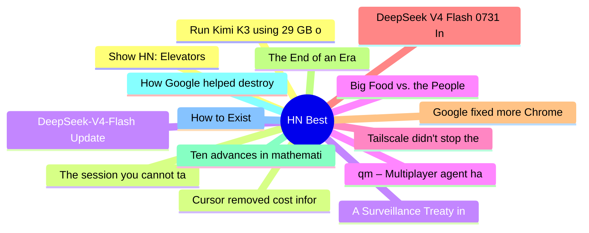

# HackerNews Best (高赞) Top 15 (2026-08-02)

## 思维导图

## 列表（15 条）

### 1. Show HN: Elevators
- **链接**: [https://john.fun/elevators](https://john.fun/elevators)
- **分数**: 1581 | **评论**: 387 | **作者**: Jrh0203
- **HN**: https://news.ycombinator.com/item?id=49124218

### 2. The session you cannot take with you
- **链接**: [https://earendil.com/posts/session-portability/](https://earendil.com/posts/session-portability/)
- **分数**: 760 | **评论**: 218 | **作者**: apitman
- **HN**: https://news.ycombinator.com/item?id=49118781

### 3. DeepSeek-V4-Flash Update
- **链接**: [https://api-docs.deepseek.com/updates/](https://api-docs.deepseek.com/updates/)
- **分数**: 728 | **评论**: 343 | **作者**: dnhkng
- **HN**: https://news.ycombinator.com/item?id=49119559

### 4. qm – Multiplayer agent harness for work
- **链接**: [https://github.com/yc-software/qm](https://github.com/yc-software/qm)
- **分数**: 650 | **评论**: 152 | **作者**: tosh
- **HN**: https://news.ycombinator.com/item?id=49126604

### 5. Tailscale didn't stop the Hugging Face intrusion
- **链接**: [https://tailscale.com/blog/hugging-face-intrusion](https://tailscale.com/blog/hugging-face-intrusion)
- **分数**: 595 | **评论**: 215 | **作者**: bluehatbrit
- **HN**: https://news.ycombinator.com/item?id=49127306

### 6. DeepSeek V4 Flash 0731 Intelligence, Performance and Price Analysis
- **链接**: [https://artificialanalysis.ai/models/deepseek-v4-flash](https://artificialanalysis.ai/models/deepseek-v4-flash)
- **分数**: 580 | **评论**: 311 | **作者**: theanonymousone
- **HN**: https://news.ycombinator.com/item?id=49120299

### 7. Google fixed more Chrome bugs in June than over the past two years, thanks to AI
- **链接**: [https://blog.google/security/chrome-stronger-with-every-update/](https://blog.google/security/chrome-stronger-with-every-update/)
- **分数**: 556 | **评论**: 603 | **作者**: Garbage
- **HN**: https://news.ycombinator.com/item?id=49120097

### 8. The End of an Era
- **链接**: [https://hughhowey.com/the-end-of-an-era/](https://hughhowey.com/the-end-of-an-era/)
- **分数**: 430 | **评论**: 440 | **作者**: harscoat
- **HN**: https://news.ycombinator.com/item?id=49121980

### 9. Ten advances in mathematics and theoretical computer science
- **链接**: [https://openai.com/index/ten-advances-in-mathematics/](https://openai.com/index/ten-advances-in-mathematics/)
- **分数**: 416 | **评论**: 280 | **作者**: milkshakes
- **HN**: https://news.ycombinator.com/item?id=49132058

### 10. How Google helped destroy adoption of RSS feeds (2023)
- **链接**: [https://openrss.org/blog/how-google-helped-destroy-adoption-of-rss-feeds](https://openrss.org/blog/how-google-helped-destroy-adoption-of-rss-feeds)
- **分数**: 403 | **评论**: 142 | **作者**: pudgywalsh
- **HN**: https://news.ycombinator.com/item?id=49136821

### 11. How to Exist
- **链接**: [https://www.raptitude.com/2026/07/how-to-exist/](https://www.raptitude.com/2026/07/how-to-exist/)
- **分数**: 371 | **评论**: 233 | **作者**: walterbell
- **HN**: https://news.ycombinator.com/item?id=49129990

### 12. Run Kimi K3 using 29 GB of RAM at 0.50 tok/s
- **链接**: [https://github.com/sqliteai/waste](https://github.com/sqliteai/waste)
- **分数**: 325 | **评论**: 160 | **作者**: marcobambini
- **HN**: https://news.ycombinator.com/item?id=49123386

### 13. Cursor removed cost information from the usage page and CSV export
- **链接**: [https://forum.cursor.com/t/usage-page-to-token-amount-what/167153](https://forum.cursor.com/t/usage-page-to-token-amount-what/167153)
- **分数**: 309 | **评论**: 142 | **作者**: EugeneOZ
- **HN**: https://news.ycombinator.com/item?id=49135257

### 14. A Surveillance Treaty in Disguise: Canada Signs UN Cybercrime Convention
- **链接**: [https://www.michaelgeist.ca/2026/07/a-surveillance-treaty-in-disguise-the-trouble-with-canadas-quiet-decision-to-sign-the-un-cybercrime-convention/](https://www.michaelgeist.ca/2026/07/a-surveillance-treaty-in-disguise-the-trouble-with-canadas-quiet-decision-to-sign-the-un-cybercrime-convention/)
- **分数**: 275 | **评论**: 149 | **作者**: iamnothere
- **HN**: https://news.ycombinator.com/item?id=49134694

### 15. Big Food vs. the People
- **链接**: [https://www.lighthousereports.com/investigation/big-food-vs-the-people/](https://www.lighthousereports.com/investigation/big-food-vs-the-people/)
- **分数**: 264 | **评论**: 172 | **作者**: jruohonen
- **HN**: https://news.ycombinator.com/item?id=49124858
