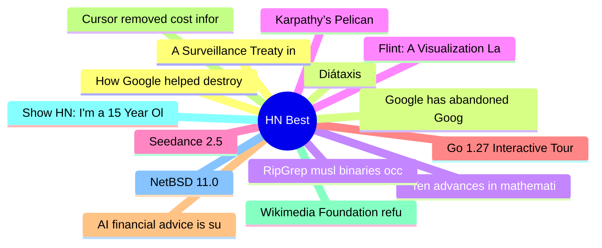

# HackerNews Best (高赞) Top 15 (2026-08-03)

## 思维导图

## 列表（15 条）

### 1. How Google helped destroy adoption of RSS feeds (2023)
- **链接**: [https://openrss.org/blog/how-google-helped-destroy-adoption-of-rss-feeds](https://openrss.org/blog/how-google-helped-destroy-adoption-of-rss-feeds)
- **分数**: 605 | **评论**: 231 | **作者**: pudgywalsh
- **HN**: https://news.ycombinator.com/item?id=49136821

### 2. Diátaxis
- **链接**: [https://diataxis.fr/](https://diataxis.fr/)
- **分数**: 529 | **评论**: 58 | **作者**: ryanseys
- **HN**: https://news.ycombinator.com/item?id=49138188

### 3. Ten advances in mathematics and theoretical computer science
- **链接**: [https://openai.com/index/ten-advances-in-mathematics/](https://openai.com/index/ten-advances-in-mathematics/)
- **分数**: 451 | **评论**: 323 | **作者**: milkshakes
- **HN**: https://news.ycombinator.com/item?id=49132058

### 4. Karpathy’s Pelican
- **链接**: [https://twitter.com/karpathy/status/2083749667410727319](https://twitter.com/karpathy/status/2083749667410727319)
- **分数**: 440 | **评论**: 341 | **作者**: delichon
- **HN**: https://news.ycombinator.com/item?id=49140998

### 5. Seedance 2.5
- **链接**: [https://seed.bytedance.com/en/blog/one-take-creation-flexible-referencing-introducing-seedance-2-5](https://seed.bytedance.com/en/blog/one-take-creation-flexible-referencing-introducing-seedance-2-5)
- **分数**: 426 | **评论**: 250 | **作者**: njaremko
- **HN**: https://news.ycombinator.com/item?id=49138302

### 6. Go 1.27 Interactive Tour
- **链接**: [https://victoriametrics.com/blog/go-1-27/index.html](https://victoriametrics.com/blog/go-1-27/index.html)
- **分数**: 344 | **评论**: 176 | **作者**: Hixon10
- **HN**: https://news.ycombinator.com/item?id=49140218

### 7. AI financial advice is surprisingly good, especially if you ask right questions
- **链接**: [https://mitsloan.mit.edu/ideas-made-to-matter/ai-financial-advice-surprisingly-good-especially-if-you-ask-right-questions](https://mitsloan.mit.edu/ideas-made-to-matter/ai-financial-advice-surprisingly-good-especially-if-you-ask-right-questions)
- **分数**: 335 | **评论**: 376 | **作者**: foxtrot8672
- **HN**: https://news.ycombinator.com/item?id=49139102

### 8. Cursor removed cost information from the usage page and CSV export
- **链接**: [https://forum.cursor.com/t/usage-page-to-token-amount-what/167153](https://forum.cursor.com/t/usage-page-to-token-amount-what/167153)
- **分数**: 331 | **评论**: 153 | **作者**: EugeneOZ
- **HN**: https://news.ycombinator.com/item?id=49135257

### 9. Wikimedia Foundation refuses union recognition, hires union-busting law firm
- **链接**: [https://en.wikipedia.org/wiki/Wikipedia:Wikipedia_Signpost/2026-08-02/News_and_notes](https://en.wikipedia.org/wiki/Wikipedia:Wikipedia_Signpost/2026-08-02/News_and_notes)
- **分数**: 325 | **评论**: 308 | **作者**: akolbe
- **HN**: https://news.ycombinator.com/item?id=49143414

### 10. Show HN: I'm a 15 Year Old Wannabe Engineer, This Is a Cycloidal Gearbox I Built
- **链接**: [https://github.com/tom-ilan/cycloidal_gearbox](https://github.com/tom-ilan/cycloidal_gearbox)
- **分数**: 319 | **评论**: 102 | **作者**: tomilan
- **HN**: https://news.ycombinator.com/item?id=49140396

### 11. NetBSD 11.0
- **链接**: [https://blog.netbsd.org/tnf/entry/netbsd_11_0_released](https://blog.netbsd.org/tnf/entry/netbsd_11_0_released)
- **分数**: 309 | **评论**: 151 | **作者**: jaypatelani
- **HN**: https://news.ycombinator.com/item?id=49136736

### 12. A Surveillance Treaty in Disguise: Canada Signs UN Cybercrime Convention
- **链接**: [https://www.michaelgeist.ca/2026/07/a-surveillance-treaty-in-disguise-the-trouble-with-canadas-quiet-decision-to-sign-the-un-cybercrime-convention/](https://www.michaelgeist.ca/2026/07/a-surveillance-treaty-in-disguise-the-trouble-with-canadas-quiet-decision-to-sign-the-un-cybercrime-convention/)
- **分数**: 302 | **评论**: 161 | **作者**: iamnothere
- **HN**: https://news.ycombinator.com/item?id=49134694

### 13. Google has abandoned Google News?
- **链接**: [https://elgan.com/google-news-is-just-forrest-gumps-shrimp-boat-now](https://elgan.com/google-news-is-just-forrest-gumps-shrimp-boat-now)
- **分数**: 280 | **评论**: 204 | **作者**: mikelgan
- **HN**: https://news.ycombinator.com/item?id=49137681

### 14. RipGrep musl binaries occasionally segfault during very-large searches
- **链接**: [https://github.com/BurntSushi/ripgrep/issues/3494](https://github.com/BurntSushi/ripgrep/issues/3494)
- **分数**: 278 | **评论**: 193 | **作者**: throwaway2037
- **HN**: https://news.ycombinator.com/item?id=49133889

### 15. Flint: A Visualization Language for the AI Era
- **链接**: [https://microsoft.github.io/flint-chart/](https://microsoft.github.io/flint-chart/)
- **分数**: 270 | **评论**: 68 | **作者**: vinhnx
- **HN**: https://news.ycombinator.com/item?id=49130604
