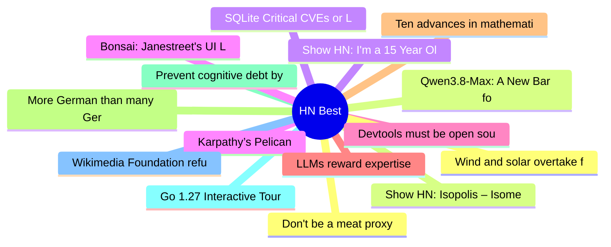

# HackerNews Best (高赞) Top 15 (2026-08-04)

## 思维导图

## 列表（15 条）

### 1. Don't be a meat proxy
- **链接**: [https://gruhn.me/blog/2026-08-03/](https://gruhn.me/blog/2026-08-03/)
- **分数**: 1697 | **评论**: 691 | **作者**: ngruhn
- **HN**: https://news.ycombinator.com/item?id=49151933

### 2. Qwen3.8-Max: A New Bar for Coding and Cowork
- **链接**: [https://qwen.ai/blog?id=qwen3.8](https://qwen.ai/blog?id=qwen3.8)
- **分数**: 1055 | **评论**: 567 | **作者**: ai2027
- **HN**: https://news.ycombinator.com/item?id=49150470

### 3. SQLite Critical CVEs or LLM Slop?
- **链接**: [https://research.jfrog.com/post/sqlite-critical-cves-or-llm-slops/](https://research.jfrog.com/post/sqlite-critical-cves-or-llm-slops/)
- **分数**: 699 | **评论**: 350 | **作者**: ymir_e
- **HN**: https://news.ycombinator.com/item?id=49154332

### 4. Karpathy’s Pelican
- **链接**: [https://twitter.com/karpathy/status/2083749667410727319](https://twitter.com/karpathy/status/2083749667410727319)
- **分数**: 608 | **评论**: 423 | **作者**: delichon
- **HN**: https://news.ycombinator.com/item?id=49140998

### 5. Devtools must be open source
- **链接**: [https://blog.exe.dev/devtools-must-be-open-source](https://blog.exe.dev/devtools-must-be-open-source)
- **分数**: 504 | **评论**: 179 | **作者**: bryanmikaelian
- **HN**: https://news.ycombinator.com/item?id=49156111

### 6. LLMs reward expertise
- **链接**: [https://www.seangoedecke.com/llms-reward-expertise/](https://www.seangoedecke.com/llms-reward-expertise/)
- **分数**: 454 | **评论**: 196 | **作者**: MaxMussio
- **HN**: https://news.ycombinator.com/item?id=49161518

### 7. Ten advances in mathematics and theoretical computer science
- **链接**: [https://openai.com/index/ten-advances-in-mathematics/](https://openai.com/index/ten-advances-in-mathematics/)
- **分数**: 436 | **评论**: 716 | **作者**: milkshakes
- **HN**: https://news.ycombinator.com/item?id=49157930

### 8. More German than many Germans
- **链接**: [https://mertbulan.com/more-german-than-many-germans/](https://mertbulan.com/more-german-than-many-germans/)
- **分数**: 403 | **评论**: 307 | **作者**: mertbio
- **HN**: https://news.ycombinator.com/item?id=49151734

### 9. Prevent cognitive debt by manually retyping LLM-generated code
- **链接**: [https://ankursethi.com/blog/prevent-cognitive-debt-by-manually-retyping-llm-generated-code/](https://ankursethi.com/blog/prevent-cognitive-debt-by-manually-retyping-llm-generated-code/)
- **分数**: 386 | **评论**: 329 | **作者**: mpweiher
- **HN**: https://news.ycombinator.com/item?id=49153374

### 10. Go 1.27 Interactive Tour
- **链接**: [https://victoriametrics.com/blog/go-1-27/index.html](https://victoriametrics.com/blog/go-1-27/index.html)
- **分数**: 360 | **评论**: 195 | **作者**: Hixon10
- **HN**: https://news.ycombinator.com/item?id=49140218

### 11. Wikimedia Foundation refuses union recognition, hires union-busting law firm
- **链接**: [https://en.wikipedia.org/wiki/Wikipedia:Wikipedia_Signpost/2026-08-02/News_and_notes](https://en.wikipedia.org/wiki/Wikipedia:Wikipedia_Signpost/2026-08-02/News_and_notes)
- **分数**: 348 | **评论**: 341 | **作者**: akolbe
- **HN**: https://news.ycombinator.com/item?id=49143414

### 12. Wind and solar overtake fossil fuels in Germany for the first time
- **链接**: [https://www.intellinews.com/wind-and-solar-overtake-fossil-fuels-in-germany-for-the-first-time-ever-458379/](https://www.intellinews.com/wind-and-solar-overtake-fossil-fuels-in-germany-for-the-first-time-ever-458379/)
- **分数**: 338 | **评论**: 265 | **作者**: just_some_user
- **HN**: https://news.ycombinator.com/item?id=49155359

### 13. Show HN: Isopolis – Isometric pixel map of SF
- **链接**: [https://sf.isopolis.city/](https://sf.isopolis.city/)
- **分数**: 333 | **评论**: 75 | **作者**: nuwandavek
- **HN**: https://news.ycombinator.com/item?id=49149966

### 14. Show HN: I'm a 15 Year Old Wannabe Engineer, This Is a Cycloidal Gearbox I Built
- **链接**: [https://github.com/tom-ilan/cycloidal_gearbox](https://github.com/tom-ilan/cycloidal_gearbox)
- **分数**: 331 | **评论**: 111 | **作者**: tomilan
- **HN**: https://news.ycombinator.com/item?id=49140396

### 15. Bonsai: Janestreet's UI Library
- **链接**: [https://github.com/janestreet/bonsai](https://github.com/janestreet/bonsai)
- **分数**: 305 | **评论**: 126 | **作者**: KolmogorovComp
- **HN**: https://news.ycombinator.com/item?id=49152842
