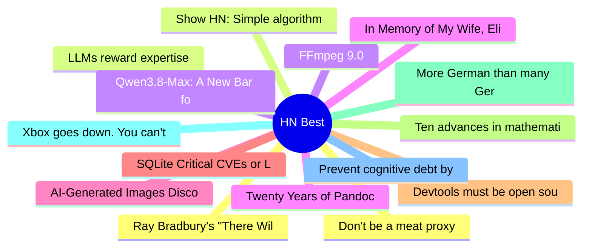

# HackerNews Best (高赞) Top 15 (2026-08-05)

## 思维导图

## 列表（15 条）

### 1. Don't be a meat proxy
- **链接**: [https://gruhn.me/blog/2026-08-03/](https://gruhn.me/blog/2026-08-03/)
- **分数**: 1785 | **评论**: 715 | **作者**: ngruhn
- **HN**: https://news.ycombinator.com/item?id=49151933

### 2. LLMs reward expertise
- **链接**: [https://www.seangoedecke.com/llms-reward-expertise/](https://www.seangoedecke.com/llms-reward-expertise/)
- **分数**: 1324 | **评论**: 551 | **作者**: MaxMussio
- **HN**: https://news.ycombinator.com/item?id=49161518

### 3. Qwen3.8-Max: A New Bar for Coding and Cowork
- **链接**: [https://qwen.ai/blog?id=qwen3.8](https://qwen.ai/blog?id=qwen3.8)
- **分数**: 1098 | **评论**: 600 | **作者**: ai2027
- **HN**: https://news.ycombinator.com/item?id=49150470

### 4. In Memory of My Wife, Elise Cawley, with Thanks for 36 Wonderful Years
- **链接**: [https://writings.stephenwolfram.com/2026/08/in-memory-of-my-wife-elise-cawley-1961-2026-with-thanks-for-36-wonderful-years/](https://writings.stephenwolfram.com/2026/08/in-memory-of-my-wife-elise-cawley-1961-2026-with-thanks-for-36-wonderful-years/)
- **分数**: 939 | **评论**: 53 | **作者**: jdcampolargo
- **HN**: https://news.ycombinator.com/item?id=49173165

### 5. AI-Generated Images Discourage Me from Reading Your Blog
- **链接**: [https://nelson.cloud/ai-generated-images-discourage-me-from-reading-your-blog/](https://nelson.cloud/ai-generated-images-discourage-me-from-reading-your-blog/)
- **分数**: 734 | **评论**: 436 | **作者**: meysamazad
- **HN**: https://news.ycombinator.com/item?id=49167113

### 6. SQLite Critical CVEs or LLM Slop?
- **链接**: [https://research.jfrog.com/post/sqlite-critical-cves-or-llm-slops/](https://research.jfrog.com/post/sqlite-critical-cves-or-llm-slops/)
- **分数**: 721 | **评论**: 370 | **作者**: ymir_e
- **HN**: https://news.ycombinator.com/item?id=49154332

### 7. Devtools must be open source
- **链接**: [https://blog.exe.dev/devtools-must-be-open-source](https://blog.exe.dev/devtools-must-be-open-source)
- **分数**: 705 | **评论**: 231 | **作者**: bryanmikaelian
- **HN**: https://news.ycombinator.com/item?id=49156111

### 8. Ten advances in mathematics and theoretical computer science
- **链接**: [https://openai.com/index/ten-advances-in-mathematics/](https://openai.com/index/ten-advances-in-mathematics/)
- **分数**: 613 | **评论**: 911 | **作者**: milkshakes
- **HN**: https://news.ycombinator.com/item?id=49157930

### 9. More German than many Germans
- **链接**: [https://mertbulan.com/more-german-than-many-germans/](https://mertbulan.com/more-german-than-many-germans/)
- **分数**: 604 | **评论**: 463 | **作者**: mertbio
- **HN**: https://news.ycombinator.com/item?id=49151734

### 10. Xbox goes down. You can't play games you own on disc
- **链接**: [https://birchtree.me/blog/xbox-goes-down-you-cant-play-games-you-own-on-disc/](https://birchtree.me/blog/xbox-goes-down-you-cant-play-games-you-own-on-disc/)
- **分数**: 591 | **评论**: 632 | **作者**: surprisetalk
- **HN**: https://news.ycombinator.com/item?id=49167448

### 11. Prevent cognitive debt by manually retyping LLM-generated code
- **链接**: [https://ankursethi.com/blog/prevent-cognitive-debt-by-manually-retyping-llm-generated-code/](https://ankursethi.com/blog/prevent-cognitive-debt-by-manually-retyping-llm-generated-code/)
- **分数**: 526 | **评论**: 435 | **作者**: mpweiher
- **HN**: https://news.ycombinator.com/item?id=49153374

### 12. Ray Bradbury's "There Will Come Soft Rains" is set today (2026-08-04)
- **链接**: [https://short-stories.co/@raybradbury/there-will-come-soft-rains-6k8vr4xxlnmj](https://short-stories.co/@raybradbury/there-will-come-soft-rains-6k8vr4xxlnmj)
- **分数**: 496 | **评论**: 6 | **作者**: askvictor
- **HN**: https://news.ycombinator.com/item?id=49166491

### 13. Show HN: Simple algorithm and color space to generate diverse skin tones
- **链接**: [https://toneyalexander.github.io/inclusive-color-space/](https://toneyalexander.github.io/inclusive-color-space/)
- **分数**: 467 | **评论**: 88 | **作者**: automatoney
- **HN**: https://news.ycombinator.com/item?id=49170165

### 14. FFmpeg 9.0
- **链接**: [https://github.com/FFmpeg/FFmpeg/blob/n9.0/RELEASE_NOTES](https://github.com/FFmpeg/FFmpeg/blob/n9.0/RELEASE_NOTES)
- **分数**: 426 | **评论**: 94 | **作者**: gyan
- **HN**: https://news.ycombinator.com/item?id=49166202

### 15. Twenty Years of Pandoc
- **链接**: [https://pandoc.org/twenty-years-of-pandoc.html](https://pandoc.org/twenty-years-of-pandoc.html)
- **分数**: 389 | **评论**: 49 | **作者**: fiddlosopher
- **HN**: https://news.ycombinator.com/item?id=49156750
