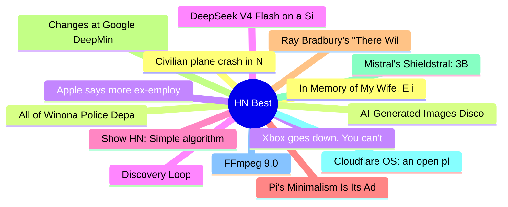

# HackerNews Best (高赞) Top 15 (2026-08-06)

## 思维导图

## 列表（15 条）

### 1. In Memory of My Wife, Elise Cawley, with Thanks for 36 Wonderful Years
- **链接**: [https://writings.stephenwolfram.com/2026/08/in-memory-of-my-wife-elise-cawley-1961-2026-with-thanks-for-36-wonderful-years/](https://writings.stephenwolfram.com/2026/08/in-memory-of-my-wife-elise-cawley-1961-2026-with-thanks-for-36-wonderful-years/)
- **分数**: 1591 | **评论**: 93 | **作者**: jdcampolargo
- **HN**: https://news.ycombinator.com/item?id=49173165

### 2. AI-Generated Images Discourage Me from Reading Your Blog
- **链接**: [https://nelson.cloud/ai-generated-images-discourage-me-from-reading-your-blog/](https://nelson.cloud/ai-generated-images-discourage-me-from-reading-your-blog/)
- **分数**: 781 | **评论**: 460 | **作者**: meysamazad
- **HN**: https://news.ycombinator.com/item?id=49167113

### 3. Xbox goes down. You can't play games you own on disc
- **链接**: [https://birchtree.me/blog/xbox-goes-down-you-cant-play-games-you-own-on-disc/](https://birchtree.me/blog/xbox-goes-down-you-cant-play-games-you-own-on-disc/)
- **分数**: 698 | **评论**: 749 | **作者**: surprisetalk
- **HN**: https://news.ycombinator.com/item?id=49167448

### 4. Discovery Loop
- **链接**: [https://www.discoveryloop.com/](https://www.discoveryloop.com/)
- **分数**: 600 | **评论**: 383 | **作者**: xtreak29
- **HN**: https://news.ycombinator.com/item?id=49184960

### 5. Show HN: Simple algorithm and color space to generate diverse skin tones
- **链接**: [https://toneyalexander.github.io/inclusive-color-space/](https://toneyalexander.github.io/inclusive-color-space/)
- **分数**: 600 | **评论**: 98 | **作者**: automatoney
- **HN**: https://news.ycombinator.com/item?id=49170165

### 6. Pi's Minimalism Is Its Advantage
- **链接**: [https://earendil.com/posts/pi-autoresearch-and-databricks/](https://earendil.com/posts/pi-autoresearch-and-databricks/)
- **分数**: 512 | **评论**: 276 | **作者**: luispa
- **HN**: https://news.ycombinator.com/item?id=49176038

### 7. Ray Bradbury's "There Will Come Soft Rains" is set today (2026-08-04)
- **链接**: [https://short-stories.co/@raybradbury/there-will-come-soft-rains-6k8vr4xxlnmj](https://short-stories.co/@raybradbury/there-will-come-soft-rains-6k8vr4xxlnmj)
- **分数**: 500 | **评论**: 6 | **作者**: askvictor
- **HN**: https://news.ycombinator.com/item?id=49166491

### 8. Changes at Google DeepMind: Demis Hassabis from CEO to Chair, Jeff Dean departs
- **链接**: [https://blog.google/company-news/inside-google/message-ceo/next-chapter-ai-momentum/](https://blog.google/company-news/inside-google/message-ceo/next-chapter-ai-momentum/)
- **分数**: 477 | **评论**: 593 | **作者**: colesantiago
- **HN**: https://news.ycombinator.com/item?id=49184755

### 9. Mistral's Shieldstral: 3B open-weights model for multimodal moderation
- **链接**: [https://mistral.ai/news/shieldstral/](https://mistral.ai/news/shieldstral/)
- **分数**: 475 | **评论**: 128 | **作者**: riadsila
- **HN**: https://news.ycombinator.com/item?id=49171268

### 10. Cloudflare OS: an open platform for agents, apps, and work
- **链接**: [https://blog.cloudflare.com/cloudflare-os/](https://blog.cloudflare.com/cloudflare-os/)
- **分数**: 472 | **评论**: 237 | **作者**: speckx
- **HN**: https://news.ycombinator.com/item?id=49182996

### 11. FFmpeg 9.0
- **链接**: [https://github.com/FFmpeg/FFmpeg/blob/n9.0/RELEASE_NOTES](https://github.com/FFmpeg/FFmpeg/blob/n9.0/RELEASE_NOTES)
- **分数**: 456 | **评论**: 97 | **作者**: gyan
- **HN**: https://news.ycombinator.com/item?id=49166202

### 12. Civilian plane crash in New Mexico tied to military GPS blocking
- **链接**: [https://www.wired.com/story/a-civilian-plane-crashed-in-new-mexico-was-the-militarys-tech-to-blame/](https://www.wired.com/story/a-civilian-plane-crashed-in-new-mexico-was-the-militarys-tech-to-blame/)
- **分数**: 449 | **评论**: 241 | **作者**: dzdt
- **HN**: https://news.ycombinator.com/item?id=49181099

### 13. All of Winona Police Department's Flock cameras cut down and stolen
- **链接**: [https://www.valleynewslive.com/2026/08/04/every-flock-camera-winona-minnesota-cut-down-stolen-coordinated-theft/](https://www.valleynewslive.com/2026/08/04/every-flock-camera-winona-minnesota-cut-down-stolen-coordinated-theft/)
- **分数**: 385 | **评论**: 245 | **作者**: NDlurker
- **HN**: https://news.ycombinator.com/item?id=49171656

### 14. Apple says more ex-employees may have taken confidential data to OpenAI
- **链接**: [https://techcrunch.com/2026/08/04/apple-says-more-ex-employees-may-have-taken-confidential-data-to-openai/](https://techcrunch.com/2026/08/04/apple-says-more-ex-employees-may-have-taken-confidential-data-to-openai/)
- **分数**: 384 | **评论**: 281 | **作者**: thewebguyd
- **HN**: https://news.ycombinator.com/item?id=49170479

### 15. DeepSeek V4 Flash on a Single AMD MI300X
- **链接**: [https://github.com/ryanzhou/deepseek-v4-flash-mi300x](https://github.com/ryanzhou/deepseek-v4-flash-mi300x)
- **分数**: 377 | **评论**: 104 | **作者**: zhoutong
- **HN**: https://news.ycombinator.com/item?id=49166386
