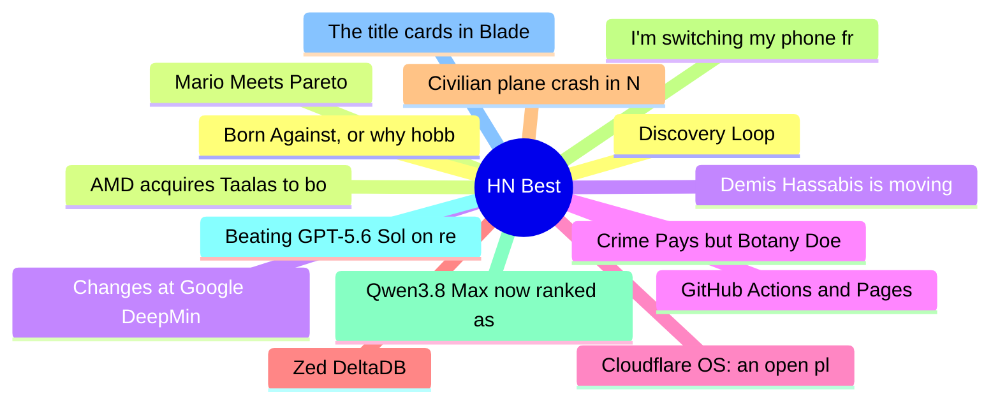

# HackerNews Best (高赞) Top 15 (2026-08-07)

## 思维导图

## 列表（15 条）

### 1. Discovery Loop
- **链接**: [https://www.discoveryloop.com/](https://www.discoveryloop.com/)
- **分数**: 913 | **评论**: 581 | **作者**: xtreak29
- **HN**: https://news.ycombinator.com/item?id=49184960

### 2. Mario Meets Pareto
- **链接**: [https://www.mayerowitz.io/blog/mario-meets-pareto](https://www.mayerowitz.io/blog/mario-meets-pareto)
- **分数**: 877 | **评论**: 150 | **作者**: theanonymousone
- **HN**: https://news.ycombinator.com/item?id=49195231

### 3. Changes at Google DeepMind: Demis Hassabis from CEO to Chair, Jeff Dean departs
- **链接**: [https://blog.google/company-news/inside-google/message-ceo/next-chapter-ai-momentum/](https://blog.google/company-news/inside-google/message-ceo/next-chapter-ai-momentum/)
- **分数**: 827 | **评论**: 885 | **作者**: colesantiago
- **HN**: https://news.ycombinator.com/item?id=49184755

### 4. Crime Pays but Botany Doesn't
- **链接**: [https://www.crimepaysbutbotanydoesnt.com/reading-list](https://www.crimepaysbutbotanydoesnt.com/reading-list)
- **分数**: 653 | **评论**: 203 | **作者**: DarkContinent
- **HN**: https://news.ycombinator.com/item?id=49192566

### 5. Cloudflare OS: an open platform for agents, apps, and work
- **链接**: [https://blog.cloudflare.com/cloudflare-os/](https://blog.cloudflare.com/cloudflare-os/)
- **分数**: 647 | **评论**: 318 | **作者**: speckx
- **HN**: https://news.ycombinator.com/item?id=49182996

### 6. Zed DeltaDB
- **链接**: [https://zed.dev/deltadb](https://zed.dev/deltadb)
- **分数**: 519 | **评论**: 302 | **作者**: ahamez
- **HN**: https://news.ycombinator.com/item?id=49187256

### 7. Civilian plane crash in New Mexico tied to military GPS blocking
- **链接**: [https://www.wired.com/story/a-civilian-plane-crashed-in-new-mexico-was-the-militarys-tech-to-blame/](https://www.wired.com/story/a-civilian-plane-crashed-in-new-mexico-was-the-militarys-tech-to-blame/)
- **分数**: 486 | **评论**: 266 | **作者**: dzdt
- **HN**: https://news.ycombinator.com/item?id=49181099

### 8. I'm switching my phone from Android to Linux
- **链接**: [https://runarcn.no/android-to-linux/](https://runarcn.no/android-to-linux/)
- **分数**: 436 | **评论**: 483 | **作者**: speckx
- **HN**: https://news.ycombinator.com/item?id=49188022

### 9. Qwen3.8 Max now ranked as the best overall model by agentic index
- **链接**: [https://artificialanalysis.ai/?intelligence=agentic-index](https://artificialanalysis.ai/?intelligence=agentic-index)
- **分数**: 430 | **评论**: 279 | **作者**: apitman
- **HN**: https://news.ycombinator.com/item?id=49200652

### 10. Beating GPT-5.6 Sol on retrieval with 100x cheaper open models
- **链接**: [https://neon.com/blog/how-castform-neon-beats-frontier-models-on-price-and-efficiency](https://neon.com/blog/how-castform-neon-beats-frontier-models-on-price-and-efficiency)
- **分数**: 424 | **评论**: 114 | **作者**: moonikakiss
- **HN**: https://news.ycombinator.com/item?id=49186762

### 11. The title cards in Blade Runner are amazing
- **链接**: [https://randsinrepose.com/archives/blade-runner-title-cards/](https://randsinrepose.com/archives/blade-runner-title-cards/)
- **分数**: 416 | **评论**: 203 | **作者**: ExMachina73
- **HN**: https://news.ycombinator.com/item?id=49189287

### 12. Born Against, or why hobby programming communities are against LLM usage
- **链接**: [https://blog.fogus.me/llm/born-against.html](https://blog.fogus.me/llm/born-against.html)
- **分数**: 408 | **评论**: 482 | **作者**: lladnar
- **HN**: https://news.ycombinator.com/item?id=49187061

### 13. AMD acquires Taalas to boost inference performance by etching models in silicon
- **链接**: [https://www.theregister.com/systems/2026/08/06/amd-acquires-ai-chip-startup-taalas-to-boost-inference-performance-by-etching-models-into-silicon/5284344](https://www.theregister.com/systems/2026/08/06/amd-acquires-ai-chip-startup-taalas-to-boost-inference-performance-by-etching-models-into-silicon/5284344)
- **分数**: 376 | **评论**: 298 | **作者**: itvision
- **HN**: https://news.ycombinator.com/item?id=49201970

### 14. Demis Hassabis is moving from CEO to Chairman at Google DeepMind
- **链接**: [https://www.axios.com/2026/08/05/google-deepmind-demis-hassabis-ai](https://www.axios.com/2026/08/05/google-deepmind-demis-hassabis-ai)
- **分数**: 370 | **评论**: 1 | **作者**: ot
- **HN**: https://news.ycombinator.com/item?id=49184757

### 15. GitHub Actions and Pages are experiencing degraded availability
- **链接**: [https://www.githubstatus.com/incidents/qcvjkzcs7j74](https://www.githubstatus.com/incidents/qcvjkzcs7j74)
- **分数**: 325 | **评论**: 272 | **作者**: Footkerchief
- **HN**: https://news.ycombinator.com/item?id=49198302
