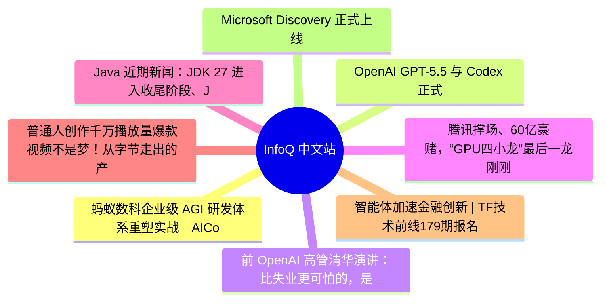

# 📰 InfoQ 中文站 Top 8 (2026-06-15)

## 思维导图

## 列表（8 条）

### 1. 蚂蚁数科企业级 AGI 研发体系重塑实战｜AICon上海
- **链接**: [https://www.infoq.cn/article/k890EiwhdA4ISuOu8IhH?utm_source=rss&utm_medium=article](https://www.infoq.cn/article/k890EiwhdA4ISuOu8IhH?utm_source=rss&utm_medium=article)
- **发布**: Sun, 14 Jun 2026 10:00:00 GMT
- **简介**: 点击查看原文>

### 2. OpenAI GPT-5.5 与 Codex 正式登陆 Amazon Bedrock
- **链接**: [https://www.infoq.cn/article/FuhAEYbk8T0b0GQZyq4c?utm_source=rss&utm_medium=article](https://www.infoq.cn/article/FuhAEYbk8T0b0GQZyq4c?utm_source=rss&utm_medium=article)
- **发布**: Sun, 14 Jun 2026 10:00:00 GMT
- **简介**: 点击查看原文>

### 3. 前 OpenAI 高管清华演讲：比失业更可怕的，是 AI 时代我们不知道“我是谁”
- **链接**: [https://www.infoq.cn/article/BVEc18iUtotFGN2mpRSI?utm_source=rss&utm_medium=article](https://www.infoq.cn/article/BVEc18iUtotFGN2mpRSI?utm_source=rss&utm_medium=article)
- **发布**: Mon, 15 Jun 2026 22:31:48 GMT
- **简介**: 点击查看原文>

### 4. 腾讯撑场、60亿豪赌，“GPU四小龙”最后一龙刚刚过会
- **链接**: [https://www.infoq.cn/article/OLS2A0uPEfmqoktKKGWg?utm_source=rss&utm_medium=article](https://www.infoq.cn/article/OLS2A0uPEfmqoktKKGWg?utm_source=rss&utm_medium=article)
- **发布**: Mon, 15 Jun 2026 22:26:54 GMT
- **简介**: 点击查看原文>

### 5. Java 近期新闻：JDK 27 进入收尾阶段、JDK 28 专家组、GlassFish、Infinispan、Kotlin
- **链接**: [https://www.infoq.cn/article/UkvVZm81ZerzhmEsTgHD?utm_source=rss&utm_medium=article](https://www.infoq.cn/article/UkvVZm81ZerzhmEsTgHD?utm_source=rss&utm_medium=article)
- **发布**: Mon, 15 Jun 2026 20:00:00 GMT
- **简介**: 点击查看原文>

### 6. 普通人创作千万播放量爆款视频不是梦！从字节走出的产品人，做了一款AIGC视频神器
- **链接**: [https://www.infoq.cn/article/pfJ4soZQji2VsfuX1DMm?utm_source=rss&utm_medium=article](https://www.infoq.cn/article/pfJ4soZQji2VsfuX1DMm?utm_source=rss&utm_medium=article)
- **发布**: Mon, 15 Jun 2026 18:40:26 GMT
- **简介**: 点击查看原文>

### 7. 智能体加速金融创新 | TF技术前线179期报名
- **链接**: [https://www.infoq.cn/article/Bim80Njzp6ZYQJVm8dh7?utm_source=rss&utm_medium=article](https://www.infoq.cn/article/Bim80Njzp6ZYQJVm8dh7?utm_source=rss&utm_medium=article)
- **发布**: Mon, 15 Jun 2026 18:39:02 GMT
- **简介**: 点击查看原文>

### 8. Microsoft Discovery 正式上线 Azure ，为 Majorana 2 量子芯片的研发提供代理式 AI 支持
- **链接**: [https://www.infoq.cn/article/TVaWScbjordM7XP3FuPg?utm_source=rss&utm_medium=article](https://www.infoq.cn/article/TVaWScbjordM7XP3FuPg?utm_source=rss&utm_medium=article)
- **发布**: Mon, 15 Jun 2026 18:11:00 GMT
- **简介**: 点击查看原文>
