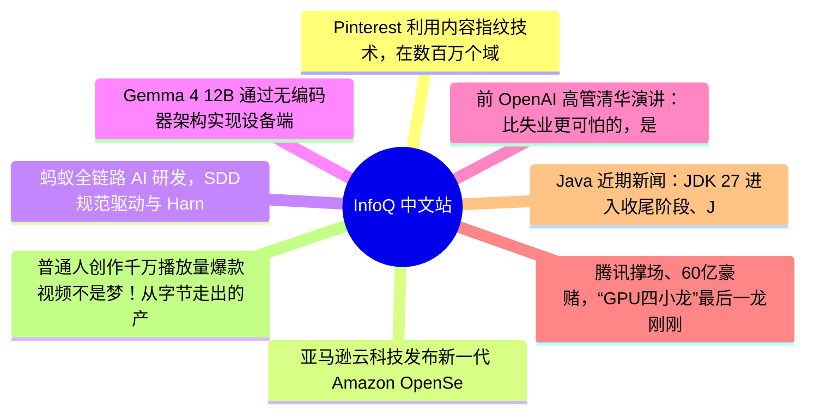

# 📰 InfoQ 中文站 Top 8 (2026-06-16)

## 思维导图

## 列表（8 条）

### 1. Pinterest 利用内容指纹技术，在数百万个域名中实现 URL 去重
- **链接**: [https://www.infoq.cn/article/ptleqt2rgIC96zXp5Tzu?utm_source=rss&utm_medium=article](https://www.infoq.cn/article/ptleqt2rgIC96zXp5Tzu?utm_source=rss&utm_medium=article)
- **发布**: Tue, 16 Jun 2026 13:54:00 GMT
- **简介**: 点击查看原文>

### 2. 亚马逊云科技发布新一代 Amazon OpenSearch Serverless
- **链接**: [https://www.infoq.cn/article/1JmJurL7fQtvpujOTIMg?utm_source=rss&utm_medium=article](https://www.infoq.cn/article/1JmJurL7fQtvpujOTIMg?utm_source=rss&utm_medium=article)
- **发布**: Tue, 16 Jun 2026 11:38:00 GMT
- **简介**: 点击查看原文>

### 3. 蚂蚁全链路 AI 研发，SDD规范驱动与 Harness 工程实践｜AICon上海
- **链接**: [https://www.infoq.cn/article/5Ke1HD7F6R7aYr4jERyk?utm_source=rss&utm_medium=article](https://www.infoq.cn/article/5Ke1HD7F6R7aYr4jERyk?utm_source=rss&utm_medium=article)
- **发布**: Tue, 16 Jun 2026 10:00:00 GMT
- **简介**: 点击查看原文>

### 4. Gemma 4 12B 通过无编码器架构实现设备端多模态主动工作流
- **链接**: [https://www.infoq.cn/article/7djN3gq1MaqGitDAPkhe?utm_source=rss&utm_medium=article](https://www.infoq.cn/article/7djN3gq1MaqGitDAPkhe?utm_source=rss&utm_medium=article)
- **发布**: Tue, 16 Jun 2026 09:44:17 GMT
- **简介**: 点击查看原文>

### 5. 前 OpenAI 高管清华演讲：比失业更可怕的，是 AI 时代我们不知道“我是谁”
- **链接**: [https://www.infoq.cn/article/BVEc18iUtotFGN2mpRSI?utm_source=rss&utm_medium=article](https://www.infoq.cn/article/BVEc18iUtotFGN2mpRSI?utm_source=rss&utm_medium=article)
- **发布**: Mon, 15 Jun 2026 22:31:48 GMT
- **简介**: 点击查看原文>

### 6. 腾讯撑场、60亿豪赌，“GPU四小龙”最后一龙刚刚过会
- **链接**: [https://www.infoq.cn/article/OLS2A0uPEfmqoktKKGWg?utm_source=rss&utm_medium=article](https://www.infoq.cn/article/OLS2A0uPEfmqoktKKGWg?utm_source=rss&utm_medium=article)
- **发布**: Mon, 15 Jun 2026 22:26:54 GMT
- **简介**: 点击查看原文>

### 7. Java 近期新闻：JDK 27 进入收尾阶段、JDK 28 专家组、GlassFish、Infinispan、Kotlin
- **链接**: [https://www.infoq.cn/article/UkvVZm81ZerzhmEsTgHD?utm_source=rss&utm_medium=article](https://www.infoq.cn/article/UkvVZm81ZerzhmEsTgHD?utm_source=rss&utm_medium=article)
- **发布**: Mon, 15 Jun 2026 20:00:00 GMT
- **简介**: 点击查看原文>

### 8. 普通人创作千万播放量爆款视频不是梦！从字节走出的产品人，做了一款AIGC视频神器
- **链接**: [https://www.infoq.cn/article/pfJ4soZQji2VsfuX1DMm?utm_source=rss&utm_medium=article](https://www.infoq.cn/article/pfJ4soZQji2VsfuX1DMm?utm_source=rss&utm_medium=article)
- **发布**: Mon, 15 Jun 2026 18:40:26 GMT
- **简介**: 点击查看原文>
