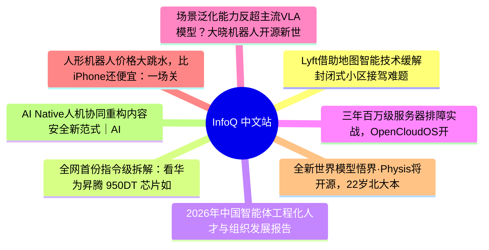

# 📰 InfoQ 中文站 Top 8 (2026-06-17)

## 思维导图

## 列表（8 条）

### 1. Lyft借助地图智能技术缓解封闭式小区接驾难题
- **链接**: [https://www.infoq.cn/article/mo0XQK6h2xAcVEqafKVN?utm_source=rss&utm_medium=article](https://www.infoq.cn/article/mo0XQK6h2xAcVEqafKVN?utm_source=rss&utm_medium=article)
- **发布**: Wed, 17 Jun 2026 11:53:00 GMT
- **简介**: 点击查看原文>

### 2. 全网首份指令级拆解：看华为昇腾 950DT 芯片如何撬动 DeepSeek 75%降价与字节锁单
- **链接**: [https://www.infoq.cn/article/y9letxDfTZ72Ls1JX27u?utm_source=rss&utm_medium=article](https://www.infoq.cn/article/y9letxDfTZ72Ls1JX27u?utm_source=rss&utm_medium=article)
- **发布**: Wed, 17 Jun 2026 11:12:03 GMT
- **简介**: 点击查看原文>

### 3. 2026年中国智能体工程化人才与组织发展报告
- **链接**: [https://www.infoq.cn/minibook/Rhz3a9NjqbRYCWNQJerz?utm_source=rss&utm_medium=article](https://www.infoq.cn/minibook/Rhz3a9NjqbRYCWNQJerz?utm_source=rss&utm_medium=article)
- **发布**: Wed, 17 Jun 2026 10:46:17 GMT
- **简介**: 点击查看原文>

### 4. 三年百万级服务器排障实战，OpenCloudOS开源OS层 AI诊断系统
- **链接**: [https://www.infoq.cn/article/N8OtrKJAucsocHwY650b?utm_source=rss&utm_medium=article](https://www.infoq.cn/article/N8OtrKJAucsocHwY650b?utm_source=rss&utm_medium=article)
- **发布**: Wed, 17 Jun 2026 10:37:53 GMT
- **简介**: 点击查看原文>

### 5. 场景泛化能力反超主流VLA模型？大晓机器人开源新世界模型，以极小代价直达家庭
- **链接**: [https://www.infoq.cn/article/jpXp2TDdHMgvwkcA3sf1?utm_source=rss&utm_medium=article](https://www.infoq.cn/article/jpXp2TDdHMgvwkcA3sf1?utm_source=rss&utm_medium=article)
- **发布**: Wed, 17 Jun 2026 10:22:29 GMT
- **简介**: 点击查看原文>

### 6. 人形机器人价格大跳水，比iPhone还便宜：一场关于生产力而非形态的产业竞速
- **链接**: [https://www.infoq.cn/article/9jUgTpozqbBvjIBXiVXD?utm_source=rss&utm_medium=article](https://www.infoq.cn/article/9jUgTpozqbBvjIBXiVXD?utm_source=rss&utm_medium=article)
- **发布**: Wed, 17 Jun 2026 10:12:35 GMT
- **简介**: 点击查看原文>

### 7. 全新世界模型悟界·Physis将开源，22岁北大本科生担任负责人｜智源大会
- **链接**: [https://www.infoq.cn/article/DSWOGK8XvrirsxTIITdY?utm_source=rss&utm_medium=article](https://www.infoq.cn/article/DSWOGK8XvrirsxTIITdY?utm_source=rss&utm_medium=article)
- **发布**: Wed, 17 Jun 2026 10:09:05 GMT
- **简介**: 点击查看原文>

### 8. AI Native人机协同重构内容安全新范式｜AICon上海
- **链接**: [https://www.infoq.cn/article/HYuYyycPfMcAatwxNWwy?utm_source=rss&utm_medium=article](https://www.infoq.cn/article/HYuYyycPfMcAatwxNWwy?utm_source=rss&utm_medium=article)
- **发布**: Wed, 17 Jun 2026 10:00:00 GMT
- **简介**: 点击查看原文>
