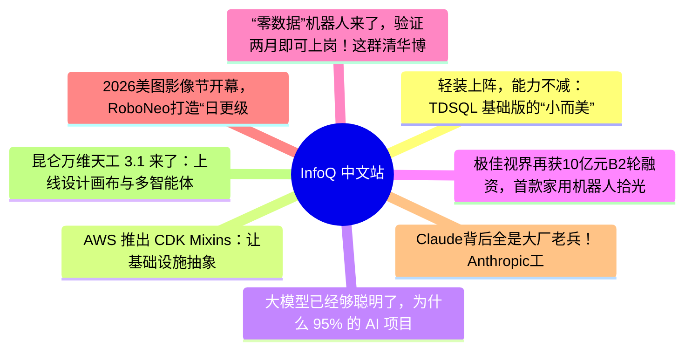

# 📰 InfoQ 中文站 Top 8 (2026-06-18)

## 思维导图

## 列表（8 条）

### 1. 轻装上阵，能力不减：TDSQL 基础版的“小而美”之道 | 腾讯云数据库 DBTalk
- **链接**: [https://www.infoq.cn/video/psxhwD4phyyE27DLXPZ7?utm_source=rss&utm_medium=article](https://www.infoq.cn/video/psxhwD4phyyE27DLXPZ7?utm_source=rss&utm_medium=article)
- **发布**: Wed, 17 Jun 2026 19:11:32 GMT
- **简介**: 点击查看原文>

### 2. AWS 推出 CDK Mixins：让基础设施抽象支持灵活组合
- **链接**: [https://www.infoq.cn/article/18TJbucoqyvqfRzsNjBN?utm_source=rss&utm_medium=article](https://www.infoq.cn/article/18TJbucoqyvqfRzsNjBN?utm_source=rss&utm_medium=article)
- **发布**: Wed, 17 Jun 2026 19:05:00 GMT
- **简介**: 点击查看原文>

### 3. 大模型已经够聪明了，为什么 95% 的 AI 项目还是跑不出 ROI？
- **链接**: [https://www.infoq.cn/article/wyjzqyE7A1Z3XSprDRq5?utm_source=rss&utm_medium=article](https://www.infoq.cn/article/wyjzqyE7A1Z3XSprDRq5?utm_source=rss&utm_medium=article)
- **发布**: Wed, 17 Jun 2026 18:59:30 GMT
- **简介**: 点击查看原文>

### 4. 极佳视界再获10亿元B2轮融资，首款家用机器人拾光S1引发强烈反响
- **链接**: [https://www.infoq.cn/article/WTOJWohLb3Ie7uhNfceO?utm_source=rss&utm_medium=article](https://www.infoq.cn/article/WTOJWohLb3Ie7uhNfceO?utm_source=rss&utm_medium=article)
- **发布**: Wed, 17 Jun 2026 18:17:00 GMT
- **简介**: 点击查看原文>

### 5. “零数据”机器人来了，验证两月即可上岗！这群清华博士破局世界模型，靠“本能”让机器人上手就会
- **链接**: [https://www.infoq.cn/article/mxw8pKVvLpuF20CQJr6j?utm_source=rss&utm_medium=article](https://www.infoq.cn/article/mxw8pKVvLpuF20CQJr6j?utm_source=rss&utm_medium=article)
- **发布**: Wed, 17 Jun 2026 18:01:54 GMT
- **简介**: 点击查看原文>

### 6. 2026美图影像节开幕，RoboNeo打造“日更级AI短剧团队”
- **链接**: [https://www.infoq.cn/article/R7xRO4KMhl8mUxHXyKDC?utm_source=rss&utm_medium=article](https://www.infoq.cn/article/R7xRO4KMhl8mUxHXyKDC?utm_source=rss&utm_medium=article)
- **发布**: Wed, 17 Jun 2026 17:29:01 GMT
- **简介**: 点击查看原文>

### 7. Claude背后全是大厂老兵！Anthropic工程团队1680人画像曝光：谷歌系、12年经验、本硕为主
- **链接**: [https://www.infoq.cn/article/amwREaeNbTGi3842HS27?utm_source=rss&utm_medium=article](https://www.infoq.cn/article/amwREaeNbTGi3842HS27?utm_source=rss&utm_medium=article)
- **发布**: Wed, 17 Jun 2026 17:17:29 GMT
- **简介**: 点击查看原文>

### 8. 昆仑万维天工 3.1 来了：上线设计画布与多智能体工作流，强化复杂项目交付能力
- **链接**: [https://www.infoq.cn/article/OrwQcvjJ0YiRdiAorZcS?utm_source=rss&utm_medium=article](https://www.infoq.cn/article/OrwQcvjJ0YiRdiAorZcS?utm_source=rss&utm_medium=article)
- **发布**: Wed, 17 Jun 2026 17:13:03 GMT
- **简介**: 点击查看原文>
