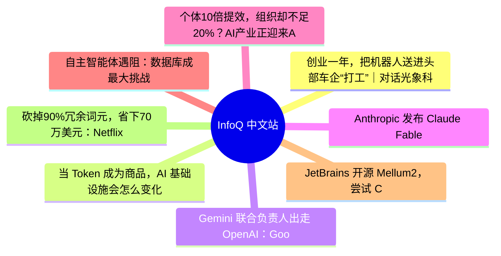

# 📰 InfoQ 中文站 Top 8 (2026-06-19)

## 思维导图

## 列表（8 条，3 条含全文）

### 1. 创业一年，把机器人送进头部车企“打工”｜对话光象科技CEO张涛
- **链接**: [https://www.infoq.cn/article/GYBZkeGxGry11oCu0c1A?utm_source=rss&utm_medium=article](https://www.infoq.cn/article/GYBZkeGxGry11oCu0c1A?utm_source=rss&utm_medium=article)
- **发布**: Thu, 18 Jun 2026 19:27:38 GMT
- **简介**: 点击查看原文>

📄 全文（4021 字符，点击展开）

作者 | 华卫

去年刚成立的光象科技，近日发布了首个工业级自进化具身智能机器人 Phi-Bot X1。作为专为工业场景设计的自进化具身智能机器人，X1 在本体架构上深度契合一线工厂对高精度、高灵活性、高稳定性和高安全性的严苛要求，具备极致精度、敏捷效率、柔性灵活与协同安全等综合能力。

并且，他们的机器人已经拿到头部车企的订单，要进真实的汽车产线上“打工”了。

“今天行业里很多具身机器人其实并没有去干具身机器人该干的事情。“光象科技创始人张涛表示。2024 年中，他离开阿里体系内的高德，拉上清华师兄李升波，组了个团队，扎进了具身智能赛道。

连续 3 天、累计约 21.5 小时干活还不出错，这是 Phi-Bot X1 在 2026 ATC 蔚来汽车焊接上下料全流程作业场景交出的成绩单。

零失误、零中断，基于自研物理原生智能模型的自主感知动作闭环，X1 在动态环境下实现连续工作 100%成功率，并能够与产线节拍实时协同，展示了具身智能机器人在汽车制造真实场景中的稳定性、精度与连续作业能力。

据张涛透露，他们跟至少十几家汽车企业都有交流，深度合作的车厂都是行业的头部车厂，且有明确的商业化合同和订单在推进。目前为止，真正在这些车厂面向商业化落地的具身智能公司，只有光象科技一家。

# 下线一个月，直接能在产线工位干活

Phi-Bot X1 的真机亮相时，我们注意到它并非时下最吸睛的“双足人形”，而是一台拥有四舵轮全向底盘、升降腰结构的双臂协作机器人。

“过去几年，很多双足人形机器人在汽车制造厂里搬箱子。为什么都去搬箱子？因为干不了别的。”张涛表示，X1 在今年 4 月真正完成集成之后，只用一个月时间就直接能够在真实汽车制造工位中完成所有的工艺流程。“我们从一开始就考虑清楚机器人要去干什么，并且以此为所有的设计原点。”

这种实用主义渗透在 X1 的每一个设计细节里。面向高精度、多工位、高节拍的工业场景，X1 采用工业级本体设计，搭载自研物理原生智能模型，并构建 Phi-Arch 物理智能开发平台实现规模化部署，具备“一机多能、快速上岗、自我学习”三大核心能力，能够在真实产线中自主感知、决策、操作并持续进化。

在感知与定位能力上，X1 搭载由 3D 激光雷达、RGBD 深度相机、双目相机及超声波雷达构成的多维环境感知系统，具备 10mm 定位精度和 0.05mm 末端重复定位能力。仅依靠本体感知能力，X1 可在动态复杂的工业环境中完成高精度定位与稳定作业。这意味着在实际工业环境中，无需进行大规模集成改造即可完成机器人的快速部署与稳定运行，显著降低了工厂智能化升级的门槛。

在运动能力上，X1 采用四舵轮全向底盘，支持主动转向、横向“蟹行”、斜向移动、原地回转，可灵活适配产线中的狭窄通道、复杂工位和边移动边操作的动态作业需求。四舵轮结构还具备更好的移动与驻停稳定性，可在作业状态下自主锁定，为高精度操作提供稳定支撑。在作业范围上，X1 采用工业级升降腰结构，在保持机身稳定的同时可拓展垂直方向和远端作业，最大可覆盖 0~2.5 米工作区间。针对双排上料台等深距、高负荷取放件任务，X1 具备抗倾覆和全身协同能力，可保障全流程作业的精准与连续。

同时，X1 拥有 27 个自由度，全关节力控双臂，支持高精度协同操作。基于全关节 1kHz 的协同控制，以及从关节到末端的实时力感知与力反馈，X1 展现出极佳的柔顺抗阻表现，保障机器人在真实产线中与人员、设备协同作业的安全性与可靠性。

此外，X1 配备双电池，支持 1 分钟快速换电，确保工业生产全天候连续性。张涛表示，“X1 支持人工换电，也可以机器人自主换电。我们专门设计了机器人的手臂可以把自己的电池拿起来、放到换电的卡槽里面、再从电池仓里面拿一个新的电池装上去。1 分钟的换电效率目前是针对人工的，对机器人的话现在还是稍微慢了一点，但未来也会逐渐提升，达到对应的换电效率。”

通过可替换的末端执行器，X1 可以轻松胜任质检、上料、分拣、拧紧、粘贴、插接、卡接等多种复杂工位作业，实现“一机多能”。同时，依托泛化技能库与高效真机后训练能力，X1 从场景导入到验收上线的周期可显著压缩，实现“快速上岗”。相较于传统工业自动化长达 6 个月以上的方案设计、硬件定制、软件开发、软硬件集成、现场施工、集成调试等冗长流程，X1 的部署周期可缩短至周级甚至天级，帮助工厂更快完成具身智能能力导入。

# 押注强化学习，“仿真数据比真实数据多用很多”

核心技术路径上，光象科技再次选择了“少数人的路”：以强化学习为最核心的技术能力做具身智能。“过去我们看到绝大部分 VLA 模型都采用模仿学习，采大量数据。我们去年就在讨论这种方式是不是终局，能不能走到最后，我们的结论是不太可能。”

张涛进一步拆解了其中的量级逻辑：对标自动驾驶，特斯拉训练端到端模型需要几千万条有效数据，这是从几十亿条数据里筛出来的。而今天具身智能开源模型的数据量级基本在几十万到几百万条，而且非常分散。聚焦到某一个具体场景或任务，可能只有几万或者十几万条。

“自动驾驶只解决一个任务，但具身要解决的是几百个、几千个任务。在这种情况下，需要的数据量级是十亿、百亿级别。通过数据量级分析，就知道用监督学习这种方式绝对不可能走到最后。但强化学习能够突破这一点。强化学习是在探索和试错的过程中，通过奖励信号让模型自己学到什么策略最优，能够不断迭代、提升性能。”

因此，在算法层面，光象科技构建了覆盖仿真强化学习、真机强化学习和世界模型强化学习的技术体系。依托自研值分布强化学习算法 DSAC、多模态强化学习算法 DACER、均值速度场 MVP、安全强化学习算法 RACS 等算法矩阵，X1 能够在复杂工业任务中实现更高精度、更高成功率和更平滑的动作控制。

在数据层面，光象科技以真实工业场景为基础，构建高效率、低成本的数据飞轮。通过 3D 空间物理资产高精度建模、高保真仿真场景生成和大模型生成式扩展，光象科技持续积累工业场景中的高价值数据资产，加速机器人泛化能力从单场景验证走向多场景迁移。

"在数据量级规模上，仿真数据是唯一有可能实现指数级扩增的方案：通过堆显卡、并行方式，让数据量级指数级倍增。我们的仿真数据用得比真实数据多，而且是多很多。"张涛表示，数据方案一直在更新迭代，到今天数据方案并没有完全收敛。他们不排斥任何一种数据方案，有更好更低成本的真实数据也会用起来。但他强调，仿真数据是可以被规模化的，所以他们会在仿真数据上投入更大的精力。

"如果数据问题解决了，具身智能的长期 AGI 问题就不远了，两者是相关的。自从特斯拉端到端之后，大的技术范式没有太大区别，核心是由数据驱动的端到端范式。怎样利用数据、获取数据的规模与品质，并结合模型结构和训练方法，得到最优最泛化的模型，这些是耦合在一起的。没有单独的数据问题或模型问题，它们是耦合的。"

在平台层面，光象科技自研物理智能开发平台 Phi-Arch，覆盖训练数据生成，具身智能模型构建、训练、调优以及集成部署全流程。依托 Phi-Arch 平台，机器人能够实现从对象建模、环境建模、任务转化，到网络构建、优化求解、参数调教、代码部署和控制器集成的完整闭环，显著提升具身智能模型开发、部署与迭代效率。

基于算法、数据与平台的系统能力，X1 具备从开发部署到真实作业中持续学习和自我进化的能力。机器人可在执行任务过程中持续与真实场景交互，依托自研强化学习算法矩阵在试错和迭代过程中不断优化动作策略，进一步提升操作精度、任务成功率、动作平滑性与场景鲁棒性。这使得 X1 能够持续提升性能上限，形成面向跨工位、跨场景迁移与规模化落地的长期能力。

# 一年拿下头部车企，靠的是什么?

2025 年创业做机器人，光象科技面临的市场环境并不宽松。头部的具身智能公司已经融资数轮，工厂里也出现了各种机器人的身影。一家新公司，凭什么让车企掏钱？

“创立之初，我们就在思考：光象科技到底要做成一家什么样的公司？”这个问题的核心是场景选择。张涛认为，最好的方式是在一个点上做突破，而不是多点开花。在一个点上突破，意味着如果希望重点突破复杂的操作能力，就先不去接触最难的复杂环境，所以工业是典型场景。

在他看来，对标过去自动驾驶的发展历程，今天的具身智能从 L2 走向 L4，可能是一个更合理的路径。“如果直接进入家庭场景，意味着既要做非常复杂的任务、非常复杂的操作，又要认知和理解各种各样不同的环境，所有因素交织在一起后，事情会变得极难。”

为什么选汽车场景？张涛给出的判断是："首先，汽车是目前最大规模、复杂程度最高的规模化工业品之一，除汽车之外可能找不到第二个规模如此大、复杂度如此高、还能做到如此成熟标准化的场景。其次，整个汽车制造过程过去做了大量的生产优化，带来了产线极高的一致性和标准化。在一个工位 3 到 5 米的空间里完成相对集中的任务，具身智能机器人既可以实现规模化部署，又能以比较高的效率快速实现工位价值。"

事实证明，这个判断是对的。Phi-Bot X1 在焊接上料场景中，面向汽车制造中重复、枯燥且存在灼伤风险的上料工位，可完成抓取、移动、翻转、精准对孔、放置等长程复杂任务。在双孔同时对准高精度作业中，X1 仅依靠本体感知即可实现超高对孔精度，动态位置精度达到毫米级，并将角度精准控制在 0.3°以内。

在移动质检场景中，X1 可实现“边走边检”和底盘、腰、臂全身协同控制，完成覆盖式车身表面检测。依托自研物理原生智能模型，X1 能够在移动过程中动态调整姿态与检测路径，兼顾工业级精准度、平

...（截断，原文 5026+ 字符）

### 2. 当 Token 成为商品，AI 基础设施会怎么变化？
- **链接**: [https://www.infoq.cn/article/VXD37NcfxyXjXFLk2hyd?utm_source=rss&utm_medium=article](https://www.infoq.cn/article/VXD37NcfxyXjXFLk2hyd?utm_source=rss&utm_medium=article)
- **发布**: Thu, 18 Jun 2026 19:17:06 GMT
- **简介**: 点击查看原文>

📄 全文（4021 字符，点击展开）

在大模型能力如此强大的当下，模型背后智能的生产和交付，仍远没有实现工业化。

九章云极副总裁胡宗星给出了一个直观的数据对比：顶级 8 卡 GPU 服务器的聚合内存带宽，理论上支持每秒生成约 1000 个 Token；但在实际工程中，主流推理框架的解码速度往往只有几十 Token/s，中间存在超过 10 倍的性能鸿沟。

这道鸿沟来自推理系统里的“执行间隙”。GPU 本身并不缺理论算力，但在真实推理链路中，不同计算任务之间会出现等待，通信和计算也很难充分并行。尤其在解码阶段，单个 Kernel 的执行时间可能只有微秒级，CPU 与 GPU 之间频繁的启动、调度和同步，反而会成为关键瓶颈。再加上 KV Cache 等推理状态需要在 HBM、DRAM、NVMe 等不同存储层级之间反复搬运

这些都使得算力消耗在等待、同步和数据移动中，而客户最后为这道性能鸿沟买单。

这说明，智能的工业化不能只追求更大的算力规模，也不能只比较更低的 Token 单价。真正重要的是同样的能源和算力投入，能不能生产出更多有效 Token；同样的 Token 消耗，能不能完成更多业务任务。

因此，AI 基础设施需要同时回答智能如何计量，以及智能如何生产。

“我们正处于智能工业化时代的拐点，但现在，一个更根本、更现实的考验摆在我们所有人面前：时代所需要的不仅是技术突破，更是‘智能生产力’的突破。 ”九章云极 DataCanvas 公司创始人、董事长方磊说。

在 6 月 17 日的发布会上，九章云极提出 AI 工厂战略，并发布 Alaya NeW Cloud 3.0。训练工厂负责把通用智能生产为专业模型，Token 工厂负责把专业模型封装为可调用、可计量、可保障的专业 Token。与此同时，九章还提出了 DCU 与 Token 的度量体系，以及围绕推理效率、状态复用、跨集群调度和算电协同展开的一系列底层工程设计。

成立 13 年来，九章云极经历了 AI 的多轮浪潮，也走过了 PaaS、云、智算平台的多次转型。现在，它试图把自己从算力资源提供者，进一步推向智能工业生产者，组织智能的生产、计量、流通和交付。

# 智能工业化的第一步：统一度量衡

智能走向工业化的第一道关卡，是建立统一度量衡，即用什么指标，来衡量智能的生产、交易与交付。

过去，AI 基础设施主要围绕资源计量。企业买算力，看 GPU 数量、显存规模、集群性能；买模型服务，看参数规模、API 调用量、Token 单价。

这些指标都重要，但它们描述的主要是供给侧。它们能说明厂商有多少资源、模型有多大、调用有多便宜，却不能回答企业真正关心的问题：一次任务能不能完成，结果是否可靠，响应是否够快，失败和重试会不会把总成本推高。

因此，九章云极提出，AI 基础设施要从“资源计量”转向“智能计量”。

在九章云极看来，Token 是最适合作为智能计量的基础单位。模型接收输入、处理信息、生成输出，都围绕 Token 展开。相比 GPU、参数和 API 调用量，Token 更接近智能被加工和交付的过程。

但 Token 只是基础单位，还不是价值单位，更有计量价值的概念是“有效 Token”。

一个模型可以生成很多 Token，但如果回答错误、响应超时、无法进入业务流程，这些 Token 对客户来说仍然没有意义。

一个有效 Token，至少要同时满足几个条件：请求成功，质量达标，时延达标，并且能够进入真实业务流程。只有这样的 Token，才构成可交付的智能产出。

胡宗星指出，企业真正关心的不是 Token 单价，而是有效 Token ——那些请求成功、质量达标、时延可控、能够进入真实业务流程的 Token。客户买的不是便宜 Token，而是更低的任务完成成本。

基于这一判断，九章云极对 Token 进行了重新分级。

九章云极将专业 Token 划分为三个层级：消费级 Token 是智能社会的“基础电力”；专业级 Token 封装行业知识与合规逻辑，让企业购买的是效率、风控与决策支持；前沿级 Token 面向高复杂度科研场景。九章云极的战略聚焦，在于企业级与前沿级 Token。

当计量单位发生变化，基础设施的形态也必须发生变化。企业需要的就是一套完整的生产体系：它既要把通用模型训练成能解决具体业务问题的专业模型，也要把这些模型能力封装成稳定、可计量、可调度、可保障的专业 Token。

也是在这个背景下，九章云极提出了“训练工厂 + Token 工厂”。

# 打造智能工业化的训练和 Token 工厂

统一度量衡之后，新的问题出现了：有效 Token 从哪里来？

九章云极认为，有效 Token 不能单纯通过通用模型得到，它需要被专业生产。训练工厂负责生产专业模型，Token 工厂负责交付专业 Token。前者解决模型能力是否足够专业，后者解决专业能力能否稳定进入业务。

训练工厂把通用模型加工成能处理具体业务任务的专业模型。这个过程需要领域数据、强化学习、精调、评测反馈和持续优化。通用模型提供基础能力，训练工厂负责把这些基础能力压进具体行业、具体场景、具体任务里。

专业模型训练出来之后，还不能直接变成企业可消费的智能商品。企业需要的不是一个模型文件，而是稳定 API、权限管理、版本管理、SLA 保障、成本控制和按需调用能力。

Token 工厂要做的，是把专业模型封装成标准化、可计量、可调度、可保障的专业 Token。这样，模型能力才能从一次性项目交付，变成可以反复调用、持续复用、按量计费的智能服务。

训练工厂的算力投入用 DCU 衡量，Token 工厂的只能产出用专业 Token 衡量。

DCU 衡量的是算力投入。专业 Token 衡量的是智能产出。

DCU 解决算力侧的问题。传统算力计量往往围绕 GPU 卡数、核时或集群规模展开，但这些指标很难反映不同硬件、不同架构、不同调度方式之间的真实效率差异。DCU 的意义，是把复杂的异构算力抽象成更统一的计算单位，让客户不必理解底层硬件拓扑，也能像采购电力一样采购算力。

Token 解决智能侧的问题。抽象的模型能力无法直接买卖，必须变成可度量、可定价、可交付的商品。专业 Token 的意义，是把昂贵、复杂、稀缺的模型能力，转化为可以按量调用、持续复用、标准化交付的智能单元。

这就意味着，企业可以按业务需求调用专业智能。AI 服务可以像水电一样，按需接入、按量计费、持续运营。

# 如何通过 AI 工厂，把算力转化为更多有效 Token？

水电之所以能被按需使用，背后有发电、输配、计量、调度和运维系统。专业智能也一样。一个模型能力要变成企业可以稳定购买和使用的专业 Token，背后要先经过接入、训练、封装、推理、缓存、调度和计费。

九章云极这次发布的产品体系，正是沿着这条链路展开。

最前端的 Aladdin 处理算力入口问题。

过去，算力大多藏在后台。客户买 GPU、开实例、配环境、调集群，再把模型和应用部署上去。算力已经存在，但离开发者、Agent 和业务流程还有距离。每一次接入、调试、迁移、部署，都会消耗工程时间，也会拉长 AI 应用进入生产的周期。

Aladdin 要把算力推到使用者手边。通过 IDE 插件、CLI、SDK、Skills Hub 等入口，开发者和 Agent 可以更直接地调用算力、工具和模型能力。算力不再只是后台资源池里的配额，而变成开发链路和任务链路中的可调用能力。

这一步影响的是智能生产的起点。企业要使用专业 Token，首先要让算力和模型能力进入业务系统。如果每次调用都要从环境配置、资源申请、接口适配开始，智能服务就很难像水电一样即插即用。

Aladdin 缩短的是从算力资源到业务任务的距离。

第二层是训练工厂。它处理的是专业能力来源问题。

通用模型具备基础能力，但企业场景里的问题通常更具体。金融、制造、政务、科研，对数据结构、行业知识、业务流程、合规边界和结果稳定性都有要求。模型能生成一段流畅文本，不代表它能完成一个生产任务。

训练工厂负责把通用模型加工成专业模型。它通过大规模训练底座、领域精调、强化学习、评测反馈和持续优化，把模型能力压进具体行业、具体场景、具体任务里。

这一步决定专业 Token 的质量基础。模型越懂业务，越能减少无效回答、失败重试和人工兜底。客户消耗的 Token 数量未必最低，但更大比例会变成可用结果。对企业来说，重要的不是一次调用生成多少内容，而是一个任务最终花了多少成本完成。

第三层是 Token 工厂。它处理的是专业能力的商品化问题。

专业模型训练出来之后，还不能直接成为企业可消费的智能商品。企业需要稳定 API、权限体系、版本管理、密钥管理、计量计费、SLA 保障和成本控制。模型能力只有经过这层封装，才能进入企业系统，成为可以采购、调用和结算的服务。

Token 工厂把专业模型封装成专业 Token。

一方面，它完成服务封装。专业模型通过 API、SDK、权限、版本和计量体系进入企业应用，客户可以按任务、按服务等级、按调用规模使用模型能力。

另一方面，它完成推理优化。不同任务需要的模型、上下文长度、响应速度和成本约束不同。简单任务调用大模型，会浪费算力；复杂任务交给小模型，会带来失败和重试。Token 工厂通过量化、动态路由、KV 缓存、弹性伸缩等机制，为不同任务选择更合适的模型和推理路径。

胡宗星介绍，目前 Alaya NeW 平台预制了 DeepSeek、GLM、Kimi、Minimax、Qwen 等 50 余款主流大模型，并且还在此基础上沉淀了 100 多

...（截断，原文 5752+ 字符）

### 3. Gemini 联合负责人出走 OpenAI：Google 为什么总让 AI 天才感到挫败？
- **链接**: [https://www.infoq.cn/article/3hkmF10X9ec1ujwwIjFW?utm_source=rss&utm_medium=article](https://www.infoq.cn/article/3hkmF10X9ec1ujwwIjFW?utm_source=rss&utm_medium=article)
- **发布**: Thu, 18 Jun 2026 18:15:00 GMT
- **简介**: 点击查看原文>

📄 全文（4021 字符，点击展开）

Google 工程副总裁、Gemini 联合负责人 Noam Shazeer 宣布，他将离开现有职位，加入 OpenAI。

今天，Noam Shazeer 在 X 上发文宣布，自己将离开 Google，加入 OpenAI。这很可能是今年人工智能领域最重要的一次人才变动，因为这位 50 岁的工程师正是 Google 下一代最强 AI 技术 Gemini 的三位负责人之一。

对 Gemini 来说，这无疑是一个残酷的消息。Shazeer 不仅是 Gemini 的联合负责人、Google 工程副总裁，还是 Transformer、T5 和 Switch Transformer 等重要论文的合著者，也是稀疏 MoE 模型的先驱之一。

据 OpenAI 首席研究官 Mark Chen 发帖内容来看，Noam Shazeer 将担任 OpenAI 架构研究负责人。

前 Ai2 高级研究科学家、后训练负责人 Nathan Lambert 也忍不住调侃：OpenAI 这下算是解决了他们所谓的“预训练规模问题”。

## 一个反复回到 Google、又反复感到挫败的人

从 Noam Shazeer 的 LinkedIn 履历来看，他与 Google 的关系贯穿了职业生涯的大部分时间。2000 年 12 月，他以软件工程师身份加入 Google。2012 年再次入职 Google，担任首席软件工程师。2024 年 8 月，他重返 Google，担任工程副总裁兼 Gemini 联合负责人。

而这中间有一段比较戏剧性的创业经历。

2021 年，Shazeer 离开 Google，创办了 Character.AI。导火索是，Google 拒绝发布他参与开发的一款聊天机器人。当时，他与 Google 同事 Daniel De Freitas 合作开发了一个最初名为 Meena 的聊天机器人，它能够围绕广泛话题展开自然对话。

据熟悉相关文件的人士透露，Shazeer 曾在一份广为流传的备忘录《Meena Eats the World》中预测，这款聊天机器人有可能取代 Google 搜索，并创造数万亿美元收入。

不止这一件事情，实际上他在 Google 的 AI 生涯里，长期伴随着一种反复出现的挫败感。

Shazeer 于 2000 年加入 Google 时，是公司最早的几百名员工之一。当时的 Google 要求每个人都必须有一位导师，Shazeer 后来在播客中回忆，自己刚加入时什么都不懂，什么都去问导师，而他的导师正是 Jeff Dean。他还开玩笑说，并不是 Google 每个人都什么都懂，只是 Jeff Dean 什么都懂，因为很多东西基本都是他写的。

Shazeer 早年其实就已经在想 AI。他在播客中说，自己当时加入 Google，一个朴素想法是先赚一些钱，以后就可以长期去做 AI 研究。后来他也承认，Google 确实一度成了一个非常适合做 AI 的地方。

2012 年，他再次加入 Google Brain。Shazeer 后来在播客中回忆，2012 年前后，他曾离开 Google 一段时间，有一次只是回公司和妻子吃午饭，碰巧坐到了 Jeff Dean 和早期 Google Brain 团队旁边。Shazeer 当时的第一反应是：“哇，这是一群很聪明的人。” Shazeer 再次被这群人吸引，Jeff Dean 则笑称自己把他“哄回来了”。

Shazeer 还自嘲说，自己似乎每隔 12 年就会“重新加入一次 Google”：2000 年一次，2012 年一次，2024 年又一次。

但这段经历里最有代表性的挫败，并不只是某个项目没能发布，而是一个天才研究员在大公司里不断撞上的机会成本和系统复杂度。

Shazeer 在播客里提到，Larry Page 以前常说，Google 第二大的成本是税，最大的成本是机会成本。也就是说，真正可惜的不是做错了什么，而是明明看到一个巨大机会，却没有及时抓住。放在 Shazeer 身上，这种机会成本显得格外刺眼：他很早就看到了语言模型、聊天机器人和下一代 AI 产品的潜力，但在 Google 内部，这些想法往往要经过安全、公平、业务、组织和产品化的多重权衡。

与此同时，大模型研发本身也不是一个“聪明人想到点子就能立刻改变世界”的过程。Shazeer 在播客中说，小规模研究最理想的状态，是早上醒来想到一个主意，当天写出来，跑一些实验，很快看到初步结果。但真正难的是把这些改进放到大系统里。一个小实验看起来有希望，放大后未必成立；几个看起来各自有效的改进叠在一起，也未必能协同工作。他甚至说，这种“叠不起来”的情况大约会发生一半。

这也是 Google 式 AI 研发最令人挫败的地方：它拥有世界上最强的研究人员、最庞大的代码库、最先进的 TPU 和数据中心，但越到大规模训练，问题越像一团纠缠在一起的线。Shazeer 说，最大规模实验是无法真正加速的，最后仍然是 N=1 的实验，只能把一群聪明人放在房间里盯着结果，判断到底为什么有效、为什么无效。模型稍微变差一点，可能是量化推得太狠，可能是数据问题，可能是代码里有 bug，也可能是某个底层系统噪音。更麻烦的是，神经网络对噪音很宽容，很多错误不会让系统直接崩掉，只会让模型悄悄变差。

### Google 花 27 亿美元追回的人，又被挖走了

回头去看，Shazeer 绝对也是 AI 领域最强的人之一。他进入 Google 参与的第一个重要项目，是构建一套系统，用于改进 Google 搜索引擎的拼写纠错功能。加入 Google 不久后，他就向当时的 CEO Eric Schmidt 提出，希望获得数千颗计算芯片的使用权限。

Schmidt 在 2015 年斯坦福大学的一次演讲中回忆，Shazeer 当时对他说：“我要在这个周末之前解决通用知识问题。”那次早期尝试虽然以失败告终，但 Schmidt 相信，Shazeer 具备打造人类级智能 AI 的潜力。Schmidt 在演讲中说：“如果说世界上有谁最有可能做到这件事，我能想到的就是他。”

2017 年，Shazeer 与另外七位 Google 研究人员共同发表了论文《Attention Is All You Need》，详细描述了一种能在人类给出提示后可靠预测序列中下一个词的计算机系统。这项工作后来成为生成式 AI 技术的基础。

之后，Shazeer 与 Google 同事 Daniel De Freitas 合作，开发了一款最初名为 Meena 的聊天机器人。它可以围绕各种话题自信地与人对话。据熟悉相关文件的人士称，Shazeer 曾在一份广为流传的备忘录《Meena Eats the World》中预测，这款聊天机器人有可能取代 Google 搜索引擎，并创造数万亿美元收入。然而，Google 高管以安全性和公平性方面的担忧为由，拒绝将这款聊天机器人向公众发布。

2021 年，Shazeer 和 De Freitas 离开 Google，创办了 Character.AI。

但创业也不顺利，公司没有稳定的盈利模式。

一年后，OpenAI 发布 ChatGPT，证明大众对 AI 聊天机器人的需求远比许多大公司预想得更强。2023 年 3 月，Character.AI 完成 1.5 亿美元融资，估值达到 10 亿美元。

Shazeer 和团队最初希望，人们会愿意为与各种聊天机器人互动付费。这些机器人既可以提供实用建议，也可以模仿名人，比如 Elon Musk，或者模仿 Percy Jackson 这样的虚构人物。Shazeer 曾在播客中表示，这类产品会对很多孤独或抑郁的人非常有帮助。

但随着公司发展，Character.AI 也遇到了一些偏离创始团队设想的问题。员工越来越多地需要阻止用户进行浪漫角色扮演，这类使用方式并不符合 Shazeer 和 De Freitas 原本的愿景。同时，和许多试图与 OpenAI、微软等巨头竞争的 AI 创业公司一样，Character.AI 也面临高昂研发成本压力，在形成稳定收入来源之前，继续烧钱变得越来越困难。

2024 年的时候，Shazeer 曾考虑为 Character.AI 继续融资，也接触过潜在买家，其中包括 Facebook 母公司 Meta。不过，Character.AI 最终与 Google 母公司 Alphabet 达成交易，并在博客中表示，自公司创立以来，AI 行业的格局已经发生了变化。

Google 为此斥资约 27 亿美元，获得了 Character.AI 的技术授权，Shazeer 本人则以副总裁头衔回到 Google 工作，从管理一家拥有数百名员工的公司，转向专注于研究，并负责管理一个小团队，其中包括 De Freitas。据报道，他持有 Character.AI 30%至 40%的股份，这意味着他个人获得了 7.5 亿至 10 亿美元的收益。

这次回归，让 Google 士气大振。当时就有网友形容，Google 员工在 X 上的反应，几乎像是在见证“耶稣复活”。这句夸张的调侃背后，恰恰说明了 Shazeer 在 Google AI 团队中的特殊地位：他不只是一个被高价请回来的明星研究员，更像是 Google 曾经错失、如今又拼命追回的关键人物。

但不到两年后，剧情又一次反转。Shazeer 这次离职，有人注意到，他的告别措辞显得异常简短：没有提到 Character.AI，没有提到自己留下的团队，只用了类似“继续前进”的说法。

...（截断，原文 4060+ 字符）

### 4. Anthropic 发布 Claude Fable 5 三天遭临时下架
- **链接**: [https://www.infoq.cn/article/UXghld6fuzYxJNuU6L47?utm_source=rss&utm_medium=article](https://www.infoq.cn/article/UXghld6fuzYxJNuU6L47?utm_source=rss&utm_medium=article)
- **发布**: Thu, 18 Jun 2026 18:14:00 GMT
- **简介**: 点击查看原文>

### 5. 个体10倍提效，组织却不足20%？AI产业正迎来Agent落地大考
- **链接**: [https://www.infoq.cn/article/Xbol4ryW7wkczQsumUY9?utm_source=rss&utm_medium=article](https://www.infoq.cn/article/Xbol4ryW7wkczQsumUY9?utm_source=rss&utm_medium=article)
- **发布**: Thu, 18 Jun 2026 17:58:02 GMT
- **简介**: 点击查看原文>

### 6. 自主智能体遇阻：数据库成最大挑战
- **链接**: [https://www.infoq.cn/article/BtWV3huF3ZydPc501mAO?utm_source=rss&utm_medium=article](https://www.infoq.cn/article/BtWV3huF3ZydPc501mAO?utm_source=rss&utm_medium=article)
- **发布**: Thu, 18 Jun 2026 17:54:26 GMT
- **简介**: 点击查看原文>

### 7. JetBrains 开源 Mellum2，尝试 Claude Code 无法涉足的领域
- **链接**: [https://www.infoq.cn/article/QQVa7HhtdoDzLFB7ewVQ?utm_source=rss&utm_medium=article](https://www.infoq.cn/article/QQVa7HhtdoDzLFB7ewVQ?utm_source=rss&utm_medium=article)
- **发布**: Thu, 18 Jun 2026 17:48:17 GMT
- **简介**: 点击查看原文>

### 8. 砍掉90%冗余词元，省下70万美元：Netflix开源工具狙击AI账单黑洞
- **链接**: [https://www.infoq.cn/article/SdkcGqZQ2coEqM04xsQG?utm_source=rss&utm_medium=article](https://www.infoq.cn/article/SdkcGqZQ2coEqM04xsQG?utm_source=rss&utm_medium=article)
- **发布**: Thu, 18 Jun 2026 17:42:01 GMT
- **简介**: 点击查看原文>
