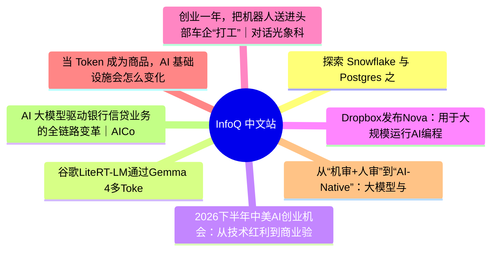

# 📰 InfoQ 中文站 Top 8 (2026-06-23)

## 思维导图

## 列表（8 条，3 条含全文）

### 1. 探索 Snowflake 与 Postgres 之间的双向数据流动模式 ｜ 技术实践
- **链接**: [https://www.infoq.cn/article/wvtzppvWzOlKYDVRzlYN?utm_source=rss&utm_medium=article](https://www.infoq.cn/article/wvtzppvWzOlKYDVRzlYN?utm_source=rss&utm_medium=article)
- **发布**: Tue, 23 Jun 2026 11:46:51 GMT
- **简介**: 点击查看原文>

📄 全文（4022 字符，点击展开）

*2026 年，智能体将在企业级应用中取得哪些实质性突破？*[点击下载](https://www.infoq.cn/minibook/keTZm4fpOmFEzmx77Zpq)*《2026 年 AI 与数据发展预测》白皮书，获悉专家一手前瞻，抢先拥抱新的工作方式！*

现代数据架构越来越要求事务型与分析型工作负载能够无缝共存。PostgreSQL 仍然是事务型应用的核心基础设施——支撑电商订单处理、实时库存系统以及面向客户的 API——而 Snowflake 则是所有分析型数据与 AI 的基础平台。挑战在于：如何让数据在这两个系统之间双向可靠流动，同时将延迟与运维开销降到最低。

历史上，要打通 OLTP 与 OLAP 系统，需要拼接外部 ETL 工具、管理云存储桶、配置 IAM 角色，并维护脆弱的 CDC 数据管道。团队花在基础设施“打通”上的时间，往往超过从数据中产生价值的时间。

本文的目标是探索如何利用 Snowflake 的一些最新创新能力，在 Postgres 与 Snowflake 之间支持五种关键的数据流动模式。如下所示：

## 有哪些变化？

近期 Snowflake 的一些产品能力显著简化了这一问题：

- **Snowflake Postgres（PuPr）**：一种完全托管的 PostgreSQL 服务，原生运行在 Snowflake 生态系统中。它消除了外部 PostgreSQL 托管的需求，同时与 Snowflake 数据平台实现一流集成；
- **pg_lake（PuPr）**：PostgreSQL 的扩展能力，允许在 Postgres 内直接创建 Apache Iceberg 表。在 Postgres 中写入的数据，可以通过共享 Iceberg 元数据被 Snowflake 直接查询——无需文件导出、无需中转存储、无需 ETL 管道；
- **pg_incremental（PuPr）**：用于调度式增量同步的扩展组件。与 pg_lake 结合使用时，可以实现轻量级 CDC，只同步发生变化的数据行；
- **Snowflake 托管 Iceberg 存储（PuPr）**：Postgres 管理的 Iceberg 表使用 Snowflake 内部存储，并通过托管凭证访问。无需外部 S3、无需 IAM、无需存储集成配置；
- **Openflow（正式发布）**：Snowflake 的托管数据集成平台（基于 Apache NiFi 构建），提供预置的 CDC 连接能力，包括基于 PostgreSQL WAL 的变更捕获，以及通过 Snowpipe Streaming 进行数据传输。

这些能力共同构建了一个完整的数据流动能力体系——从简单的批量加载，到实时 CDC——全部在一个统一平台内完成。

本文中的所有模式都使用 ORDERS 表作为示例数据源。该表模拟典型电商订单生命周期，约 28,000 行数据。本例中数据来源于 SNOWFLAKE_SAMPLE_DATA.TPCH_SF1.Orders。

`CREATE TABLE cdc_demo.orders (``    order_id        BIGINT PRIMARY KEY,``    customer_id     BIGINT,``    order_status    VARCHAR(1),``    total_price     DECIMAL(15,2),``    order_date      DATE,``    order_priority  VARCHAR(15),``    clerk           VARCHAR(15),``    ship_priority   INTEGER,``    comment         VARCHAR(79),``    created_at      TIMESTAMP DEFAULT NOW(),``    updated_at      TIMESTAMP DEFAULT NOW()``);`## 模式 1：批量数据流动 —— Postgres 到 Snowflake

**业务场景：**某零售公司在 PostgreSQL 电商系统中全天处理订单。每天夜间，分析团队需要在 Snowflake 中获取所有订单的完整快照，用于报表分析、需求预测以及财务对账；

**技术方案：**在 Postgres 中创建 Iceberg 表。“USING Iceberg”子句允许 pg_lake 在 Postgres 内创建并写入 Iceberg 表。然后通过 INSERT/SELECT 将订单数据写入该表。

在 Snowflake 侧，创建目录集成（Catalog Integration）后再创建 Iceberg 表。这些操作属于元数据层操作，不涉及实际数据搬运。当 Iceberg 表创建完成后，即可在 Snowflake 中直接查询。

#### 步骤 1：在 Postgres 中启用 pg_lake

`-- Connect to Snowflake Postgres instance``CREATE EXTENSION IF NOT EXISTS pg_lake CASCADE;`#### 步骤 2：创建 Iceberg 表并批量加载数据

`-- Create an Iceberg table and bulk load all orders into it``CREATE TABLE cdc_demo.orders_iceberg (``    order_id        BIGINT,``    customer_id     BIGINT,``    order_status    VARCHAR(1),``    total_price     DECIMAL(15,2),``    order_date      DATE,``    order_priority  VARCHAR(15),``    clerk           VARCHAR(15),``    ship_priority   INTEGER,``    comment         VARCHAR(79),``    created_at      TIMESTAMP,``    updated_at      TIMESTAMP``) USING iceberg;``-- Bulk load from the source table``INSERT INTO cdc_demo.orders_iceberg``SELECT * FROM cdc_demo.orders;`#### 步骤 3：在 Snowflake 中创建目录集成

`-- In Snowflake: create a catalog integration pointing to the Postgres instance``CREATE OR REPLACE CATALOG INTEGRATION pg_orders_catalog``  CATALOG_SOURCE = SNOWFLAKE_POSTGRES``  TABLE_FORMAT = ICEBERG``  CATALOG_NAMESPACE = 'cdc_demo'``  REST_CONFIG = (``    POSTGRES_INSTANCE = 'Snowflake_Postgres_Demo'``    CATALOG_NAME = 'postgres'``    ACCESS_DELEGATION_MODE = VENDED_CREDENTIALS``  )``  ENABLED = TRUE;`#### 步骤 4：在 Snowflake 创建 Iceberg 表

`-- Create the Snowflake Iceberg table referencing the Postgres-managed Iceberg data``CREATE OR REPLACE ICEBERG TABLE orders_iceberg``  CATALOG = 'pg_orders_catalog'``  CATALOG_TABLE_NAME = 'orders_iceberg'``  CATALOG_NAMESPACE = 'cdc_demo'``  AUTO_REFRESH = TRUE;`#### 步骤 5：查询验证数据

`SELECT COUNT(*) FROM orders_iceberg;``SELECT order_status, COUNT(*), SUM(total_price) AS total_revenue``FROM orders_iceberg``GROUP BY order_status;`## 模式 2：批量数据流动 —— Snowflake 到 Postgres

**业务场景：**数据科学团队在 Snowflake 中构建订单优先级预测模型，结果需要回写到 Postgres，使业务系统能够实时展示预测结果；

**技术方案：**在 Snowflake 中生成结果表后，将数据写入 stage（Parquet 文件）。Postgres 从 stage 拉取数据并写入本地表。

#### 步骤 1：创建存储集成

`-- In Snowflake: create a storage integration for the Po

...（截断，原文 14278+ 字符）

### 2. 谷歌LiteRT-LM通过Gemma 4多Token预测将本地推理速度提升了最高2.2倍
- **链接**: [https://www.infoq.cn/article/lv6xh4HeBfWaYubLv54y?utm_source=rss&utm_medium=article](https://www.infoq.cn/article/lv6xh4HeBfWaYubLv54y?utm_source=rss&utm_medium=article)
- **发布**: Tue, 23 Jun 2026 11:11:13 GMT
- **简介**: 点击查看原文>

📄 全文（1784 字符，点击展开）

LiteRT-LM[原生支持Gemma 4的多Token预测（Multi-Token Prediction，MTP）草稿器（drafter）](https://developers.googleblog.com/blazing-fast-on-device-genai-with-litert-lm/)，可将推理速度提升最高 2.2 倍。该框架已经从 Kotlin 与 C++进行了扩展，新增了对 Swift 和 JavaScript API 的支持。

LiteRT-LM 在 LiteRT（前身为 TensorFlow Lite）之上包含了一层专门的编排逻辑，专为处理大规模语言模型（LLM）而设计。谷歌表示，它是在 Android、iOS 与 Web 等平台上运行 Gemma 4 的运行时，经过了生产环境的验证和高度优化。

其基于 LiteRT 的底层使其能有效应对内存、计算与硬件碎片化等约束，结合了先进的量化模式以及加速的 XNNPACK 和 MLDrift 内核。在编排层面，它采用优化流水线以最小化昂贵的 CPU-GPU 数据传输，支持多 Token 预测并具备先进的会话管理功能。谷歌称这种组合使其成为“针对 Gemma 模型性能最高的运行时环境”。

LiteRT-LM 在 MTP 上采用了推测性解码（speculative decoding），并通过“优化主模型与 MTP 草稿器之间的数据交互”来避免简单实现的常见瓶颈。

为了实现这一点，LiteRT-LM 通过在相同硬件 IP（例如，GPU）上同时执行轻量级的 MTP 草稿器与主模型来实现内存的局部化。在本地内存中管理共享的 KV 缓存和激活态，完全消除了跨 IP 同步与数据传输带来的延迟惩罚。一旦草稿器预测出未来的 token，主模型便使用优化内核对其进行评估，从而在验证阶段最大化并行处理。

基于自身的基准测试，谷歌表示 MTP 解码在 Gemma 4 E2B 上快了 1.6 倍，在 Gemma 4 E4B 上快了 2.2 倍。公司还报告称，无论是预填充（prefill）还是解码（decode）性能，相比 llama.cpp、MLX、Cactus 与 ONNX 等竞争框架提升了 1.8 到 3.7 倍。

LiteRT-LM 将会话管理视为一等特性。它可以保存并恢复 KV 缓存状态，从而在避免昂贵重算的同时无缝续接长时交互，这既能改善用户体验也能提高效率。

另一个重要支柱是内存效率，通过将按层分布的嵌入向量（per-layer embeddings）保持在外部并按需动态加载图像与音频编码器，运行时可以尽可能地保持精简。例如，约 2.58 GB 的 Gemma 4 E2B 模型在 Apple 移动 CPU 上只占用了约 607MB。

系统还强调了 agentic 的能力，原生支持 Gemma 4 的“思考模式（Thinking Mode）”、用于结构化输出的[约束解码](https://ai.google.dev/edge/litert-lm/cpp#constrained_decoding)，以及[函数调用（function-calling）](https://developers.googleblog.com/on-device-function-calling-in-google-ai-edge-gallery/)。这些功能允许运行时暂停执行、返回结构化的工具调用请求并在随后恢复执行。

随 Gemma 4 一同推出的多 Token 预测草稿器使用推测性解码并行生成多个 token，然后在单次通过的过程中一起进行验证。该方法减少了 VRAM 与计算单元之间的持续数据移动，同时利用了许多预测“显而易见”这一事实，这类预测通常不需要像其他情况那么多的计算。

[LiteRT-LM已经在GitHub 开源](https://github.com/google-ai-edge/LiteRT-LM)，并包括用于桌面试验的[CLI](https://ai.google.dev/edge/litert-lm/cli)，以及用于在设备上运行的[移动示例应用](https://github.com/google-ai-edge/gallery)。

### 3. 2026下半年中美AI创业机会：从技术红利到商业验证｜AICon上海
- **链接**: [https://www.infoq.cn/article/gk0VlPy3hufsH4zKTh2X?utm_source=rss&utm_medium=article](https://www.infoq.cn/article/gk0VlPy3hufsH4zKTh2X?utm_source=rss&utm_medium=article)
- **发布**: Tue, 23 Jun 2026 10:00:00 GMT
- **简介**: 点击查看原文>

📄 全文（1626 字符，点击展开）

6 月 26 日-27 日，[AICon全球人工智能开发与应用大会](https://aicon.infoq.cn/2026/shanghai/schedule)即将在上海举行。本次大会将以“构建可信赖、可规模化、可商业化的 Agentic 操作系统”为核心命题，集结清华、复旦等知名高校教授，以及来自阿里、腾讯、蚂蚁、字节、快手、小红书、华为、Google Cloud 等数十家头部公司的技术专家登台分享。2 天、13 大专题、1 个动手实验室、近 60 场重磅议题，将深度探讨 Agent 工程化落地等相关话题。

在首日的[Keynote 主题演讲](https://aicon.infoq.cn/2026/shanghai/track/1946)中，来自清华、复旦等高校教授，以及蚂蚁集团、观正资本等企业顶尖专家，将从产学研用金等不同视角，围绕 AI 时代的工程化组织进化、 多模态模型创新、算力重构、大模型落地及赛道投资方向，深度剖析智能体规模化落地的底层逻辑。

其中，观正资本创始合伙人肇极将分享**《 **[2026下半年中美AI创业机会：从技术红利到商业验证](https://aicon.infoq.cn/2026/shanghai/presentation/7140)**》。**过去两年，AI 创业经历了从基础模型竞赛到应用爆发的快速演进。2026 年以来，市场关注点早已明显转变：资本不再为技术想象力买单，而开始将商业化能力、用户留存和收入长期稳定增长作为核心衡量标准。

本次分享将从一级市场投资人的视角出发，系统梳理中美 AI 创业生态的最新变化，分析 Agent、AI Native 应用、企业服务、AI 硬件等重点方向的发展趋势与投资逻辑。同时结合一线项目观察，探讨估值体系重构、创业团队能力模型变化以及未来 12 个月最值得关注的新机会窗口。

听众将获得对 AI 创业下一阶段竞争格局的整体认知，以及面向未来的商业机会的判断。

肇极，观正资本创始合伙人，电化学储能和纳米材料专家，创业者，美东创投社群建设者。本科和博士分别毕业于清华大学和中科院，曾在 UT Austin 化学系从事电化学能源材料的博后研究工作。2016 年到 2020 年在 MIT 材料系担任博后研究员，和研究科学家，开展新型电池的开发。2020 年，从 MIT 实验室技术转化，联合创立了储能电池公司 Avanti Battery。早期退出后，于 2022 年创立了 Liquidmetal Ventures（观正资本）。

除此之外，本次大会还策划了[端侧 AI、物理与数字空间智能化](https://aicon.infoq.cn/2026/shanghai/track/1931)、[世界模型与多模态智能突破](https://aicon.infoq.cn/2026/shanghai/track/1937)、[Agent 架构与工程化实践](https://aicon.infoq.cn/2026/shanghai/track/1926)、[Agent 安全与可信治理](https://aicon.infoq.cn/2026/shanghai/track/1928)、[企业级研发体系重构](https://aicon.infoq.cn/2026/shanghai/track/1938)、[AI 原生数据工程](https://aicon.infoq.cn/2026/shanghai/track/1943)、[AI 时代的个人提效与组织变革](https://aicon.infoq.cn/2026/shanghai/track/1936)等 14 个专题论坛，届时将有来自不同行业、不同领域、不同企业的 50+资深专家在现场带来前沿技术洞察和一线实践经验。

更多详情可扫码或联系票务经理 13269078023 进行咨询。

### 4. Dropbox发布Nova：用于大规模运行AI编程智能体的内部平台
- **链接**: [https://www.infoq.cn/article/5UOHryk6Ck66376bCULb?utm_source=rss&utm_medium=article](https://www.infoq.cn/article/5UOHryk6Ck66376bCULb?utm_source=rss&utm_medium=article)
- **发布**: Tue, 23 Jun 2026 09:40:37 GMT
- **简介**: 点击查看原文>

### 5. 创业一年，把机器人送进头部车企“打工”｜对话光象科技CEO张涛
- **链接**: [https://www.infoq.cn/article/GYBZkeGxGry11oCu0c1A?utm_source=rss&utm_medium=article](https://www.infoq.cn/article/GYBZkeGxGry11oCu0c1A?utm_source=rss&utm_medium=article)
- **发布**: Thu, 18 Jun 2026 19:27:38 GMT
- **简介**: 点击查看原文>

### 6. 当 Token 成为商品，AI 基础设施会怎么变化？
- **链接**: [https://www.infoq.cn/article/VXD37NcfxyXjXFLk2hyd?utm_source=rss&utm_medium=article](https://www.infoq.cn/article/VXD37NcfxyXjXFLk2hyd?utm_source=rss&utm_medium=article)
- **发布**: Thu, 18 Jun 2026 19:17:06 GMT
- **简介**: 点击查看原文>

### 7. 从“机审+人审”到“AI-Native”：大模型与 Agent 驱动内容风控智能化升级｜AICon上海
- **链接**: [https://www.infoq.cn/article/qTF6xLMZmM5vJe0L9twb?utm_source=rss&utm_medium=article](https://www.infoq.cn/article/qTF6xLMZmM5vJe0L9twb?utm_source=rss&utm_medium=article)
- **发布**: Sun, 21 Jun 2026 10:00:00 GMT
- **简介**: 点击查看原文>

### 8. AI 大模型驱动银行信贷业务的全链路变革｜AICon上海
- **链接**: [https://www.infoq.cn/article/TbCYkGW0XrYuhSK1NE2p?utm_source=rss&utm_medium=article](https://www.infoq.cn/article/TbCYkGW0XrYuhSK1NE2p?utm_source=rss&utm_medium=article)
- **发布**: Sat, 20 Jun 2026 10:00:00 GMT
- **简介**: 点击查看原文>
