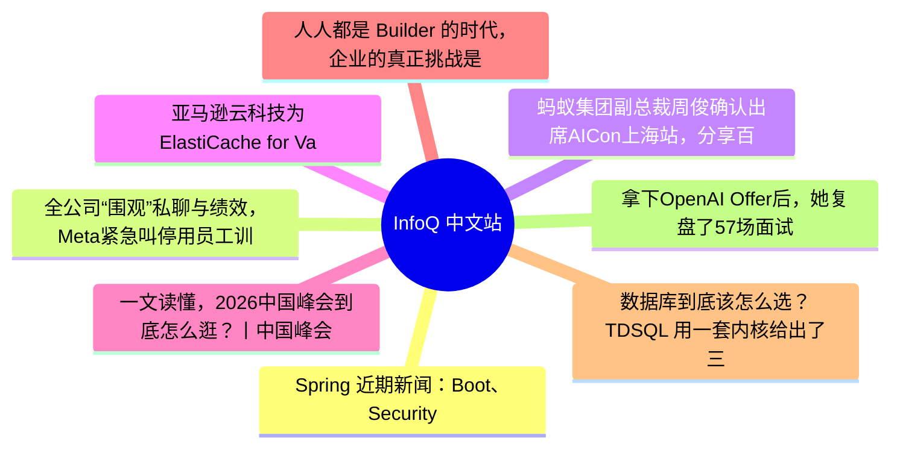

# 📰 InfoQ 中文站 Top 8 (2026-06-24)

## 思维导图

## 列表（8 条，3 条含全文）

### 1. Spring 近期新闻：Boot、Security、Integration、Modulith 发布增量版本及 Spring AI 2.0 正式发布
- **链接**: [https://www.infoq.cn/article/Jpi5XBmoO8smLYSyaD9t?utm_source=rss&utm_medium=article](https://www.infoq.cn/article/Jpi5XBmoO8smLYSyaD9t?utm_source=rss&utm_medium=article)
- **发布**: Wed, 24 Jun 2026 11:11:00 GMT
- **简介**: 点击查看原文>

📄 全文（4021 字符，点击展开）

在 2026 年 6 月 8 日这一周，Spring 生态系统呈现出一片繁忙的景象，其中包括发布以下组件的增量版本：Spring Boot、Spring Security、Spring Session、Spring Integration、Spring Modulith、Spring AMQP 和 Spring Vault，以及 Spring AI 2.0 和 Spring Data 2026.0.0 的正式版本。

#### Spring Boot

[Spring Boot](https://spring.io/projects/spring-boot) [4.1.0](https://spring.io/blog/2026/06/10/spring-boot-4) 发布，带来 Bug 修复、文档改进、依赖项升级以及以下新特性：支持 [Spring gRPC](https://spring.io/projects/spring-grpc)；在 `InvalidConfigurationPropertyValueException` 类中新增了一个公共构造函数，它可以接受一个字符串用于描述异常原因；降低多次调用 `WritableJson` 接口中定义的 toByteArray() 方法时的内存消耗。要了解有关该版本的更多详情，请参阅[发布说明](https://github.com/spring-projects/spring-boot/releases/tag/v4.1.0)及这篇 [InfoQ 新闻报道](https://infoq.com/news/2026/06/spring-boot-4-1)。

#### Spring Data

[Spring Data](https://spring.io/projects/spring-data) 2026.0.0 版本[发布](https://spring.io/blog/2026/06/09/spring-data-2026-0-0-generally-available)，带来了以下新特性：兼容 [Kotlin](https://kotlinlang.org/) 2.3.20 和 [Vavr](https://vavr.io/) 0.11.0；新增带注解的 Redis [发布/订阅](https://github.com/spring-projects/spring-data-examples/blob/083ff1c38c9c77339828accf106f2c8f4b8bb511/redis/pubsub-listener/README.md)消息监听器；类型安全的属性路径。要了解有关该版本的更多详细信息，请参阅其[维基页面](https://github.com/spring-projects/spring-data-commons/wiki/Spring-Data-2026.0-Release-Notes)。

#### Spring Security

[Spring Security](https://spring.io/projects/spring-security) 7.1.0 [发布](https://spring.io/blog/2026/06/09/spring-security-releases-2026-06)，带来 Bug 修复、依赖项升级以及一些新特性，例如：新增 `InetAddressMatcher` 功能接口，可以作为 lambda 表达式或方法引用的赋值目标；在`AllRequiredFactorsAuthorizationManager` 类中新增 anyOf() 方法，用于返回 `AuthorizationManager`接口的实例，从而向满足多种身份验证因素组合中任意一种的用户授予访问权限。要了解有关该版本的更多详细信息，请参阅[发布说明](https://github.com/spring-projects/spring-security/releases/tag/7.1.0)和[新功能介绍页面](https://docs.spring.io/spring-security/reference/whats-new.html)。

#### Spring Session

[Spring Session](https://spring.io/projects/spring-session) 4.1.0 [发布](https://spring.io/blog/2026/06/09/spring-session-releases-2026-06)，带来 Bug 修复以及以下值得注意的依赖项升级：Spring Boot 4.1.0、Spring Security 7.1.0、Spring Framework 7.0.8、Spring Data 2025.1.6、Reactor 2025.0.6、Jackson 3.1.4 以及 Testcontainers 2.0.5。要了解有关该版本的更多详细信息，请参阅[发布说明](https://github.com/spring-projects/spring-session/releases/tag/4.1.0)。

#### Spring Integration

[Spring Integration](https://spring.io/projects/spring-integration) 7.1.0 版本发布，带来 Bug 修复、文档改进、依赖项升级以及以下新特性：在 Spring Framework 注解 `@CrossOrigin` 中禁用 `allowCredentials` 元素，转而使用 `originPatterns` 元素，以便与 [Spring MVC](https://docs.spring.io/spring-framework/reference/web/webmvc.html) 保持一致；改进 `ExpressionEvaluatingMessageProcessor` 类的构造函数，移除了异常处理逻辑，转而使用 Spring Framework 的 `Assert` 类。要了解有关该版本的更多详细信息，请参阅[发布说明](https://github.com/spring-projects/spring-integration/releases/tag/v7.1.0)和[新功能介绍页面](https://docs.spring.io/spring-integration/reference/whats-new.html)。

#### Spring HATEOAS

[Spring HATEOAS](https://spring.io/projects/spring-hateoas) 3.1.0 [发布](https://spring.io/blog/2026/06/08/spring-hateoas-3-1-GA-3-0-7-and-2-5-3-released)，带来 Bug 修复、依赖项升级以及一些新特性，包括：改进 `StringLinkRelation` 类的缓存机制，确保缓存条目不会超过 256 个；修改 `TypeConstrainedJacksonJsonHttpMessageConverter` 类中定义的 `canWrite()` 方法，使其与 Spring Framework `AbstractSmartHttpMessageConverter` 类中定义的同名方法保持一致。

该版本还修复了两个 CVE：

- [CVE-2026-41006](https://spring.io/security/cve-2026-41006)：该漏洞会绕过 Jackson 的访问控制注解，导致安全敏感属性被泄露。
- [CVE-2026-41007](https://spring.io/security/cve-2026-41007)：因为前面提到的- `StringLinkRelation`类的静态缓存无边界问题，该漏洞使得攻击者能够提供自定义的恶意超媒体内容。

要了解有关该版本的更多详细信息，请参阅[发布说明](https://github.com/spring-projects/spring-hateoas/releases/tag/3.1.0)。

#### Spring Modulith

[Spring Modulith](https://spring.io/projects/spring-modulith) 2.1.0 [发布](https://spring.io/blog/2026/06/11/spring-modulith-2-1-ga-2-0-7-and-1-4-12-released)，带来 Bug 修复、依赖项升级以及一些新特性，包括：新增一组类（如 `NamastackOutboxEventRecorder`），利用 [Namastack](https://github.com/namastack) 支持事件发送引擎；新增 `JobRunrEventExternalizer` 类，利用 [JobRunr](https://www.jobrunr.io/en/) 支持事件外部化；新增 `@ModuleSlicing` 注解，与 Spring Boot 的切片测试注解结合使用，可以实现应用程序模块的切片。要了解有关该版本的更多详细信息

...（截断，原文 7513+ 字符）

### 2. 全公司“围观”私聊与绩效，Meta紧急叫停用员工训练AI：士气崩了，员工怒骂高管“狗屎”
- **链接**: [https://www.infoq.cn/article/puuuQ3qD8AKrP5AmBGfk?utm_source=rss&utm_medium=article](https://www.infoq.cn/article/puuuQ3qD8AKrP5AmBGfk?utm_source=rss&utm_medium=article)
- **发布**: Wed, 24 Jun 2026 10:16:58 GMT
- **简介**: 点击查看原文>

📄 全文（3550 字符，点击展开）

整理 | 华卫

刚刚，Meta 叫停了一项争议巨大的员工监控项目。据悉，一场内部安全事故导致该项目收集的各类敏感数据暴露给全公司，包括员工的私人对话、绩效数据以及转录内容。

今年 4 月，Meta 向美国员工推出了名为 Model Compatibility Initiative（MCI）的工具。根据发起反对请愿的员工说法，该工具会“收集包括鼠标移动、点击位置、键盘输入在内的计算机操作数据，以及屏幕内容”，并将此作为训练数据来改进公司的 AI 模型。项目刚上线时，Meta 员工无权选择退出。为此，员工们以隐私、安全和个人自由为由对其提出质疑，经过抗议之后公司才有限度地开放了退出选项。

最初，该公司发言人 Tracy Clayton 表示：“我们在设计该项目时已加入隐私保护措施，目前也没有迹象表明有任何数据被 Meta 员工不当访问。但在进行调查期间，我们决定暂停该项目。”之后，他又补充说，Meta 将无限期暂停该数据收集计划。

这无疑会让 Meta 本就颇具争议的内部 AI 训练计划变得更不受欢迎。

# CTO 刚承诺“严格控制”，4.5 万张 Hive 表数据泄露

曝出数据泄露的人，是 Meta 团队里的一位工程师。周一，他发布了内部安全通知，称 MCI 收集的信息数据库已向公司内部所有人开放。这些数据是作为一项备受争议的训练人工智能模型计划的一部分而收集的，据信包括 Meta 美国员工的键盘输入、鼠标点击以及电脑屏幕上显示的内容。

一位曾积极参与反对 MCI 的 Meta 前员工将此次疏漏描述为“一团糟”，并表示这是员工早已预料到的结果。该人士表示：“当员工提出担忧时，领导层变本加厉，未能承认员工提出的关于员工和客户数据安全与隐私的风险。领导层显然营造了一个带有威权色彩环境，在这种环境下，员工不再被尊重，也不再被倾听。”

“45000 个 Hive 表中的员工数据已被暴露。”根据外媒收到的文件，这些表包括员工活动，如“完整提示词和转录文本、私人对话、人员与绩效数据以及 DSS 敏感性评级（1-4）”。该事件被归类为 SEV 2 级（严重程度 2 级），严重程度分级为 0 至 5 级，其中 0 级最为严重。

几个月前，Meta 首席技术官 Andrew Bosworth 还曾在内部回应员工对数据泄露的担忧时表示，该项目是“受到严格控制”的，并采用与其他敏感数据相同的保护标准、存储系统和访问控制机制。

尽管其如此表态，但看起来 Meta 在安全性方面并未如其所说那样周全。这也是该公司一系列与 AI 相关的网络安全事件中的最新一起。今年 3 月，一款具备自主行为的 AI 在未被指示的情况下采取行动，并引发连锁反应，最终导致安全漏洞，当时 Meta 也给出了类似回应。而就在本月早些时候，该公司还不得不应对黑客利用其 AI 客服聊天机器人劫持 Instagram 账户的事件。

而现在，原本用来监控和收集员工数据的工具也成了 Meta 的安全“漏洞”，公司里任何人都能读取他们收集到的同事资料。

据了解，在数据安全方面，Meta 面临的监管压力高于大多数公司。该公司需遵守美国联邦贸易委员会（FTC）的一项同意令（有效期至 2040 年），要求其建立防止数据泄露的流程。但有现任和前任员工对外媒表示，这些要求已显不足且过时。

此外，Meta 还开始将部分隐私和安全风险审查工作外包给 AI 系统。目前尚不清楚 AI 是否参与了此次 MCI 数据访问控制问题。

# 员工失望“大闹”，Meta 决定全面关停 MCI

Meta 的一些员工迅速抓住这次安全失误，在内部论坛上表示，这证实了他们在公司 4 月开始追踪员工办公笔记本电脑时提出的担忧。一名员工写道：“我非常愤怒。我没有看到任何恶意访问的证据，但数据没有按最初承诺的那样被锁定保护，这非常令人沮丧。”

论坛上关于该事件的评论，还包括质疑 Meta 的隐私审查为何未能防止泄露，以及所有数据可能被暴露的人是否会被允许参加复盘会议。内部文件显示，一名员工在 SEV 讨论中发表评论，要求对这些问题进行更深入调查。该员工写道：“我通过工作电脑访问过个人税务和医疗信息，成千上万的员工也是如此。我们被告知这些数据会受到保护，并且仅在经过严格过滤后用于合法的商业目的。”

内部论坛上涌出大量批评评论，表达对安全问题的失望后，Meta 最终决定全面关停 MCI，这一举动让部分员工感到意外。据两名知情人士透露，Meta 甚至在正式通知员工之前，就已将该决定先告知了外媒。

在一则回应员工问题的内部帖子中，Bosworth 表示，该追踪项目的实施未达到隐私评审设定的标准，相关调查结果将被共享。他写道：“这次问题源于 ACL（访问控制列表）配置错误，我们需要搞清楚是如何发生的，追踪所有数据访问，并彻底弄明白。”

据 Meta 内部未获授权公开表态的消息人士透露，该事件现已被标记为“已关闭”，意味着可能已得到解决。

不过，一位消息人士表示，截至周一下午，该工具仍在持续记录数据。该公司发言人称，暂停措施正在逐步实施，完全停止所有人的数据收集需要一定时间。

有意思的是，在一个 Meta 员工常用于分享玩笑的内部论坛中，有人贴出美剧《办公室》的梗图：角色 Jim Halpert 举着牌子，上面写着“距离上一次荒唐事件已过去 0 天”。

# Meta 被曝多个部门士气低迷，高管当场被骂“狗屎”

这起安全事件很可能会加剧 Meta 当前的士气危机。

Meta 提出的通过监控工具来展开的内部 AI 训练计划，员工们早有异议。上个月，这家科技巨头超过 1600 名员工签署内部请愿书，反对这一笔记本监控项目，并警告称：“收集这些数据会为 Meta 带来安全和监管风险，包括潜在的数据泄露和未经授权的披露。”请愿者还对 Meta 所采取的保护措施不足表示担忧。一名工程师在广泛传播的内部备忘录中写道，在未经同意的情况下抓取其屏幕内容用于训练数据，“感觉像是对隐私的侵犯，也是一种剥削”。

而 Meta 高管此前为该项目辩护称，这是为了训练 AI 系统像人类一样使用计算机软件所必需的。在上月泄露的一段公司会议录音中，CEO Mark Zuckerberg 表示，“AI 模型是通过观察非常聪明的人如何做事来学习的”，而公司员工的“平均智力水平明显高于”专门雇佣来生成此类数据的外部承包商。

在员工的广泛抗议之下，Meta 本月才开始放宽监控措施，包括允许员工在处理敏感事务（如预约个人事项）时短暂关闭监控。没过多久，就又出了今天数据泄露的事。

过去几年，大规模裁员、动荡的组织重组，以及公司全力推进 AI 模型与功能开发，也已令 Meta 员工普遍感到不满。今年 3 月，Meta 成立了新的 Applied AI 团队，并将约 6500 名员工调整至以优化 AI 模型为核心的新岗位。一些员工将自己被分配的工作形容为琐碎甚至“令人精神崩溃”。上周，Bosworth 向员工发送备忘录，就公司在 AI 重组过程中的“糟糕沟通”致歉，并承诺改进，包括提供更清晰的信息沟通以及恢复部分办公福利。

根据外媒爆出的录音，Meta 多个部门紧张情绪沸腾、员工士气跌至历史低点。本周早些时候，有人打断了 Meta 内部仅限员工观看的直播演示，爆粗口抱怨“成了公司的奴隶”。此人随后要求会议主持者给某位 Meta AI 高管写信，“告诉他，他是个狗屎”。据一位目击者称，其中一位主讲人用手捂住了脸。

在本周向 Instagram 所有员工开放的一次会议上，Meta 首席产品官 Chris Cox 谈到了过去几个月“公司的疯狂”所造成的“艰难”和“残酷”环境。Cox 赞扬了 Instagram 员工在堪比“在冰雹中跑马拉松，然后队友被替换，接着还被录制监控”的环境下推出功能并为约 20 亿用户服务。他说：“这简直他妈的离谱。”引发笑声后又重复了一遍。Cox 表示，公司领导层需要重新与员工建立联系，并且不要对 AI 的力量“过于夸大”。“它既不是神，也不是魔鬼，它远没有你想的那么好，也远没有你想的那么糟。而且它每周都在变……它连今天是星期几都不知道。”

“鉴于这些变化的复杂性，我们犯了错误，而且几乎肯定会犯更多错误，在我们度过这一时期的当下，我也专注于尽可能为未来提供更多稳定性。”Zuckerberg 也在一份内部备忘录中承认，近期的组织变革在 Meta 内部引起了困扰，并且重申了今年不再进行大规模裁员的承诺。到今年年底，许多地点的员工将再次拥有固定工位。

参考链接：

### 3. 蚂蚁集团副总裁周俊确认出席AICon上海站，分享百灵 2.6 的系统协同设计及挑战
- **链接**: [https://www.infoq.cn/article/hG1Rz8KImMfgLirwscPv?utm_source=rss&utm_medium=article](https://www.infoq.cn/article/hG1Rz8KImMfgLirwscPv?utm_source=rss&utm_medium=article)
- **发布**: Wed, 24 Jun 2026 10:00:00 GMT
- **简介**: 点击查看原文>

📄 全文（2177 字符，点击展开）

6 月 26 日-27 日，[AICon全球人工智能开发与应用大会](https://aicon.infoq.cn/2026/shanghai/schedule)即将在上海举行。本次大会将以“构建可信赖、可规模化、可商业化的 Agentic 操作系统”为核心命题，集结清华、复旦等知名高校教授，以及来自阿里、腾讯、蚂蚁、字节、快手、小红书、华为、Google Cloud 等数十家头部公司的技术专家登台分享。2 天、13 大专题、1 个动手实验室、近 60 场重磅议题，将深度探讨 Agent 工程化落地等相关话题。

在首日的[Keynote 主题演讲](https://aicon.infoq.cn/2026/shanghai/track/1946)中，来自清华、复旦等高校教授，以及蚂蚁集团、观正资本等企业顶尖专家，将从产学研用金等不同视角，围绕 AI 时代的工程化组织进化、 多模态模型创新、算力重构、大模型落地及赛道投资方向，深度剖析智能体规模化落地的底层逻辑。

其中，蚂蚁集团副总裁周俊将带来**《**[从大模型能力竞争到真实生产力重构：百灵 2.6 的系统协同设计](https://aicon.infoq.cn/2026/shanghai/presentation/7134)**》**的主题分享。过去 18 个月，大模型行业的优化目标正从“对话系统”转向“Agentic 系统”。这个转向给模型设计带来一组本质上互相牵制的目标：推理要深、工具调用要可靠、响应要够快、token 要省。百灵 2.6 这一代的回答，不是用更大的算力把单一指标推上去，而是在万亿参数尺度上，围绕架构、后训练、推理系统和 Agent 训练环境做一次统一的协同设计。

本次演讲将以百灵 2.6 的发布为载体，分享百灵在架构层、训练层、协同层三个方向上的系统性思考。同时，周俊还将分享 2.6 这一代仍未解决的问题——flash 在高复杂度场景的推理深度受限、token 效率目标对知识密集型输出的不完整覆盖、长程 Agentic 鲁棒性的衰减，以及这些问题指向的下一阶段研究方向。

周俊，蚂蚁集团副总裁，国家级创新领军人才，主要研究方向为基础大模型、机器学习等人工智能技术，致力于相关领域的技术创新与应用。在学术方面，已发表 AI 领域顶会论文百余篇，H-index 为 52，并获得 3 项国际最佳论文奖及 41 项美国授权专利。在云计算跟大数据领域，作为早期技术团队成员，参与了国内唯一自研的云计算操作系统（飞天）的建设，为该技术的大规模商业化应用奠定了基础。作为阿里和蚂蚁 AI 的创始成员之一，深度参与并负责构建了多个大规模 AI 项目，包括双 11 电商个性化推荐、人工智能平台 PAI、图学习系统 AGL、AI 风控、支付宝智能化等。带领团队在 4 项国际算法评测中排名第 1，并获得教育部科学研究优秀成果奖一等奖、陕西高等学校科学技术研究优秀成果特等奖、CCF 科技进步 1 等奖、吴文俊人工智能科技进步 1 等奖、电子学会科技进步 1 等奖和浙江省科技进步 1 等奖等多个 AI 领域奖励，帮助提升了核心科技竞争力。他在本次会议的详细演讲内容如下：

演讲提纲：

大模型正在进入“真实生产力”阶段

百灵 2.6：不是单一模型升级，而是一套生产级模型系统

架构选择：为什么我们改造，而不是重训

训练稳定性：从 IcePop 到 KPop

训练效率与可调思维：让能力成为可配置资源

异步 RL 与系统协同：让长周期 Agentic 训练可工程化

百灵未来技术路线

听众收益：

理解蚂蚁百灵在 Agent、推理优化与 base model 开放上的最新技术实践，掌握大模型走向真实生产落地的关键路径

获得关于如何构建可控、可靠、可规模化工作流智能系统 的方法论与技术启发，为企业 AI 应用落地提供参考

除此之外，本次大会还策划了[端侧 AI、物理与数字空间智能化](https://aicon.infoq.cn/2026/shanghai/track/1931)、[世界模型与多模态智能突破](https://aicon.infoq.cn/2026/shanghai/track/1937)、[Agent 架构与工程化实践](https://aicon.infoq.cn/2026/shanghai/track/1926)、[Agent 安全与可信治理](https://aicon.infoq.cn/2026/shanghai/track/1928)、[企业级研发体系重构](https://aicon.infoq.cn/2026/shanghai/track/1938)、[AI 原生数据工程](https://aicon.infoq.cn/2026/shanghai/track/1943)、[AI 时代的个人提效与组织变革](https://aicon.infoq.cn/2026/shanghai/track/1936)等 14 个专题论坛，届时将有来自不同行业、不同领域、不同企业的 50+资深专家在现场带来前沿技术洞察和一线实践经验。

更多详情可扫码或联系票务经理 13269078023 进行咨询。

### 4. 亚马逊云科技为ElastiCache for Valkey推出持久化存储选项
- **链接**: [https://www.infoq.cn/article/ueZqEfU5byzB48PNBfi1?utm_source=rss&utm_medium=article](https://www.infoq.cn/article/ueZqEfU5byzB48PNBfi1?utm_source=rss&utm_medium=article)
- **发布**: Wed, 24 Jun 2026 09:40:58 GMT
- **简介**: 点击查看原文>

### 5. 一文读懂，2026中国峰会到底怎么逛？丨中国峰会
- **链接**: [https://www.infoq.cn/article/HRRlDs5N4z8L0kDXF9w4?utm_source=rss&utm_medium=article](https://www.infoq.cn/article/HRRlDs5N4z8L0kDXF9w4?utm_source=rss&utm_medium=article)
- **发布**: Wed, 24 Jun 2026 09:20:27 GMT
- **简介**: 点击查看原文>

### 6. 人人都是 Builder 的时代，企业的真正挑战是“怎么管”？
- **链接**: [https://www.infoq.cn/article/UXZBCoYhBRFN0WRLVR5x?utm_source=rss&utm_medium=article](https://www.infoq.cn/article/UXZBCoYhBRFN0WRLVR5x?utm_source=rss&utm_medium=article)
- **发布**: Tue, 23 Jun 2026 21:13:23 GMT
- **简介**: 点击查看原文>

### 7. 数据库到底该怎么选？TDSQL 用一套内核给出了三个答案
- **链接**: [https://www.infoq.cn/article/aWFuheF4r0CGI5tor4VH?utm_source=rss&utm_medium=article](https://www.infoq.cn/article/aWFuheF4r0CGI5tor4VH?utm_source=rss&utm_medium=article)
- **发布**: Tue, 23 Jun 2026 19:32:55 GMT
- **简介**: 点击查看原文>

### 8. 拿下OpenAI Offer后，她复盘了57场面试：Transformer要会手写，LeetCode还得刷
- **链接**: [https://www.infoq.cn/article/85A9DVFo51jUHia88mQ4?utm_source=rss&utm_medium=article](https://www.infoq.cn/article/85A9DVFo51jUHia88mQ4?utm_source=rss&utm_medium=article)
- **发布**: Tue, 23 Jun 2026 19:09:50 GMT
- **简介**: 点击查看原文>
