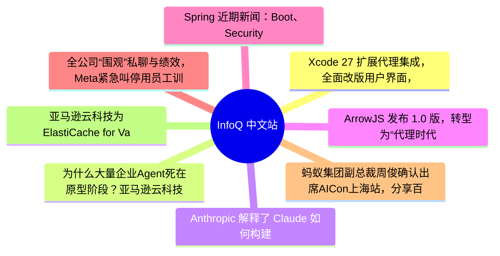

# 📰 InfoQ 中文站 Top 8 (2026-06-25)

## 思维导图

## 列表（8 条，3 条含全文）

### 1. Xcode 27 扩展代理集成，全面改版用户界面，并引入了 DeviceHub
- **链接**: [https://www.infoq.cn/article/VGQNO8bH0sq4kFDb6B7H?utm_source=rss&utm_medium=article](https://www.infoq.cn/article/VGQNO8bH0sq4kFDb6B7H?utm_source=rss&utm_medium=article)
- **发布**: Wed, 24 Jun 2026 17:39:00 GMT
- **简介**: 点击查看原文>

📄 全文（1388 字符，点击展开）

在 2026 年的 WWDC 大会上，[苹果推出了 Xcode 27](https://developer.apple.com/xcode/whats-new/)，旨在使用户能够轻松地借助编码代理启动任务、对新项目构想进行迭代，并自定义工作区。除了其他改进之外，该版本还推出了用于统一管理模拟器和设备的 DeviceHub，并增强了 Organizer 和 Instruments 。

Xcode 27 扩展了工具栏和主题自定义功能，并对关键控件的布局进行了更新。为了便于访问，此前位于跳转栏中的历史记录导航和编辑器控件等元素，现在已经移到了工具栏。最值得注意的是，工具栏现在完全支持自定义，你可以根据自己的工作流程添加、删除和重新排列菜单项。

主题自定义功能也得到了显著的改进，通过更丰富、更直观的用户界面，主题配置变得更加轻松。例如，你可以通过简单的滑块调整文本颜色饱和度和背景透明度。

开发人员还可以为不同的工作区分配不同的主题：

这有助于一目了然地分辨出哪个项目是哪个。因此，如果你发现自己需要快速区分并排显示且可能惊人相似的项目，不妨尝试为它们设置独特的主题。

为了更好地与当前主题相融合，警告和错误提示也经过了重新设计，采用了更低调的外观，旨在减少干扰，并帮助用户将其与构建时问题区分开来。

Xcode 27 完全重新设计了项目创建体验，不仅能更快地启动新项目，还免去了提前命名项目的步骤。通过“未命名”项目，你可以快速进行实验，并在必要时再为其命名。此外，当在项目外打开单个 Swift 文件（例如和同事共享的文件）时，Xcode 现在会在工作区环境中显示该文件，让你能够使用 Playground 结果和 UI 预览等功能。

得益于全新的用户界面，在 Xcode 27 中使用编码代理更加流畅。该界面将对话记录直接集成到编辑器窗格中。对话记录本身以编辑器形式呈现，因此可以自然地与标签页、分屏视图以及你偏好的工作区布局搭配使用。例如，你可以使用 /pl（计划）命令概述代理应考虑的细节。随后，代理会在不进行任何修改的情况下收集必要的背景信息，并呈现完整的计划供你审阅和反馈。

Xcode 27 的另一项新功能是 DeviceHub。它允许你在模拟器和实体设备上浏览和评估应用。它为常见的任务提供了一个统一的界面，例如截屏、旋转设备，以及调整无障碍设置（如对比度、动态字号大小以及浅色或深色外观）。

DeviceHub 让使用模拟器变得轻而易举，但最酷的是，我之前分享的内容同样适用于实体设备。打开侧边栏，就会看到一个同时包含模拟器和设备的列表。我有一台已配对的 iPad Pro 正在运行我的应用，我可以在 DeviceHub 中直接查看并控制它。

Xcode 27 还扩展了应用本地化支持，增强了 AI 集成，并重新设计了 Organizer ，使其优先突出显示影响最大的问题。它将诊断信息和指标整合到了单个视图中，并扩展了对应用建议以及启动时间、卡顿率、磁盘权限、电池和存储等目标集的支持，从而帮助你跟踪这些指标。

Xcode 27 的功能远不止于此。要了解完整信息，可以观看 [WWDC 大会的录像](https://www.youtube.com/watch?v=9zjeImiYtow)。

*所有图片均由 Apple 提供

### 2. 为什么大量企业Agent死在原型阶段？亚马逊云科技储瑞松：Agent工程是关键
- **链接**: [https://www.infoq.cn/article/zod9SeNbe75T8YtrIcEC?utm_source=rss&utm_medium=article](https://www.infoq.cn/article/zod9SeNbe75T8YtrIcEC?utm_source=rss&utm_medium=article)
- **发布**: Wed, 24 Jun 2026 17:22:20 GMT
- **简介**: 点击查看原文>

📄 全文（3610 字符，点击展开）

“Agentic AI 的爆发拐点已经到来。”亚马逊全球副总裁、亚马逊云科技亚太区联席总裁储瑞松表示。推动这一拐点出现的，不只是大模型能力的持续跃迁，更是 Agentic 工程体系的快速成熟。

亚马逊云科技全球数据库服务副总裁 Ganapathy “G2” Krishnamoorthy 进一步指出，Agentic AI 的核心变化在于，AI 正从一次性问答工具，转向能够持续理解上下文、调用工具、执行任务并不断学习的数字劳动力。企业竞争的关键，也将从“有没有使用 AI”，转向“能否把每一次任务都变成下一次任务的智能积累”。

他指出，未来的 AI Agent 将覆盖多类关键场景，包括改变员工工作方式的 Agent、提升安全与合规能力的 Agent、能够理解并交付软件的 Agent，以及帮助企业自行创建智能体的平台能力。

## 模型能力与工程体系形成飞轮

储瑞松认为，过去两年多里，Agentic AI 的底层支撑正在发生关键变化。一方面，大模型能力在快速竞争中持续突破，从推理能力、代码生成到多模态理解，模型的智能水平不断跨越新的门槛。另一方面，基于模型能力的 Agentic 工程体系也在快速成熟。

“二者正在形成一个相互促进的飞轮：模型能力不断提升，让智能体具备更强的推理、代码生成和多模态理解能力；而成熟的 Agentic 工程实践，又把真实业务场景中的反馈传导回模型迭代过程，进一步指引模型能力的突破方向。”

他将 Agentic 工程体系定义为，把模型能力转化为可稳定交付业务结果的智能体的系统化工程能力。这个体系并不是单一技术点，而是一套围绕模型、上下文、工具、流程、评估和治理构建起来的综合工程框架。

Agentic 工程体系的演进可以分为三层：

- 第一层，早期行业广泛关注的 Prompt Engineering，重点是通过更有效的提示词，让模型理解用户希望它完成什么任务。 
- 第二层，Context Engineering，重点是如何在合适的时机，向模型提供正确的信息、工具和记忆，让模型不仅知道“要做什么”，也掌握“完成任务需要知道什么”。 
- 第三层是最近半年成为行业焦点的 Harness Engineering，它更进一步强调围绕模型搭建稳定执行框架，包括智能体循环、工具调用、任务评估、失败重试和安全护栏等机制，让模型不仅能理解任务，也能可靠地把事情做完。 

围绕企业如何实现 Agentic 业务转型，储瑞松提出，企业首先要从工具导向转向业务结果导向。过去，不少企业推进 AI 项目时，关注点往往停留在选择什么模型、采购什么工具、搭建什么系统。但在 Agentic AI 时代，真正重要的问题是：企业到底希望 AI 带来什么业务结果。只有先定义清楚业务目标，模型选择、数据准备、工作流设计和平台建设才有明确方向。

对于希望启动第一个智能体项目的企业，储瑞松建议，起步场景无需过于复杂，但必须具备真实业务价值。理想场景应有明确的起点、终点和业务目标，需要智能体在多个系统和工具之间进行选择与判断，同时拥有可衡量的成功标准。此外，这类场景还应具备安全的失败模式，即便智能体执行出错，也不会造成不可逆后果。此外，企业还需要明确智能体的边界，包括自主程度、管辖范围，以及人机协作中的审核分工。

储瑞松提出，一个实用方法是像为新员工撰写岗位说明书一样定义智能体：明确它的职责范围、交付标准、权限边界和出错预案，并将其与业务 KPI 直接关联。这样一来，企业从启动第一个智能体工作流开始，就能够衡量其业务价值，并逐步扩展到更多 Agentic AI 工作流。

其次，数据也将成为企业最重要的护城河之一。在 Agentic AI 时代，数据不再只是静态资产，而会变成持续驱动智能体为企业创造价值的战略资产。企业多年积累的行业知识、客户数据、运营流程和业务经验，将成为其智能体系统最难被复制的竞争壁垒。

与此同时，Agentic 平台将成为概念验证与生产部署之间的分界线。当企业只是做几个智能体试点时，可以依赖局部工具和单点方案；但当企业要让成百上千个智能体与员工协同，甚至让智能体之间相互协作时，就必须依赖统一平台进行开发、部署、管理、评估和治理。平台能力决定了智能体能否从试验走向规模化生产。

此外，储瑞松还强调，信任和治理是发展的加速器，而不是刹车。企业也需要建立新的角色、流程、责任和管理体系，来协调人类员工与智能体之间的协作关系。

## 企业需要理解上下文的 Agent

“对许多企业员工而言，今天的工作方式已经越来越难以支撑高效协作。”Krishnamoorthy 表示，员工并不真正关心某个任务要在哪个工具里完成，他们真正关心的是，一个想法能否被快速推进、一个客户问题能否被及时响应，一个变更能否真正落地。但现实是，员工不得不在不同系统之间反复切换，承担“连接信息、判断下一步、推动任务流转”的操作员角色。

更大的问题是，许多 AI 工具虽然可以连接企业工具，但它们往往只回答一个问题，然后就忘记上下文。它们在孤立会话中运行，只理解单次请求、单一数据源，却不了解用户与谁协作、正在做什么项目，也无法把分散的业务流程连接成真正的智能系统。

Krishnamoorthy 认为，如果团队仍然需要人类不断连接信息点，如果用户仍然被迫充当工作流中的人工操作员，那么 AI 能够释放的效率就会被严重限制。领先组织之所以能够跑得更快，不只是因为执行速度更快，而是因为它们正在让每一项任务都为下一项任务积累智能。

真正改变工作方式的 Agent，必须能够跨越企业业务、数据和工具运行，并随着每一次查询、每一次活动持续学习。这样一来，用户在第 100 天获得的答案，应该比第 1 天更准确、更贴合业务环境。这意味着 Agent 不只是一个聊天界面，而应具备持续记忆、权限管理、上下文理解和跨系统执行能力。它需要知道谁在行动、哪些数据被访问、数据来自哪里，以及当前策略是否允许该操作。

企业长期面对一个矛盾：安全与速度似乎总是互相牵制。一边是快速开发、快速发布、快速响应客户需求；另一边是安全审查、漏洞检测、合规验证和风险控制。过去，安全经常被视为拖慢进度的环节。

但在 Agentic AI 时代，这种权衡关系不应继续存在。Krishnamoorthy 认为，企业安全正在从“存储、查询、仪表盘和告警”的世界，走向“上下文、推理和访问控制”的世界。没有上下文的安全信号只是噪声，只有结合企业具体环境、架构、权限和业务逻辑，安全系统才能真正判断风险优先级。

## 软件交付成为关键战场

除了工作流和安全，软件开发是 Agentic AI 落地的另一条主线。Krishnamoorthy 表示，几乎每一个 Agent、每一个工作负载、每一个业务站点，最终都会以软件形式交付给客户。因此，软件交付是企业创新速度能否真正转化为业务价值的关键环节。

今天，代码生成已经变得越来越便宜，也不缺少可以快速生成代码的工具。但对企业项目来说，真正困难的不是写出一段代码，而是理解企业环境、开发标准、系统架构和既有约束。一个不了解企业上下文的代码生成工具，可能会制造更多技术债，而不是提升工程效率。

亚马逊云科技认为，企业需要的不是单点代码生成，而是覆盖需求理解、系统设计、实现、测试、验证和发布的完整软件交付能力。Agent 应该能够理解项目结构、架构约束和测试要求，并在发布前完成验证，确保代码不仅“能写出来”，也“能正确交付”。

随着 Agent 写代码速度提升，软件流水线本身也必须同步升级。如果 Agent 让代码产出速度提升 10 倍，但企业的发布管线仍然以旧速度运转，最终瓶颈只会从“写代码”转移到“测试、审核和上线”。

因此，企业需要让发布管理也具备 Agentic 能力。代码生成之后，系统应能自动接管后续流程，包括审查变更、搭建环境、运行测试、发现失败、修复问题，并在问题影响客户之前完成验证。

未来的软件交付将从“人类推动流水线”转向“Agent 协调流水线”。多个 Agent 可以共同维护持续流动的开发、测试和发布流程，让企业在加快交付的同时，避免技术债持续积累。

亚马逊云科技进一步指出，今天许多企业的 Agent 仍卡在原型阶段，无法真正进入生产环境。原因不是模型不够强，而是企业缺少生产级 Agent 所需的基础设施，包括认证、记忆、长任务执行、安全、治理、工具接入、策略控制和运行环境。

在亚马逊云科技看来，企业不能只关注 Agent 本身，而应关注支撑 Agent 进入生产的完整平台。模型可以被视为“大脑”，而 Harness 或平台能力则是“身体”和“安全系统”。没有后者，再聪明的模型也很难可靠地完成企业级任务。

### 3. Anthropic 解释了 Claude 如何构建自己的执行框架
- **链接**: [https://www.infoq.cn/article/DYIUw7abCW7ZYI1OER9i?utm_source=rss&utm_medium=article](https://www.infoq.cn/article/DYIUw7abCW7ZYI1OER9i?utm_source=rss&utm_medium=article)
- **发布**: Wed, 24 Jun 2026 16:16:00 GMT
- **简介**: 点击查看原文>

📄 全文（1432 字符，点击展开）

Anthropic [详细介绍](https://claude.com/blog/a-harness-for-every-task-dynamic-workflows-in-claude-code)了 Claude Code 新推出的“动态工作流”背后的协调系统，并重点描述了该功能如何生成定制化的执行框架，用于协调 AI 代理团队完成复杂的任务。

最初的公告着重介绍了动态工作流在大型软件工程项目中的应用，这次则重点说明了 Claude 如何创建和管理这些工作流。Anthropic 表示，Claude 能够动态生成 JavaScript 框架，用于分配任务、指派代理、验证结果以及确定工作流的持续时间。

该公司认为，这种方法有助于解决与长期运行的 AI 任务相关的若干挑战。Anthropic 指出了诸如“代理惰性”（即 AI 系统在未完全完成任务前便停止运行）、“自我偏好偏差”（即模型在评估过程中倾向于采纳自身的结论）以及“目标漂移”（即在长时间交互过程中目标逐渐模糊）等问题。

动态工作流采用了多个独立的代理，每个代理承担特定的角色，而非使用单一上下文窗口。Anthropic 大致描述了 Claude 的若干策略，包括“扇出与合成”（将任务拆分为并行子任务后再合并）以及“对抗性验证”（由评审代理对其他代理的发现提出质疑）。

该公司还重点介绍了竞赛式工作流，即让多名代理采用不同的方法尝试解决同一问题，并相互评估；此外，他们还介绍了分类器系统，它可以根据任务的复杂程度或要求，将任务分配给不同的代理。

该系统的一个显著特点是模型路由。Anthropic 表示，工作流可以针对任务的不同阶段分配不同的模型，让成本较低的模型处理比较简单的工作，将性能更强的模型保留给需要更深入推理的任务。

开发者对该功能的反应褒贬不一。一些用户认为，动态工作流可能是迈向更自主的 AI 系统的重要一步，而另一些用户则质疑其成本效益权衡。在 Reddit 上的一场讨论中，有一位用户[写道](https://www.reddit.com/r/singularity/comments/1tqxkab/comment/ool1gtn/?utm_source=share&utm_medium=web3x&utm_name=web3xcss&utm_term=1&utm_content=share_button)：

总有一天它会变得很棒，但目前它只是个烧 Token 的炫酷方法。

还有人[指出](https://www.reddit.com/r/ClaudeCode/comments/1tqtlz6/comment/oow3kcm/?utm_source=share&utm_medium=web3x&utm_name=web3xcss&utm_term=1&utm_content=share_button)了模型选择所带来的灵活性：

Claude Code 中的动态工作流允许对每个阶段使用的具体的子代理进行精确控制。根据复杂程度的不同，可以为不同的任务分配不同的模型。

例如，对于不需要大量推理的工作流，可以使用成本更低的模型。通过这种方式，可以有效地优化并降低每次执行工作流时的总体运营成本。

这一讨论反映了 AI 发展中存在的一种更广泛的趋势：企业越来越关注编排框架、验证系统和多智能体协调，借此来提升性能，使其超越单个模型的能力范围。

### 4. ArrowJS 发布 1.0 版，转型为“代理时代”的首个 UI 框架
- **链接**: [https://www.infoq.cn/article/JW7bom70PQ14N2OlVRLt?utm_source=rss&utm_medium=article](https://www.infoq.cn/article/JW7bom70PQ14N2OlVRLt?utm_source=rss&utm_medium=article)
- **发布**: Wed, 24 Jun 2026 14:00:00 GMT
- **简介**: 点击查看原文>

### 5. Spring 近期新闻：Boot、Security、Integration、Modulith 发布增量版本及 Spring AI 2.0 正式发布
- **链接**: [https://www.infoq.cn/article/Jpi5XBmoO8smLYSyaD9t?utm_source=rss&utm_medium=article](https://www.infoq.cn/article/Jpi5XBmoO8smLYSyaD9t?utm_source=rss&utm_medium=article)
- **发布**: Wed, 24 Jun 2026 11:11:00 GMT
- **简介**: 点击查看原文>

### 6. 全公司“围观”私聊与绩效，Meta紧急叫停用员工训练AI：士气崩了，员工怒骂高管“狗屎”
- **链接**: [https://www.infoq.cn/article/puuuQ3qD8AKrP5AmBGfk?utm_source=rss&utm_medium=article](https://www.infoq.cn/article/puuuQ3qD8AKrP5AmBGfk?utm_source=rss&utm_medium=article)
- **发布**: Wed, 24 Jun 2026 10:16:58 GMT
- **简介**: 点击查看原文>

### 7. 蚂蚁集团副总裁周俊确认出席AICon上海站，分享百灵 2.6 的系统协同设计及挑战
- **链接**: [https://www.infoq.cn/article/hG1Rz8KImMfgLirwscPv?utm_source=rss&utm_medium=article](https://www.infoq.cn/article/hG1Rz8KImMfgLirwscPv?utm_source=rss&utm_medium=article)
- **发布**: Wed, 24 Jun 2026 10:00:00 GMT
- **简介**: 点击查看原文>

### 8. 亚马逊云科技为ElastiCache for Valkey推出持久化存储选项
- **链接**: [https://www.infoq.cn/article/ueZqEfU5byzB48PNBfi1?utm_source=rss&utm_medium=article](https://www.infoq.cn/article/ueZqEfU5byzB48PNBfi1?utm_source=rss&utm_medium=article)
- **发布**: Wed, 24 Jun 2026 09:40:58 GMT
- **简介**: 点击查看原文>
