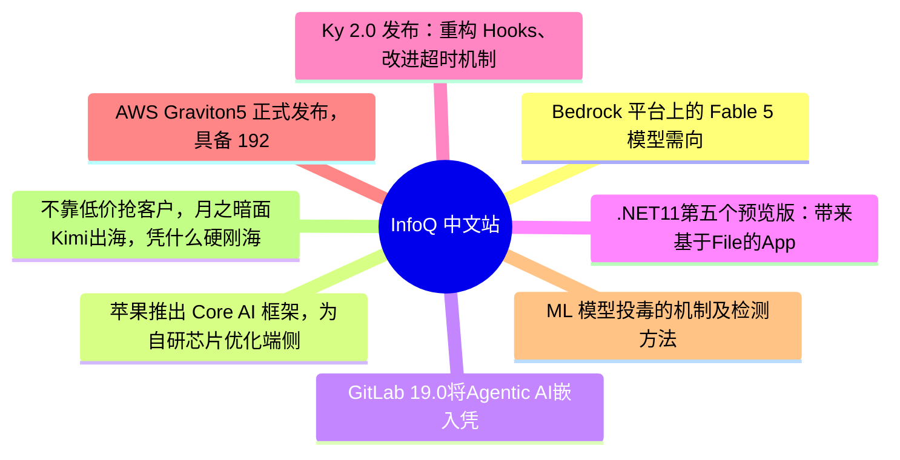

# 📰 InfoQ 中文站 Top 8 (2026-06-29)

## 思维导图

## 列表（8 条，3 条含全文）

### 1. Bedrock 平台上的 Fable 5 模型需向 Anthropic 共享推理数据
- **链接**: [https://www.infoq.cn/article/NodhKVrhWoYF9yGwm12j?utm_source=rss&utm_medium=article](https://www.infoq.cn/article/NodhKVrhWoYF9yGwm12j?utm_source=rss&utm_medium=article)
- **发布**: Sun, 28 Jun 2026 14:00:00 GMT
- **简介**: 点击查看原文>

📄 全文（3419 字符，点击展开）

在[亚马逊 Bedrock](https://aws.amazon.com/blogs/aws/anthropic-claude-fable-5-on-aws-mythos-class-capabilities-with-built-in-safeguards-now-available/) 平台上使用 Anthropic 的 Claude Fable 5 或 Mythos 5 需要启用 `provider_data_share`，这是一种数据保留模式，会将提示词和输出结果发送给 Anthropic 保留 30 天，并接受人工审查，且没有其他替代模式。上述两款模型的 `allowed_modes` 字段只有一个有效值。

亚马逊 Bedrock 平台此前上线的所有模型（包括 Opus 4.8、Sonnet、Haiku），推理数据都保留在 AWS 边界内，模型服务商无法获取任何相关数据。正是这项数据隔离保障让 Bedrock 顺利通过采购审批、法务审核，以及从概念验证阶段到落地生产环境之前所需完成的安全问卷审查。而 Fable 5 打破了这一规则。

[AWS 博客文章](https://aws.amazon.com/blogs/aws/anthropic-claude-fable-5-on-aws-mythos-class-capabilities-with-built-in-safeguards-now-available/)在文末直白写明：

一旦你启用数据留存功能，你的数据将脱离 AWS 的数据与安全隔离边界。

Anthropic 将 30 天数据留存机制定位为 Mythos 系列模型的安全强制要求，需要借助拦截分类器识别新型攻击和模型越狱行为。该公司表示，后续同性能级别的模型都将沿用此项规定。这项要求并非 AWS 单方面制定，而是 Anthropic 的统一政策，会在所有上架 Fable 5、Mythos 5 的平台统一执行。

[Reddit](https://www.reddit.com/r/aws/comments/1u1yt4k/aws_bedrock_to_require_sharing_data_with/) 上有一位评论者反驳称，不应将安全审核与训练数据采集混为一谈：

需要厘清一个关键区别：这是用于安全评估，而非训练下一代模型的权重。Anthropic 临时保留推理数据是为了检测滥用行为和研究模型表现，而不是将这些数据用于预训练。对于医疗、金融行业而言，这仍然是一个不容忽视的风险点，但安全威胁模型与“我们的提示词会成为未来 Claude 的一部分”完全是两码事。

[Securosis](https://securosis.com/blog/aws-destroyed-the-value-proposition-for-bedrock/) 云安全研究员 Chris Farris 发表了一篇详细评述，指出 AWS 违背了 Bedrock 平台的核心价值主张：

AWS Bedrock 的全部价值在于它是企业与模型提厂商之间的中立平台。它保证数据和推理驻留在 AWS 边界内，企业数据绝无可能被模型厂商用于其自身目的。剥离了这一点，AWS Bedrock 就成了功能更少的 Anthropic 第一方服务。

此举会立刻引发一系列数据治理层面的连锁问题。Anthropic 将成为次级数据处理方，可获取用户输入与模型输出内容，还能对标记的敏感内容开展人工审核。对于受监管企业来说，这意味着需要修订数据处理协议、更新次级处理方清单、重新梳理数据处理活动记录，同时重新评估所有调用该系列模型业务负载的合法处理依据。Farris 表达了有关《CLOUD 法案》的顾虑：Anthropic 是一家正在与美国政府合作部署其最强模型的美国公司，这使得保留的数据可能受到美国法律请求的管辖。

[Reddit](https://www.reddit.com/r/aws/comments/1u1yt4k/aws_bedrock_to_require_sharing_data_with/) 上的一位德国从业者证实了该影响：

这件事会让我们直接放弃合作，我相信很多德国及欧洲本土企业也会如此。

医疗机构还将面临额外的合规漏洞。一位 Reddit 评论者直接提出了这个问题：

Anthropic 会通过 Bedrock 提供与他们签订 BAA（商业伙伴协议）的方式吗？我们持有医疗健康数据，没有 BAA 就无法合法共享个人身份信息（PII）与受保护健康信息（PHI）。我们已和 AWS 签订该协议，这也是我们选用 Bedrock 的原因。

已签署 AWS 业务伙伴协议且协议覆盖 Bedrock 推理业务的企业团队需要确定：Anthropic 作为次级数据处理方是否需要另行签署独立协议，而针对当前这条数据链路，目前或许尚不存在独立的协议。

该功能的上线方式招致了最尖锐的批评。数据保留 API 与模型在同一时刻正式启用，安全团队未收到任何提前通知。虽然平台提供了基于服务控制策略（SCP）的全局阻断方案，可借助 `bedrock-mantle:DataRetentionMode` 在整个组织范围内禁用数据共享，但相关说明被埋在文档的一个子章节中，没有任何公告。Farris 指出：

这项能力得到了大肆宣传，对应的防护措施却连文档脚注都不配拥有。

另一项监控盲区让问题雪上加霜。`bedrock-mantle` 记录的 CloudTrail 事件源（`bedrock-mantle.amazonaws.com`）与普通 Bedrock（`bedrock.amazonaws.com`）完全不同。如果你的 CSPM 规则和安全检测器正在监控 Bedrock 活动，它们不会捕获数据保留变更。你必须显式添加 Mantle 事件源。

AWS 随后通过 Builder Center 发布了[隔离指南](https://builder.aws.com/content/3F2mpnIhuSEHC4SDFrqoINtipZD/isolate-claude-fable-5-data-retention-with-mantle-projects)，建议为启用了 `provider_data_share` 的 Fable 5 单独创建 Bedrock 项目，同时将生产工作负载保持在零保留模式下。Farris 记录了一个 [SCP 模式](https://securosis.com/blog/aws-destroyed-the-value-proposition-for-bedrock/)，使用 `bedrock-mantle:DataRetentionMode` 在组织范围内拒绝除 `none` 以外的任何保留模式，对已获批准用例且已签署 DPA 的特定账户例外开放权限。

后续事态有新进展，6 月 12 日，AWS [更新了博客文章](https://aws.amazon.com/blogs/aws/anthropic-claude-fable-5-on-aws-mythos-class-capabilities-with-built-in-safeguards-now-available/)，指出 Anthropic 已要求 AWS 撤销所有用户对 Claude Fable 5 和 Claude Mythos 5 的访问权限，理由是遵守美国政府出口管制指令。所有其他模型，包括 Opus 4.8，均不受影响。在模型可用的三天内已在账户级别启用 `provider_data_share` 的团队应部署 Farris 的 SCP 模式以恢复默认的零保留状态。

对于企业而言，它们需要深思的核心问题是：这是前沿安全模型的一次性例外，还是新常态？Anthropic 已暗示是后者。那些因数据从不离开 AWS 边界而选择 Bedrock 的团队现在面临抉择：要么继续使用 Opus 4.8，接受模型能力上的差距；要么升级前沿大模型，接受一套完全不同的数据治理规则。这是架构师、法务和合规团队需要共同参与讨论的话题，而且应该在发布日之前就开始，而不是之后。

### 2. 苹果推出 Core AI 框架，为自研芯片优化端侧生成式 AI
- **链接**: [https://www.infoq.cn/article/x6KDPdgrdHzY7I38JK9U?utm_source=rss&utm_medium=article](https://www.infoq.cn/article/x6KDPdgrdHzY7I38JK9U?utm_source=rss&utm_medium=article)
- **发布**: Sun, 28 Jun 2026 11:06:00 GMT
- **简介**: 点击查看原文>

📄 全文（2573 字符，点击展开）

在 2026 年 WWDC 大会上，苹果发布了 [Core AI 框架](https://developer.apple.com/documentation/coreai)，Core ML 的官方继任者。该框架旨在让开发者能够完全在设备本地运行大语言模型和生成式 AI，同时支持自定义转换后的 PyTorch 模型和预优化的开源模型。

苹果表示，新的 Core AI 框架提供了一个统一的架构，可在 iPhone、iPad、Mac 以及 Apple Vision Pro 上部署[小至仅 30 亿参数的视觉模型、大至最高 700 亿参数的推理模型）](https://developer.apple.com/videos/play/wwdc2026/324/?time=33)。

Core AI 是 Apple Intelligence 的底层技术，随着苹果下一代操作系统与工具链发布，开发者将可使用该框架打造苹果所称的 “自定义智能功能”。Core AI 只能在 Apple Silicon 上运行，确保用户数据隐私、零服务器依赖，也不会产生按词元计费的云端开销。

Core AI 的关键能力包括：统一硬件访问，工作负载可使用单个 API 在 CPU、GPU 和神经网络引擎上无缝运行；内存安全的 Swift API 可实现零拷贝数据路径和对推理内存的精细控制；提前（AOT）编译技术，将运算预处理工作转移至设备外部完成，实现近乎瞬时的模型加载速度。

如前所述，你可以使用 [Core AI PyTorch](https://apple.github.io/coreai-torch) 将 PyTorch 模型转换为 Core AI 模型。最简单的方法是将 PyTorch 导出为 `torch.export.ExportedProgram`，然后使用 `TorchConverter().add_exported_program(ep).to_coreai()` 将其转换为 CoreAI 的 AIProgram。

或者，你可以使用库提供的[内置复合算子](https://apple.github.io/coreai-torch/main/guides/composite-ops.html)（如注意力机制、RoPE 嵌入、RMSNorm 和 gather-matmul）基于现有 PyTorch 模型构建新的 Core AI 模型，注册自定义降阶函数以便将新的 PyTorch 算子映射到 Core AI IR，甚至创建[自定义 Metal 内核](https://apple.github.io/coreai-torch/main/guides/custom-metal-kernels.html)以实现更底层的优化。

转换 PyTorch 模型时，一个关键步骤是[针对 Apple 硬件进行压缩部署](https://apple.github.io/coreai-optimization/)。该过程应用了[量化](https://apple.github.io/coreai-optimization/quantization/index.html)和[调色板化](https://apple.github.io/coreai-optimization/palettization/index.html)等优化技术，这些技术默认与 Core AI 运行时的执行模式对齐，确保高效的设备端性能。

模型压缩有助于减少模型的内存占用（包括磁盘大小和运行时占用）、降低推理延迟、降低功耗，或同时实现以上全部优化。

运行 AIModel 有一个关键特性：模型会自动[特化](https://developer.apple.com/documentation/CoreAI/compiling-core-ai-models-ahead-of-time)当前硬件和操作系统版本，这个过程在模型首次加载到模型缓存时完成。因此，首次使用模型的耗时可能比后续长一些。开发者可以通过自定义 [SpecializationOptions](https://developer.apple.com/documentation/coreai/specializationoptions)、访问 [AICacheModel](https://developer.apple.com/documentation/coreai/aimodelcache) 来检查模型是否已可用或删除已缓存的模型，甚至可以在应用组之间共享模型缓存。

随着 Core AI 的推出，苹果为其操作系统上的 ML/AI 提供了三种不同的运行方式：Core ML、Core AI 和 MLX Swift。根据 Hacker News 上的开发者讨论来看，[苹果的使用建议](https://news.ycombinator.com/item?id=48459443)是：将 Core ML 用于“经典的非神经网络 ML”，如决策树或表格特征工程；将 Core AI 用于神经网络和 Transformer；将 MLX 用于处理自定义模型权重——尽管可能[性能较低](https://news.ycombinator.com/item?id=48454273)。[社区反馈还指出](https://www.reddit.com/r/iOSProgramming/comments/1u1nfxr/comment/or7429o/?utm_source=share&utm_medium=web3x&utm_name=web3xcss&utm_term=1&utm_content=share_button)，虽然 Core AI “让集成高性能 LLM 变得更加容易”，但其长期价值将取决于“官方 Core AI/社区的未来发展”。

查看英文原文：[https://www.infoq.com/news/2026/06/apple-core-ai-wwdc/](https://www.infoq.com/news/2026/06/apple-core-ai-wwdc/)

### 3. GitLab 19.0将Agentic AI嵌入凭证、合并请求与供应链安全
- **链接**: [https://www.infoq.cn/article/ICdHZotGllYog0ocIrxA?utm_source=rss&utm_medium=article](https://www.infoq.cn/article/ICdHZotGllYog0ocIrxA?utm_source=rss&utm_medium=article)
- **发布**: Sun, 28 Jun 2026 09:00:00 GMT
- **简介**: 点击查看原文>

📄 全文（1992 字符，点击展开）

GitLab 发布了[GitLab 19.0](https://docs.gitlab.com/releases/19/gitlab-19-0-released/)版本，把 Agentic AI 从代码生成推向与之相关的工作流中：凭证安全、变更审查与合并，以及已发布包的依赖扫描。5 月 21 日的发布这个版本包含了 GitLab Secrets Manager 的公开测试、将 Developer Flow 智能体扩展到完整的合并请求生命周期中，并正式发布软件物料清单（SBOM，software bill of materials）依赖扫描。

[GitLab Secrets Manager](https://about.gitlab.com/blog/secrets-manager-in-public-beta/)目前对 Premium 与 Ultimate 用户发布了公开测试，它将在运行代码与流水线的同一平台内保存凭证，并将每个 secret 限定为仅允许被授权的 job 使用。访问控制与审计日志沿用 GitLab 现有的 group 与 project 层级，无需独立的授权模型。如果凭证被泄露的话，响应者可以从 GitLab 审计轨迹追溯每个使用该凭证的 job。该功能与 HashiCorp Vault、AWS Secrets Manager、Azure Key Vault、Google Cloud Secret Manager 兼容，并非替代这些服务。

在合并请求方面，[Developer Flow](https://about.gitlab.com/blog/transform-mrs-to-automated-workflow/)现在能处理审阅者反馈、拆分过大的 MR 并自动解决冲突。该流程在提交前会从`AGENTS.md`读取项目规范，这样生成的产出能够反映团队的上下文而不是通用的默认方式。新的 Resolve with Duo 按钮（beta）会评估双方分支、提交建议修复并留下概要注释供后续审阅。一次性的 rebase-and-merge 支持 fast-forward 与半线性合并。GitLab Duo 遵守分支保护规则，不会对受保护分支强制推送。

此版本还将 GitLab Duo Core 迁移为按使用计费。Web IDE 与桌面 IDE 中的 Code Suggestions 现在使用[GitLab Credits](https://docs.gitlab.com/subscriptions/gitlab_credits/)计费，GitLab Duo Chat 也变为基于智能体运行，团队需启用 GitLab Duo Agent Platform 以继续使用。平台工程师将获得 Components Analytics 数据，显示组织内运行的 CI/CD Catalog 组件及版本，以及尚未落地的安全修复的位置。

在供应链方面，基于 SBOM 的依赖扫描现已正式发布，覆盖 Maven、npm、NuGet、PyPI、Go 与 Cargo 等生态系统。自动依赖解析（在项目未提交 lockfile 时生成所需的 lockfile 或依赖图导出）默认对 Maven、Gradle 与 Python 启用，必要时能够回退到 manifest 扫描。安全配置策略允许团队通过策略开启 Secret Detection、SAST 与依赖扫描，而无需逐项目修改 CI 配置。对于自托管团队，GitLab Duo Agent Platform 为无网络的环境提供了包括 Mistral Devstral 2 123B 与 GLM-5.1 在内的四个开源模型，并新增对 Claude Opus4.7 与 Gemini 的支持。

GitLab 的首席产品与市场官 Manav Khurana 表示：“AI 加速了代码生成，但并未让大规模信任或保障变得更容易。当安全、自动化与治理、代码共享同一平台时，团队能在 AI 加速下保持对交付物的控制，而这正是 GitLab 19.0 要实现的。”

GitLab 19.0 同时提升了对平台的要求：将 PostgreSQL 17 设为最低版本、停止对 Redis 6 的支持，并移除针对 Ubuntu 20.04 与 SUSE 发行版的 Linux 包。包括[GitHub](https://github.com/features/copilot/agents)与[Atlassian](https://www.atlassian.com/software/rovo)在内的竞争对手也在推进类似的 agentic 功能，因此平台团队需要在治理与定价模型上权衡，选择与安全需求及预算相符的方案。

### 4. .NET11第五个预览版：带来基于File的App改进、新C#特性与Blazor校验抖动效果
- **链接**: [https://www.infoq.cn/article/9k2FtAR89wsZVgkh7BQv?utm_source=rss&utm_medium=article](https://www.infoq.cn/article/9k2FtAR89wsZVgkh7BQv?utm_source=rss&utm_medium=article)
- **发布**: Sat, 27 Jun 2026 11:00:00 GMT
- **简介**: 点击查看原文>

### 5. Ky 2.0 发布：重构 Hooks、改进超时机制，并内置 Schema 校验能力
- **链接**: [https://www.infoq.cn/article/v1wsHJd54imD1b4yUeYf?utm_source=rss&utm_medium=article](https://www.infoq.cn/article/v1wsHJd54imD1b4yUeYf?utm_source=rss&utm_medium=article)
- **发布**: Sat, 27 Jun 2026 09:00:00 GMT
- **简介**: 点击查看原文>

### 6. AWS Graviton5 正式发布，具备 192 个内核和经过正式验证的虚拟机隔离功能
- **链接**: [https://www.infoq.cn/article/ONqpdtmlUXgF32G1vqT2?utm_source=rss&utm_medium=article](https://www.infoq.cn/article/ONqpdtmlUXgF32G1vqT2?utm_source=rss&utm_medium=article)
- **发布**: Mon, 29 Jun 2026 11:50:00 GMT
- **简介**: 点击查看原文>

### 7. ML 模型投毒的机制及检测方法
- **链接**: [https://www.infoq.cn/article/GqFL7BV2JopihkBJWkt2?utm_source=rss&utm_medium=article](https://www.infoq.cn/article/GqFL7BV2JopihkBJWkt2?utm_source=rss&utm_medium=article)
- **发布**: Mon, 29 Jun 2026 10:14:27 GMT
- **简介**: 点击查看原文>

### 8. 不靠低价抢客户，月之暗面Kimi出海，凭什么硬刚海外AI“御三家”？
- **链接**: [https://www.infoq.cn/article/uJ7sK8HW50T256cMoVF1?utm_source=rss&utm_medium=article](https://www.infoq.cn/article/uJ7sK8HW50T256cMoVF1?utm_source=rss&utm_medium=article)
- **发布**: Mon, 29 Jun 2026 10:03:31 GMT
- **简介**: 点击查看原文>
