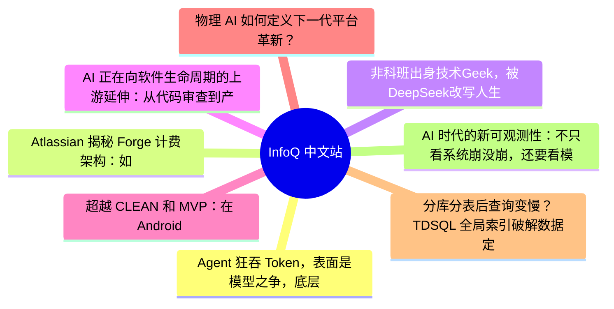

# 📰 InfoQ 中文站 Top 8 (2026-06-30)

## 思维导图

## 列表（8 条，2 条含全文）

### 1. Agent 狂吞 Token，表面是模型之争，底层全是煤电博弈
- **链接**: [https://www.infoq.cn/article/5sAu5pdOatCpxaIU4vOw?utm_source=rss&utm_medium=article](https://www.infoq.cn/article/5sAu5pdOatCpxaIU4vOw?utm_source=rss&utm_medium=article)
- **发布**: Tue, 30 Jun 2026 11:02:41 GMT
- **简介**: 点击查看原文>

📄 全文（4021 字符，点击展开）

## AI 开始进入算账阶段

过去一年，模型厂商不断降价，DeepSeek、通义千问、智谱、MiniMax 等国产模型，也把大模型调用价格拉到了一个新的区间。表面看，Token 价格是模型厂商之间的竞争结果，可如果往更底层看，每一个 Token 背后，都有一条从电力、土地、机柜、制冷、网络、存储、GPU 调度到企业内部使用方式的长链条。

优刻得董事长兼 CEO 季昕华在接受 InfoQ 采访中谈到，今天企业老板最关心的事情大致有三件：第一，如何让员工用上、用好 AI；第二，用了一段时间后发现成本很高，如何降低成本；第三，如何真正提高效率。也就是说，AI 不是不用了，而是开始进入算账阶段。

Token 成本不只是 API 标价问题，它正在变成一场贯穿“电力—算力—模型—应用—组织”的系统工程。

优刻得到乌兰察布，最早不是因为 AI。

据优刻得副总裁刘杰回忆，2017 年筹划建设乌兰察布数据中心时，AI 还没有真正起来。当时更多考虑的是 CPU 业务，第一栋楼最初也是按照 CPU 计划来做，后面才逐步转向 GPU。那时 优刻得的设想，是把乌兰察布作为服务北京的“前店后厂”：北京是用户和业务前台，乌兰察布提供低成本、低时延的数据中心支撑。

选择乌兰察布也不是拍脑袋。季昕华提到，当时苹果在国内选数据中心，由于对优刻得的技术水平比较认可，曾让优刻得一起参与选址。他们团队跑了很多地方，从贵州、四川、重庆、青海、宁夏、甘肃一路看到内蒙古，最后发现乌兰察布是一个很适合建数据中心的地方。

原因很直接：第一，电比较便宜；第二，苹果要求 100% 绿电，内蒙古有机会做到；第三，天气比较冷，PUE 更好做；第四，离北京近，不管是网络时延，还是人员往来，都比较方便。

这些因素放在云计算时代已经重要，放到 AI 时代更重要。

因为 AI 最终会把所有成本打穿到电力上。季昕华在谈到 Token 降本时说得很直白：Token 的终局是电力，电便宜，Token 就便宜。内蒙古的优势也正在这里。

在现场交流中，刘杰表示，他们其实也算过一笔账。

“以一台某国外顶级服务器为例，其功耗约 6.5 千瓦，一台服务器通常有 8 张 GPU 卡。一个千卡集群大约需要 125 台服务器。仅服务器本身，一年耗电就已经是一个很大的数字；如果再乘上 PUE 系数，才是数据中心真正要承担的总用电。”

这就是为什么数据中心选址、电价、PUE、高功率机柜，会直接影响 Token 成本。

过去 IDC 行业讲“柜子”，更关注机柜数量。但 AI 时代，“多少个柜子”本身已经不够说明问题。优刻得青浦数据中心约 42 亩地，设计容量约 5000 个机柜；乌兰察布园区约 212 亩地，设计容量约 12000 个机柜。但季昕华和优刻得方面都提到，传统机柜和今天 AI 算力需要的高功率机柜已经不是一回事。

大模型训练和推理需要更高的功率密度。普通机柜可能放不下多台高功耗 GPU 服务器，单机柜供电能力、散热能力、网络布线、液冷能力，都会重新定义数据中心价值。现场交流中提到，液冷单机柜可以做到 35 千瓦，这背后需要电路和散热系统专门改造。

## 如何真正降低 Token 成本？

这也是为什么一些传统低功率数据中心正在出现空置，而高功率数据中心反而供不应求。

季昕华提到，国内现在有些原来低功率数据中心空闲率比较高，但像优刻得这类高功率数据中心，还没有开始建，就已经有订单进来。季昕华表示，新建的数据中心按照前几栋楼的情况和市场需求判断，满载率预计会非常高，已有一些签约订单。

数据中心的成本竞争，正在从“有没有楼”转向“能不能承载 AI”。

乌兰察布的优势也不只是便宜电。

这里海拔较高，年均温度低，天然有利于制冷。PUE，也就是能源使用效率，是数据中心非常关键的指标。简单说，数据中心总用电中，真正用于服务器计算的比例越高，PUE 越低，能源利用效率越好。气温低意味着制冷能耗下降，PUE 更容易做低。

此外，乌兰察布所在区域的能源结构相对稳定。这里有风电、光电，也有煤电，供电结构更稳。对于 AI 数据中心来说，便宜电固然重要，但稳定电力同样重要。

GPU 集群不怕贵一点，怕的是中断和不稳定。训练任务一旦中断，损失的不只是电费，还有时间、算力窗口和客户信任。

所以，Token 降本的第一层答案，是选对地方，把电力成本压下来，把 PUE 做下来，把高功率机柜建起来。

但这只是开始。

季昕华在谈到如何降低 Token 成本时，给出了几个方向。

第一个方向，是使用国内模型。相较海外模型，DeepSeek 等国内模型在价格上有明显优势，智谱、MiniMax 等客户和模型厂商也在持续提升能力。对很多企业应用来说，并不是所有任务都必须调用最贵、最强的模型。一个 85 分的模型在某些任务上确实更好，但一个 80 分模型如果也能完成任务，且成本低得多，就会成为更现实的选择。

第二个方向，是从技术上提高“每度电产生 Token 的数量”。这句话很关键，它把 AI 成本问题重新拉回到基础设施效率上。过去大家习惯讨论每百万 Token 多少钱，但真正决定长期成本的，是每一度电最终能转化成多少有效 Token。GPU 利用率、推理框架、模型部署、网络通信、存储读写，都会影响这件事。

第三个方向，是选择合适的数据中心位置。内蒙古这种电力和气候条件较好的地方，可以在底层成本上形成优势。乌兰察布更适合训练，以及覆盖北方的大部分推理需求；而上海的青浦更适合华东地区对时延更敏感的业务，比如金融、汽车等场景，也更适合部分推理业务。这实际上对应了“东数西算”的分工逻辑：不是所有算力都必须离用户最近，也不是所有算力都适合放到西部，而是要按任务类型拆分。

第四个方向，是模型组合。季昕华提到，不同模型的能力边界不同，企业不能总想着用一个模型解决所有问题。比如有些模型适合前端代码，有些模型适合后端，有些模型适合测试，有些模型适合需求分析或写作。未来更合理的方式，是把一个任务拆开，让不同模型处理各自擅长的部分，甚至由平台自动帮用户选择模型。

这点非常重要。因为 AI 降本并不等于一味调用便宜模型，而是在“效果”和“成本”之间做动态路由。一个复杂任务里，真正需要顶级模型处理的部分可能只有 20%，其他部分可以交给更便宜、更快的模型完成。这样才是面向企业级 AI 应用的真实降本。

第五个方向，是 Prompt 管理和 Prompt Engineering。很多企业现在一边喊 AI 成本高，一边并没有建立内部使用规则。员工怎么提问、调用什么模型、是否复用模板、是否重复调用、是否把简单问题交给高价模型，这些都会影响 Token 消耗。季昕华提到，让员工按照一定规则用好 Token，也是降本的重要手段。

这就把问题从基础设施推进到了组织管理。

企业真正的问题不是“有没有 AI”，而是“AI 花出去的钱有没有产生价值”。

季昕华谈到，优刻得内部每天都会看 AI 使用报告，包括多少员工用了 AI、用了多少钱、用在什么场景上。Coding 是用量非常大的场景，查询、PPT 等场景也在增长。但他也承认，目前最大的问题，是如何衡量这些投入到底带来了多少产出。

这可能是所有企业都绕不开的问题。

AI 工具铺开之后，会出现三类情况：第一，很多员工还在摸索怎么用，效果并不稳定；第二，有些调用并不是为了公司业务，而是个人使用；第三，真正用于公司工作的部分，到底提效多少，还需要评估。季昕华提到，优刻得正在做一个产品，帮助企业分析员工使用 AI 是否用于公司工作，以及使用效率是否高。

## Token 需求不会只是一次热闹

这其实是 Token 时代企业管理的新命题。

SaaS 时代，企业买软件，通常按账号、席位、模块付费。员工越活跃，往往说明软件价值越高。但 AI 不一样，用得越多，成本越高。如果企业没有治理体系，老板推动 AI 之后，很快就会遇到一个尴尬局面：感觉没有明显提效，但账单多了一大块。

因此，便宜 Token 的另一面，不是无限调用，而是 Token 治理。

这也是为什么季昕华把“如何让老板或管理干部评估 Token 产生的效益”视为当前最大的挑战之一。

AI 真正进入企业，不只是技术升级，也会倒逼生产关系调整。

未来组织里，高层更需要回答“做什么”和“为什么做”，AI 更多解决“怎么做”，中间还需要懂业务、懂架构的人来驾驭 AI，避免 AI 做着做着跑偏。

他甚至谈到，AI 时代的人才观也会变化。过去企业招聘更看重经验，但有了 AI 之后，学习一门新技术的门槛下降了。主动性、好奇心、自我反思能力、业务理解，可能变得比单纯经验更重要。因为 AI 每天都在变化，真正稀缺的不再只是“会不会写代码”，而是能不能判断问题、拆解任务、驾驭工具，并把 AI 产出落到业务结果上。

这也解释了为什么 Token 需求不会只是一次热闹。

对于算力需求是否长期持续，季昕华给出的判断比较明确：Token 增长是长期趋势。年初某些现象级智能体应用带动了普通用户快速体验 AI，但即便热点退去，Token 量仍在快速增长。

原因在于，AI 能力本身在提升，尤其是 Coding 能力已经让 AI 真正进入“干活”阶段；视频、图片模型让短剧、漫剧等内容生产释放出大量需求；广告营销、市场推广、财务、HR 等企业内部岗位也开始使用 AI；此外，录音转会议纪要、智能眼镜、智能戒指等 AI 硬件，也在持续消耗 Token。

这几个需求来源有一个共同点：它们不是单次尝鲜，而是工作流、内容流和硬件入口的持续消耗。

其中，Coding 是最明确

...（截断，原文 7005+ 字符）

### 2. Atlassian 揭秘 Forge 计费架构：如何在分布式环境下实现大规模用量计费
- **链接**: [https://www.infoq.cn/article/5a8OTMYRHj6XZIpOTVoo?utm_source=rss&utm_medium=article](https://www.infoq.cn/article/5a8OTMYRHj6XZIpOTVoo?utm_source=rss&utm_medium=article)
- **发布**: Tue, 30 Jun 2026 10:50:00 GMT
- **简介**: 点击查看原文>

📄 全文（1588 字符，点击展开）

Atlassian 近日介绍了自家 [Forge 计费平台](https://www.atlassian.com/blog/atlassian-engineering/engineering-the-forge-billing-platform-for-reliability-and-scale)背后的技术架构。该系统负责支撑 Forge 平台的按量计费能力，将分散在各个云服务中的使用数据转换成准确的计费记录。Forge 是 Atlassian 面向 Jira、Confluence 等产品推出的无服务器扩展开发平台，而这套计费系统则承担着在大规模分布式环境下完成使用量统计和费用核算的任务。

随着 Forge 从早期简单的扩展机制逐渐发展成一个按使用量收费的平台，计费依据也变得越来越细。例如函数调用次数、存储使用量以及各种运行时遥测数据，都会直接影响最终费用。这意味着 Atlassian 必须建立一套新的系统，用来收集来自不同服务的大量事件数据，并确保这些数据能够被正确校验、准确归属到对应租户，同时在不重复、不遗漏的前提下转换为可计费记录，并向开发者提供接近实时的使用情况反馈。

从整体架构来看，这套系统由几个部分组成：负责产生使用事件的 Forge 服务、统一的数据接入与流处理层、使用量追踪系统，以及下游的计费和商业系统。所有 Forge 服务都通过统一的事件模型输出结构化事件，从而保证无论数据来自哪个服务，下游系统都能以一致的方式进行解析和处理。

Atlassian 表示：

UTS（Usage Tracking Service，使用量追踪服务）是 Forge 计费体系中的“神经系统”。

UTS 扮演着整个使用数据协调层的角色，负责对进入系统的事件进行校验、标准化、补充上下文信息，并为后续计费流程做好准备。同时，它还负责将使用数据准确关联到对应的授权或订阅对象，然后再写入存储并传递给下游系统。

这些事件通过基于 Kafka 的流处理基础设施以及 Atlassian 内部的数据传输抽象层进行传递。该层不仅负责模式校验，也保证数据能够可靠地送达后续消费者。通过将生产者和消费者解耦，平台降低了服务之间的依赖关系，同时也让数据接入和处理能力能够分别独立扩展。

Atlassian 指出：

这里最复杂的问题在于归属关系和数据格式：每个事件都必须准确归属到正确的授权或订阅上下文，同时还必须符合 UTS 的数据契约要求，才能被下游系统正确处理。

进入系统之后，使用事件会经过追踪层进一步处理，包括数据校验、标准化、上下文补充、去重以及排序等步骤。即使出现事件乱序到达，或者因为重试机制导致同一事件被重复发送，系统仍然能够保证最终计费结果的准确性。

数据接入流水线（来源：[Atlassian 博客](https://www.atlassian.com/blog/atlassian-engineering/engineering-the-forge-billing-platform-for-reliability-and-scale)）

为了应对分布式环境中的一致性问题，这套系统采用了幂等事件设计和基于时间窗口的聚合机制。重复投递的事件不会导致重复计费，而延迟到达的数据也能够通过窗口处理机制被重新纳入统计范围。

在此基础上，流处理引擎会将原始使用事件转换成可用于计费和分析的聚合指标。数据则分别存储在不同层级的系统之中：长期存储层采用不可变数据结构，以满足审计和追溯需求；低延迟分析层则为仪表盘和 API 提供实时查询能力。

最终，所有使用量数据都会映射到对应的开发者空间，实现按应用维度的使用统计和统一计费。通过这种设计，Forge 能够在大规模环境下提供透明的按量计费能力，同时保证财务数据的准确性以及完整的可追溯性。

### 3. 非科班出身技术Geek，被DeepSeek改写人生（上集）
- **链接**: [https://www.infoq.cn/video/wqJ2rxfB7CI3PMF50zD7?utm_source=rss&utm_medium=article](https://www.infoq.cn/video/wqJ2rxfB7CI3PMF50zD7?utm_source=rss&utm_medium=article)
- **发布**: Tue, 30 Jun 2026 10:22:29 GMT
- **简介**: 点击查看原文>

### 4. AI 正在向软件生命周期的上游延伸：从代码审查到产品需求文档（PRD）治理
- **链接**: [https://www.infoq.cn/article/30O5wT7GIPEtIpiXeAS0?utm_source=rss&utm_medium=article](https://www.infoq.cn/article/30O5wT7GIPEtIpiXeAS0?utm_source=rss&utm_medium=article)
- **发布**: Tue, 30 Jun 2026 09:00:00 GMT
- **简介**: 点击查看原文>

### 5. 超越 CLEAN 和 MVP：在 Android 中构建离线优先的响应式数据层
- **链接**: [https://www.infoq.cn/article/dPgYc639VWEXxbPzmBK1?utm_source=rss&utm_medium=article](https://www.infoq.cn/article/dPgYc639VWEXxbPzmBK1?utm_source=rss&utm_medium=article)
- **发布**: Mon, 29 Jun 2026 18:44:00 GMT
- **简介**: 点击查看原文>

### 6. 物理 AI 如何定义下一代平台革新？
- **链接**: [https://www.infoq.cn/article/sMq6bwGfrp5vRsc22hZj?utm_source=rss&utm_medium=article](https://www.infoq.cn/article/sMq6bwGfrp5vRsc22hZj?utm_source=rss&utm_medium=article)
- **发布**: Mon, 29 Jun 2026 18:29:08 GMT
- **简介**: 点击查看原文>

### 7. 分库分表后查询变慢？TDSQL 全局索引破解数据定位难题
- **链接**: [https://www.infoq.cn/video/0Qd7LCv7PIRaoUL5MQ1m?utm_source=rss&utm_medium=article](https://www.infoq.cn/video/0Qd7LCv7PIRaoUL5MQ1m?utm_source=rss&utm_medium=article)
- **发布**: Mon, 29 Jun 2026 18:07:13 GMT
- **简介**: 点击查看原文>

### 8. AI 时代的新可观测性：不只看系统崩没崩，还要看模型有没有胡说
- **链接**: [https://www.infoq.cn/article/HUri8txfhl93vIb9kHIJ?utm_source=rss&utm_medium=article](https://www.infoq.cn/article/HUri8txfhl93vIb9kHIJ?utm_source=rss&utm_medium=article)
- **发布**: Mon, 29 Jun 2026 18:06:26 GMT
- **简介**: 点击查看原文>
