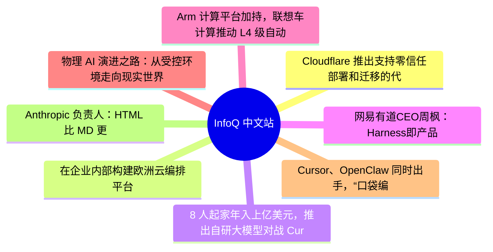

# 📰 InfoQ 中文站 Top 8 (2026-07-01)

## 思维导图

## 列表（8 条，3 条含全文）

### 1. Cloudflare 推出支持零信任部署和迁移的代理技能
- **链接**: [https://www.infoq.cn/article/fTk8yti9vUIP9hbP5Lcs?utm_source=rss&utm_medium=article](https://www.infoq.cn/article/fTk8yti9vUIP9hbP5Lcs?utm_source=rss&utm_medium=article)
- **发布**: Wed, 01 Jul 2026 11:00:00 GMT
- **简介**: 点击查看原文>

📄 全文（2046 字符，点击展开）

最近，Cloudflare 发布了 [Cloudflare One 套件](https://blog.cloudflare.com/cloudflare-one-stack/)，这是一个开源的[代理技能库](https://github.com/cloudflare/skills)，可以为 AI 代理提供规划、部署、管理和迁移零信任环境所需的知识，而且不需要从业人员事先学习完整的产品套件。这些技能以两个轻量级文件的形式发布，任何智能代理均可以加载：cloudflare-one 用于提供产品指导，cloudflare-one-migration 用于实现供应商间的转换，其中包含从 Zscaler 和 Palo Alto Networks 迁移的明确逻辑。来自 Cloudflare 的 AJ Gerstenhaber 和 Abe Carryl [写道](https://blog.cloudflare.com/cloudflare-one-stack/)：

各团队已经开始使用智能代理来编写代码、筛选警报以及自动化工作流。但仅凭智能代理本身，并不能掌握组织特有的网络拓扑或供应商配置的细微差别。

迁移功能是最能让安全团队立即受益的部分。只需让智能助手将你的 Zscaler Private Access 应用程序迁移到 Cloudflare Access，该技能便能自动将 Zscaler 应用程序的定义映射到 Cloudflare 的对等功能，转换用户组和策略，通过 Cloudflare API 创建资源，并生成一份汇总报告，列明那些项已经迁移完成，哪些项需要人工审核。该迁移采用了与 Cloudflare [Descaler](https://blog.cloudflare.com/descaler-program/) 和 [Deskope](https://blog.cloudflare.com/deskope-program-and-asdp-for-descaler/) 计划相同的逻辑。这两项计划已经帮助企业客户在数小时内（而非数月）从 Zscaler 和 Netskope 迁移至 Cloudflare。该技术栈使任何客户或合作伙伴都可以自行迁移，无需预约任何专项服务。

每个技能文件都包含结构化知识、决策树和工具定义，当上下文匹配时，代理会自动加载这些内容。此外，cloudflare-one 技能涵盖了完整的生命周期：使用 Cloudflare Access 替代 VPN；通过 Gateway 保障用户和网络安全；通过 Tunnel、Mesh 和 WAN 实现连接；使用数字体验监控（DEX）工具包进行故障排除；根据实时账户中观察到的流量提供自动规则建议。只需要求代理替换你的 VPN 基础设施，该技能便会盘点现有的应用程序，将每个应用程序映射到相应的 Cloudflare 基础组件，生成一套能最大限度减少切换期间服务中断的部署序列，并在应用任何更改之前生成配置摘要供团队审核。

当与 [Cloudflare 代码模式 MCP 服务器](https://developers.cloudflare.com/cloudflare-one/access-controls/ai-controls/mcp-portals/#code-mode)配合使用时，这些技能将获得一个 Cloudflare API 的类型化接口。这样一来，代理就可以查询实时账户配置，检查策略，并通过经过精心设计的流程进行修改，而非通过临时的 API 调用。由于 MCP 服务器会单独处理身份验证凭据，所以这些凭据不会进入模型上下文。

实际的问题在于，安全团队是否已经准备好让代理参与零信任配置。该技术栈采用“应用前审核”的模式：代理提出变更建议并生成摘要，但在任何变更提交之前，必须由安全从业人员进行审核和批准。正如一位安全从业人员[在 X 上指出的那样](https://x.com/jjfleagle/status/2067248617967014353)：

这并非取代安全团队，而是缩短了从意图到配置策略的流程。企业需要考虑的是，是否生成的每项变更都附有审批、差异对比、负责人及回滚信息。

安全基础设施的边界需得把握得当，否则配置错误的网关策略或不正确的访问应用程序映射可能会导致内部服务暴露或用户被锁定。

对于 Cloudflare 的合作伙伴网络而言，该技术栈相当于一整套打包的专业知识。为客户部署 Cloudflare One 的合作伙伴可以利用这些技能加快部署速度、更准确地排查故障，并减少此前需要手动操作且容易出错的供应商转换工作所耗费的时间。

Cloudflare One 技术栈现已[在 GitHub 上发布](https://github.com/cloudflare/skills)。针对更多迁移来源和高级故障排除工作流的新技能正在开发当中。

### 2. 在企业内部构建欧洲云编排平台
- **链接**: [https://www.infoq.cn/article/WauDgmzsNkHocILNI86f?utm_source=rss&utm_medium=article](https://www.infoq.cn/article/WauDgmzsNkHocILNI86f?utm_source=rss&utm_medium=article)
- **发布**: Wed, 01 Jul 2026 09:40:55 GMT
- **简介**: 点击查看原文>

📄 全文（2772 字符，点击展开）

现代云部署涉及许多具有不同生命周期的工具，给工程师带来了沉重的负担。Kubernetes 生态系统提供了一种统一的控制平面方案。在 [KubeCon & CloudNativeCon 欧洲大会](https://events.linuxfoundation.org/kubecon-cloudnativecon-europe/)上， Maximilian Techritz 和 Johannes Ott 发表了题为“[如何在企业内部构建欧洲云编排平台](https://www.youtube.com/watch?v=hR8hFht9sFA)”的演讲。他们展示了如何通过技术分享和内部开源协作来分享最佳实践，从而打造了一个人们积极参与的社区并推动了这项技术的采用。

Ott 提到，我们会编写应用程序并将其部署到服务器上，创建和配置数据库，管理和持久化安全密钥，并与来自内外部供应商的众多现有服务进行集成。为了管理所有这些不同的方面，需要用到许多工具，而这些工具都有各自的使用模式和生命周期。这些工具可能包括管道、命令行界面（CLI）、基于工单的配置、Click-Ops 等。

Ott 解释道，在发布软件新版本时，我们必须通过验证来保证整个复杂的工具链中没有任何环节出现故障：

我们的工程师不得不承担维护和开发技术栈的重担，这占用了他们大量本应用于开发工作的时间和精力。世界正变得日益复杂。软件不再仅仅部署到少数几个数据中心里，而是越来越多地部署到私有云和主权云中。

在重新考虑如何处理云编排时，他们很清楚，仅靠另外开发一个工具无法解决这个问题。Techritz 表示，他们考察了现有的开源生态系统和工具。借助 Kubernetes 生态系统，他们可以用声明式的方式，将所有期望的外部云资源配置应用到 Kubernetes 控制平面中：

我们拥有诸如 Crossplane 之类的工具。它使我们能够管理 Google Cloud Platform 上的数据库、AWS 上的存储桶，以及 Microsoft Azure 上的网络策略。我们只需要在控制平面（Control Plane）上指定这些资源的目标状态即可。在 Kubernetes 集群中运行的专用控制器会持续不断地与云服务提供商的实际 API 进行同步，据此创建资源、获取其状态，或对其进行更新和删除。

Techritz 补充道，诸如 External Secrets Operator 之类的工具可以在不同位置之间同步和轮换凭据，Kyverno 可以定义符合公司规定的自定义策略，而 Flux 则能将所有配置文件放入 Git 存储库中，以践行 GitOps 最佳实践：

这些工具目前都已经公开发布。它们提供了相似的用户界面和操作体验，并且能与 Kubernetes 生态系统无缝集成。

Techritz 表示，[OpenControlPlane](https://open-control-plane.io/) 允许企业通过运行一个平台来向其开发团队提供控制平面。平台所有者定义开发团队应该如何使用密钥、数据库和应用程序。开发团队只需要订购一个控制平面，即可获得预先安装并且配置好的运维工具；他们不用自己操心安装和管理所有这些不同的工具。

他们推出的这种基于 Kubernetes 的云环境编排方案引发了社区的强烈反响和浓厚兴趣。不过，Ott 解释道，不同团队和组织在使用 Kubernetes 资源模型方面的经验存在显著的差异：

我们发起了一项每月一次的技术分享会，这是一场混合多种形式的活动，邀请来自公司各个部门的人员分享他们共同面临的挑战。在这些时长较短、几乎无需任何先备知识的分享环节中，我们展示了“控制平面”方法论如何让他们的日常工作变得更加轻松。我们投入了大量的时间和精力，共同编写了用户入门指南。最初所有内容都采用了“内源”模式，现在大部分内容都已经开源。

Ott 表示，他们的技术讲座系列一直吸引着新老利益相关者的参与，通过轻松但内容丰富的交流会分享最佳实践。

为了打造一个积极参与、支持解决方案适配的社区，Techritz 建议找出公司内部的共同痛点，并利用“控制平面”方法论来开发解决这些挑战的概念验证。他建议：不要强调差异，要拥抱共同点，并积极投入到一个共享的最小可行解决方案中。不要追求完美，而是要营造一种共同改进可改进之处的文化：

这并不总是能奏效，但耐心或对失败的包容态度无疑会有所帮助。但绝不要停止赋能并与身边的人分享知识。要让人们能够轻松地跟上节奏，动手实操，并提出建设性的反馈意见。

Techritz 总结道，归根结底，要想取得成功，就需要工程师、领域专家、推动者以及人脉网络的合理搭配。

演讲结束后，InfoQ 采访了 [Maximilian Techritz](https://www.infoq.com/news/2026/06/europe-cloud-enterprise/www.linkedin.com/in/maximilian-techritz) 和 [Johannes Ott](https://www.linkedin.com/in/johannes-ott-00a74949/) 。

InfoQ：开发人员使用控制平面能获得什么好处？

Johannes Ott：使用一种既适用于机器又便于人类阅读的语法，将整个目标状态明确地定义出来，并由 Kubernetes Operators 永久保存其编排和维护方法，可以显著地减少以往拖慢我们进度的手动操作、手册及其他流程。

借助这一方法论，你可以充满信心地交付符合现代云环境要求的软件。

InfoQ：你们取得了哪些成果？有哪些事情让您感到自豪？

Maximilian Techritz：当得知我们可以将该项目捐赠给欧盟资助的 IPCEI-CIS 项目（欧洲共同利益重要项目——云基础设施与服务）时，我们感到非常兴奋。这使我们与许多其他项目走得更近，那些项目都致力于加强欧洲在云原生领域的自主权。

所有这些项目都隶属于

[NeoNephos 基金会](https://neonephos.org/)。这是 Linux 基金会欧洲分会的项目，旨在确保供应商中立性。

InfoQ：你们获得了哪些经验？

Techritz：从小处着手。在实践中了解人们真正关心的是什么。找出开发团队共同面临的痛点。利用“控制平面”方法论一起解决这些问题——构建一个 Kubernetes Operator，或者从现有的开源 Operator 中找一个合适的。

在这段旅程中，帮助没有 Kubernetes 经验的人参与进来。积极贡献是项目成功的关键。

### 3. 8 人起家年入上亿美元，推出自研大模型对战 Cursor、Claude Code？
- **链接**: [https://www.infoq.cn/article/lgKWA0PHN4zsOkB4C4Pv?utm_source=rss&utm_medium=article](https://www.infoq.cn/article/lgKWA0PHN4zsOkB4C4Pv?utm_source=rss&utm_medium=article)
- **发布**: Tue, 30 Jun 2026 18:29:30 GMT
- **简介**: 点击查看原文>

📄 全文（1713 字符，点击展开）

整理 | 华卫

一年前，Wix 斥资 8000 万美元收购低代码 AI 开发平台 Base44。彼时，这家公司成立仅半年，团队仅有 8 人。如今，Base44 已正式推出自研大语言模型，帮助用户通过自然语言搭建应用。这一举措正值 AI 圈围绕“前沿模型是否适用于所有场景”的讨论不断升温。同时，一个相关问题也愈发突出：构建在他人模型之上的公司，长期来看是否具备真正的护城河。

Base44 的最新动作，正回应了这两个问题。尽管其定制的大语言模型（LLM）仍处于初步上线阶段，但 Base44 希望未来它能够超越前沿模型。创始人 Maor Shlomo 表示：“将模型训练并纳入我们整个技术栈的一部分，让我们在延迟、成本和效率方面拥有更多优化空间。”

乍看之下，这或许是为了在竞争中领先于瑞典初创公司 Lovable，后者在去年夏天的 A 轮融资中晋升独角兽，目前依赖外部 LLM。不过，Shlomo 预计其他公司也会训练自己的模型，“至少那些已经具备足够规模和数据积累的玩家会这么做。”

风险投资机构 Headline 的普通合伙人 Jonathan Userovici（其投资组合包括 Mistral AI 等公司，但不包括 Base44）认为，数据是 AI 初创公司构建护城河的三大关键要素之一，另外两个是分发能力和技术栈。因此，拥有强品牌的玩家正越来越多地依靠自身的数据和基础设施来提升防御能力，Base44 也符合这一趋势。

该公司表示，其首个 LLM Base1 是基于“平台上数千万真实用户交互数据”开发和训练而成。这一数据集将随着公司增长不断扩大，但竞争对手也同样如此。真正更大的竞争或许并非其他 vibe coding 初创公司，而是不断切入该赛道的前沿 AI 实验室：代码工具 Cursor、Grok 所属母公司 xAI 如今均隶属于 SpaceX，而 Claude Code 也已成为成熟的自然语言编程工具。

这意味着，Anthropic 等基础大模型厂商能够获取应用开发场景的数据与用户反馈闭环，持续迭代适配开发场景的模型。但 Shlomo 认为，垂直专精让 Base44 具备优势。“模型在进步，但它们仍将保持通用性，”他预测道。

Userovici 则提醒不要低估前沿模型的能力。他举例称，法律科技初创公司 Harvey 就曾放弃自研模型的计划。他并不认为应用层 AI 公司会大规模转型为前沿模型实验室，但他将 Base44 的举动放在更宏观的背景下来看，推理成本正变得越来越重要。

Userovici 表示，这种成本压力正在推动变化，企业客户也开始提出新的需求：“他们并不总能在所有场景中使用最新模型获得投资回报，因此整个基础设施正在建立，用于编排和优化模型选择，以在不显著增加成本的前提下，维持大多数场景下相同或相近的性能。”

目前，企业用户在 vibe coding 平台的用户群中仍占少数，但其收入占比正在上升。同时，各类用户也开始对 AI 使用成本表达担忧。Base44 决定自研 LLM 的原因有多方面，但降低成本无疑是其中之一。Shlomo 表示：“我们希望拥有一个更符合我们价值判断的模型，更贴合我们观察到的用户偏好结果，同时最终在速度和成本上都优于使用 Opus 等前沿模型。”

至于 Base44 自身，成本下降并非立竿见影。该公司表示：“拥有模型使 Base44 能直接控制计算和推理支出，预计将随着时间推移形成更强的利润结构。”即便回报存在滞后，更高的利润率对其母公司来说仍是利好，后者近期刚宣布裁员 20%。

相比之下，Base44 在被收购后持续扩张团队，并在几个月前宣布其年度经常性收入（ARR）已突破 1 亿美元。这一数字仍低于 Lovable，后者本月早些时候表示 ARR 已达 5 亿美元。但 Shlomo 押注于开发 Base1 所投入的“巨大工程努力”，将巩固 Base44 作为“唯一垂直一体化 vibe coding 应用”的定位。也就是说，在 Userovici 的定义中，它是一个同时掌控分发、数据和基础设施的玩家。

参考链接：

### 4. 网易有道CEO周枫：Harness即产品
- **链接**: [https://www.infoq.cn/article/3X8E2FVCllu24XYVoPeK?utm_source=rss&utm_medium=article](https://www.infoq.cn/article/3X8E2FVCllu24XYVoPeK?utm_source=rss&utm_medium=article)
- **发布**: Tue, 30 Jun 2026 18:23:05 GMT
- **简介**: 点击查看原文>

### 5. Arm 计算平台加持，联想车计算推动 L4 级自动驾驶出租车规模化落地
- **链接**: [https://www.infoq.cn/article/Ny7RygQpB3cbBUvU57GW?utm_source=rss&utm_medium=article](https://www.infoq.cn/article/Ny7RygQpB3cbBUvU57GW?utm_source=rss&utm_medium=article)
- **发布**: Tue, 30 Jun 2026 18:03:03 GMT
- **简介**: 点击查看原文>

### 6. 物理 AI 演进之路：从受控环境走向现实世界
- **链接**: [https://www.infoq.cn/article/erU6ZuSI5qowMlIGSr8i?utm_source=rss&utm_medium=article](https://www.infoq.cn/article/erU6ZuSI5qowMlIGSr8i?utm_source=rss&utm_medium=article)
- **发布**: Tue, 30 Jun 2026 17:56:34 GMT
- **简介**: 点击查看原文>

### 7. Cursor、OpenClaw 同时出手，“口袋编程”时代来了：程序员只用“动嘴”！
- **链接**: [https://www.infoq.cn/article/6WCaAMdgSR8r46j3OZd4?utm_source=rss&utm_medium=article](https://www.infoq.cn/article/6WCaAMdgSR8r46j3OZd4?utm_source=rss&utm_medium=article)
- **发布**: Tue, 30 Jun 2026 17:46:54 GMT
- **简介**: 点击查看原文>

### 8. Anthropic 负责人：HTML 比 MD 更利于人类跟进智能体协作流程
- **链接**: [https://www.infoq.cn/article/i3eauD7F8KF9gVY3SD18?utm_source=rss&utm_medium=article](https://www.infoq.cn/article/i3eauD7F8KF9gVY3SD18?utm_source=rss&utm_medium=article)
- **发布**: Tue, 30 Jun 2026 17:00:00 GMT
- **简介**: 点击查看原文>
